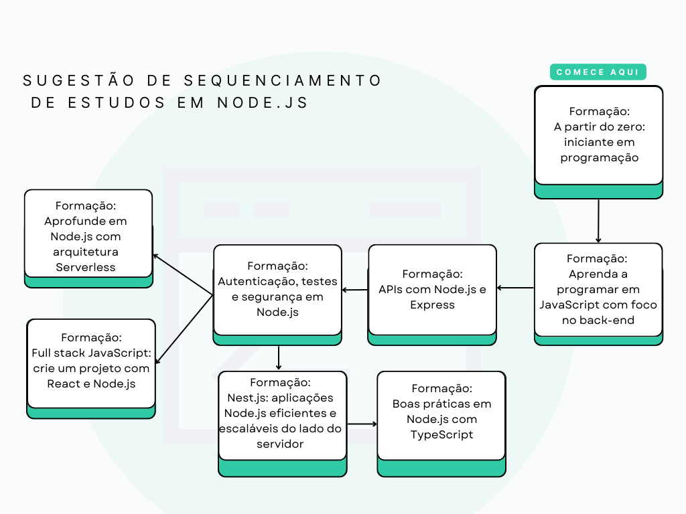

# Formação Alura - Aprenda a programar em JavaScript com foco no back-end

Aprenda a usar JavaScript fora do navegador

Esta formação faz parte da escola Programação  

- 0/8 - passos finalizados
- 44h - Para conclusão
- 5 - Cursos
- 2 - Vídeos extras
- 1 - Artigo

## Formação JavaScript para back-end

JavaScript é hoje uma das linguagens de programação mais populares da web e há alguns anos deixou de ser utilizada apenas em navegadores, para conseguirmos atribuir comportamentos a páginas. Agora ela também espaço no desenvolvimento de aplicações back-end, mobile e web apps , além de jogos.

Esta formação é indicada para quem está começando agora em programação e escolheu o JavaScript como primeira linguagem para se aprofundar e o back-end como ramo do desenvolvimento web para trabalhar. Vamos começar abordando as partes fundamentais de qualquer linguagem de programação (tipos de dados, funções, arrays e objetos) e como trabalhá-las com JavaScript.

A partir destas bases conseguiremos evoluir em complexidade, aumentando seu repertório de conhecimento sobre o JavaScript fora do navegador e o que podemos fazer com ele utilizando NodeJS: sistemas de back-end, APIs e bibliotecas.

É importante que você tenha passado pela Formação Iniciante em Programação, para que já tenha praticado a lógica de programação e tido contato com algumas ferramentas importantes, como o terminal de linha de comando e o sistema de versionamento Git.

Pré-requisitos:  
Para aproveitar melhor essa formação, sugerimos que você já tenha feito ou tenha conhecimentos equivalentes ao conteúdo desta formação: A partir do zero: iniciante em programação.

Passo a passo

### 1. Fundamentos do JavaScript

O primeiro passo para aprender uma linguagem de programação é entender como ela trabalha com conceitos fundamentais da programação: tipos de dados, funções, arrays e objetos. Estas são as ferramentas que vamos utilizar para avançar no estudo de JavaScript criando nossos primeiros projetos.

Alura+ - O que é Back-End e Front-End

Curso - JavaScript: utilizando tipos, variáveis e funções

Curso - JavaScript: conhecendo arrays

Curso - JavaScript: conhecendo objetos

### 2. Avançando com ferramentas e paradigmas

Depois de aprendermos os fundamentos, podemos ver o JavaScript sendo utilizado em conjunto com o NodeJS na criação de diversas aplicações, como por exemplo bibliotecas de código que podem ser publicadas e disponibilizadas para uso da comunidade. Também podemos avançar em nosso conhecimento de JavaScript, entendendo mais sobre como a linguagem foi desenvolvida e como utilizá-la com o paradigma de Orientação a Objetos, um dos mais utilizados hoje em desenvolvimento de aplicações.

Alura+ - NodeJS: o que é e como funciona

Artigo - Como instalar o Node.js no Windows, Linux e macOS

Curso - JavaScript com Node.js: criando sua primeira biblioteca

### 3. Orientação a objetos

Neste passo você vai aprender como utilizar o paradigma de orientação a objetos com JavaScript, um dos paradigmas mais usados em algumas das linguagens mais utilizadas no mercado.

Também vai aprender como a linguagem JavaScript funciona e como a forma específica de implementar algumas funcionalidades dessa linguagem influencia na forma como utilizamos a orientação a objetos.

Curso - JavaScript: programação Orientada a Objetos
