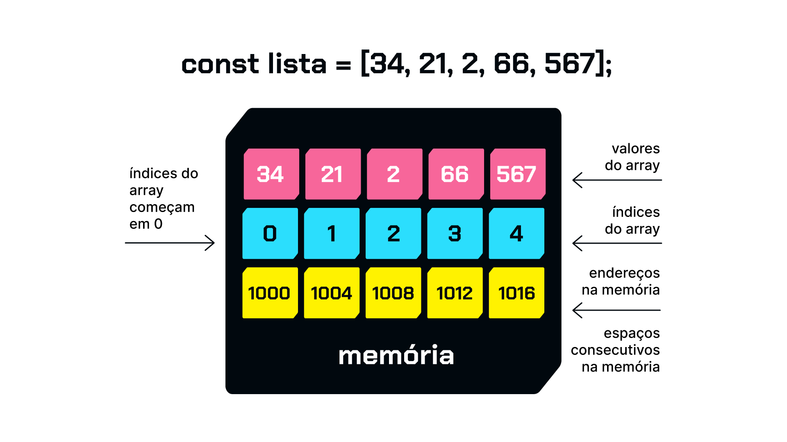

# Curso Alura - JavaScript conhecendo arrays

## Aula 1 - O que são Arrays

### Aula 1 - Apresentação - Vídeo 1

Transcrição  
Olá! Boas-vindas ao curso de Fundamentos do JavaScript para Back-end (Arrays). Meu nome é Ju Amoasei e irei te acompanhar ao longo dessa jornada!

Audiodescrição: Ju se descreve como uma mulher branca, de olhos pretos, sobrancelhas castanhas e cabelo curto pintado de azul. Ela usa óculos de armação arredondada vermelha, brincos prateados, piercing no nariz, veste uma camiseta preta com o logo da Alura e está no estúdio da Alura, iluminado em azul e verde ao fundo, com uma estante preta à direita com enfeites e luminárias.

Para quem é este curso?  
Este conteúdo é indicado para quem está iniciando na programação e escolheu o JavaScript como linguagem.

Pré-requisitos  
Para melhor aproveitamento deste conteúdo, recomendamos que você já tenha acompanhado o curso anterior de Fundamentos do JavaScript, onde falamos sobre variáveis, tipos de dados e funções.

O que vamos aprender?  
Este curso não aborda tópicos específicos de front-end. Ao longo dos nossos estudos, você vai aprender o que são arrays e por que os arrays são uma estrutura de dados tão importante.

Também abordaremos o que são laços de repetição, como utilizamos os laços com arrays, como manipular arrays utilizando métodos específicos que o JavaScript disponibiliza, e vamos aplicar todos esses conceitos usando desafios práticos.

Aproveite os recursos da plataforma. Além dos vídeos, temos diversas atividades extra que acompanham o conteúdo audiovisual. Lembre-se de participar do fórum e do Discord; a comunidade te espera para ajudar com as suas dúvidas e também para compartilhar conhecimento.

### Aula 1 - Introdução a arrays - Vídeo 2

Transcrição  
Neste curso, vamos continuar trabalhando no contexto de uma escola. Sendo assim, encontraremos listas de pessoas estudantes, listas de notas, médias, entre outros documentos.

Resolveremos os desafios com JavaScript, então vamos colocar a mão na massa para descobrir como resolver nosso primeiro desafio: calcular uma média.

Desafio: calculando a média  
Precisamos calcular uma média entre as seguintes notas: 10, 6.5, 8 e 7.5. A primeira coisa a fazer é abrir o editor de código. Já estamos com o VS Code aberto, criamos uma pasta para o projeto, e da mesma forma que fizemos anteriormente no curso de fundamentos, criaremos um novo arquivo no botão "New File…". Vamos chamar esse arquivo de calculo-media.js.

Criando as constantes nota  
Se retomarmos o que foi feito no curso anterior, podemos criar quatro const. Primeiro, vamos criar uma const nota1 = 10, depois uma const nota2 = 6.5 (lembrando que usamos ponto para separar o decimal, e não vírgula), uma const nota3 = 8, e a const nota4 = 7.5.

calculo-media.js:

```JavaScript
const nota1 = 10;
const nota2 = 6.5;
const nota3 = 8;
const nota4 = 7.5;
```

Criando a constante media  
Até o momento, nenhuma novidade. Agora vamos fazer a média, digitando const media que receberá a operação (nota1 + nota2 + nota3 + nota4) / 4. Por fim, podemos chamar o método console.log() para exibir a media. Por enquanto, apenas retomamos o que já fizemos anteriormente.

```JavaScript
// código omitido
const media = (nota1 + nota2 + nota3 + nota4) / 4;
console.log(media);
```

Também como fizemos anteriormente, vamos abrir um terminal no menu "Terminal > New Terminal". Em seguida, conferimos se estamos dentro da pasta certa e chamamos o comando node, passando o nome do arquivo calculo-media.js para o Node.js executá-lo.

> node calculo-media.js

Nesse caso, foi retornada a média 8. No entanto, esse método de atribuir cada valor a uma variável não é muito prático, porque, nesse caso, temos 4 notas. Porém, se pensarmos em qualquer caso, e se precisarmos somar mil números? Seria impraticável criar uma variável para cada número.

Criando a constante notas  
Vamos fazer o seguinte: comentar as const que criamos anteriormente, e em vez disso, criar apenas uma const chamada notas que receberá uma lista com os valores das notas ([10, 6.5, 8, 7.5]).

> const notas = [10, 6.5, 8, 7.5];

Agora, o que temos é algo parecido com uma lista de notas, e elas estão todas englobadas dentro de apenas uma variável. A partir disso, como calculamos a média?

Em vez de somar nota1, nota2, nota3 e nota4, podemos substituir isso pela lista. Mas como acessamos cada um dos valores desta lista? De uma forma um pouco diferente.

Agora, a nossa soma será da variável notas no índice onde está o primeiro valor, isto é, o valor 10. Então, será notas[0]. Em seguida, vamos somar a isso as variáveis notas[1] + notas[2] + notas[3].

Por último, em vez de dividir por 4, vamos usar um recurso do JavaScript para passar o tamanho da nossa lista de forma automática. Dessa forma, o JavaScript consegue acessar a lista, saber quantos valores há nela, e trazer esse número para nós sem a necessidade de contar manualmente.

Portanto, vamos dividir por notas.length. Tenha cuidado com a grafia da palavra "length" (comprimento), porque ela é muito fácil de errar. Isso é fonte de muitos bugs.

```JavaScript
const media = (notas[0] + notas[1] + notas[2] + notas[3]) / notas.length;
```

Antes de continuar, vamos testar para conferir se tudo continua no lugar. De volta ao terminal, retornamos ao último comando com "Seta para cima", node calculo-media.js, e continua funcionando normalmente.

Conclusão  
Agora que tudo funciona, é hora de revisar o que foi feito e entender o que são os índices [0], [1], [2], [3]. Você já pode ter até uma ideia do que está acontecendo, mas vamos analisar com detalhes logo em seguida!

### Aula 1 - Como funcionam os arrays - Vídeo 3

Transcrição  
Agora que tivemos nosso primeiro contato com um array, vamos examinar essa estrutura e entender o que acontece de fato!

Funcionamento do array  
O que é um array e como ele funciona? Um array é uma sequência, ele é uma lista de elementos. Na nossa variável notas, temos 4 elementos, nesse caso, 4 dados do tipo número: 10, 6.5, 8 e 7.5. Esses são chamados de elementos ou itens do array.

Além disso, temos outro dado com que precisamos lidar: os índices do array. Se voltarmos ao código, vamos notar que para acessar cada um dos itens da lista, utilizamos uma anotação que foi colchete, número e colchete (exemplo: [0]), logo depois do nome da variável. Isso significa que estamos acessando o índice do array, ou seja, a posição onde o elemento está nessa lista.

O primeiro elemento sempre estará no índice número 0; depois temos o segundo elemento no índice número 1, o terceiro elemento no índice número 2, e o quarto elemento no índice número 3.

Ou seja, podemos concluir que todo array é uma lista numerada que começa sempre no índice 0 até infinito, porque não limitamos, no JavaScript, a quantidade de posições que podem existir dentro de um array.

Porém, é importante notar que ele sempre começa no índice 0 e os elementos que estão no array, exceto se manipularmos para fazer essa troca, eles sempre vão aparecer na mesma ordem.

Sendo assim, no nosso caso, o elemento de valor 10 sempre estará no índice 0, ou seja, ele sempre será o primeiro elemento desse array, seguido do 6.5, seguido do 8, e do 7.5 por último.

Ao contrário das variáveis que lidamos até agora, que guardam apenas um valor, uma string, um número, para conseguirmos acessar um valor de um array, precisamos acessar o número do índice onde ele está posicionado. Por isso, para acessar o primeiro valor, temos que usar a notação "variável + colchete + número do índice + colchete".

Para acessar o primeiro valor, utilizamos colchetes com 0. Assim, acessaremos o valor 10, que é o primeiro elemento do array. Para acessar, por exemplo, o número 8, que é o terceiro elemento desse array, temos que acessar o índice número 2. Então, é sempre um número a menos. Se quisermos acessar o terceiro elemento, é o índice 2; se quisermos acessar o quarto, é o índice 3; e assim por diante.

Se passarmos para o método console.log() a constante notas[2], vamos acessar o valor 8, que é o elemento de número 3 na lista.

Além disso, os arrays em JavaScript têm algumas outras particularidades diferentes de outras linguagens. Por exemplo: no JavaScript, podemos criar um array com diversos tipos de dados.

Assim, podemos ter uma variável lista, que tem, por exemplo, o número 10, seguido da string "oi", seguido do boolean (verdadeiro ou falso) true, seguido de outro array ([1, 2]), seguido de um objeto ({ a: b }), que abordaremos posteriormente durante essa formação e vai funcionar da mesma forma, com índice 0, 1, 2 e 3.

No exemplo acima, se quisermos acessar, por exemplo, o valor true, temos que acessar a lista no índice 2, ou seja, lista[2]. Não é uma prática comum em linguagens de programação essa possibilidade de agruparmos em uma mesma lista diversos tipos de dados. O normal é sempre termos listas de dados do mesmo tipo: ou listas só de números, ou listas só de strings, ou listas só de objetos.

Parece um pouco contraproducente não aceitarmos mais de um tipo de dado em uma lista, porém, com a prática de programação, criando aplicações e programas, você vai perceber que é muito mais comum do que se imagina ter apenas listas de um mesmo dado. Isso virá com a prática.

Como você deve ter notado, as listas podem conter qualquer tipo de dado, inclusive, um array dentro de outro array, um array de objetos, entre outras variantes. Vamos praticar mais durante o curso!

Conclusão  
Agora que entendemos de forma um pouco mais específica o que são arrays e a questão de como acessamos os elementos desse array, podemos passar para os próximos desafios. Vamos lá!

### Aula 1 - Para saber mais: o que são arrays

Nesta aula, vamos trabalhar com array, que é um tipo de estrutura de dados. Ao contrário de uma variável, que guarda somente um valor por vez, um array (ou lista) pode armazenar diversos valores. Pode ser usado, por exemplo, para agrupar diferentes dados que têm relação entre si.

Conforme o exemplo:

```JavaScript
const numero1 = 50;
const numero2 = 43;
const numero3 = 12;
// utilizando array
const numeros = [50, 43, 12];
```

Um array pode ser definido como uma lista ordenada de valores enumerados em que cada valor é chamado de elemento, ou item, e cada elemento se localiza numa posição fixa na lista chamada de índice.

Vamos destrinchar essa explicação!

Uma lista ordenada de valores enumerados  
Quando falamos de valores, estamos nos referindo a dados de algum tipo: string (texto), number (número), booleano (true ou false) ou outros dados reconhecidos pelo JavaScript. Por exemplo:

```JavaScript
const arrayDeNumeros = [50, 43, 12];
const arrayDeStrings = ["banana", "alura", "Juliana"];
```

Como uma lista ordenada, entende-se que os dados no array estão em uma ordem definida e se manterão nessa ordem. Eles estão enumerados, ou seja, cada um está associado a um identificador numérico que diz qual é a sua posição na lista (mais sobre isso abaixo!). Caso não seja feita nenhuma alteração no array, seus valores sempre aparecerão na mesma ordem, por exemplo, [50, 43, 12].

Cada valor é chamado de elemento ou item
Em programação é importante sempre sabermos os nomes dos itens, para facilitar na hora de tirar dúvidas, procurar soluções e ler documentação. Quando trabalhamos com arrays, chamamos de elemento ou item cada um dos valores da lista, como no exemplo a seguir:

```JavaScript
// array com 1 elemento
const numero = [5];
// array com 3 elementos
const nums = [50, 43, 12];
```

Lembrando que cada elemento corresponde a um dado, separados por vírgula. O espaço é opcional, mas facilita a leitura.

Cada elemento está localizado em uma posição na lista, chamada de índice
Se um array é uma lista ordenada, então é possível acessar cada um dos dados (ou valores) nele se soubermos a posição dele na lista. Por exemplo:

```JavaScript
const nums = [50, 43, 12];
// o número 43 está na posição de índice 1 (segunda posição) nessa lista de três números.
```

Em programação, chamamos de índice (em inglês, index) o número que identifica a posição de um valor em um array.

Porém, um detalhe muito importante para trabalharmos bem com arrays é que, em JavaScript (e na maior parte das linguagens de programação), a contagem dos índices não começa no número 1, e, sim, no número 0. Então, se quisermos acessar determinado valor pelo número do índice temos que levar isso em consideração:

```JavaScript
// índice     0   1   2   3
const nums = [50, 43, 12, 98];
```

Sendo assim, o elemento de valor 43 está localizado no índice de número 1.

A imagem abaixo mostra um diagrama da representação de um array, nomeando seus recursos:

Diagrama representando um array. Há um texto “notas” e ao lado direito do texto há 4 retângulos enfileirados lado a lado com um número em cada um: 10, 6.5, 8 e 7.5, da esquerda para direita. Cada retângulo contém um número dentro, que representa uma nota. Ao lado direito da fileira de retângulos há uma seta apontando para eles com o texto “elementos/itens”. Abaixo de cada retângulo, há um número, que começa à esquerda, do zero no primeiro retângulo e vai até o número três, mais à direita, no último retângulo. Ao lado dessa fileira de números, há uma seta apontando para eles, com o texto “índices/posições”.

A propriedade length  
Esta propriedade especifica o tamanho de um array, ou melhor dizendo, o número de elementos. É importante notar que não estamos falando aqui de índices ou posições, e sim da quantidade de valores (dados) contidos no array. Por exemplo:

```JavaScript
// índice     0   1   2   3
const nums = [50, 43, 12, 98];
console.log(nums.length) //4
```

Considerando que o array acima tem 4 elementos, podemos dizer que o valor retornado por length sempre será 1 número a mais do que o valor de índice mais alto. Neste caso, o array nums é um array de 4 elementos e seus índices vão de 0 a 3.

A propriedade length é muito útil para trabalharmos com arrays, pois não é preciso saber o número de elementos de antemão e nem tentar contá-los, o que seria impraticável em um programa de computador real.

Esta é só uma pequena introdução! Ainda há muito o que estudar e aprender sobre arrays e como utilizar esta estrutura.

### Aula 1 - Para saber mais: índices de array e memória

Os arrays são estruturas de dados que armazenam coleções de elementos. Cada elemento em um array é acessado por meio de um índice, que é um número inteiro usado para identificar a posição desse elemento no array.

Quando se trata de como os índices são armazenados na memória em JavaScript, é importante entender que os arrays em JavaScript são implementados como objetos. Internamente, os índices são tratados como chaves (ou propriedades) de um objeto, onde cada chave é associada ao seu valor correspondente (o elemento do array).

A memória em JavaScript é gerenciada automaticamente pelo mecanismo do navegador ou do ambiente de execução. Quando você cria um array e adiciona elementos a ele, o mecanismo aloca espaço na memória para armazenar esses elementos sequencialmente, de acordo com seus índices.

Por exemplo, ao criar um array, a memória poderia ser representada de forma simplificada como:



alt text: Diagrama que representa a memória ao criar uma array. Na parte superior está a declaração do array “const lista = [34, 21, 2, 66, 567];” abaixo há uma figura em cor escura que representa a memória, dentro dessa figura há 15 quadrados menores organizados em 3 linhas de 5 quadrados. De cima para baixo, a primeira linha tem cor rosa e os seguintes números em cada um dos quadrados: 34, 21, 2, 66 e 567 e uma seta indica que essa linha representa os valores do array. A segunda linha tem cor azul ciano e os seguintes números: 0, 1, 2, 3 e 4 e uma seta indica que os índices do array começam em 0. A terceira linha tem cor amarela e os seguintes números: 1000, 1004, 1008, 1012 e 1016 e uma seta indica que são os endereços na memória.

Cada elemento está localizado em um espaço de memória sequencial, e o acesso aos elementos do array é feito diretamente por meio dos índices correspondentes.

Resumindo, os índices de um array em JavaScript são números inteiros que representam a posição de cada elemento no array. Internamente, esses índices são tratados como chaves de um objeto, e os elementos são armazenados sequencialmente na memória conforme são adicionados ao array. Isso permite acessar rapidamente os elementos usando seus índices correspondentes.

### Aula 1 - Adicionando elementos - Vídeo 4

Transcrição  
Avançando para o nosso próximo desafio, em uma situação hipotética, uma pessoa docente inseriu apenas 3 das 4 notas de uma pessoa estudante no sistema, sendo elas 10, 6 e 8. Precisamos corrigir isso adicionando a nota 7 à lista de notas e calcular a média corretamente.

Desafio: adicionando elementos
Para isso, vamos ao Visual Studio Code e criar um novo arquivo que será nomeado adicionar-nota.js. O primeiro passo é criar a constante notas. Para isso, escrevemos const notas = [10, 6, 8]. Os espaços entre as vírgulas não são estritamente necessários, mas ajudam na leitura do código.

adicionar-nota.js:

```JavaScript
const notas = [10, 6, 8];
```

Usando o método push()
Com a constante notas criada, precisamos adicionar um valor ao array. Nesse caso, será um pouco diferente do processo quando temos um valor dentro de uma variável let e queremos apenas substituir.

Se tivéssemos let nota = 9, por exemplo, e quiséssemos trocar, seria necessário apenas chamar novamente nota e trocar o valor para, digamos, 5.6.

No entanto, ao trabalhar com listas, o processo é diferente. Precisamos utilizar funções do JavaScript para fazer essa alteração. A função que utilizaremos é push(). Então, chamamos a variável notas e, após ela, a palavra push(), que o JavaScript deixa pronta para ser utilizada.

O valor que passamos como parâmetro do push() é o valor que queremos inserir no array. Portanto, para resolver nosso desafio, escrevemos notas.push(7).

```JavaScript
// código omitido
notas.push(7);
```

Criando a constante media  
Em seguida, criaremos a constante media. Podemos copiar a linha de código onde a constante media foi criada anteriormente no arquivo calculo-media.js, para economizar tempo.

A constante media continua funcionando da mesma forma: vamos acessar notas[0], notas[1], notas[2] e notas[3] e dividir pelo comprimento do array (notas.length).

Por fim, exibimos a média com console.log(media).

```JavaScript
// código omitido
const media = (notas[0] + notas[1] + notas[2] + notas[3]) / notas.length;
console.log(media);
```

No terminal, vamos executar o comando node seguido do nome do arquivo adicionar-nota.js.

> node adicionar-nota.js

Como retorno, recebemos a média 7.75.

Observações  
Um detalhe importante é que o método push(), nativo do JavaScript, sempre adiciona o valor no final do array. Conforme discutido anteriormente, o array é uma lista de posição fixa, então o valor 10 sempre estará no índice 0, exceto se manipularmos esse array. Portanto, é crucial entender que o push() sempre colocará o valor no final do array como o último elemento.

Em relação ao que discutimos anteriormente sobre const e let, uma const é uma variável cujo valor não pode ser modificado. Teoricamente, se quiséssemos modificar o array notas, deveríamos usar let notas. No entanto, atribuímos arrays a algumas const e conseguimos manipular esse array.

Uma const significa que um valor não pode ser reatribuído, mas um array que é atribuído a uma const ainda é um array e pode ter seus índices alterados. Sendo assim, não podemos, por exemplo, chamar notas e, em vez de um array, tentarmos atribuir um número. Isso resultará em erro.

Note também que usamos o termo "método" para nos referirmos ao push(). Um método é uma função do JavaScript associada a um tipo de dado específico. O push() só funciona se estiver associado a um array, razão pela qual usamos a sintaxe notas.push().

Conclusão  
Vamos continuar com nossos desafios, onde exploraremos outros métodos específicos de array!

### Aula 1 - Faça como eu fiz: array esparso

Não deixe de praticar em seu projeto com os exemplos abaixo!

Até agora trabalhamos com arrays que representam listas de dados (notas de alunos em uma escola). Mas o que acontece se declaramos um array sem nenhum valor na lista?

Crie um arquivo script.js em seu computador e escreva o seguinte código:

```JavaScript
const arrayVazia = [];

console.log(arrayVazia)
console.log(arrayVazia.length)
```

Executando este código com node script.js (não esqueça de conferir se está executando o comando dentro da pasta/diretório certo), o resultado é:

> []  
  0

No exemplo acima, podemos notar que o JavaScript criou o array e a guardou na variável arrayVazia, mas seu length é 0.

Vamos então ver o que acontece se usarmos a notação de colchetes para tentar acessar o índice 0 do array (lembrando que o índice zero se refere à primeira posição):

```JavaScript
const arrayVazia = [];
console.log(arrayVazia[0])
```

Desta vez, o resultado é:

> undefined

Parece um pouco confuso? Vamos executar mais um teste e ver o que acontece:

```JavaScript
const arrayVazia = [,,,];
console.log(arrayVazia.length)
console.log(arrayVazia[0])
console.log(arrayVazia[1])
console.log(arrayVazia[2])
```

Confira os resultados no terminal:

```JavaScript
3
undefined
undefined
undefined
```

O que fizemos aqui, afinal?

Criamos um array com 3 posições, porém, em nenhuma dessas posições existe um valor. De certa forma, podemos pensar que este array foi criado como um gaveteiro com três gavetas e todas elas estão “vazias”, sem nenhum valor de dado guardado.

Para finalizar, faça um último teste. Vamos usar o método push() visto anteriormente para adicionar um valor - lembrando que este método sempre vai adicionar o valor no final do array!

```JavaScript
const arrayVazia = [,,,];
console.log(arrayVazia.length)
arrayVazia.push(50)
console.log(arrayVazia)
console.log(arrayVazia.length)
```

Conferindo os resultados:

```JavaScript
3
[ <3 empty items>, 50 ]
4
```

O JavaScript manteve as posições vazias e adicionou o 50 ao final do array. Após a execução, ele passou a ter 4 posições, mas somente um elemento (o número 50).

### Aula 1 - Excluindo elementos - Vídeo 5

Transcrição  
Continuando com nossos desafios, o próximo é excluir elementos!

Desafio: excluindo elementos  
Suponha que um professor tenha acidentalmente lançado 5 notas de uma pessoa estudante no sistema, sendo elas: 10, 6, 8, 5.5 e 10. Para corrigir, precisamos remover a última nota e fazer o cálculo da média correta. Portanto, a nota que está por último, o último índice do array, é a nota que foi incluída sem querer e precisa ser removida.

Criando o arquivo excluir-elementos.js  
No Visual Studio Code, vamos criar um arquivo novo chamado excluir-elementos.js. Primeiro, precisamos criar a constante notas, que receberá um array contendo as notas 10, 6, 8, 5.5 e 10.

excluir-elementos.js:

> const notas = [10, 6, 8, 5.5, 10];

Usando o método pop()  
Utilizamos anteriormente o método push() do JavaScript para adicionar um elemento ao final do array. Agora podemos pensar o seguinte: existe algum método pronto para remover elementos do final?

A resposta é sim, existe. Usaremos o método pop(), que vamos chamar da seguinte forma: notas.pop(). É importante notar que, diferente do push(), com o método pop(), sempre retiramos o último elemento do array, então não é necessário passar nenhum parâmetro para ele.

> // código omitido  
  notas.pop();

Refazendo o cálculo da média  
Para refazer o cálculo da média, podemos voltar ao arquivo anterior (adicionar-nota.js) e copiar novamente a variável media e o console.log(). Continua sendo o mesmo cálculo com quatro elementos e já temos a constante media entre os parênteses de console.log().

```JavaScript
// código omitido
const media = (notas[0] + notas[1] + notas[2] + notas[3]) / notas.length;

console.log(media);
```

Vamos fazer um teste executando no terminal o comando abaixo:

> node excluir-elementos.js

Foi retornada a nota 7.375. Se quisermos reduzir a quantidade de casas decimais, podemos utilizar o método toFixed(), que já conhecemos, e passar entre parênteses a quantidade de casas desejadas.

> console.log(media.toFixed(2));

Nesse caso, selecionamos duas casas, então foi retornado 7.38.

Agora que já conversamos sobre métodos, podemos observar o media.toFixed(). Assim como o JavaScript tem funções prontas que funcionam para arrays, como é o caso do pop(), também temos funções prontas que funcionam para números. media é um valor numérico, o valor 7.375, e podemos associá-la a uma função pronta do JavaScript chamada toFixed().

Deixaremos o link da documentação do toFixed() e do Array.prototype.pop() para você conferir mais exemplos e testar o método em funcionamento.

Um último detalhe importante é que o método pop() modifica o array notas. Porém, alguns métodos não modificam o array original, criando outro array. Portanto, ao trabalhar com arrays, preste sempre atenção se a modificação é feita no próprio array, pois isso pode ser relevante no seu programa.

### Aula 1 - Para saber mais: arrays truthy ou falsy

Em JavaScript, os termos "truthy" e "falsy" referem-se à avaliação de valores de acordo com seu contexto booleano. Um valor "falsy" é aquele que é considerado falso quando avaliado como um booleano, enquanto um valor "truthy" é considerado verdadeiro nesse mesmo contexto.

Valores "falsy" em JavaScript são aqueles que, ao serem convertidos para booleanos, são interpretados como falso. Isso inclui:

- Zero: O valor numérico zero (0);
- String vazia (''): Uma string sem nenhum caractere;
- NaN: Representa "Not-A-Number", frequentemente resultante de operações matemáticas inválidas;
- null: Indica a ausência intencional de um valor ou referência nula;
- undefined: Indica uma variável que foi declarada, mas ainda não teve um valor atribuído.

Valores "truthy", por outro lado, são valores que, quando convertidos para booleanos, são interpretados como verdadeiros. Estes incluem:

- Strings não vazias: Qualquer string que contenha pelo menos um caractere;
- Números diferentes de zero: Qualquer número que não seja zero, incluindo números negativos e decimais;
- Arrays: Mesmo um array vazio é considerado "truthy";
- Objetos: Objetos em JavaScript são "truthy", mesmo se estiverem vazios;

Aqui está um exemplo mais detalhado, demonstrando como os arrays podem ser avaliados como "truthy":

```JavaScript
const arrayVazio = [];
const arrayNaoVazio = [1, 2, 3];

console.log(Boolean(arrayVazio)); // Saída: true - Mesmo sendo um array vazio, é "truthy"
console.log(Boolean(arrayNaoVazio)); // Saída: true - Um array com elementos também é "truthy"
```

No exemplo acima, tanto o arrayVazio (um array sem elementos) quanto o arrayNaoVazio (um array com elementos) são avaliados como "truthy" quando usados em um contexto booleano.

Entender os conceitos de "truthy" e "falsy" em JavaScript é extremamente importante ao lidarmos com lógica condicional em estruturas como if, while e operadores lógicos, para garantir que o código funcione conforme esperado.

### Aula 1 - Para saber mais: métodos de array

Já utilizamos alguns métodos de arrays nessa aula, e ainda vamos praticar com outros. Porém, pode ainda ter ficado a dúvida: o que são os métodos?

Um método é uma função chamada (executada) no contexto de um objeto (array, number, string, etc).

Métodos realizam tarefas pré-definidas usando o valor que está no contexto (por exemplo, um array) e dos parâmetros que passamos para eles, como adicionar, remover ou até encontrar elementos.

Vamos entender com mais detalhes o que são propriedades de objetos durante o curso de fundamentos do JavaScript: objetos.

Os interpretadores de JavaScript implementam vários métodos “prontos” que podemos usar para manipular e fazer operações com números, strings, arrays, objetos, etc. Com algumas exceções, os métodos são próprios de cada tipo: por exemplo, não conseguimos usar métodos de arrays para manipular números e vice-versa.

Exemplos de métodos:

```JavaScript
(9.999).toFixed(2); // toFixed é um método de Number
'string'.toUpperCase(); // toUpperCase é um método de String
[1, 2, 3].push(4); // push é um método de Array
```

Existem muitos métodos para conseguir lembrar de todos, mas vamos trabalhar com vários outros durante o curso!

### Aula 1 - Criando nosso primeiro array

Após os primeiros passos com arrays, Ana decidiu praticar para colocar o conhecimento em prática. Ela escreveu o seguinte código:

```JavaScript
const lista = [7, 13, 'JavaScript', 'Alura', true];
lista.push(false);
console.log(lista.length); // 6
```

Analise o primeiro array de Ana e marque as alternativas corretas:

Alternativa correta  
Todo array do JavaScript possui a propriedade length, além de determinados métodos.

Todo array criado no JavaScript vem com automaticamente com a propriedade length, que indica sua quantidade de elementos, e métodos como push e pop, que servem para realizar operações com o array, como modificá-lo.

### Aula 1 - Jantar de hoje

O push e pop são usados para adicionar/remover elementos de uma lista, como mostra o seguinte código:

```JavaScript
const jantarDeHoje = [‘burguer’, ‘hot dog’, ‘pizza’];
jantarDeHoje.pop()
jantarDeHoje.pop()
jantarDeHoje.push('ovo frito')
jantarDeHoje.push('salada')
jantarDeHoje.push('maçã')
console.log(jantarDeHoje)
```

Analisando o código, selecione a alternativa que corresponde ao que teremos como saída do console do jantarDeHoje .

> [ 'burguer', 'ovo frito', 'salada', 'maçã' ]

Certo! No jantar de hoje, a pizza e o hot dog não estão presentes por conta do código jantarDeHoje.pop(), que remove o último elemento da lista e o ovo, a salada e a maçã verde entraram na lista com comando push.

#### Aula 1 - Para saber mais: links da aula

Confira abaixo a lista de links utilizados durante a aula e/ou links complementares ao conteúdo:

Documentação do MDN: [array.push()](https://developer.mozilla.org/en-US/docs/Web/JavaScript/Reference/Global_Objects/Array/push);
Documentação do MDN: [array.pop()](https://developer.mozilla.org/en-US/docs/Web/JavaScript/Reference/Global_Objects/Array/pop).

### Aula 1 - Desafio: exercícios

Dominar o uso de arrays é fundamental em programação e uma base essencial na manipulação de dados. Praticar regularmente é a chave para se tornar mais confiante!

Para isso criamos uma lista de exercícios que não apenas ajudam a explorar os métodos de manipulação de arrays, mas também vão te preparar para lidar eficientemente com dados em aplicações reais.

1. Um array esparso é um tipo de array no qual a maioria dos elementos tem valores indefinidos. Crie um array esparso e atribua valores a alguns elementos do array (por exemplo, defina valores nos índices 1, 3 e 7). Imprima no console o array e também a informação de comprimento do array.
2. Crie um programa em Node.js que inicie com um array cinco elementos e atribua um novo valor para a primeira posição (índice 0) desse array. Em seguida, exiba o array antes e depois da alteração.
3. Crie um array vazio chamado meuArray e adicione 3 números inteiros de sua escolha utilizando o método push(). Imprima no console os itens presentes no array para verificar se os números foram adicionados. Em seguida, substitua o primeiro elemento do array (índice 0) pelo dobro do seu valor atual. Imprima no console o array atualizado para verificar a mudança.
4. Desenvolva um programa em Node.js que crie um array vazio e atribua valores a ele utilizando o método push(). Adicione três números inteiros ao array e, em seguida, exiba o array resultante.
5. Desenvolva um programa em Node.js que simule uma clínica veterinária. Crie um array vazio chamado clinica que representará a fila de animais na clínica. Em um primeiro momento, simule a chegada de três animais diferentes e exiba a lista de animais no console. Após a exibição, remova os animais da lista um por vez e, por fim, exiba no console o estado final da lista.

Caso precise de ajuda, opções de solução das atividades estarão disponíveis na seção “Opinião”.

Disponibilizamos uma possível resolução dos [desafios neste link](https://github.com/alura-cursos/3530-js-arrays/tree/exercicios-aula1) para você construir ou validar suas soluções.

### Aula 1 - O que aprendemos?

Nessa aula, você aprendeu:

- As características principais de arrays:
  - Um array é uma lista ordenada de dados. Você aprendeu a sintaxe de um array e como acessar seus valores.
- Os conceitos de elemento e índice:
  - Elementos são os valores que um array guarda, e índice é o identificador único e numérico de cada elemento do array.
- Como utilizar a propriedade .length:
  - Todos os arrays do JavaScript possuem essa propriedade, que indica a quantidade de elementos do array.
- Como utilizar os métodos .push() e .pop():
  - Fizemos as primeiras alterações em um array, adicionando um novo item ao final ou removendo o último item.

## Aula 2 - Alterando Arrays

### Aula 2 - Dividindo com slice() - Vídeo 1

Transcrição  
Partindo para o próximo desafio, temos uma lista de estudantes e precisamos dividir essa lista em duas, com a mesma quantidade de estudantes.

Desafio: dividindo salas  
Divida os alunos da sala abaixo em duas listas com a mesma quantidade de estudantes:

```JavaScript
'João', 'Juliana', 'Ana', 'Caio', 'Lara', 'Marjorie', 'Guilherme', 'Aline', 'Fabiana', 'André', 'Carlos', 'Paulo', 'Bia', 'Vivian', 'Isabela', 'Vinícius', 'Renan', 'Renata', 'Daisy', 'Camilo'
```

Na tela, está mostrando uma lista com diversos nomes. Podemos copiar do GitHub para evitar digitar ou criar seus próprios nomes.

Criamos no Visual Studio Code um arquivo chamado dividir-array.js, com uma constante chamada listaEstudantes e dentro dessa variável, criamos o array com o nome de cada estudante.

dividir-array.js

```JavaScript
const listaEstudantes = ['João', 'Juliana', 'Ana', 'Caio', 'Lara', 'Marjorie', 'Guilherme', 'Aline', 'Fabiana', 'André', 'Carlos', 'Paulo', 'Bia', 'Vivian', 'Isabela', 'Vinícius', 'Renan', 'Renata', 'Daisy', 'Camilo'];
```

Lembrando que, por serem strings (cadeias de caracteres), sempre devem estar entre aspas duplas ou simples.

Como dividimos esse array em dois arrays com a mesma quantidade de elementos, sem ter que contar manualmente a quantidade de elementos em cada um? A primeira coisa que faremos é criar uma constante que chamaremos de sala1. O valor dessa constante será nosso array cortado pela metade.

Para isso, temos um método do JavaScript chamado slice(), que fará esse trabalho para nós. Passamos a listaEstudantes.slice().

dividir-array.js

```JavaScript
const listaEstudantes = ['João', 'Juliana', 'Ana', 'Caio', 'Lara', 'Marjorie', 'Guilherme', 'Aline', 'Fabiana', 'André', 'Carlos', 'Paulo', 'Bia', 'Vivian', 'Isabela', 'Vinícius', 'Renan', 'Renata', 'Daisy', 'Camilo'];

const sala1 = listaEstudantes.slice()
```

A função slice(), como qualquer função que utilizamos, seja ela criada por nós ou prontas no JavaScript, requer parâmetros e precisamos entender quais são eles. É importante sempre entender quais são os parâmetros que cada função precisa receber ao programar.

Deixaremos novamente o link da documentação do Array.prototype.slice() .

Na documentação, sempre dirá quais são os parâmetros a serem fornecidos. O MDN, onde estamos procurando a documentação, informará na seção "Sintaxe" que slice precisa de um parâmetro, que é o início do array onde queremos fazer o corte, e o final é opcional.

Exemplo retirado da documentação:

> arr.slice([início[,fim]])

A sintaxe da função slice, diz que ela precisa de parâmetros, um que está sendo chamado de início, que é opcional, e o final também é opcional. O início é onde desejamos que comece o corte. Com base nisso, faremos uns testes com slice e pensar em como pegar o meio de um array.

Sabemos que para termos acesso ao comprimento de um array, usamos uma propriedade chamada length.

Então, listaEstudantes.slice(listaEstudantes.length), retornará a quantidade de elementos. Se queremos metade dessa lista, seria metade dos elementos. O que podemos fazer? ListaEstudantes.length é um número e podemos dividir esse número por dois. Então, listaEstudantes.length/2.

No entanto, o valor desejado para o término da nossa primeira lista é aquele em que ela começa no primeiro estudante e se encerra na metade do array. O slice, nosso primeiro parâmetro, deve ser configurado considerando que os parâmetros são sempre ordenados, sendo o início o primeiro deles. Portanto, o índice inicial é 0, e o índice final é listaEstudantes.length dividido por dois.

dividir-array.js

```JavaScript
const listaEstudantes = ['João', 'Juliana', 'Ana', 'Caio', 'Lara', 'Marjorie', 'Guilherme', 'Aline', 'Fabiana', 'André', 'Carlos', 'Paulo', 'Bia', 'Vivian', 'Isabela', 'Vinícius', 'Renan', 'Renata', 'Daisy', 'Camilo'];

const sala1 = listaEstudantes.slice(0, listaEstudantes.length/2);
```

Se voltarmos à documentação, estará exatamente de acordo com o que o método slice() espera receber, um parâmetro de início e um parâmetro de fim. Para fazer o restante da lista criaremos uma constante, sala2, igual, listaEstudantes.slice().

Utilizaremos outra opção do método slice(), passando apenas um parâmetro, o parâmetro de início, indicando o ponto de corte do meio para o final. Se passarmos apenas um parâmetro para o slice, como listaEstudantes.length/2, especificamos somente o ponto inicial do corte.

dividir-array.js

```JavaScript
const listaEstudantes = ['João', 'Juliana', 'Ana', 'Caio', 'Lara', 'Marjorie', 'Guilherme', 'Aline', 'Fabiana', 'André', 'Carlos', 'Paulo', 'Bia', 'Vivian', 'Isabela', 'Vinícius', 'Renan', 'Renata', 'Daisy', 'Camilo'];

const sala1 = listaEstudantes.slice(0, listaEstudantes.length/2);
const sala2 = listaEstudantes.slice(listaEstudantes.length/2);
```

A partir disso, o JavaScript entende que é desse ponto para o final e não precisamos passar o parâmetro do final.

Vamos testar tudo isso para verificar se está funcionando. Para isso, chamaremos o console.log(), o primeiro com sala1 e o segundo console, copiamos e colamos, mostrando o sala2.

dividir-array.js

```JavaScript
const listaEstudantes = ['João', 'Juliana', 'Ana', 'Caio', 'Lara', 'Marjorie', 'Guilherme', 'Aline', 'Fabiana', 'André', 'Carlos', 'Paulo', 'Bia', 'Vivian', 'Isabela', 'Vinícius', 'Renan', 'Renata', 'Daisy', 'Camilo'];

const sala1 = listaEstudantes.slice(0, listaEstudantes.length/2);
const sala2 = listaEstudantes.slice(listaEstudantes.length/2);

console.log(sala1);
console.log(sala2);
```

Voltaremos no terminal, pediremos para o Node executar o arquivo dividir-array:

> node dividir-array.js

No terminal, obtemos dois arrays:

```JavaScript
[
'João',
'Ana',
'Juliana',
'Caio',
'Lara',
'Marjorie',
'Guilherme',
'Aline',
'Fabiana',
'André'
]
[
'Carlos',
'Paulo',
'Bia',
'Vivian',
'Isabela',
'Renan',
'Daisy',
'Vinícius',
'Renata',
'Camilo'
```

O primeiro começando em João, que é o primeiro índice do array, e indo até André, que é a metade. Não vamos contar, mas é a metade do array, é um array de 20 elementos, então, teremos 10 em cada um. O segundo array começa em Carlos e vai até Camilo.

Porém, há dois detalhes que gostaríamos de destacar. Se passamos o final, listaEstudantes.length/2, e passamos o começo da outra lista também, .length/2, não teria que ter um valor repetido, que é o valor do meio?

Isso ocorre porque, quando temos um parâmetro de fim, o elemento exato do fim do array não é incluído. No entanto, quando passamos apenas o começo, o índice do começo é incluído.

O índice 10, que é a metade do nosso array, não foi incluído na primeira listagem, paramos no índice 9. Ou seja, isso está inclusive na documentação, que quando criamos um sub-array entre as posições início e fim, o fim não é incluído.

Então, passamos o índice 10 para incluir até o índice 9, do índice 0 ao índice 9. Ao contrário do parâmetro de início, que é a partir do início, então a lista seguinte começa no índice 10. Assim, temos uma lista terminando no índice 9 e outra lista começando no índice 10.

Outro ponto importante, mencionamos anteriormente que alguns métodos de array alteram o próprio array e outros geram um novo array que precisamos, por exemplo, salvar uma variável. Por isso, que salvamos nossos resultados em sala1 com parte do array e sala2 com o restante do array.

Deixaremos o link da documentação, pratique bastante com os exemplos e continuaremos com nossos desafios!

### Aula 2 - Alterando com splice() - Vídeo 2

Transcrição  
Seguindo com nossos desafios, agora temos que atualizar uma lista.

Desafio: atualizando listas  
> 'João', 'Ana', 'Caio', 'Lara', 'Marjorie', 'Leo'

Porém, Ana e Caio mudaram de escola e o Rodrigo entrou nessa sala. Atualize a lista.

Teremos uma lista de chamadas com seis estudantes. No entanto, Ana e Caio, que são duas pessoas estudantes, mudaram de escola e Rodrigo entrou nessa sala no lugar delas. Ou seja, agora temos que manipular uma lista, um array.

Vamos ao Visual Studio Code criar um novo arquivo que chamaremos de atualizar-lista.js. Para isso, clicamos no primeiro ícone do lado superior esquerdo. Criaremos nossa constante listaEstudantes, com os nomes: João, Ana, Caio, Lara, Marjorie e Léo.

atualizar-lista.js

> const listaEstudantes = ['João', 'Ana', 'Caio', 'Lara', 'Marjorie', 'Leo'];

Temos duas alterações a fazer: retirar itens desse array e adicionar itens nesse array.

Excluindo Ana e Caio da lista
O JavaScript possui um método para fazer esse tipo de alteração: splice().

Array.prototype.splice()

Da mesma forma que conversamos sobre parâmetros de função quando trabalhamos com slice(), o método splice() também vai poder receber uma quantidade de parâmetros. Portanto, índice, se algum elemento será excluído, se algum elemento será adicionado, precisamos passar esses parâmetros em ordem para tudo funcionar.

No caso, escrevemos listaEstudantes.splice(1, 2). O Visual Studio Code já está dando uma dica dos parâmetros que o splice() aceita. O primeiro parâmetro é o start (início), que é um número, e o deleteCount, ou seja, quantos elementos serão excluídos a partir do início.

Os estudantes a serem excluídos são Ana e Caio, localizados nos índices 1 e 2. Estamos transmitindo para o splice o primeiro parâmetro, o ponto inicial do nosso processo. Iniciaremos o processo a partir do índice 1, incluindo. Isso é muito importante, como aprendemos anteriormente: neste caso, incluímos o índice 1.

O segundo parâmetro é a quantidade de itens que serão excluídos: no caso, dois elementos. Portanto, dois elementos excluídos a partir do índice 1 são Ana e Caio, índice 1 e índice 2. Não confunda esse número 2 do listaEstudantes(1, 2). Ele se refere à quantidade de elementos, não a uma posição no array.

Vamos fazer um teste para verificar o que aconteceu.

Digitamos console.log(listaEstudantes). Se estamos pedindo um console.log direto em listaEstudantes, podemos concluir que splice() é um método que altera o próprio array.

atualizar-lista.js

```JavaScript
const listaEstudantes = ['João', 'Ana', 'Caio', 'Lara', 'Marjorie', 'Leo'];

listaEstudantes.splice(1, 2);

console.log(listaEstudantes);
```

Lembrando dessa diferença quando um método altera o próprio array e quando temos que criar um novo array e salvar em uma variável.

Vamos testar para verificar se está tudo funcionando. No terminal, rodamos:

> node atualizar-lista.js

Obtemos:

> [ 'João', 'Lara', 'Marjorie', 'Leo' ]

A primeira parte do nosso desafio já está resolvida, porque excluiu Ana e Caio. Agora, nossa lista só tem João, Lara, Marjorie e Léo.

Adicionando o Rodrigo à lista  
Agora temos a segunda parte: adicionar Rodrigo, que entrou no lugar de Ana e Caio. Poderíamos utilizar o push, que já usamos anteriormente. Então, poderíamos fazer listaEstudantes.push('Rodrigo').

No entanto, o splice() já junta esses dois métodos. Ele reúne a possibilidade de excluir elementos específicos, não apenas do final, e também adicionar elementos em um lugar específico.

Portanto, comentamos o push() e, voltando ao splice(), temos 1, onde começa a alteração, 2, quantidade de itens a serem removidos, e o terceiro parâmetro que vamos trabalhar, que é o elemento que será incluído nesse local.

atualizar-lista.js

```JavaScript
const listaEstudantes = ['João', 'Ana', 'Caio', 'Lara', 'Marjorie', 'Leo'];

listaEstudantes.splice(1, 2, 'Rodrigo');
// listaEstudantes.push('Rodrigo');

console.log(listaEstudantes);
```

Se testarmos novamente, agora visualizamos que no lugar de Ana e Caio entrou Rodrigo:

> [ 'João', 'Rodrigo', 'Lara', 'Marjorie', 'Leo' ]

Observe que o splice, assim como vários métodos de array, tem uma quantidade de opções que podemos usar, de parâmetros, e utilizamos ou não utilizamos esses parâmetros de acordo com a necessidade.

Recomendamos a leitura da documentação, que deixaremos o link, ela está em português, e testar todas as possibilidades do splice().

### Aula 2 - Concatenando arrays - Vídeo 3

Transcrição  
Nosso próximo desafio é unificar salas.

Haverá uma palestra sobre padrões de projetos para as salas de JavaScript e Python

Junte ambas as salas em uma única lista que exiba todas as estudantes.

> Sala JS: 'Evaldo', 'Camis', 'Mari'  
  Sala Python: 'Ju', 'Leo', 'Raquel'

Haverá uma palestra sobre padrões de projeto para salas de JavaScript e Python. Nós precisamos unir ambas as salas em uma única lista que exiba todas as pessoas estudantes.

Neste caso, já criamos um arquivo chamado juntar-salas.js e também criamos dois arrays com as duas salas.

juntar-salas.js

```JavaScript
const salaJS = ['Evaldo', 'Camis', 'Mari'];
const salaPython = ['Ju', 'Leo', 'Raquel'];
```

Temos salaJS com Evaldo, Cubs e Mari no nosso array, três strings, e salaPython com Ju, Léo e Raquel, outro array de strings.

Vamos trabalhar com métodos do JavaScript para resolver os nossos problemas. Nesse caso, podemos usar um método chamado concat. Como seria então?

Criamos uma constante, const salasUnificadas, e nesse caso, vamos concatenar, concat é de concatenar, ou seja, vamos unir duas coisas. Por exemplo, juntar salaJS.concat() e passar como parâmetro do método concat() o que queremos unir com esse array. Então, desejamos unir salaPython.

Podemos testar agora com console.log(salasUnificadas) e verificar se deu tudo certo.

juntar-salas.js

```JavaScript
const salaJS = ['Evaldo', 'Camis', 'Mari'];
const salaPython = ['Ju', 'Leo', 'Raquel'];

const salasUnificadas = salaJS.concat(salaPython);
console.log(salasUnificadas);
```

No terminal, executamos node juntar-salas.js:

> node juntar-salas.js

Obtemos:

> [ 'Evaldo', 'Camis', 'Mari', 'Ju', 'Leo', 'Raquel' ]

Obtemos um array com todas as pessoas, sendo que, primeiro, temos Evaldo, Camis e Mari, que é o array onde solicitamos a concatenação, e, em seguida, os elementos do segundo array, que foi o array que passamos por parâmetro para o concat.

Concatenar é um termo comum em programação, ele é usado em diversos contextos. Aqui, estamos usando, literalmente, para unir coisas.

Vamos passar o [link da documentação do MDN](https://developer.mozilla.org/pt-BR/docs/Web/JavaScript/Reference/Global_Objects/Array/concat) sobre o concat. No primeiro parágrafo da documentação, já nos avisa que este método não altera os arrays existentes; mas, em vez disso, retorna um novo array.

Isso reforça a questão de entender qual é o retorno, o que o método vai fazer com o nosso array original, se ele vai alterar ou se precisamos salvar em uma nova variável o resultado do método, como fizemos, salvando em salasUnificadas.

Se quiser testar invertendo, passando salaPython.conca(salaJS), o resultado será o inverso. Primeiro, os elementos da sala de Python e, em seguida, os elementos da sala de JavaScript. Nesse caso, não fez muita diferença.

### Aula 2 - Array de duas dimensões - Vídeo 4

Transcrição  
Para o nosso próximo desafio, precisamos criar uma lista de listas.

Crie uma lista com os seguintes nomes de estudantes:  
> 'João', 'Juliana', 'Caio', 'Ana'

Crie uma lista com as seguintes médias:  
> 10, 8, 7.5, 9

Crie uma lista que contém as duas listas acima.

Teremos uma lista com alguns nomes de estudantes, como João, Juliana, Caio e Ana; e uma lista com as médias desses estudantes, 10, 8, 7.5 e 9. O que precisamos fazer é criar uma lista que contenha dentro dela essas duas listas.

Você pode estar pensando, "agora é só usar o concat()". Na verdade, vai ser um pouco diferente.

No Visual Studio Code, já criamos um arquivo, chamado array-de-arrays, e já criamos os nossos dois arrays, as duas listas com as quais vamos trabalhar. Uma chamada alunos, com os nomes dos estudantes, e outra chamada medias, com as médias de cada pessoa.

array-de-arrays.js

```JavaScript
const alunos = ['João', 'Juliana', 'Caio', 'Ana'];
const medias = [10, 8, 7.5, 9];
```

Para criar um array e colocar elementos dentro dele, criamos uma nova constante, que chamaremos de lista. Abrimos os colchetes, e dentro desses colchetes, colocamos dois elementos. O primeiro será alunos, e o segundo será medias.

Fazendo isso, estamos criando um array. Abrimos e fechamos colchetes, e dentro deste array, já estamos colocando o valor da variável alunos e o valor da variável medias.

Na prática, isso significa que o valor da variável alunos é um array, logo, ele entra como o primeiro índice. Lembrando que mencionamos anteriormente que podemos colocar um array dentro de um array, da mesma forma que podemos colocar uma string, um número, um objeto, etc.

O Medias também é um array, então, este array inteiro entra como o segundo elemento do array lista que estamos criando neste momento. Para conferir isso, passamos o console.log(lista).

array-de-arrays.js

```JavaScript
const alunos = ['João', 'Juliana', 'Caio', 'Ana'];
const medias = [10, 8, 7.5, 9];

const lista = [alunos, medias];

console.log(lista);
```

No terminal, executamos:

> node array-de-arrays.js

Obtemos:

> [['João', 'Juliana', 'Caio', 'Ana' ], [ 10, 8, 7.5, 9 ]]

Agora, o terminal exibe um único array contendo dentro dele dois elementos. No índice zero, todo o array de nomes, e no segundo elemento, todo o array de notas. É muito importante que nos acostumemos a identificar a sintaxe e consigamos observar dentro do array onde os índices começam e terminam, separados por vírgula.

Como acessamos os valores de cada um desses arrays? Suponhamos que desejamos exibir no console a estudante Juliana e a nota dela, que é 8. Lembrando que o array tem posições fixas, então João tem nota 10, Juliana tem nota 8, etc.

Vamos examinar como podemos fazer isso. Dentro do console.log(), criamos, com o template string (modelo de texto), um texto para concatenar algumas informações.

Abriremos dentro do console.log() com crase, passaremos um texto: "A aluna da posição 1 da lista é: ${}", o cifrão e as chaves são para passar um dado variável, e passaremos lista, que é o nosso array de arrays. Como acessamos Juliana e o 8? Primeiro, vamos fazer lista[0][1].

array-de-arrays.js

const alunos = ['João', 'Juliana', 'Caio', 'Ana'];
const medias = [10, 8, 7.5, 9];

const lista = [alunos, medias];

console.log(
`a aluna da posição 1 da lista é: ${lista[0][1]}`
);
Copiar código
Vamos testar para ver se está tudo certo. Obtemos:

a aluna da posição 1 da lista é: Juliana

E se quiséssemos, além disso, pegar também a nota da Juliana? Dentro do template string, quebramos a linha. Quando utilizamos template string, conseguimos dar "enter" e quebrar linhas, o que não conseguimos quando utilizamos aspas em strings.

Adicionamos mais um texto, "A nota dessa estudante é:", e como pegamos a nota, então? Para capturar a nota, usamos cifrão e chaves, chamaremos nossa variável lista; e passaremos lista[1][1].

array-de-arrays.js

const alunos = ['João', 'Juliana', 'Caio', 'Ana'];
const medias = [10, 8, 7.5, 9];

const lista = [alunos, medias];

console.log(
`a aluna da posição 1 da lista é: ${lista[0][1]}.
a nota dessa aluna é ${lista[1][1]}`
);
Copiar código
Vamos testar e entender o que fizemos. Rodamos novamente o comando node array-de-arrays.js no terminal.

Obtemos como retorno:

a aluna da posição 1 da lista é: Juliana.

a nota dessa aluna é 8

Tudo está funcionando, mas o que está acontecendo aqui? O que são essas sequências de colchetes que inserimos no código? Desejamos pegar, primeiro, o nome da Juliana. O nome da Juliana está dentro da lista alunos.

Se observarmos o array inteiro, ele tem dois elementos. Se são strings, se são números, se são arrays, não importa, o que importa é que um array está na posição 0 e um array está na posição 1.

O array alunos está na posição 0. Então, para o JavaScript acessar esse elemento, é como fizemos anteriormente, acessamos a lista na posição 0. Só que agora desejamos acessar um índice que está dentro do array de alunos.

E podemos passar para o JavaScript: entre no array de posição 0 e dentro dele acesse um elemento específico. Portanto, dentro do array de alunos, que está na posição 0, acessamos o elemento que está na posição 1, Juliana.

Se pedíssemos lista apenas na posição 0 através do console.log()? Vamos colocar isso no código e testar.

array-de-arrays.js

const alunos = ['João', 'Juliana', 'Caio', 'Ana'];
const medias = [10, 8, 7.5, 9];

const lista = [alunos, medias];

console.log(
`a aluna da posição 1 da lista é: ${lista[0][1]}.
a nota dessa aluna é ${lista[1][1]}`
);

console.log(lista[0]);
Copiar código
Temos como retorno o array completo conforme estávamos trabalhando anteriormente, mas com números e strings. Mas é a mesma lógica: um array inteiro está no índice 0 e outro no índice 1.

[ 'João', 'Juliana', 'Caio', 'Ana' ]

Para que usamos arrays de arrays em programas? Por exemplo, para fazer operações matemáticas que envolvem matrizes, para também organizar dados de forma lógica em linhas e colunas, podemos acessar a posição 0 na linha 1, posição 2 na linha 4.

Você pode também fazer esses testes com outros arrays de arrays, e também para representar grids (grades), por exemplo, se quiser fazer um jogo da velha, consegue representar grids usando arrays de arrays.

Conseguimos fazer um array de arrays e acessar os dados dentro deles, vamos continuar então com os nossos desafios.

### Aula 2 - Para saber mais: matrizes

Durante a aula vimos as listas com duas dimensões, ou seja, arrays que contêm arrays, podendo ter um único array ou vários dentro do principal. Como no exemplo a seguir:

```JavaScript
const nomes = ["Ana", "Juliana", "Leonardo"];
const idades = [30, 35, 28];
const faculdade = [false, true, true];
 
const funcionarios = [nomes, idades, faculdade];
```

O array funcionarios é um array de duas dimensões. Há 3 arrays dentro dele, e para acessar os valores em funcionarios precisamos de 2 colchetes “[ ] [ ]”. O primeiro colchete será usado para escolher qual dos 3 arrays dentro de funcionarios será acessado, podendo ser:

0 -> nomes
1 -> idades
2 -> faculdade
O segundo colchete será usado para acessar a informação dentro do array escolhido.

Outra forma de chamar os arrays de 2 dimensões é matrizes. Matrizes podem ser visualizadas como uma tabela do Excel, em que cada campo representa um elemento, e precisamos de uma linha e uma coluna para acessar um campo. Então, as linhas são o primeiro colchete e a coluna o segundo colchete.

Arrays têm seu principal uso quando temos uma grande quantidade de informações com propósitos similares, como as notas de um aluno. Matrizes, por sua vez, são utilizadas quando precisamos de vários arrays similares ou com informações ligadas às outras, como as notas de uma classe com vários alunos.

Uma outra forma comum de trabalharmos com várias informações semelhantes é utilizando objetos.

As matrizes não são limitadas a 2 dimensões, podendo ter mais dimensões, de modo que cada dimensão é representada por um colchete. Porém, tome cuidado para não se perder dentro delas, já que se uma matriz passa a ter, por exemplo, 4 ou 5 dimensões, se torna bem difícil saber exatamente o que está sendo acessado e começamos a ter problemas para fazer a manutenção do código.

### Aula 2 - Faça como eu fiz: concatenando arrays e dados

Durante a aula usamos o método concat() para unir (concatenar) arrays gerando um novo array com o resultado da concatenação. Neste caso, o método funcionou da seguinte forma:

> array1.concat(array2)

Logo, o método foi utilizado com um array (no caso acima, array1) e recebeu como parâmetro outro array (array2). O resultado foi um novo array com todos os elementos de array1 e array2; isso acontece pois, quando o concat() recebe um array como parâmetro, apenas os elementos dentro dele que são concatenados, e não o array em si.

E se tentarmos usar esse método passando como parâmetro outro tipo de dado, que não seja array? Tente fazer isso a partir do que você aprendeu ao longo da aula.

Boa prática!

Ver opinião do instrutor

Abra um arquivo index.js em seu computador e execute o seguinte código:

```JavaScript
const arrayOriginal = ["Maria", "Carlos", "Eduardo", "Samanta"]
const arrayConcat = arrayOriginal.concat("André", "Fernanda")
 
console.log(arrayConcat)
console.log(arrayOriginal)
```

O resultado deve ser:

```JavaScript
[ 'Maria', 'Carlos', 'Eduardo', 'Samanta', 'André', 'Fernanda' ]
[ 'Maria', 'Carlos', 'Eduardo', 'Samanta' ]
```

Com o exemplo acima, vemos que o JavaScript concatena o array principal e as strings de texto passadas como parâmetro para criar outro array, mantendo o original sem alterações.

Vamos fazer um novo teste, mas passando mais de um array como parâmetro.

```JavaScript
const arrayOriginal = ["Maria", "Carlos", "Eduardo", "Samanta"]
const arrayConcat = arrayOriginal.concat(["André", "Fernanda"], ["Ricardo", "Ana"], ["Marcelo", "Bia"])
 
console.log(arrayConcat)
console.log(arrayOriginal)
```

O resultado é:

```JavaScript
[ 'Maria', 'Carlos', 'Eduardo', 'Samanta', 'André', 'Fernanda', 'Ricardo', 'Ana', 'Marcelo', 'Bia' ]
[ 'Maria', 'Carlos', 'Eduardo', 'Samanta' ]
```

Podemos passar mais de um array como parâmetro para que seus elementos sejam concatenados em um único array, junto com o que está sendo chamado com o método no caso, arrayOriginal.

Como um último teste, vamos ver o que acontece se um dos parâmetros for um array com dois elementos, um número e um array:

```JavaScript
const arrayOriginal = [50, 60, 70]
const arrayConcat = arrayOriginal.concat([80, [90, 100]])
 
console.log(arrayConcat)
console.log(arrayOriginal)
```

O resultado no terminal agora é:

```JavaScript
[ 50, 60, 70, 80, [ 90, 100 ] ]
[ 50, 60, 70 ]
```

Vimos anteriormente que, quando recebe um array como parâmetro, concat() vai concatenar apenas os elementos. Porém, este método não extrai os elementos do array de forma recursiva; ou seja, não vai extrair os elementos de arrays que estejam “aninhados”. Dessa forma, 80 foi extraído do array com sucesso, porém 90 e 100 não, o método considerou [90, 100] como um único elemento.

concat() é um método útil quando não se deseja alterar o array original, e sim fazer uma cópia alterada. Caso isso não seja necessário, considere utilizar push() ou splice() para inserir novos elementos ou fazer alterações no array original.

Continue com os seus estudos, e se houver dúvidas, não hesite em recorrer ao nosso fórum!

### Aula 2 - Para saber mais: links da aula

Confira abaixo a lista de links utilizados durante a aula e/ou links complementares ao conteúdo:

- Documentação do MDN: [array.slice()](https://developer.mozilla.org/pt-BR/docs/Web/JavaScript/Reference/Global_Objects/Array/slice);
- Documentação do MDN: [array.splice()](https://developer.mozilla.org/pt-BR/docs/Web/JavaScript/Reference/Global_Objects/Array/splice);
- Documentação do MDN: [array.concat()](https://developer.mozilla.org/pt-BR/docs/Web/JavaScript/Reference/Global_Objects/Array/concat).

### Aula 2 - Desafio: exercícios

Dominar o uso de arrays é fundamental em programação e uma base essencial na manipulação de dados. Praticar regularmente é a chave para se tornar mais confiante!

Para isso criamos uma lista de exercícios que não apenas ajudam a explorar os métodos de manipulação de arrays, mas também vão te preparar para lidar eficientemente com dados em aplicações reais.

1. Crie uma função que receba dois arrays e os concatene em um único array.

2. Crie um array chamado numeros contendo números de 1 a 10. Utilize o método slice para criar um novo array chamado parteNumeros que contenha apenas os números de índice 3 a 7 de numeros.

3. Dado o array frutas contendo frutas que desejamos comprar na feira:

const frutas = ['Maçã', 'Banana', 'Laranja', 'Limão', 'Abacaxi']

Utilize o método splice para remover as frutas no índice 2 e 3 e, em seguida, adicione as frutas 'Kiwi' e 'Pêssego' nesses mesmos índices.

4. Crie dois arrays chamados menuPrincipal e menuDeSobremesas contendo opções do cardápio de um restaurante. Utilize o método concat para criar um novo array menuCompleto contendo todos os elementos de menuPrincipal seguidos pelos elementos de menuDeSobremesas.

5. Crie uma lista bidimensional com 3 linhas e 3 colunas, onde cada elemento seja uma matriz 3x3 com valores iniciando em 1 e aumentando em 1 a cada elemento.

Dicas:

comece com um array vazio, por exemplo const matriz = [] e adicione valores nele com push;
você pode resolver usando um for dentro de outro for.
6. Acesse e imprima o elemento na segunda linha e terceira coluna da lista bidimensional matriz criada no exercício anterior.

7. Adicione um novo elemento (por exemplo,15) na terceira linha e segunda coluna da lista bidimensional matriz criada anteriormente.

Caso precise de ajuda, opções de solução das atividades estarão disponíveis na seção “Opinião”.

Opinião do instrutor

Disponibilizamos uma possível resolução dos desafios [neste link](https://github.com/alura-cursos/3530-js-arrays/tree/exercicios-aula2) para você construir ou validar suas soluções.

### Aula 2 - O que aprendemos?

Nessa aula, você aprendeu como:

- Separar um array em partes com slice():
  - Utilizamos para obter dois novos arrays a partir de um.
- Remover e incluir novos elementos em um array com splice():
  - Esse método permite remover elementos de qualquer posição do array. Além disso, podemos incluir um novo elemento no local dos removidos.
- Concatenar elementos em um único array com concat():
  - Utilizamos essa estratégia pois é uma forma facilitada de juntar dois arrays.
- Trabalhar com arrays de duas dimensões:
  - Vimos que uma lista também pode guardar outras listas! Para acessar elementos das listas mais internas, devemos informar primeiro os índices das mais externas e depois os das mais internas, como por exemplo com funcionarios`[0][2]`.

## Aula 3 - Laços de Repetição

### Aula 3 -  - Vídeo 1
### Aula 3 -  - Vídeo 2
### Aula 3 -  - Vídeo 3
### Aula 3 -  - Vídeo 4
### Aula 3 -  - Vídeo 5
