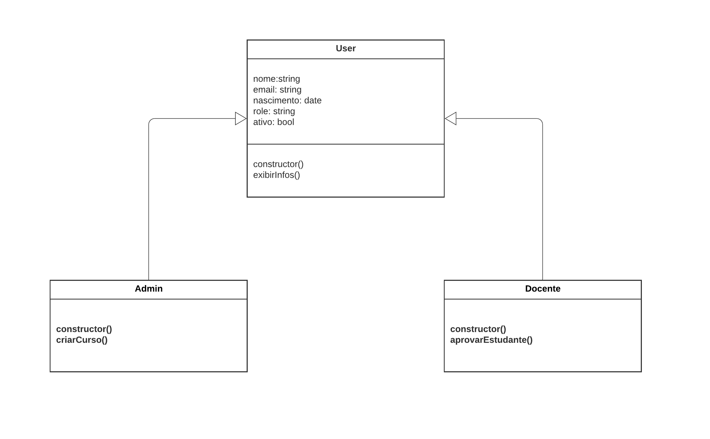
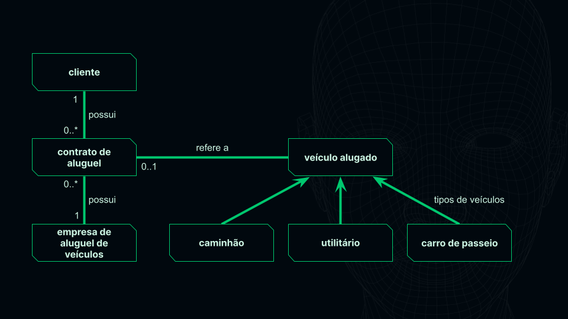
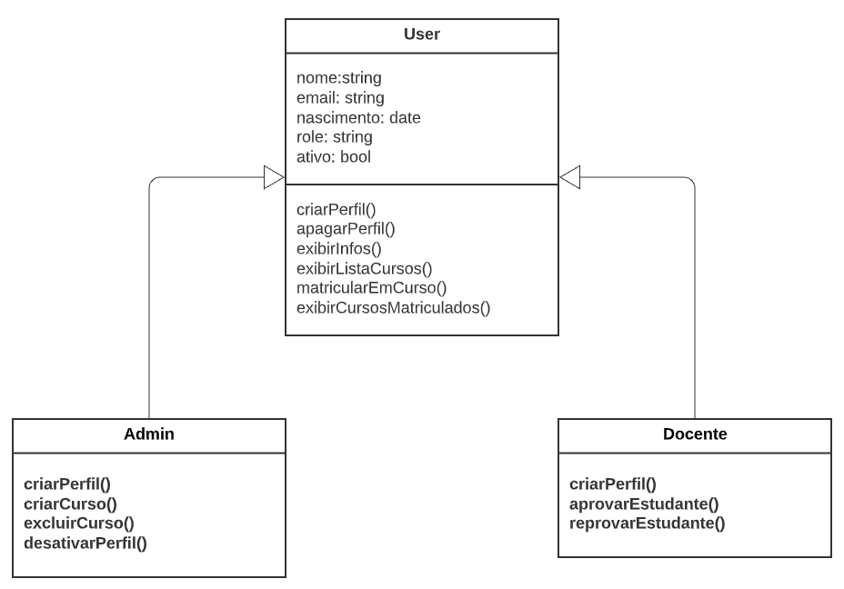

# Curso Alura - JavaScript programação Orientada a Objetos

## Aula 01 - Entendendo a Orientação a Objetos

### Aula 01 - Apresentação - Vídeo 1

Transcrição  
Boas-vindas ao curso de Orientação a Objetos com JavaScript! Eu sou Ju Amoasei.

Audiodescrição: Juliana Amoasei se identifica como uma mulher branca. Possui cabelos curtos pintados de azul, olhos e sobrancelhas castanho-escuros. Nos olhos, usa óculos de armação vermelha. No nariz, usa piercing de argola na narina direita. Na orelha direita, usa dois brincos de argola médios. No corpo, usa uma camiseta cinza mescla com o logo da Alura. Ao fundo, um dos estúdios da Alura, com uma parede lisa e uma estante de livros à direita, ambos iluminados em tons de verde e azul.

Para quem é este curso?  
Este conteúdo é quem está iniciando na programação e escolheu o JavaScript como linguagem.

Pré-requisitos  
Para fazer este curso, recomendamos fortemente que você já tenha acompanhado os cursos sobre Fundamentos de Objetos com JavaScript e sobre Biblioteca aqui na plataforma.

O que aprenderemos?  
Este curso não vai abordar temas relacionados à programação front-end. Porém, alguns dos conceitos que vamos apresentar serão bem similares.

Vamos aprender como utilizar o paradigma de orientação a objetos com JavaScript, um dos paradigmas mais usados em algumas das linguagens mais utilizadas no mercado.

Também vamos aprender como a linguagem JavaScript funciona e como a forma específica de implementar algumas funcionalidades dessa linguagem influencia na forma como utilizamos a orientação a objetos.

Também vamos aprender cinco fundamentos da orientação a objetos:

- Objetos
- Classes
- Herança
- Encapsulamento
- Polimorfismo.

Vamos aproveitar os recursos da plataforma! Além dos vídeos, há várias atividades extras que complementam o conteúdo.

Além disso, você pode contar com o apoio do fórum do curso e da nossa comunidade no Discord.

Vamos estudar?

### Aula 01 - Preparando o ambiente

> Se você já fez os cursos que constam como pré-requisito, é muito provável que o ambiente já esteja pronto. Ainda assim, organizamos algumas instruções, que estão logo abaixo, para você conferir!

Node.js  
Caso já tenha feito algum curso anterior de JavaScript para back-end, o Node.js pode já estar instalado na sua máquina.

> Recomendamos fortemente que tenha feito os cursos anteriores da formação para acompanhar melhor o conteúdo! Se não tiver certeza, é possível conferir com os seguintes passos:

1 - Abra uma janela do terminal em seu computador. Isso pode ser feito da seguinte forma:

- Windows: você pode acessar a busca no menu iniciar e procurar por Prompt de Comando, ou acessar via Menu Iniciar > Sistema do Windows > Prompt de Comando.
- MacOs: o Terminal está disponível no menu de Aplicações, dentro da pasta de Utilitários.
- Linux (Ubuntu): o Terminal está disponível no menu de Programas/Aplicações. Caso não localize, pode estar dentro da pasta Utilitários.

2 - No terminal, digite node --version ou node -v. Se retornar um número de versão, como v20.11.0, o Node.js já está instalado.

Caso precise instalar, siga as instruções para cada sistema operacional que estão na [página inicial do Node.js](https://nodejs.org/en). Este curso foi desenvolvido usando a versão 20.11.0.

O site do Node.js (no momento em que produzimos este curso) oferece na página inicial o download da versão LTS (long term support, ou suporte a longo prazo). Clique no botão correspondente para baixar e instalar normalmente como qualquer outro programa.

alt: Site oficial do Node.js. O botão para download da versão LTS se encontra à esquerda, abaixo do texto “Run JavaScript Everywhere. Node.js is a free, open-source, cross-plataform JavaScript runtime environment that lets developers create servers, web apps, command line tools and scripts.”. À direita, há um exemplo de código para criar um servidor HTTP. O site tem tons escuros e a cor de destaque é verde.

Confira no link um [tutorial em vídeo de instalação do Node.js](https://youtu.be/Wqrx5FrmpZc). O site estará diferente no vídeo, porém as instruções e o passo a passo da instalação são os mesmos.

Se você utiliza Linux ou WSL (Subsystem Linux no Windows) também pode utilizar o NVM, Node Version Manager, para gerenciar as versões do Node.js instaladas em seu computador. [Confira nosso artigo com tutorial para instalação e uso](https://www.alura.com.br/artigos/descomplicando-o-trabalho-com-node).

Visual Studio Code  
O Visual Studio Code é o editor que escolhemos utilizar para escrever nossos códigos durante este curso. Os links para baixar e instalar de acordo com o seu sistema operacional estão na [página inicial do VSC](https://code.visualstudio.com/).

Recomendamos o uso do VSC para um melhor acompanhamento dos vídeos.

Porém, existem vários outros editores, como o Atom, o Sublime e o Notepad++. Caso já tenha algum destes instalado ou tenha preferência por outro, fique à vontade! Apenas note que alguns recursos e ferramentas variam de editor para editor e podem não estar disponíveis ou funcionar de forma diferente.

Agora podemos começar!

### Aula 01 - Relembrando objetos - Vídeo 2

Transcrição  
Neste curso, vamos trabalhar especificamente com orientação a objetos. A orientação a objetos é um dos vários paradigmas de programação. Mas o que é um paradigma?

Entendendo os paradigmas de programação  
Paradigmas de programação são abordagens sobre como resolver problemas de programação, baseados em uma teoria ou um conjunto de princípios definidos. Em outras palavras, um paradigma normalmente se baseia em alguma teoria matemática ou computacional que propõe resolver determinado problema de uma forma específica.

Cada paradigma tem um conjunto de regras que especificam como os dados são tratados, a organização do sistema, a forma como o código é escrito, entre vários outros aspectos.

Abstraindo conceitos com orientação a objetos  
A orientação a objetos, especificamente, é um princípio que busca espelhar o mundo real por meio de uma estrutura de objetos com características e ações. Esses objetos, por sua vez, interagem uns com os outros.

Ou seja, a programação orientada a objetos parte de uma premissa de aproximar a modelagem do código do "mundo real" para o software. O propósito é transformar em software aspectos como uma pessoa, um produto ou um processo.

O intuito dessa abordagem é aproximar a abstração lógica de um programa ou aplicativo aos problemas da vida real que o software deve resolver.

Quando falamos em objetos, precisamos abstrair conceitos que existem na vida real.

Por exemplo, vamos pensar em um gato. Para abstrair um gato seguindo os conceitos da orientação a objetos, começamos dividindo este gato (não literalmente) em duas partes: características e comportamentos.

Como características desse gato, identificaremos:

- O sexo;
- A idade, que calculamos a partir da data de nascimento;
- A cor da pelagem;
- Alguns status como:
- Ser castrado;
- Estar vacinado;
- Estar vermifugado.

Os comportamentos que este gato pode ter são ações. Nessa etapa, descreveremos o que o gato pode fazer:

- Miar;
- Comer:
- Comer ração úmida;
- Comer ração seca;
- Dormir;
- Se limpar com lambidas;
- Brincar:
- Brincar com bolinha;
- Brincar com laser;
- Brincar com fita;

Se transferirmos isso para o JavaScript, podemos utilizar um objeto literal, único para cada gato.

O objeto literal é a forma mais comum de se criar objetos em JavaScript, na qual temos uma variável e criamos o objeto a partir dela.

```JavaScript
const gato = {
    nome: "Churrumina",
    nascimento: "25/11/2018",
    pelagem: "mesclada",
    status: {
        castrada: true,
        vacinada: true,
        vermifugada: true
    }
}
```

O objeto gato criado como exemplo acima possui diversas propriedades:

- O nome, com o valor Churrumina do tipo string;
- O nascimento, também do tipo string, com sua data de nascimento;
- A pelagem, com o valor mesclada;
- Um bloco status com uma lista de valores booleanos, que retornam verdadeiro ou falso (true ou false):
- castrada, igual a true;
- vacinada, igual a true e
- vermifugado, igual a true.

Além das propriedades, esse objeto tem comportamentos. No JavaScript, podemos atribuir isso a uma função, como no exemplo miar abaixo, inserido dentro do objeto gato, abaixo do bloco status.

```JavaScript
const gato = {
    nome: "Churrumina",
    nascimento: "25/11/2018",
    pelagem: "mesclada",
    status: {
        castrada: true,
        vacinada: true,
        vermifugada: true
    }
    miar: function() {
        console.log("miau")
    }
}
```

Nesse exemplo, a função miar chama um console.log com o som "miau" do gato em uma string. A partir disso, temos o comportamento de miar do gato, que será chamado com gato.miar().

Criando modelos de objetos  
Entendemos como abstrair conceitos da vida real em um objeto, transformando um gato de verdade em um gato de software.

Mas e se tivermos mais de um gato?

Vamos pensar, por exemplo, em uma clínica veterinária que atende vários gatos. Poderíamos ter um objeto literal, único para cada um dos gatos, conforme o exemplo abaixo.

```JavaScript
const gato1 = {
    nome: "Churrumina",
    nascimento: "25/11/2018",
    pelagem: "mesclada",
    status: {
        castrada: true,
        vacinada: true,
        vermifugada: true
    }
}

const gato2 = {
    nome: "Wen Ning",
    nascimento: "25/01/2021",
    pelagem: "creme",
    status: {
        castrado: true,
        vacinado: true,
        vermifugado: true
    }
}
```

Temos o gato1, Churrumina, e o gato2, Wen Ning, cada qual com todas as suas características.

Mas se pensarmos em termos de um sistema, essa estrutura não é gerenciável nem prática. Não dá para criar variáveis e objetos literais para cada um dos gatos, cachorros e papagaios que temos em uma clínica veterinária.

Para resolver esse problema, podemos ter um modelo que se reflita no objeto que queremos criar.

Ou seja, podemos ter uma base para a estrutura gato, conforme o exemplo abaixo. Podemos criar esse modelo no formato de objeto literal mesmo, dizendo que modeloGato vai ter um nome, do tipo string, um nascimento, do tipo string, uma pelagem, do tipo string, e os status, que é um bloco com outro objeto, dentro do qual temos castrado, vacinado, e vermifugado, do tipo booleano.

```JavaScript
const modeloGato = {
    nome: stringNome,
    nascimento: stringData,
    pelagem: stringPelagem,
    status: {
        castrado: boolCastrado,
        vacinado: boolVacinado,
        vermifugado: boolVermifugado
    },
}
```

Esse modelo é uma das bases da orientação a objetos. Com ele, não só abstraímos os conceitos da vida real e transformamos em estrutura de código, como abstraímos os próprios modelos.

A partir desses modelos, criarmos todos os nossos gatos, pessoas usuárias, produtos do nosso e-commerce, e assim por diante.

A partir de um modelo, conseguimos criar instâncias diferentes, ou seja, cópias de um objeto. No nosso exemplo, a partir do modeloGato, criamos abaixo um objeto com os dados do gato Churrumina e outro com os dados do gato Wen Ning.

```JavaScript
[
    {
        nome: "Churrumina",
        nascimento: "25/11/2018",
        pelagem: "mesclada",
        status: {
            castrado: true,
            vacinado: true,
            vermifugado: true
        },
    },
    {
        nome: "Wen Ning",
        nascimento: "25/01/2021",
        pelagem: "creme",
        status: {
            castrado: true,
            vacinado: true,
            vermifugado: true
        },
    }
]
```

Um dos fundamentos explorados da orientação a objetos é conseguir fazer essa abstração que pode ser reaproveitada para vários gatos, clientes, produtos e outras entidades. A seguir, vamos colocar isso em prática.

### Aula 01 - Para saber mais: paradigmas de programação

Além do paradigma orientado a objetos, temos também outras formas de lidar e organizar os programas. Uma forma muito comum de categorizar esses paradigmas é dividi-los entre paradigmas imperativos ou declarativos.

Os paradigmas imperativos são aqueles que usam afirmações para alterar o estado de um programa, da mesma forma como o modo verbal imperativo no português expressa um comando ou ordem para ser executada. Essa categoria se preocupa com o “como” uma tarefa vai ser executada, o seu passo a passo e a sequência dessas etapas. Alguns dos paradigmas que se encaixam aqui são os seguintes:

- Estrutural
- Procedural
- Orientado a objetos

Um exemplo que mostra o paradigma imperativo é a implementação da seguinte função que recebe um vetor e retorna outro vetor com cada um dos valores dobrado:

```JavaScript
function dobra(vetor){
    let resultados = [];
    for (let i = 0; i < vetor.length ; i++){
        resultados.push(arr[i] * 2);
}
return resultados;
}
```

Podemos notar que passamos as instruções de como percorrer o vetor, qual operação fazer e o que devemos adicionar ao resultado.

Uma outra categoria de paradigma é o declarativo. Podemos dizer que uma característica dele é expressar a lógica de um processo sem descrever o seu controle de fluxo. Ou seja, é associado a “o quê” uma tarefa vai resultar ou retornar. Um paradigma que pode se encaixar nessa categoria é o paradigma funcional.

Uma implementação declarativa do mesmo problema de dobrar os valores de um vetor pode ser feita da seguinte forma:

```JavaScript
function dobra(vetor){
return vetor.map((item) => item * 2);
}
```

Podemos observar que não foi necessário explicitar como iterar sobre o laço de repetição ou atribuir os novos valores.

No cotidiano temos diversos outros exemplos de afirmações que podem ser consideradas declarativas, como arquivos HTML:

```HTML
<h1> Programação Declarativa</h1>
<p> Estou declarando como quero que o texto apareça, e não dizendo para o computador como renderizar um texto</p>
```

Ou até mesmo as queries SQL, nas quais apenas dizemos qual resultado esperamos, sem especificar como a busca deve ser feita:

```SQL
SELECT * FROM Alunos WHERE Escola=’Alura’;
```

O JavaScript e algumas outras linguagens podem utilizar mais de um paradigma. É comum ouvir o termo “multiparadigma” quando nos referimos a esse tipo de linguagem, e isso traz alguns benefícios, pois permite perfis diferentes de desenvolvedores e sistemas utilizarem uma linguagem em comum.

Claro que um paradigma não é necessariamente melhor que o outro, mas dependendo das circunstâncias podemos utilizar um que seja mais otimizado para determinada aplicação. Algumas funcionalidades precisam alterar o estado de uma aplicação, não podendo ser escritas de forma declarativa, assim como os códigos declarativos que utilizamos podem ter uma implementação imperativa por baixo dos panos.

Você pode conferir mais conteúdos sobre o tema na plataforma da Alura:

- [POO: o que é programação orientada a objetos?](https://www.alura.com.br/artigos/poo-programacao-orientada-a-objetos)
- [Alura+: O que é Programação Funcional?](https://cursos.alura.com.br/extra/alura-mais/o-que-e-programacao-funcional--c696)
- [Programação funcional: O que é?](https://www.alura.com.br/artigos/programacao-funcional-o-que-e)
- [Linguagens Funcionais – Hipsters #91](https://hipsters.tech/linguagens-funcionais-hipsters-91/)
- [Programação Funcional (e (clojure)) – Hipsters #158](https://hipsters.tech/linguagens-funcionais-hipsters-91/)

### Aula 01 - Modelando o projeto - Vídeo 3

Transcrição  
Neste curso, vamos trabalhar com um sistema que gerencia pessoas usuárias de uma plataforma de ensino, docentes e a parte de administração da plataforma.

Antes de começar a codar, precisamos entender o que vamos codar. Por onde começaremos?

Mapeando pessoas usuárias  
Vamos começar definindo quem são as pessoas usuárias. Assim como definimos um modelo para gatos, vamos fazer um modelo para as pessoas usuárias do sistema.

As pessoas usuárias básicas de um sistema de plataforma de ensino são estudantes e docentes que ministram aulas e criam cursos. Além disso, queremos pessoas para fazer a administração da plataforma, deletando coisas, colocando cursos no ar, deletando estudantes, entre outras tarefas.

Para isso, criamos um diagrama, dentro do qual mapeamos as propriedades de tipos de pessoa usuária do sistema. Precisamos fazer isso antes de codar para entender o que vamos programar.



No diagrama acima, estabelecemos um tipo de pessoa usuária básico chamado User, pensando no projeto atual. Os projetos que você fizer provavelmente terão propriedades diferentes.

No modelo User, estabelecemos dados básicos para ele:

- nome;
- e-mail;
- data de nascimento;
- role ou papel (estudante, docente, gerente, admin, entre outros);
- se está ativo no sistema.

A propriedade ativo retornará um booliano true ou false, enquanto as outras são todas do tipo string ou data. Para facilitar, podemos tratar esse data como string também.

Também estabelecemos nesse modelo duas funções, constructor() e exibirInfos(), das quais falaremos posteriormente. É possível ver que são funções, pois possuem parênteses no final.

Vamos explorar os outros dois perfis que criamos. O Docente possui as funções constructor() e aprovarEstudante(), enquanto o Admin também possui constructor() e outra função chamada criarCursos().

No diagrama que criamos, apenas a pessoa usuária básica tem propriedades. Contudo, isso não significa que as outras não precisam ter nome e e-mail.

A partir daqui, vamos começar a entender, em orientação a objetos, como criar bases de objetos, e a partir delas, criar outras, assim como criamos Admin e Docente a partir de User.

As entidades Admin e Docente têm setas que apontam para User no diagrama porque partiremos dela e vamos desmembrá-la em outros tipos de objeto, com outras características.

No diagrama, estamos dizendo que uma pessoa usuária básica não pode criar cursos, somente uma pessoa admin. O mesmo vale uma pessoa docente, a única que pode aprovar uma pessoa estudante.

Já a pessoa usuária básica só pode exibir informações, não sendo capaz de criar cursos, nem de aprovar uma pessoa estudante.

Essas limitações ocorrem porque decidimos os impedimentos e permissões que serão adicionados ao sistema para cada tipo de pessoa usuária.

Será que os tipos Admin e Docente também exibem informações? A seguir, vamos começar a codar para saber a resposta.

### Aula 01 - Para saber mais: a linguagem UML

Existe uma forma muito prática de ilustrar sistemas, controles de fluxo e outros comportamentos chamado UML. A UML é a Linguagem de Modelagem Unificada - do inglês Unified Modeling Language.

Ela consiste na padronização de algumas notações para facilitar o entendimento entre os times de desenvolvimento que eventualmente irão lidar com um determinado sistema.

Um dos diagramas mais comuns de ser representado utilizando a UML é o diagrama de classe. A função dele é representar as estruturas e relações entre as classes de um projeto e interfaces com outros sistemas. Aqui está um exemplo:



Diagrama UML representando um cliente, que pode possuir contratos de aluguel. O contrato de aluguel que se refere a 0 ou 1 veículo alugado e possui apenas uma empresa de aluguel de veículos. A empresa de aluguel de veículos pode possuir contratos de aluguel. A classe veículo alugado pode ser um caminhão, utilitário ou carro de passeio.

Neste diagrama, representamos a existência de uma relação por uma reta e as associações são indicadas por setas. Os números que acompanham as retas indicam a quantidade de itens que estão se relacionando. No exemplo, um cliente pode possuir 0 ou mais contratos de aluguel, enquanto um contrato de aluguel só pode se referir a 0 ou 1 veículo alugado.

Existem outras versões de diagramas de classe que incluem, por exemplo, os tipos de variáveis dos dados associados, informações sobre tipos de dados abstratos, relações de herança e composição de classes e métodos que são implementados pelas classes.

Atualmente, a [UML](https://www.uml.org/) é mantida por um consórcio internacional que regula esse padrão. Existem diversos programas disponíveis que nos permitem descrever em um código próprio um diagrama e exportar as imagens que ilustram o sistema, como o [PlantUML](https://plantuml.com/).

### Aula 01 - Criando usuários - Exercício

Você vai trabalhar em um novo projeto para uma escola de programação e começou mapeando os tipos de usuários da plataforma. Conversando com colegas, você se inteirou sobre quem serão os usuários e quais as necessidades de cada; a partir disso, desenhou o seguinte modelo de diagrama:



Revisando o diagrama junto com colegas, assinale as alternativas que correspondem às conclusões que vocês chegaram.

Alternativa correta;  
Todos os usuários deverão ter as mesmas propriedades em comum: nome, email, data de nascimento, role e ativo.

> Os tipos de usuário Admin e Docente não terão propriedades específicas, apenas as mesmas propriedades que o usuário padrão.

Alternativa correta;  
Todos os usuários deverão ter acesso à funcionalidade exibirInfos().

> O método exibirInfos() faz parte da lista de métodos do usuário padrão. Assim, qualquer outro tipo de usuário que derive deste deverá ter acesso aos mesmos métodos.

Alternativa correta;  
Caso um usuário deseje excluir um curso da plataforma, deverá ter permissões de usuário do tipo Admin.

> O método excluirCurso() faz parte apenas dos métodos de Admin, ou seja, outros tipos de usuário não terão acesso a este método.

Alternativa correta;  
Um usuário Admin pode se matricular em um curso da plataforma, se quiser.

> Os métodos implementados no usuário padrão, inclusive o método matricularEmCurso(), também podem ser acessados pelos tipos de usuários que derivam do padrão.

### Aula 01 - OO com JavaScript - Vídeo 4

Transcrição  
Após relembrar o que são objetos literais e temos uma ideia de como queremos começar a estruturar esse sistema, vamos criar a primeira pessoa usuária para ter um ponto de partida.

No diagrama exibido anteriormente, definimos que a pessoa usuária tem algumas propriedades. Além disso, na raiz da pasta do projeto, criamos um arquivo chamado objetoLiteral.js, que vamos acessar pelo VS Code.

Criando o objeto user  
Dentro desse arquivo, criamos um objeto com a const user, que possui as mesmas características que definimos no diagrama: nome, email, nascimento, role e ativo.

objetoLiteral.js:

```JavaScript
const user = {
    nome: 'Juliana',
    email: 'j@j.com',
    nascimento: '2024-01-01',
    role: 'estudante',
    ativo: true,
}
```

No sistema, definimos que toda vez que criamos uma pessoa usuária, o criamos como ativo por padrão, ou seja, com o valor true no atributo ativo. Afinal, não faz sentido para o sistema criar uma pessoa usuária que esteja inativa.

Nesse caso, você pode pensar no que faz mais sentido para o seu projeto.

Você pode consultar esse objeto pronto no repositório de código do curso.

Criando a função exibirInfo()  
Além das propriedades que já inserimos, também definimos que as pessoas usuárias têm uma função que chamamos de exibirInfo(). Esta fará o papel de pegar os dados das propriedades que julgarmos relevantes e enviá-las para algum lugar, exibindo na tela, no console, ou outro local.

Agora que já temos as propriedades, vamos criar essa função para começar a trabalhar. Para isso, entre as chaves do user e abaixo de ativo: true, vamos criar um novo atributo chamado exibirInfos(), o mesmo nome que definimos no diagrama, acompanhado de dois pontos e o primeiro método, function(), que possui um par de chaves.

```JavaScript
const user = {
    nome: 'Juliana',
    email: 'j@j.com',
    nascimento: '2024-01-01',
    role: 'estudante',
    ativo: true,
    exibirInfos: function() {}
}
```

Ele não precisa receber nenhum parâmetro, portanto, manteremos os parênteses e as chaves vazios, passando somente um console.log() entre as chaves.

```JavaScript
const user = {
    nome: 'Juliana',
    email: 'j@j.com',
    nascimento: '2024-01-01',
    role: 'estudante',
    ativo: true,
    exibirInfos: function() {
        console.log()
    }
}
```

Quais informações são relevantes para começar? Por enquanto, vamos exibir somente nome e email. Portanto, adicionaremos essas propriedades entre os parênteses do console.log().

Ao digitar "nome", notaremos que a ferramenta de autocompletar do Visual Studio Code, representada por uma lista suspensa, será exibida. Ela sugerirá a opção "nome", destacando-a na lista de possíveis propriedades.

Nesse caso, vamos clicar e aceitar. Quando fazemos isso, o autocompletar adiciona, além de nome, a palavra-chave this e um ponto, transformando a propriedade em this.nome.

Vamos fazer a mesma coisa com o email, transformando-o em this.email.

```JavaScript
const user = {
    nome: 'Juliana',
    email: 'j@j.com',
    nascimento: '2024-01-01',
    role: 'estudante',
    ativo: true,
    exibirInfos: function() {
        console.log(this.nome, this.email)
    }
}
```

Com isso, o VS Code está nos dando uma dica, dizendo que precisamos dessas informações nesse local, oferecendo ajuda para adicioná-las.

Mas afinal, o que é esse this?

Antes de explicar o this, palavra-chave importante do JavaScript, vamos voltar o conteúdo para entendermos o contexto do nosso código.

Conhecendo a história da classe Javascript  
Vamos acessar o link da documentação do MDN para classes. Se você já pesquisou ou ouviu algo sobre orientação a objetos, é muito possível que já tenha visto a palavra ou sintaxe de classe ou class, em inglês, conforme aparece na tela dessa documentação.

Essa sintaxe de classe, usando a palavra-chave class, não existia no JavaScript até a atualização ECMAScript 2015 ou ES6, uma das mais importantes dessa linguagem.

Antes disso, era possível fazer orientação a objetos com JavaScript, só que fazíamos isso exclusivamente com funções, já que a palavra-chave class não existia.

Essa palavra-chave foi implementada em 2015 devido a uma demanda da comunidade. Nessa época, o JavaScript havia se popularizado muito, e muitas pessoas que migravam de outras linguagens, acostumadas a trabalhar com orientação a objetos utilizando classes, passaram a solicitar a adição desse class, que então, foi adicionado.

Mas que isso tem a ver com o this adicionado pelo VS Code em nosso código?

O JavaScript possui um paradigma nativo que não é exatamente a orientação a objetos clássica das outras linguagens, mas sim um paradigma que chamamos de herança de protótipo.

A partir dele, o núcleo da linguagem inteira se constrói. E essa palavra-chave this tem tudo a ver com esse paradigma.

Se agora o JavaScript já tem a sintaxe de classe, por que não vamos direto para isso e começamos a mostrar como funciona essa palavra-chave?

Se voltarmos à documentação, o próprio MDN informa no começo do texto que a sintaxe para classes do JavaScript não introduz um novo modelo de herança de orientação a objetos, e que as classes provêm uma maneira simples e clara de se criar objetos e lidar com herança.

Isso quer dizer que a sintaxe de classes em JavaScript é construída em cima do modelo original da linguagem, o modelo de herança de protótipo. Portanto, para entender exatamente como funciona a orientação a objetos em JavaScript, antes de usar classes, devemos entender muito bem como funciona a herança de protótipo.

Resumindo, as classes são basicamente uma "capa" ou interface, que chamamos, às vezes, de "açúcar sintático", colocado em cima do modelo original, que utiliza funções.

A seguir, vamos entender o que é a herança de protótipo e como o this funciona.

### Aula 01 - Conceito de objeto - Exercício

Durante esta aula, relembramos as características de objetos, como acessamos seus valores e métodos e como criamos um objeto literal.

Analise o objeto a seguir:

```JavaScript
const user = {
 nome: 'Juliana',
 email: 'j@j.com',
 nascimento: '2024-01-01',
 role: 'estudante',
 ativo: true,
 exibirInfos: function() {
   console.log(this.nome);
 }
}
```

Assinale as alternativas corretas.

Alternativa correta;  
É correto ter a propriedade ativo = true no objeto, pois as características de algo do mundo real podem ser representadas não apenas por strings e números, mas também utilizando booleanos para, por exemplo, representar status como “é ou não é”, “está ou não está”, “é válido ou não é válido”.

> É possível estruturar um objeto com tipos diversos de dados para cada propriedade, entre dados primitivos e estruturados como strings, números, booleanos, arrays e até mesmo outros objetos:

```JavaScript
const objProduto = {
 tipo: "caneca",
 preco: 10,
 tamanho: {
   grande: '300ml',
   pequena: '120ml'
 },
 fragil: true,
 cores: ['preto', 'branco', 'azul']
}
```

Alternativa correta;  
A programação orientada a objetos busca abstrair conceitos da vida real para estruturas de código que possam ser reaproveitadas e combinadas, visando aproximar a lógica dos problemas que o sistema deve resolver.

> O conceito central da POO é a criação e manutenção de objetos, conjuntos de chave/valor em que os valores podem ser tanto dados primitivos/estruturados (as propriedades) quanto funções (os métodos). A partir destes “modelos”, chamados de classes, podemos criar cópias de objetos que têm a mesma estrutura, propriedades e métodos, e as classes refletem partes do negócio, como produto, usuario, pedido, carro etc.

### Aula 01 - Para saber mais: links da aula

Confira abaixo a lista de links utilizados durante a aula e/ou links complementares ao conteúdo:

- Durante a aula trabalhamos com algumas regras de negócio bastante simplificadas, para a partir delas criarmos nossas classes. Caso tenha interesse, confira nosso [artigo sobre regras de negócio](https://www.alura.com.br/artigos/o-que-sao-regras-de-negocio);
- Documentação do MDN sobre classes.

### Aula 01 - Mão na massa: criando entidades

Durante a aula trabalhamos com uma versão mais concisa do diagrama UML. Porém, é possível imaginar mais ações ou comportamentos que os diferentes tipos de usuários podem fazer em um sistema. Por exemplo, acompanhe uma outra versão do diagrama abaixo:

alt: Diagrama de relações entre user, admin e docente em um sistema. User, admin e docente têm os atributos: nome: string, email: string, nascimento: date, role: string, ativo: bool, e as funções: criarPerfil(), apagarPerfil(), exibirInfos(), exibirListaCursos(), matricularEmCurso(), exibirCursosMatriculados(). Admin tem as funções: criarPerfil(), criarCurso(), excluirCurso(), desativarPerfil(). Docente tem as funções: criarPerfil(), aprovarEstudante(), reprovarEstudante().

Agora é com você! Pense em um produto que gostaria de criar ou no seu app preferido e pratique montando diagramas ou mesmo objetos JavaScript que reflitam no funcionamento do sistema.

Opinião do instrutor

Você pode usar ferramentas como o [Lucidchart](https://www.lucidchart.com/pages/) ou o [draw.io](https://www.drawio.com/), que têm opções gratuitas para a criação de diagramas de diferentes tipos.

### Aula 01 - O que aprendemos?

Nessa aula, você aprendeu:

- Qual é a motivação e a base conceitual da programação orientada a objetos, que é abstrair modelos a partir de conceitos da vida - real e estruturar a forma como o programa é desenvolvido a partir destes modelos.
- Quais são as características de um objeto literal: um tipo de dado composto de pares de chave/valor, com valores que podem ser - tanto dados primitivos quanto arrays e outros objetos (também chamados de propriedades) e funções que dão comportamento ao objeto - (também chamados de métodos).
- Sobre o princípio de usar modelos (ou classes) para criar cópias (ou instâncias) de um objeto e como isso ajuda a reaproveitar - código.
- A estrutura e os conceitos por trás da UML (Linguagem de Modelagem Unificada), linguagem que oferece uma série de ferramentas e padrões para definirmos as classes de um sistema, quais métodos serão necessários e quais seus desdobramentos.

## Aula 02 - Funções e Protótipos

### Aula 02 - Entendendo o this - Vídeo 1

Transcrição  
Agora que já entendemos melhor a história por trás da herança de protótipo e das classes em JavaScript, vamos entender o que é efetivamente o this e por que ele é importante.

Vamos começar executando a nossa função exibirInfos, que ainda não executamos. Para executar um método, chamamos o objeto onde ele está e o chamamos, user.exibirInfos(), não precisa de parâmetro, apenas abrir e fechar parênteses.

Vamos abrir o terminal, digitar node objetoLiteral.js, e funcionou perfeitamente, trouxe o nome e o e-mail, que são as duas propriedades que colocamos no console.log. Vamos comentar a chamada da função.

```JavaScript
// user.exibirInfos()
```

Vamos fazer alguns exercícios para entender o que é o this. No JavaScript, uma coisa que fazemos, usualmente, é passar uma função como valor de uma variável.

No JavaScript, as funções são valores, assim como string, number, etc.

Vamos fazer um teste: vamos criar uma constante chamada exibir, igual, vamos passar para dentro da nossa constante exibir, a função exibirInfos.

Então, vamos passar para dentro dela, user.exibirInfos, sem abrir e fechar parênteses, porque não queremos executar, só queremos passar a informação para dentro da variável. E agora, para executar, vamos executar exibir().

```JavaScript
const exibir = user.exibirInfos
exibir()
```

E chamamos o terminal, escrevemos node objetoLiteral.js, e agora não deu mais certo, agora trouxe undefined undefined. O que aconteceu, então, com a função exibir?

Quando passamos exibirInfos de dentro do objeto user para dentro da variável exibir, podemos dizer que exibir, a variável, perdeu contexto. Usamos, realmente, esse termo contexto.

Ou seja, exibirInfos perdeu a conexão, digamos assim, com o objeto user, de onde ela tirava a propriedade nome e a propriedade email.

Então, vamos comentar a constante exibir que criamos e a chamada. É mais ou menos como se fizéssemos o seguinte:

```JavaScript
const exibir = function() {
    console.log(this.nome, this.email);
}
```

Só que, a partir desse momento, se observarmos a constante exibir, a nossa expressão de função, já percebemos que this.nome e this.email não têm de onde vir mesmo. Nessa função, essas propriedades estão soltas, não fazem referência a nada.

Então, como que fazemos para dar contexto para essa função? Se formos traduzir a palavra this para o português, ela significa "isso", e tanto em inglês quanto em português, this ou "isso", são palavras que só fazem sentido se elas tiverem, literalmente, um contexto atrelado a elas.

Neste caso, exibir perdeu o contexto com o nosso objeto user, e aí ela não sabe de quem é o nome, ela não sabe de quem é o e-mail e agora temos que resolver.

Tentando, então, dar um contexto para a nossa constante exibir, vamos fazer o seguinte: vamos criar uma outra constante embaixo dela, vamos chamar de exibirNome.

exibirNome vai receber a nossa constante exibir, onde está a função guardada dentro dela, só que agora vamos usar um método que utilizamos no Javascript junto com o this, que é o método bind, então exibir.bind.

O bind é um método que utilizamos justamente para prender, para bind (ligar). Vamos usar o bind para ligar a nossa constante exibir a um objeto user, então, bind(user).

Ou seja, agora o que fizemos? Estamos passando para dentro de exibirNome a nossa função exibir, que estava sem contexto nenhum, a um objeto específico. Esse objeto tem as propriedades nome, tem a propriedade e-mail, que é o nosso objeto user, e agora podemos chamar a nossa função exibirNome e fazer o teste que deve tudo funcionar.

```JavaScript
const exibir = function() {
    console.log(this.nome, this.email);
}
const exibirNome = exibir.bind(user);
exibirNome()
```

Então chamamos o terminal, escrevemos node objetoLiteral.js, e ele retorna "Juliana j@j.com", que foi o e-mail que colocamos lá, então deu tudo certo, porque agora o bind está fazendo esse papel de juntar as duas coisas.

Essa questão de contexto do this e de como prendemos métodos a objetos específicos é muito importante na herança de protótipo, e vamos praticar mais isso nas próximas aulas.

Uma coisa muito importante sobre o this, e sobre ligar métodos a contextos. Isso é central em herança de protótipo. Você pode ter notado que não usamos arrow functions para criar essas funções.

Não utilizamos arrow functions para criar métodos. Elas não funcionam exatamente da mesma forma que funções normais.

Arrow functions não devem ser usadas como métodos, porque elas só têm o contexto de onde elas são executadas.

Não conseguimos ligar uma arrow function a um contexto específico, usando o bind da mesma forma que fazemos com funções que são declaradas mesmo com a palavra-chave function.

Vamos deixar mais material sobre essas diferenças nas atividades, recomendamos muito que você dê uma conferida, porque essa é uma particularidade importante, arrow function não é exatamente a mesma coisa que uma declaração de função.

Vamos fazer mais exercício com herança de protótipo, com contexto, com o this, porque ainda tem vários outros detalhes importantes além desse arrow function que acabamos de mencionar, então, vamos continuar.

### Aula 02 - Para saber mais: call e apply

Durante as aulas usamos bind() para ligar (bind) o valor de this a um determinado contexto. Existem outros dois métodos para manipular o contexto de this: call() e apply().

call()  
O método call() executa a função passando valores e parâmetros específicos para serem usados como contexto do this, ou seja, é possível atribuir um this diferente do contexto atual ao executar a função.

Um exemplo de uso de call() para especificar o contexto de this:

```JavaScript
function exibeInfos() {
 console.log(this.nome, this.email)
}
const user = {
 nome: 'Mariana',
 email: 'm@m.com'
}
exibeInfos.call(user)
```

Fazendo com que a função seja executada em determinado contexto, mesmo após ser instanciada:

```JavaScript
function User(nome, email) {
 this.nome = nome
 this.email = email

 this.exibeInfos = function(){
   console.log(this.nome, this.email)
 }
}
const newUser = new User('mariana', 'm@m.com')
```

```JavaScript
const outroUser = {
 nome: 'Rodrigo',
 email: 'r@r.com'
}
newUser.exibeInfos() //mariana m@m.com
newUser.exibeInfos.call(outroUser) //Rodrigo r@r.com
```

Também é possível passar parâmetros para call(), como no próximo exemplo.

Temos uma função que monta uma determinada mensagem a partir dos parâmetros nome e email. Se quiséssemos vincular os dados da mensagem a um objeto com dados de usuários, podemos usar call() passando como primeiro parâmetro o contexto a ser considerado como this (no caso, objeto user) e a partir do segundo parâmetro definimos quais os argumentos.

```JavaScript
function exibeMensagem(nome, email) {
 console.log(`usuário: ${nome}, email ${email}`)
}
 const user = {
 nome: 'Mariana',
 email: 'm@m.com',
 executaFuncao: function(fn) {
   fn.call(user, this.nome, this.email)
 }
}

user.executaFuncao(exibeMensagem) //usuário: Mariana, email m@m.com
```

Nesse caso, a função que será executada também está sendo passada como parâmetro de executaFuncao e usamos call() para “chamar” a função com um contexto (this) específico e também argumentos específicos.

O método call() pode ser utilizado para se implementar herança utilizando funções em vez da sintaxe de classe. Vamos abordar este assunto na próxima aula.

apply()  
O método apply() funciona de forma semelhante ao call(), porém recebe a lista de argumentos em um array:

```JavaScript
function exibeMensagem(nome, email) {
 console.log(`usuário: ${nome}, email ${email}`)
}
 const user = {
 nome: 'Mariana',
 email: 'm@m.com',
 executaFuncao: function(fn) {
   fn.apply(user, [this.nome, this.email])
 }
}
 user.executaFuncao(exibeMensagem) //usuário: Mariana, email m@m.com
```

Usando arrays, é possível passar os argumentos via variável ou até mesmo usando a propriedade arguments que existe internamente em todo objeto.

### Aula 02 - Para saber mais: Function vs Arrow Function

Durante a aula, usamos sempre a sintaxe de criação de funções usando a palavra-chave function, apesar de o JavaScript ter uma outra forma, mais curta e considerada mais “moderna” de se criar funções, a “arrow function” =>.

Então, por que não utilizamos arrow function na criação dos nossos métodos?

Em um primeiro momento, todas as três formas de criação de função parecem funcionar de forma bem similar. Porém, as arrow functions diferem da function usual em alguns pontos, sendo o mais importante para nós nesse momento a questão do this.

O problema do this  
Caso você precise relembrar como funcionam as três formas de se escrever funções em JavaScript, veja o tópico seguinte “Relembrando os tipos de função” (logo abaixo).

A primeira diferença entre a declaração de função e as expressões de função é o hoisting. Mas, além do hoisting, existe outra diferença principal entre declaração de função e arrow function: ao contrário das funções normais, arrow functions herdam automaticamente o contexto de onde foram criadas e não têm seu próprio “contexto de invocação”. Ou seja, não podem ser ligadas a contextos específicos com this e nem fazer uso dos métodos bind(), call() e apply().

Arrow functions também não possuem a propriedade prototype e por isso não podem ser usadas como funções construtoras - assunto que veremos em seguida. Por este motivo, não usamos arrow functions em nenhum momento para a criação de métodos durante o curso.

Agradecemos ao aluno Rodolpho, que respondeu a uma dúvida sobre arrow functions no nosso fórum e nos deu a ideia de acrescentar este conteúdo.

Você pode consultar o a documentação do MDN para saber mais sobre arrow functions.

Relembrando os tipos de função  
A primeira versão, mais “clássica”, é muito parecida com outras linguagens:

```JavaScript
function soma(num1, num2) {
 return num1 + num2;
}
```

É a chamada “declaração de função”.

A segunda forma atribui a função a uma variável, funcionalidade que não é tão comum em outras linguagens:

```JavaScript
const soma = function(num1, num2) {
 return num1 + num2;
}
```

Chamamos essa forma de “expressão de função”.

A terceira e última forma é a arrow function ou “função de seta”, caracterizada pelo operador =>:

```JavaScript
const soma = (num1, num2) => {
 return num1 + num2;
}
```

Ou, no caso de blocos de código com apenas uma linha, podemos omitir o return e as chaves {}:

```JavaScript
const soma = (num1, num2) => num1 + num2;
```

Bem mais curto!

A arrow function também é uma expressão de função.

E quais são as diferenças entre elas, além do this?
A primeira diferença entre as três formas é um pouco mais teórica. Funções criadas como declaração recebem um identificador (ou seja, um nome), e funções criadas como expressão são consideradas anônimas - estas funções são atribuídas a variáveis e é através dessas variáveis que conseguimos chamá-las e executá-las.

Na prática, a diferença se dá no contexto do carregamento do código. Declarações de função têm seu código lido antes da execução de qualquer instrução, pois o interpretador “puxa” para as primeiras linhas do arquivo todas as variáveis e todas as declarações de função, deixando seus códigos e dados “carregados” para, aí sim, começar a executar os códigos. A esta ação se dá o nome de ”hoisting”, que significa algo como “içar”, pois as funções e variáveis são “içadas” para o topo do arquivo e lidas primeiro.

Já as expressões de função, que são anônimas, não passam pelo processo de hoisting e têm seu conteúdo interpretado apenas no momento da execução. Assim, o interpretador (seja o Node.js ou um navegador) não consegue executar a função sem ter lido seu conteúdo antes.

Por exemplo, o código abaixo (uma declaração de função) executa normalmente:

```JavaScript
console.log(soma(1, 1)) //2
//é possível executar a função antes de declará-la no código
function soma(num1, num2) {
 return num1 + num2;
}
```

Porém o código abaixo (uma expressão de função) não executa:

```JavaScript
console.log(soma(1, 1)) //erro
//ReferenceError: Cannot access 'soma' before initialization
const soma = function(num1, num2) {
 return num1 + num2;
}
```

O mesmo erro acima ocorreria com uma arrow function. Faça o teste!

Agora que já relembramos os tipos de função e suas diferenças, podemos seguir em frente.

### Aula 02 - Herança de protótipo - Vídeo 2

Transcrição  
Vamos continuar a entender como funciona a herança de protótipo e o que significa esse termo. Criamos um novo arquivo chamado herancaPrototipo.js e colamos nele o mesmo objeto user que usamos anteriormente em objeto literal.

```JavaScript
const user = {
  nome: "Juliana",
  email: "j@j.com",
  nascimento: "2024-01-01",
  role: "estudante",
  ativo: true,
  exibirInfos: function () {
    console.log(this.nome, this.email);
  },
};
```

Agora, temos o nosso usuário base. De acordo com o diagrama, usuários padrão podem exibir informações, mas usuários admin podem criar cursos, o que os usuários padrão não podem.

Criando um usuário Admin
Então, poderíamos criar um objeto admin em nosso arquivo. Abaixo do nosso const user, vamos criar uma const admin. Lembrando que todos os tipos de usuário no nosso sistema têm as mesmas propriedades básicas.

Então, vamos copiar e colar essas informçaões do usuário de cima. Nome, vamos dizer que é "Mariana". O e-mail dela pode ser m@m.com. A data de nascimento pode ficar a mesma. E o role vai ser admin. Ativo o true.

Mas nós também definimos no nosso sistema que todos os tipos de usuário precisam exibir informações. Então, também vamos copiar a função exibirInfos e colocá-la embaixo de ativo na nossa const admin.

No entanto, agora temos algo que não parece tão certo, porque temos exatamente as mesmas propriedades e a mesma função que faz a mesma coisa nos dois objetos.

Então, podemos remover exibirInfos de admin e deixar dentro do nosso objeto admin apenas a função criarCurso?

Vamos fazer isso. Vamos criar aqui uma função, que vamos chamar de criarCurso: function(), abre e fecha parênteses, sem parâmetro nenhum. Por enquanto, vamos dar apenas um console.log para ela também e vamos dar só um texto escrito "curso criado" para testar.

Mas, na verdade, não podemos remover o exibirInfos de admin da forma como está, porque precisamos exibir as informações de admin também, não podemos só criar curso.

Como resolvemos isso, então? Como reaproveitamos algo que já foi feito na const user e passamos para dentro da nossa const admin?

Como funciona a herança de protótipo  
Vamos apagar a função exibirInfos dentro de admin. É aqui que entra a tal da herança de protótipo. Depois da nossa const admin, vamos chamar Object.setPrototypeOf e dentro do setPrototypeOf, vamos passar dois parâmetros.

O primeiro vai ser admin, que é o nome da nossa const, e o segundo vai ser user, que é o nome da outra const, do outro objeto.

Vamos chamar, primeiro, admin.criarCurso(), porque queremos realmente executar essa função, e vamos chamar, também, admin.exibirInfos().

```JavaScript
const admin = {
  nome: "Mariana",
  email: "m@m.com",
  nascimento: "2024-01-01",
  role: "admin",
  ativo: true,
  exibirInfos: function () {
    console.log('curso criado');
  },
};

Object.setPrototypeOf(admin, user)
admin.criarCurso()
admin.exibirInfos()
```

Vamos testar. Vamos abrir o terminal e escrever node herancaPrototipo.js, vamos ver o que acontece:

```JavaScript
curso criado
Mariana m@m.com
```

Due certo. Então, o que fizemos aqui, com essa linha onde declaramos Object.setPrototypeOf? setPrototypeOf significa, se traduzirmos, estamos definindo que admin vai usar como protótipo, ou seja, como a base ou modelo, com as especificações dele, o objeto user.

Então, o primeiro parâmetro de setPrototypeOf é quem vai pegar as propriedades, e o segundo parâmetro é o objeto que vai fornecer as propriedades, que vai fornecer essa base, vai fornecer essa receita, digamos assim, de como o objeto tem que ser construído.

Por isso, conseguimos chamar tanto o objeto admin quanto o método criar cursos, que é dele, só o admin tem. Mas também podemos chamar admin.exibirInfos.

exibirInfos não está dentro da const admin, porém, esse método faz parte do objeto user, que usamos como protótipo para construir o objeto admin.

Isso que acabamos de fazer foi herança de protótipo, onde o JavaScript utiliza um objeto como protótipo para herdar propriedades de outro.

Na prática, o que acontece quando executamos esse código? O JavaScript, na hora que executa exibirInfos a partir do objeto admin, ou seja, no contexto do objeto admin, ele vai no objeto e procura esse método, exibirInfos. Ele não encontra, porque não existe.

E o JavaScript faz o quê? Ele olha dentro do código para saber se admin tem como protótipo dele algum outro objeto. Nesse caso, ele encontra, porque definimos isso na linha 23, com o Object.setPrototypeOf.

E aí, o JavaScript acessa o objeto user e encontra um método dentro dele e consegue executar. E ele consegue executar tomando o this, o contexto, como objeto a partir de onde ele foi chamado. Ou seja, o contexto de this.nome, this.email, é o objeto admin, não é mais o objeto user, que foi a partir de onde o JavaScript executou a função exibirInfos.

Esse processo do JavaScript, acessar o primeiro objeto e ir procurando o método até encontrar o protótipo original se chama cadeia de protótipo, porque os objetos estão ligados uns aos outros.

Agora, vamos fazer mais exercícios para entender melhor o que é essa cadeia de protótipo e como ela funciona.

### Aula 02 - Cadeia de protótipos - Vídeo 3

Transcrição  
Vamos entender melhor o que é essa tal de cadeia de protótipo. Para isso, não vamos utilizar o console do Node do terminal, mas o navegador. No caso, abrimos o Google Chrome, com uma página about:blank, que é uma página sem nada. Clicamos com o botão direito em Inspect (Inspecionar) e selecionamos o "Console".

Por que vamos usar o console do navegador e não o objeto console do Node? Porque eles funcionam de forma um pouco diferente e, pelo console do Node, não conseguimos ter acesso a algumas propriedades que, no navegador, conseguimos acessar de forma mais prática. É só para entendermos como funciona a cadeia de protótipo.

Estamos no console do navegador. Vamos voltar no código para copiar e colar os dois objetos que criamos anteriormente. Então, vamos copiar a constante user, a Juliana, colar no navegador e dar Enter.

Ficou registrado. Se tiver algum erro no console do Chrome nesse momento, ele vai dar um aviso, porque normalmente o navegador tem uma ferramenta de segurança para as pessoas não inserirem código no console.

Você pode escrever lá allow pasting (Permitir Colar Código), e aí ele vai deixar você fazer isso que estamos fazendo. Se não emitiu erro, é só continuar.

Vamos fazer a mesma coisa com a constante admin. Vamos copiar e colar no código. E, por último, vamos copiar também o object.setPrototypeOf, já com admin e user.

```JavaScript
const user = {
  nome: "Juliana",
  email: "j@j.com",
  nascimento: "2024-01-01",
  role: "estudante",
  ativo: true,
  exibirInfos: function () {
    console.log(this.nome, this.email);
  },
};
const admin = {
  nome: "Mariana",
  email: "m@m.com",
  nascimento: "2024-01-01",
  role: "admin",
  ativo: true,
  criarCurso: function() {
    console.log('curso criado');
  }
}
Object.setPrototypeOf(admin, user)
admin.criarCurso()
admin.exibirInfos()
```

Agora, colamos, demos "Enter", ele registrou e já executou nesses códigos.

Como, então, utilizamos o console para entender a cadeia de protótipo? Vamos aumentar um pouco o zoom na tela para conseguirmos acompanhar melhor. Vamos dar um "Ctrl + L" para limpar também esse console, mas as informações continuam aqui.

Vamos testar escrevendo admin.exibirInfos(), ele trouxe os dados da Mariana. Vamos executar também admin.criarCurso(), e veremos a mensagem "curso criado". Está tudo funcionando.

Então, o que acontece quando fazemos essa chamada de exibirInfos a partir de admin? A chamada é feita a partir de admin, ela vai seguir uma cadeia de protótipos que vai de admin para o usuário base de admin, que é user, onde está o nosso método exibirInfos, e, a partir daí, para onde vai essa cadeia?

Agora, no console, vamos fazer o seguinte: vamos escrever admin.__proto__, e dar "Enter". O que o console retornou? Foi um objeto que já conhecemos, o nosso objeto user, Juliana, que é um role estudante.

Vamos dar um "Ctrl + L" para limpar novamente, "Seta para cima" para chamar o último comando, e vamos adicionar nessa linha, admin.__proto__. e vamos chamar a propriedade proto novamente, __proto__, em seguida. Então, agora, temos duas chamadas de proto.

```JavaScript
admin.__proto__.__proto__
```

E, agora, o console retornou uma coisa um pouco diferente: ele trouxe um outro objeto para nós, que tem dentro dele uma propriedade chamada constructor (construtor), que é uma função do tipo objeto.

Vamos guardar essa informação, vamos limpar novamente o console, voltar ao último comando, e vamos adicionar de novo o ponto __proto__ no final.

```JavaScript
admin.__proto__.__proto__.__proto__
```

E, agora, ele trouxe null, não trouxe mais nada. O que significa esse null? Significa que, a partir de admin.exibirInfos, fizemos uma cadeia de protótipo, que começa em admin, passa por user, passa pelo construtor do objeto, que observamos no console, e depois o construtor do objeto não tem mais nada.

Por isso, a nossa última chamada proto retornou null. Isso significa que, depois do objeto, chegamos ao final dessa cadeia de protótipo. Vamos voltar o comando até encontrar novamente o construtor de objetos.

O protótipo básico  
O que isso significa? Todos os objetos criados com JavaScript, eles têm dentro dele o que chamamos de protótipo básico. É um protótipo que traz todos os métodos e todas as propriedades que são comuns, compartilhados entre todos os objetos que criamos em JavaScript.

Se lermos as propriedades, podemos conferir hasOnProperty, isPrototypeOf, ou seja, uma função que utilizamos para verificar se um objeto é protótipo de outro, e a propriedade __proto__ lá embaixo.

Isso significa que todos os objetos têm dentro dele algumas propriedades que são comuns, como essas que acabamos de listar.

Vamos limpar de novo o console. Isso é importante, inclusive, no caso de primitivos. Ou seja, se quisermos, podemos criar uma string utilizando uma constante texto = 'oi'.

Porém, o JavaScript também permite que criemos uma string a partir de um construtor. Por exemplo, String() passando os dados dessa string. Por quê? Porque nos bastidores, tudo o que criamos em JavaScript é um objeto, inclusive tipos primitivos, como string, number, boolean.

Podemos chamar String.prototype, agora sem o underline, é prototype mesmo. Se dermos um "Enter", o console vai exibir um objeto que tem todos os métodos que conseguimos fazer com string que vimos nos cursos de fundamento de string.

Então, charCodeAt, por exemplo, temos a propriedade length, que é o tamanho da string, slice, a mesma coisa com array. Então, se tentarmos Array.prototype, também vamos ver todos os métodos que são comuns em todos os arrays que criamos. Então, filter, find, tudo o que vimos nos cursos anteriores de fundamento.

Ou seja, tanto primitivos quanto outros dados estruturados, por exemplo, arrays e objetos, para o JavaScript, são construídos a partir de um protótipo base.

E essa é, digamos, a forma nativa do JavaScript de trabalhar com herança, a herança de protótipo, onde você tem uma cadeia de objetos que vai se ligando até chegar no protótipo base, um protótipo de objeto, protótipo de array, etc.

Após a implementação da sintaxe de classe, que vamos ver em seguida, a herança de protótipo não é muito comum de ser utilizada no dia a dia de desenvolvimento de JavaScript.

Mas é muito importante que você entenda como os protótipos funcionam e como a cadeia de protótipo funciona, porque as classes são implementadas em cima disso.

Então, tudo isso que vimos continua valendo e você vai ver isso em documentação. Vamos ver só um pouco mais sobre esse assunto de protótipo para afirmar bem o conhecimento antes de passarmos para as classes.

### Aula 02 - Herança de protótipo - Exercício

Você está trabalhando nas funcionalidades referentes a cadastro de funcionários de uma empresa e gostaria de colocar em prática alguns conhecimentos que obteve sobre herança de protótipos. Para um sistema com usuários padrão, atendentes e gerentes, você desenvolveu os seguintes objetos:

```JavaScript
const userDefault = {
 exibirInfos: function () {
   console.log(this.nome, this.email);
 },
 cadastraEmail: function(email) {
   console.log(`email ${email} cadastrado com sucesso`);
 }
};
const atendente = {
 nome: "Rodrigo",
 email: "r@r.com",
 role: "atendente",
}
const gerente = {
 nome: "Juliana",
 email: "j@j.com",
 role: "gerente sênior",
 removeUsuario: function(idUsuario) {
   console.log(`usuário ${idUsuario} removido`);
 }
}
Object.setPrototypeOf(atendente, userDefault)
Object.setPrototypeOf(gerente, userDefault)
```

Hora de analisar o código! Baseado no código acima, assinale as alternativas corretas.

Experimente basear suas respostas na leitura do código, sem executá-lo no terminal!

Resposta:  
Executando o código:

gerente.removeUsuario(123)  
Obtemos o retorno:

usuário 123 removido

> Qualquer pessoa com cargo de gerência pode remover qualquer outro usuário do sistema. Assim, faz sentido que os dados para remoção (por exemplo, id) sejam recebidos via parâmetro.

Resposta:  
Executando o código:

atendente.exibirInfos()
gerente.exibirInfos()
Obtemos o retorno:

Rodrigo r@r.com
Juliana j@j.com

> Apesar de o método exibirInfos não fazer parte de nenhum dos objetos, usamos setPrototypeOf para incluí-los na cadeia de protótipos a partir de userDefault.

Resposta:  
Executando o código:

atendente.cadastraEmail(this.email)
Resultará em undefined.

> O método cadastraEmail perdeu contexto devido ao ponto no código a partir de onde é executada; como está sendo executada a partir do escopo global, no caso do exemplo, this se refere justamente ao objeto Global do Node.js, e não ao objeto atendente. Uma forma de corrigir é fazendo referência direta ao objeto: atendente.cadastraEmail(atendente.email).

### Aula 02 - Para saber mais: __proto__ vs prototype

Durante nossos estudos de JavaScript é normal toparmos com os protótipos de duas formas diferentes, através da propriedade __proto__ ou do objeto prototype que vemos em todos os objetos. Afinal, qual a diferença entre eles e quando se usa cada um?

Para entender melhor essa diferença, vamos testar alguns códigos:

```JavaScript
let user = {
 perfil: 'estudante'
}

let estudante = {
 nome: 'juliana'
}

Object.setPrototypeOf(estudante, user)
```

No trecho acima, definimos dois objetos, com propriedades diferentes, e estabelecemos que o objeto user será usado como protótipo para o objeto estudante. Podemos testar esse código direto no terminal:

```JavaScript
console.log(estudante.nome) // 'juliana'
console.log(estudante.perfil) //'estudante'
```

Ou seja, o objeto estudante, além da propriedade nome, também tem a propriedade perfil, trazida do protótipo user.

É possível acessar __proto__ de estudante, porém, para isso, devemos copiar o código acima e executá-lo no console do navegador, pois o módulo console do Node.js funciona de uma forma um pouco diferente e não vai acessar essa propriedade.

Trecho de tela do console do navegador Chrome, executando o código acima da imagem. Após esse trecho de código, o console executa o comando estudante.__proto__, recebendo como retorno o objeto {perfil: estudante}

Se adicionarmos mais uma propriedade ao objeto user, essa propriedade entrará também como protótipo do objeto estudante:

Trecho de tela do console do navegador Chrome, executando as seguintes linhas de código: ‘user.ativo = true’, retornando ‘true’, e em seguida ‘estudante.__proto__’, retornando o objeto {perfil: ‘estudante’, ativo: true}

Quando usamos objetos e funções para trabalhar com orientação a objetos com JavaScript, os objetos criados não são instâncias diferentes (ou seja, cópias do objeto-base) e sim referências a um mesmo objeto que está sendo delegado aos objetos que o usam como protótipo.

Agora vamos ver outro exemplo, dessa vez utilizando new para criar um novo objeto:

```JavaScript
function User() {}
User.prototype.perfil = 'estudante'
let estudante = new User()
```

Testando no próprio terminal:

```JavaScript
console.log(estudante.perfil) //'estudante'
```

No caso acima, a palavra-chave new vai criar um novo objeto simples e definir, na propriedade prototype desse objeto recém-criado, as propriedades de protótipo que encontrar em User. O prototype é criado automaticamente e existe como propriedade apenas em funções, para quando queremos usar determinada função como construtor usando new.

Vamos fazer um último teste, copiando a função User() criada acima e executando no console do navegador:

Trecho de tela do console do navegador Chrome, executando as linhas de código criadas anteriormente: function User(){}, User.prototype.perfil = ‘estudante’, let estudante = new User() e console.log(estudante.perfil)

Se tentarmos acessar as propriedades prototype e __proto__ de estudante, obtemos os seguintes retornos:

Trecho de tela do console do navegador Chrome, executando as seguintes linhas de código: estudante.__proto__ com retorno {perfil: ‘estudante’, constructor: f}, estudante.prototype com retorno undefined e User.prototype com retorno {perfil: ‘estudante’, constructor: f}

Em resumo:

__proto__ é uma propriedade que todos os objetos têm e que aponta para o protótipo que foi definido para aquele objeto.

prototype é uma propriedade da função que é definida como protótipo quando usamos new para criar novos objetos.

Você também pode ter notado que alguns objetos também possuem uma propriedade chamada [[Prototype]]. Esta é uma propriedade interna que cada instância de um objeto possui e que aponta (como um ponteiro) para a propriedade prototype da função que está sendo usada como protótipo. Quando criamos um novo objeto usando new, a propriedade prototype do construtor (como vimos acima) é “linkada” à essa propriedade [[Prototype]] da nova instância criada.

Existem diversos métodos internos do JavaScript para verificar as propriedades de um construtor e também das instâncias criadas através dele. Você pode conferir a lista na [documentação do MDN](https://developer.mozilla.org/pt-BR/docs/Web/JavaScript/Reference/Global_Objects/Object).

Faça mais testes criando objetos a partir de funções construtoras e confira o resultado!

### Aula 02 - Para saber mais: um resumo sobre protótipos

Aprendemos vários aspectos da herança de protótipos durante a aula. Vamos resumir alguns deles aqui e colocar alguns pontos extras:

Protótipo vs prototype  
Praticamente todos os dados criados em JavaScript (objetos, arrays etc.) têm um protótipo, porém apenas alguns deles têm a propriedade prototype. São estes objetos que contêm a propriedade prototype que acessamos com Object.prototype, Array.prototype, entre outros, durante o vídeo, que definem os protótipos para todos os outros acima na cadeia.

Ou seja, todos os objetos criados a partir de Object, Array, String etc. têm um protótipo que foi “herdado” destes, mas não necessariamente têm uma propriedade prototype.

Cópia vs referência  
Os métodos e propriedades não são copiados de um objeto para outro na cadeia de protótipos. Eles são acessados pelo interpretador ao percorrer a cadeia e os métodos executados de acordo com o this, ou seja, o contexto em que o método foi executado.

__proto__ será descontinuado  
O uso de __proto__ durante a aula é apenas para dar exemplo e acessar a cadeia de protótipos. Esta é uma propriedade “assessora” que serve para “expor” o protótipo dos objetos e está em processo de ser descontinuada. Você pode ler mais sobre esta propriedade na documentação do MDN.

Não altere o prototype  
Não é recomendável alterar diretamente o prototype, pois alterar diretamente as regras de herança de qualquer objeto afeta a performance do código em qualquer interpretador, tanto no Node.js quanto em navegadores. Vamos ver como criar objetos de acordo com as boas práticas do JavaScript em seguida.

Cuidado com a performance  
Todas as propriedades de uma cadeia de protótipos são enumeradas, e o tempo que o interpretador leva para pesquisar uma propriedade, desde o nível mais alto na cadeia, pode ser longo e impactar o desempenho. Além disso, se o código tentar acessar uma propriedade não existente, vai percorrer toda a cadeia durante a busca. Assim, não é uma boa prática criar longas cadeias de protótipos.

### Aula 02 - Usando o operador new - Vídeo 4

Transcrição  
Para recapitular, já compreendemos como funciona o this, o bind, para vincular um objeto a um contexto, e também entendemos os princípios da herança de protótipo, verificando a cadeia de protótipos.

No entanto, a maneira como fizemos até agora não é a forma usual de criar objetos em JavaScript quando não temos classes. Normalmente, isso é feito usando um operador que você já deve ter visto, o operador new.

Vamos criar um novo arquivo chamado new.js e fazer um teste com o que chamamos de função construtora. Nesse arquivo, vamos criar uma função chamada User. É importante notar que User aqui começa com uma letra maiúscula, não minúscula. Vamos passar apenas dois parâmetros: nome e email.

Dentro dessa função, vamos estabelecer como construir um novo objeto. Portanto, lembre-se dessa palavra: construir. Na primeira linha da função, temos this.nome = nome; e na segunda linha, this.email = email;.

```JavaScript
function User (nome, email) {
  this.nome = nome;
  this.email = email;
}
```

O que estamos construindo dentro dessa função? À esquerda do operador de atribuição, estou passando this.nome, ou seja, estou atribuindo um contexto do this, desse valor de nome, a essa função que estamos construindo.

À direita do operador, nome e email são os valores que estão vindo do parâmetro. Usamos o mesmo identificador para facilitar a identificação.

Agora, vamos criar a função que chamamos de exibirInfos. Será this.exibirInfos = function(). Vamos retornar diretamente uma string usando template string (${}), passando this.nome e this.email.

```JavaScript
function User (nome, email) {
  this.nome = nome;
  this.email = email;

  this.exibirInfos = function() {
    return `${this.nome}, ${this.email}`
  }
}
```

Como executamos essa função? Vamos fazer de uma maneira um pouco diferente de como executamos funções normais. Vamos criar uma constante chamada novoUser igual a new User(), que é essa função construtora que acabamos de criar.

Dentro dos parâmetros de User(), passamos as informações que queremos que nosso novoUser tenha. Portanto, serão duas strings. A primeira string pode ser um nome, "Juliana", e a segunda string, um email, "j@j.com".

Agora podemos chamar um console.log, porque nossa função está com return, ela não tem mais console.log. Portanto, se quisermos exibir no console, precisaremos passar isso. Dentro do console, executamos novoUser.exibirInfos().

```JavaScript
function User (nome, email) {
  this.nome = nome;
  this.email = email;

  this.exibirInfos = function() {
    return `${this.nome}, ${this.email}`
  }
}
const novoUser = new User('Juliana', 'j@j.com')
console.log(novoUser.exibirInfos());
```

Podemos salvar o arquivo, abrir o terminal, já estamos na pasta certa, e executar node new.js e continua funcionando perfeitamente. Ele trouxe no terminal tanto o nome quanto o email que passamos no construtor de User, "Juliana" e "j@j.com".

O operador new é muito conhecido para quem já trabalha em outras linguagens. Ele serve para criar instâncias de um objeto a partir de uma função construtora. E uma função construtora foi isso que acabamos de construir no nosso código.

Lembrando que conversamos anteriormente sobre como no JavaScript tudo é um objeto, mesmo os primitivos. Portanto, também é possível usar esse operador new para criar, por exemplo, novas strings com new String(), passando os parâmetros ou new Number().

Não é a forma usual, a nossa forma usual é como temos feito até agora, criando variáveis e já passando o valor delas. Mas também é possível usar o construtor.

As funções construtoras fazem o papel das classes quando trabalhamos com orientação a objetos em JavaScript antes de existir a tal sintaxe de classe que conversamos anteriormente.

Ou seja, elas servem como modelo para a criação de objetos. E essa era uma das formas mais usuais que o JavaScript tinha para trabalhar com orientação a objetos antes da sintaxe de classe.

O Visual Studio Code, inclusive, embaixo do nome User, está dando um aviso com três pontos embaixo do nome de que essa função construtora pode ser convertida para uma declaração de classe. Então, ele já avisa porque elas são equivalentes, no sentido que elas fazem o mesmo trabalho.

Quando criamos uma nova instância de um objeto com new, o que o JavaScript faz? Ele vai criar um novo objeto e vai verificar o protótipo desse objeto para ver se ele precisa ser encaixado em algum ponto da cadeia de protótipos que vimos anteriormente.

Então, no caso User se encaixa na cadeia de protótipos depois de objeto, porque estamos criando um objeto User. E depois de fazer toda essa verificação na cadeia de protótipos, ele retorna o objeto que foi criado, no caso o nosso usuário, passando esse objeto como contexto para o this.

Então, quando nosso novoUser, "Juliana", retorna, o objeto "Juliana" é o contexto de this para nome, email e exibirInfos.

Embora seja uma maneira considerada "antiga" de criar objetos e trabalhar com orientação a objetos em JavaScript, as funções construtoras não estão descontinuadas. Elas ainda podem ser usadas normalmente, embora hoje em dia realmente utilizemos mais a sintaxe de classe.

Existe outra maneira de trabalhar sem classes no JavaScript, que é usando o Object.create(). Como estamos finalizando essa parte de apresentação da herança de protótipos, não vamos fazer isso agora, mas vamos deixar no material extra para você conferir.

E com isso, finalizamos essa recapitulação e essa apresentação da herança de protótipos e da cadeia de protótipos, muito importante para entender. A sintaxe de classe é apenas construída em cima disso.

Agora, vamos continuar e finalmente apresentar as classes no nosso curso. Vamos lá!

### Aula 02 - Faça como eu fiz: Object.create()

Durante a aula aprendemos como funciona o operador new em conjunto com funções construtoras. Embora as funções construtoras não sejam mais tão utilizadas desde a implementação da sintaxe de classe, ainda é uma forma aceita de se trabalhar com orientação a objetos em JavaScript e não está descontinuada.

Existe também um outro método para a criação de objetos em JavaScript, utilizando o Object.create().

Vamos começar com a mesma função construtora que praticamos em vídeo:

```JavaScript
function User(nome, email) {
 this.nome = nome
 this.email = email

 this.exibirInfos = function() {
   return `${this.nome}, ${this.email}`
 }
}
```

Em seguida, usamos o objeto User como protótipo para criar um outro objeto (Admin) através de sua própria função construtora:

```JavaScript
function Admin(role) {
 User.call(this, 'Juliana', 'j@j.com')
 this.role = role || 'estudante'
}
```

Note que usamos o método call() para chamar a função User dentro de Admin. O this aqui vai se referir ao contexto de User que será “aproveitado” dentro de Admin.

Nos parâmetros seguintes passamos de forma “hard coded” os parâmetros que temos que passar para User (nome e email), apenas como exemplo.

Agora podemos usar o Object.create() para passar a propriedade prototype de User como protótipo de Admin. Assim, é possível usar o método exibirInfos() que existe em User mas não existe em Admin:

```JavaScript
Admin.prototype = Object.create(User.prototype)
const juliana = new Admin('admin')
console.log(juliana.exibirInfos())
console.log(juliana.role)
```

Vamos praticar com outro exemplo, a partir de um objeto ao invés de uma função construtora:

```JavaScript
const user = {
 exibirInfos: function(user) {
   return `${user.nome}, ${user.email}`
 }
}
```

O JavaScript sempre tem que criar o protótipo a partir de um objeto, então criamos um objeto.

Agora repetimos o processo, porém em vez de usar .prototype para criar a nova instância, podemos passar o próprio objeto user que acabamos de definir:

```JavaScript
const juliana = Object.create(user)
console.log(juliana.exibirInfos({nome: 'Juliana', email: 'j@j.com'}))
```

Inclusive podemos testar se user entrou mesmo como protótipo usando o método isPrototypeOf, que retorna true ou false:

```JavaScript
console.log(user.isPrototypeOf(juliana)) //true
```

O objeto foi criado a partir do protótipo, porém se tentarmos acessar alguma propriedade, como nome, ou email, não vamos conseguir:

```JavaScript
console.log(juliana.nome, juliana.email) //undefined
```

É possível fazer desta forma:

```JavaScript
juliana.nome = 'Juliana'
juliana.email = 'j@j.com'
console.log(juliana.nome, juliana.email)
```

Mas essa forma não parece muito boa nem prática.

É possível perceber que essa implementação do Object.create() é um pouco estranha. Caso o objeto precise ser iniciado com propriedades próprias, como fizemos na função construtora (e que é chamado justamente de “construtor” em orientação a objetos), como funcionaria?

O Object.create() não tem um construtor. O padrão mais comum é uma função init ou constructor que deve ser criada manualmente:

```JavaScript
const user = {
 init: function(nome, email) {
   this.nome = nome
   this.email = email
 },
 exibirInfos: function() {
   return `${this.nome}, ${this.email}`
 }
}
```

A partir daí é possível usar user como protótipo de um novo objeto:

```JavaScript
const juliana = Object.create(user)
juliana.init('Juliana', 'j@j.com')
console.log(juliana.exibirInfos())
```

Opinião do instrutor

O Object.create() existe porque faz mais sentido para o modelo de protótipo do que o new, que é uma construção que faz mais sentido com classes (vamos ver em seguida).

Na vida real não atribuímos métodos ou propriedades “manualmente” diretamente no prototype. Ao invés disso, o padrão no modelo de protótipo utiliza o Object.create() para criação de objetos a partir de um modelo.

É muito importante conhecer estes básicos, embora desde o ES6 a sintaxe de classe tenha sido mais amplamente adotada, em vez do uso “clássico” dos protótipos.

Os principais motivos são:

- Os protótipos continuam aparecendo em código legado, exemplos, tutoriais, documentações e muitas outras fontes de informação sobre o JavaScript;
- O modelo de classes foi construído em cima dos protótipos;
- Isso explica algumas particularidades das classes em JavaScript que vamos estudar nas próximas aulas.

### Aula 02 - Para saber mais: factory functions

Uma factory function (“função fábrica”) é como chamamos, em JavaScript, uma função que retorna um objeto.

Exemplo de factory function:

```JavaScript
function criaUser(nome, email) {
 return {
   nome,
   email,
   exibeInfos() {
     return `${nome}, ${email}`
   }
 }
}
```

Perceba que, um pouco diferente do que foi feito na aula, não se trata de um objeto literal, mas sim de uma função que retorna (através da palavra-chave return) um objeto.

A função acima, quando executada com os parâmetros necessário, vai retornar um objeto com duas propriedades (nome e email) e um método interno (exibeInfos()):

```JavaScript
const newUser = criaUser('Rodrigo', 'r@r.com')
console.log(newUser)
console.log(newUser.exibeInfos())
```

O retorno esperado no terminal:

```JavaScript
{
  nome: 'Rodrigo',
  email: 'r@r.com',
  exibeInfos: [Function: exibeInfos]
}
Rodrigo, r@r.com
```

As factory functions são diferentes das funções construtoras. Veja um exemplo de função construtora, como fizemos anteriormente durante a aula:

```JavaScript
function User(nome, email) {
 this.nome = nome
 this.email = email

 this.exibeInfos() {
   return `${nome}, ${email}`
 }
}
```

As funções construtoras devem ser chamadas com o operador new para criar instâncias do objeto User:

```JavaScript
const newUser = new User('Mariana', 'm@m.com')
console.log(newUser)
console.log(newUser.exibeInfos())
```

O retorno no console é praticamente o mesmo, com a exceção de que agora exibeInfos() é uma função anônima e o objeto é explicitamente uma instância de User:

```JavaScript
User {
  nome: 'Mariana',
  email: 'm@m.com',
  exibeInfos: [Function (anonymous)]
}
Mariana, m@m.com
```

No caso da factory function não há perda de contexto na execução dos métodos internos.

Quais são as diferenças e qual devo usar?  
Não há consenso, pois ambas têm vantagens e desvantagens. A sintaxe da função construtora é mais confortável para quem está acostumado com o uso de classes; já a factory function é mais flexível a respeito do tipo de objeto que será retornado.

Boa parte dos frameworks e bibliotecas do Node.js atualmente vão trabalhar com classes ou construtores, instanciados com new.

### Aula 02 - O que aprendemos?

Nessa aula, você aprendeu:

- O que é a palavra-chave this e sua importância na manipulação de objetos com JavaScript, uma vez que o this representa o contexto em que determinada função ou método será executada, e como este contexto pode ser identificado e modificado utilizando os métodos bind(), call() e apply().
- Como funciona a criação de objetos em JavaScript com o modelo de protótipo, que é a forma nativa do JavaScript trabalhar com o conceito de orientação a objetos conhecido como “herança”, quando objetos recebem propriedades e métodos de outros.
- Como acessar as propriedades prototype e __proto__ e, através delas, identificar a cadeia de protótipos desde o nível mais baixo, normalmente um objeto do próprio tipo de dado, como Object.
- Como o JavaScript cria objetos a partir de funções construtoras com new, utilizando uma sintaxe mais próxima das classes.

## Aula 03 - Classes e Herança

### Aula 03 - Projeto da aula anterior

Você pode [baixar o zip](https://github.com/alura-cursos/3710-javascript-oo/archive/refs/heads/aula-2.zip) ou acessar o link do [repositório da aula 2 no GitHub!](https://github.com/alura-cursos/3710-javascript-oo/tree/aula-2)

### Aula 03 - Estrutura da classe - Vídeo 1

Transcrição  
Vamos finalmente entender a forma mais comum de outras linguagens trabalharem com orientação a objetos, que é a sintaxe de classe.

Estrutura da classe  
Vamos criar um novo arquivo, chamado User.js, com a primeira letra em maiúsculo. Lembrando que as classes são baseadas no protótipo e elas não existiam nas primeiras versões do JavaScript.

Como criamos uma classe? Primeiramente, vamos utilizar a palavra-chave class seguida de seu nome. Nesse caso, vamos chamá-la de User com "U" maiúsculo.

A classe, em si, não leva parâmetros, então, abrimos chaves diretamente e declaramos tudo dentro dela.

User.js:

```JavaScript
class User {

}
```

Construtor  
Como fizemos no new.js para criar um novo objeto, para fazer um modelo? Utilizamos os parâmetros e os passamos como contexto via this. Faremos o mesmo na classe User.

No entanto, as classes utilizam uma função especial para construir seus modelos. Essa função especial se chama constructor(), pois é o construtor da classe. Portanto, quando estiver criando seus métodos dentro de uma classe, você não pode usar esse nome dessa função, porque ela é uma função específica.

Nesse construtor, vamos abrir e fechar parênteses para colocar todas as propriedades que a classe deve ter.

Segundo o diagrama UML, o User precisa ter:

- nome: string;
- email: string;
- nascimento: date;
- role: string;
- ativo: bool.

Como passamos isso para o constructor da classe? Via parâmetro e em ordem - como tudo o que fazemos com parâmetros no JavaScript. Entre os parênteses, o construtor terá nome, email, nascimento, role e ativo.

No caso do ativo, como definimos que todos as pessoas usuárias criadas sempre entram no sistema como ativo = true, podemos já deixar esse parâmetro declarado como ativo igual a true, como fazemos em funções do JavaScript.

```JavaScript
class User {
  constructor(nome, email, nascimento, role, ativo = true)
}
```

Agora, vamos abrir as chaves do constructor, pois será onde definiremos o que fazemos com esses parâmetros. Será igual à função construtora, usando o this novamente.

Sempre em uma nova linha, faremos this.nome igual a nome, this.email igual a email, this.nascimento igual a nascimento, this.role igual a role e this.ativo igual a ativo.

O this significa que terá um contexto interno sendo aplicado quando houver a criação de objetos a partir da classe User.

```JavaScript
class User {
  constructor(nome, email, nascimento, role, ativo = true) {
    this.nome = nome
    this.email = email
    this.nascimento = nascimento
    this.role = role
    this.ativo = ativo
  }
}
```

Além disso, devemos pensar que sempre recebemos o role via string. Assim, podemos receber uma string "estudante", "admin", "docente", etc.

Como estamos criando uma classe User que será a base das outras, podemos dizer que se esse parâmetro for recebido, vamos passar o valor dele para dentro de this.role, ou seja, para o contexto desse valor de role que estará dentro do objeto.

Se nada for passado, podemos dizer que o role será "estudante" por padrão - ou seja, todo mundo que não é admin, nem é docente, será estudante. Então, após this.role = role passamos também uma string "estudante" através de um pipe duplo (||), que é operador OU no JavaScript.

```JavaScript
class User {
  constructor(nome, email, nascimento, role, ativo = true) {
    this.nome = nome
    this.email = email
    this.nascimento = nascimento
    this.role = role || "estudante"
    this.ativo = ativo
  }
}
```

Agora, já sabemos todos os parâmetros que precisamos receber.

Métodos  
Lembrando que os objetos, além de propriedades que definem as características, eles têm comportamentos que são os métodos. Então, já podemos criar o método exibirInfos().

Qual é a diferença entre a função construtora e a classe? Quando criamos métodos em uma classe, só passamos o nome desse método. Isto é, passamos apenas exibirInfos - não escrevemos function em lugar nenhum.

Em seguida, abrimos e fechamos parênteses vazios, pois não tem nenhum parâmetro.

Dentro das chaves, já podemos retornar algo, como fizemos anteriormente. Para isso, escrevemos return e abrimos uma template string por meio de crases. Nela, vamos criar o primeiro placeholder (${}) que será this.nome seguido de vírgula e o segundo placeholder this.email.

```JavaScript
class User {
  constructor(nome, email, nascimento, role, ativo = true) {
    this.nome = nome
    this.email = email
    this.nascimento = nascimento
    this.role = role || "estudante"
    this.ativo = ativo
  }

  exibirInfos() {
    return `${this.nome}, ${this.email}`
  }
}
```

Apesar de usar a sintaxe de classe, ela ainda é muito parecida com a função construtora, já que foi construída com base nela.

Agora, já criamos o usuário base contendo um constructor(), a função exibirInfos() e todas as propriedades, assim como aparecia no diagrama.

Instância da classe  
Vamos testar a nossa classe recém-criada. Como instanciamos uma classe, isto é, como criamos uma nova instância de User?

No mesmo arquivo, mas fora da classe, vamos criar uma const chamada novoUser que vai ser igual a new User(), passando os parâmetros que precisamos entre os parênteses.

Da mesma forma da função construtora, vamos passar uma string com o nome "Juliana", uma string com o e-mail "j@j.com" e, por fim, uma string com uma data de nascimento, "2024-01-01".

Lembrando que os demais parâmetros já estão definidos. Se não passarmos nenhum role, ele assume automaticamente o papel de "estudante" e todos as pessoas usuárias no sistema entram como ativo = true.

Agora, vamos dar um console.log() tanto no objeto novoUser criado quanto na função exibirInfos através de novoUser.exibirInfos().

```JavaScript
const novoUser = new User('Juliana', 'j@j.com', '2024-01-01')
console.log(novoUser);
console.log(novoUser.exibirInfos());
```

Vamos salvar o arquivo com "Ctrl + S" e abrir um novo terminal integrado, clicando em "Terminal > New Terminal" no menu superior.

```JavaScript
node User.js
```

Com o comando node User.js, recebemos um objeto. Não um objeto qualquer, como o valor de uma variável. Recebemos um objeto do tipo User. Logo abaixo, também foi impresso o resultado do console.log() na função exibirInfos, que é Juliana, j@j.com. Isso significa que o código funcionou.

```JavaScript
User {
    nome: 'Juliana',
    email: 'j@j.com',
    nascimento: '2024-01-01',
    role: 'estudante',
    ativo: true
}
Juliana, j@j.com
```

Agora vem o que realmente queríamos mostrar para você e o motivo de se estudar a herança de protótipo, sendo que atualmente tudo é feito com classe e ninguém mais usa funções construtoras.

Vamos fazer um novo console.log(), passando o User, que é o nome da classe que acabamos de criar, .prototype, que é o protótipo, e .isPrototypeOf(). Entre os parênteses, vamos passar novoUser, que foi a instância que acabamos de criar.

Vamos comentar os console.log() anteriores para que o terminal fique mais limpo.

```JavaScript
const novoUser = new User('Juliana', 'j@j.com', '2024-01-01')
// console.log(novoUser);
// console.log(novoUser.exibirInfos());

console.log(User.prototype.isPrototypeOf(novoUser));
```

Após salvar o arquivo e executar o comando node User.js, recebemos apenas um true (verdadeiro).

```JavaScript
node User.js
```

true

Ou seja, a nossa classe é uma capa, um açúcar sintático, em cima da herança de protótipo. Além de ser uma classe, o User tem, internamente, uma propriedade prototype.

A partir de prototype, conseguimos chamar um método específico de protótipo, que é o isPrototypeOf(). Ou seja, o que perguntamos para o JavaScript? Se User é protótipo de novoUser. Sabemos que sim, porque foi com base na classe User que criamos o novoUser. Basicamente, tiramos uma cópia dessa classe com os dados de uma nova pessoa usuária.

Como todos os métodos começando com is, por padrão, ele sempre vai retornar true ou false. Nesse caso, ele retornou true.

Sempre que você tiver dúvidas com relação à cadeia de protótipo (ou entre classes e subclasses), você pode recorrer à herança de protótipo que está rodando por trás de toda a sintaxe de classe do JavaScript. Isso vai funcionar também para o TypeScript.

Próximos passos  
Criamos a nossa primeira classe e, a seguir, vamos continuar mostrando tudo que conseguimos fazer com as classes.

### Aula 03 - Herança de classe - Vídeo 2

Transcrição  
Já criamos a nossa primeira classe, a classe User. Ela já tem tudo o que previmos, por enquanto, no diagrama, que são todas as propriedades, o construtor que possibilita a construção de uma instância e a função exibirInfos().

No entanto, temos outros tipos de usuário no nosso sistema, como admin e docente, que também precisam tanto das propriedades, quanto do método exibirInfos() - além de funções que são específicas desses tipos de usuário.

Como resolvemos esse dilema usando classes?

Exportação da classe User  
Dentro do arquivo User.js, vamos exportar esse módulo para conseguirmos utilizar a classe User em outras partes do código. Antes de class, vamos escrever export default e salvar o arquivo.

User.js:

```JavaScript
export default class User {
        // código omitido…
}
```

Não vamos entrar em detalhes sobre importação e exportação de módulos, pois já exploramos com bastante detalhes no curso anterior, que é pré-requisito. Porém, vamos deixar mais material, caso você queira revisitar o tópico.

Para a importação e a exportação funcionarem, precisamos avisar o JavaScript que estamos utilizando essa sintaxe para fazer importação e exportação de módulos. Por isso, vamos abrir o terminal integrado para fazer as instalações necessárias.

Dentro da pasta do projeto, vamos passar o comando npm init –y de "yes".

```JavaScript
npm init –y
```

Com isso, foi criado um arquivo package.json dentro da raiz do nosso projeto.

Vamos abrir esse arquivo package.json para adicionar uma informação nesse JSON. Pode ser depois da linha 5, onde está a chave main, ainda que a ordem não faça muita diferença.

Vamos criar um novo par de chave valor. Usamos aspas duplas, porque é um JSON. A chave será type e o valor será module.

package.json:

```JavaScript
{
  "name": "js-oo",
  "version": "1.0.0",
  "description": "",
  "main": "User.js",
  "type": "module",
  "directories": {
    "doc": "docs"
  },
  "scripts": {
    "test": "echo \"Error: no test specified\" && exit 1"
  },
  "keywords": [],
  "author": "",
  "license": "ISC"
}
```

Só isso. Salvamos e fechamos o arquivo. Com isso, conseguimos utilizar a classe User em outros pontos do código, em outros arquivos.

Herança de classe  
Agora, vamos criar um novo arquivo chamado Admin.js com "A" maiúsculo.

Note que criamos os arquivos e as classes com a primeira letra maiúscula. Isso é padrão de criação de classes, não só do JavaScript.

Quando criamos a função construtora, usamos também o mesmo padrão de primeira letra maiúscula - isso significa que estamos criando uma classe.

Para conseguir utilizar as informações da classe User, devemos primeiramente importá-la dentro de Admin.

Na primeira linha, vamos fazer um import User, com "U" maiúsculo. O JavaScript já sabe a localização do arquivo e autocompleta com from "./User". Só precisamos adicionar um .js no final da string do nome do arquivo, porque, às vezes, o autocompletar não coloca isso, mas é necessário.

Admin.js:

```JavaScript
import User from "./User.js";
```

Agora podemos criar a classe Admin, colocando a palavra-chave class e Admin com "A" maiúsculo.

E como fazemos para juntar Admin com User e dizer que Admin vai utilizar partes de User? Vamos usar uma outra palavra-chave que é extends. Assim, ficará class Admin extends User, que já estava importado no topo do arquivo.

Como é uma classe, não tem parâmetro, portanto, só abre e fecha chaves.

```JavaScript
class Admin extends User {

}
```

Agora, vamos passar para dentro de Admin o que queremos que ele herde. Preste atenção no termo herdar.

Queremos que a classe Admin herde algumas propriedades de User. Se estamos iniciando um objeto com propriedades definidas, vamos usar um construtor. Por isso, vamos criar uma função constructor().

Dentro dos parâmetros de constructor, dentro dos parênteses, passaremos todas as propriedades que queremos que Admin tenha. Como estabelecemos no diagrama, Admin, User e Docente terão as mesmas propriedades principais.

Então, o Admin vai precisar de nome, email, nascimento, role e ativo. Aí, abre e fecha as chaves.

Se estamos criando uma classe Admin, estamos partindo do princípio que todos os usuários desse tipo serão usuários Admin. Portanto, podemos já deixar o parâmetro role declarado.

Vamos declarar que o role sempre será igual a string "admin". Assim, todos os usuários vão entrar já com esse valor, não precisamos passar isso por parâmetro, pois está pré-definido.

Além disso, ativo também será igual a true, pois queremos que todas as pessoas cujo papel seja Admin também venham por padrão no sistema como usuários ativos.

```JavaScript
class Admin extends User {
  constructor(nome, email, nascimento, role = "admin", ativo = "true") {

  }
}
```

Mas como fazer para reaproveitar código? Se passamos tudo para o parâmetro do construtor, também teremos que fazer this para todas as propriedades dentro do construtor do Admin? Não, não precisa.

Agora, vamos utilizar outra ferramenta que é o super. Dentro do constructor, vamos chamar a função super(). Entre os parênteses, vamos passar os parâmetros que queremos reutilizar de User. Nesse caso, vamos passar nome, email, nascimento, role e ativo.

```JavaScript
class Admin extends User {
  constructor(nome, email, nascimento, role = "admin", ativo = "true") {
    super(nome, email, nascimento, role, ativo)
  }
}
```

Quando trabalhamos com orientação a objetos, muitas vezes utilizamos dois tipos de nomenclatura. Podemos falar tanto de classes parent e children (ou seja, classes pais e filhas), quanto de superclasse e subclasse.

O super vem de superclasse. Em outras palavras, indicamos que a definição do que será feito com esses parâmetros estão na superclasse de Admin. Qual é a superclasse de Admin? É User, a classe base de onde Admin está herdando tudo o que ele precisa.

O que será feito dessas propriedades? Elas vão para o this ou será aplicada alguma lógica interna com elas? Isso está definido dentro do construtor da superclasse. É por isso que usamos, dentro do construtor da subclasse Admin, a função super().

Mas é preciso passar de novo nome, email, nascimento, etc? Sim, porque nem sempre queremos utilizar todas as propriedades. Nesse caso, queremos que todos os usuários tenham as mesmas propriedades, mas não é necessário sempre. Se fosse estabelecido que Admin só precisa do nome e email da superclasse, não precisaríamos passar o resto.

Criação de nova instância  
Nesse momento, vamos instanciar uma subclasse Admin para testar. Vamos criar uma nova const, embaixo da classe, chamada novoAdmin que será igual ao operador new Admin() com "A" maiúsculo.

Entre os parênteses, da mesma forma que fizemos com o User, passamos as informações que queremos. Vamos definir que o novoAdmin se chama "Rodrigo", o e-mail dele é "r@r.com" e o nascimento dele é "2024-01-01".

Não precisamos passar mais nada, porque ele vai entrar com o role de "admin" e com o ativo de true.

Além disso, chamaremos um console.log() para mostrar o objeto novo Admin e outro console.log() para executar o método novoAdmin.exibirInfos().

```JavaScript
const novoAdmin = new Admin("Rodrigo", "r@r.com", "2024-01-01")
console.log(novoAdmin);
console.log(novoAdmin.exibirInfos());
```

Após salvar o arquivo, abrimos o terminal integrado e executamos o arquivo:

```JavaScript
node Admin.js
```

Funcionou da mesma forma que funcionou com o User. Temos agora um objeto do tipo Admin, com todos os dados. Também foi retornado o resultado do método exibirInfos(), que é o nome e o e-mail desse usuário.

```JavaScript
Admin {
    nome: 'Rodrigo',
    email: 'r@r.com',
    nascimento: '2024-01-01',
    role: 'admin',
    ativo: true
}
Rodrigo, r@r.com
```

Além herdar o construtor da classe, ou seja, o que é feito dos parâmetros que a subclasse Admin está recebendo no momento em que criamos uma nova instância com os dados do Rodrigo, Admin também herdou o método exibirInfos().

Afinal, não foi preciso declarar esse método dentro de Admin. Ele veio a partir da superclasse, que é a classe User de onde herdamos as propriedades e também os métodos.

Próximos passos  
A herança de classe é um dos conceitos mais importantes em orientação ao objeto. Ela não serve só para reaproveitar código, mas também para que as entidades do sistema façam sentido entre si. Ou seja, os usuários podem ser estudantes, admins e docentes, mas todos ainda são usuários do sistema.

A herança possibilita a criação de uma lógica e de regras que façam sentido.

No diagrama, existe um método criarCurso() em Admin, que não existe em User. Então, vamos entender como implementar isso logo em seguida.

### Aula 03 - Para saber mais: módulos

Nos cursos anteriores abordamos de forma mais abrangente a questão da importação e exportação de módulos em JavaScript.

Caso sinta necessidade, você pode relembrar como funciona a importação/exportação de módulos no formato CJS (Common JavaScript), utilizando require e module.exports ou no formato ESM (EcmaScript Modules), utilizando import e export, consultando nosso [artigo sobre o assunto](https://www.alura.com.br/artigos/guia-importacao-exportacao-modulos-javascript).

### Aula 03 - Adicionando métodos - Vídeo 3

Transcrição  
Segundo o diagrama, o papel Admin precisa de um método criarCursos() que o User básico, que definimos como estudante, não terá.

Como implementamos esse novo método?

Adição de novos métodos  
Da mesma forma que criamos métodos na classe User, podemos criar um na classe Admin.

Dentro da classe Admin, abaixo do construtor, vamos criar o método criarCurso() e passar alguns parâmetros para ele. Vamos dizer que ele vai receber dois parâmetros: nomeCurso e qtdVagas.

Depois dos parâmetros, abrimos e fechamos chaves. Para continuar com os testes, vamos retornar uma string criada com essas duas informações. Para isso, escrevemos return e abrimos uma template string para informar "curso X criado com X vagas". No lugar de X, vamos colocar os placeholders de nomeCurso e qtdVagas, respectivamente.

Admin.js:

```JavaScript
class Admin extends User {
  constructor(nome, email, nascimento, role = "admin", ativo = "true") {
    super(nome, email, nascimento, role, ativo)
  }

  criarCurso(nomeCurso, qtdVagas) {
    return `curso ${nomeCurso} criado com ${qtdVagas} vagas.`
  }
}
```

Vamos testar com o novoAdmin, que já está criado, podemos manter os mesmos dados do Rodrigo.

E aí, vamos modificar o segundo console.log(). Ao invés de exibirInfos(), vamos chamar a função criarCursos().

Assim, console.log() recebe novoAdmin.criarCurso(). Entre os parênteses, podemos passar os parâmetros como se fosse uma função usual. Vamos passar uma string "JavaScript" para ser o nome do curso e o segundo dado será o número de vagas, 20.

```JavaScript
const novoAdmin = new Admin("Rodrigo", "r@r.com", "2024-01-01")
console.log(novoAdmin);
console.log(novoAdmin.criarCurso('JavaScript', 20));
```

Para testar novamente, vamos abrir o terminal integrado e escrever o seguinte comando:

```JavaScript
node Admin.js
```

Foram retornados os mesmos dados do Admin que estavam anteriormente e, embaixo, recebemos a frase do console.log().

```JavaScript
true
Admin {
    nome: 'Rodrigo',
    email: 'r@r.com',
    nascimento: '2024-01-01',
    role: 'admin',
    ativo: true
}
curso JavaScript criado com 20 vagas.
```

Também apareceu um true no terminal, que veio lá de User.js, porque embaixo da classe tem um console.log() do User.prototype.isPrototypeOf(). Vamos apenas comentar essa linha para a resposta não ficar aparecendo no terminal toda hora.

User.js:

```JavaScript
// console.log(User.prototype.isPrototypeOf(novoUser));
```

Criação de Docente  
Agora que treinamos bastante, podemos criar o último tipo de usuário que é o docente.

Criaremos um novo arquivo na raiz do projeto chamado Docente.js com "D" maiúsculo. Inclusive, podemos copiar alguns dados de Admin. Podemos copiar tanto a linha 1, onde importamos o User, quanto a base da classe.

Colamos a importação e toda a classe Admin dentro de Docente.js, porque ambos estão herdando do mesmo usuário base, o User. Então, precisamos importá-lo em Docente também.

Agora, a classe se chamará Docente, com "D" maiúsculo, e continuará a herdar de User, ou seja, extends User.

O construtor vai receber os mesmos parâmetros, porém o role, ao invés de ser igual a "admin", será igual a "docente". O super ainda receberá os mesmos dados.

Só que Docente não tem o método criarCurso().

Docente.js:

```JavaScript
import User from "./User.js";

class Docente extends User {
  constructor(nome, email, nascimento, role = "docente", ativo = "true") {
    super(nome, email, nascimento, role, ativo)
  }

  criarCurso(nomeCurso, qtdVagas) {
    return `curso ${nomeCurso} criado com ${qtdVagas} vagas.`
  }
}
```

De acordo com o diagrama, o método criarCurso() é exclusivo de Admin, enquanto o Docente tem outro método exclusivo, que se chama aprovarEstudante(). Definimos que admins não aprovam estudantes, apenas docentes.

Na classe Docente, podemos substituir o método criarCurso() pelo método aprovarEstudante(). O que precisamos receber como parâmetro? Podemos dizer que recebe estudante, que é o nome da pessoa, e também recebe o curso no qual essa pessoa foi aprovada.

No corpo do método, vamos retornar um texto também. Vamos dar um return informando "estudante X passou no curso X", substituindo X pelo placeholder de estudante e curso que virão do parâmetro.

Além disso, podemos passar mais uma informação nessa template string. Vamos acrescentar uma vírgula depois do placeholder de curso e dizer quem foi responsável pelo curso. Para isso, vamos passar o texto "responsável" e abrir outro placeholder para usar uma informação do próprio Docente. Passaremos que o responsável é this.nome.

Com esse this.nome, testamos se Docente está herdando as definições de propriedades que estão no construtor de User, e também se o contexto está certo. Afinal, esperamos que this.nome retorne o nome de Docente, não o nome de User.

```JavaScript
class Docente extends User {
  constructor(nome, email, nascimento, role = "docente", ativo = "true") {
    super(nome, email, nascimento, role, ativo)
  }
  aprovarEstudante(estudante, curso) {
    return `estudante ${estudante} passou no curso de ${curso}, responsável ${this.nome}.`
  }
}
```

Vamos testar esse código. Embaixo da classe Docente, vamos instanciar a nova classe.

Para isso, vamos criar uma const chamada novaDocente que será igual ao new Docente(). Entre os parênteses, vamos passar os dados do docente. Nesse caso, vamos informar que o nome dela é "Ana", o e-mail é "a@a.com", a data de nascimento será mesma das outras, "2024-01-01". Os outros dados já estão sendo recebidos.

Na próxima linha, faremos um console.log() para chamar o método aprovarEstudante(). Para isso, é preciso chamar novaDocente, que é o contexto, ou seja, a instância da classe Docente, seguido de .aprovarEstudante().

Agora, passamos os parâmetros do método aprovarEstudante(). Vamos dizer que a estudante "Juliana" passou no curso de "JavaScript".

```JavaScript
const novaDocente = new Docente("Ana", "a@a.com", "2024-01-01")
console.log(novaDocente.aprovarEstudante('Juliana', 'JavaScript'));
```

Para verificar se deu tudo certo, salvamos e chamamos um novo terminal integrado.

```JavaScript
node Docente.js
```

estudante Juliana passou no curso de JavaScript, responsável Ana.

Foram recebidas tanto as definições do que foi passado por parâmetro, quanto o this.nome no contexto de novaDocente. E quem que é a novaDocente? É uma instância da classe Docente que tem "Ana" como nome, ademais dos outros dados.

Cada parte da informação veio de onde ela deveria vir.

Conclusão  
Nessa aula, entendemos como funciona tanto a sintaxe de classe, quanto a herança de classe, que é realmente um dos conceitos mais importantes de orientação a objeto.

Três questões que são importantes frisar. Primeiro, métodos próprios e construtores não são obrigatórios.

Nem sempre uma classe vai precisar de construtor para ser instanciada, e nem toda classe vai precisar de métodos próprios. Mais adiante no curso, vamos conhecer alguns casos de classes que não vão precisar de construtor.

Segundo, ao contrário de funções nomeadas, as classes não são hoisted. Ou seja, não conseguimos instanciar uma classe antes de declará-la.

Por exemplo, receberíamos um erro de referência se tentássemos criar uma novaDocente antes da parte do código onde criamos a classe Docente. Isso porque as classes não são "jogadas para cima".

ReferenceError: Cannot access 'Docente' before initialization

O erro, em inglês, informa que não é possível acessar Docente antes da inicialização dessa classe.

Terceiro, toda classe em JavaScript segue implicitamente o que chamamos de modo estrito. É como se tivesse no topo do arquivo um string escrito "strict mode". Implicitamente, todas as classes são criadas dessa forma.

Não vamos entrar em detalhes sobre o que é o modo estrito, mas vamos deixar material extra para você dar uma conferida.

Vamos continuar evoluindo alguns conceitos principais da orientação a objetos com JavaScript.

### Aula 03 - Para saber mais: strict mode

O modo estrito do JavaScript serve para impedir que alguns comportamentos da linguagem causem “falhas silenciosas” (ou seja, falhas que não resultam em lançamento de erros pelo programa) e corrigir alguns outros que podem induzir bugs potenciais e comportamentos inesperados.

JavaScript é uma linguagem que não tem breaking changes, ou seja, não é possível corrigir certos comportamentos não desejados retirando o código das novas versões, pois há o risco de quebrar código que já está rodando em sites e aplicações na internet.

O modo estrito é uma forma de ajudar a contornar alguns destes comportamentos sem que o código “não estrito” deixe de funcionar. Essa política não se aplica tanto para aplicações back-end que rodam em servidores (em que é possível controlar melhor as versões utilizadas pelo interpretador), mas é extremamente importante nos navegadores, em que o código é interpretado no lado “cliente” da requisição e não há como ter controle sobre as versões de navegador dos usuários.

Para saber mais sobre o strict mode do JavaScript e por que ele existe, você pode conferir este [Alura+](https://www.youtube.com/watch?v=-iiSEKTotyg) e a [documentação do MDN](https://developer.mozilla.org/pt-BR/docs/Web/JavaScript/Reference/Strict_mode).

### Aula 03 - Classes e herança - Exercício

Nesta aula conhecemos a sintaxe de classe e estudamos alguns dos principais conceitos da orientação a objetos: o que são classes, de que forma são utilizadas e como funciona a herança de classe.

Vamos observar a classe User criada anteriormente:

```JavaScript
class User {
  constructor(nome, email, nascimento, role, ativo = true) {
    this.nome = nome
    this.email = email
    this.nascimento = nascimento
    this.role = role || "estudante"
    this.ativo = ativo
  }

  exibirInfos() {
    return `${this.nome}, ${this.email}`
  }
}
```

A partir da classe User, analise as situações e códigos a seguir e assinale as alternativas corretas:

Resposta:  
As classes não são a forma nativa do JavaScript trabalhar com orientação a objetos e foram desenvolvidas sobre o modelo de protótipo. Assim, o código a seguir retornará true:

const novoUser = new User('Juliana', 'j@j.com', '2024-01-01')
console.log(User.prototype.isPrototypeOf(novoUser));

> É possível verificar a presença do modelo de protótipo sendo utilizado “por baixo” da implementação da classe, usando o método isPrototypeOf.

Resposta:  
A classe User define um construtor de classe (constructor) e é a partir dele que a classe recebe os dados necessários para criar uma nova instância. Assim, o código abaixo resultará em undefined, undefined.

const novoUser = new User()
console.log(novoUser.exibirInfos());

> Sem ter os dados necessários recebidos por parâmetros pelo construtor, a classe não tem como criar uma nova instância com os dados e tanto this.nome quanto this.email não têm como trazer nenhuma informação, resultando em undefined.

### Aula 03 - Mão na massa: criando classes

Durante a aula, aprendemos como transformar nossos objetos em classes.

Lembrando que os objetos, por sua vez, foram criados a partir de um diagrama inicial, no qual definimos tipos de usuários para o sistema.

Agora você pode praticar a análise de diagramas UML, como o que usamos no curso, para criar suas próprias classes, expandindo o que vamos fazer durante o curso:


Utilize o que aprendemos até agora sobre herança de classes para criar os métodos próprios para cada tipo de usuário.

Opinião do instrutor

Examinando o diagrama, podemos rascunhar nossas classes:

```JavaScript
class User {
 constructor(nome, email, nascimento, role, ativo = true) {
   this.nome = nome
   this.email = email
   this.nascimento = nascimento
   this.role = role || "estudante"
   this.ativo = ativo
 }

 criarPerfil() {
   //lógica interna
 }

 apagarPerfil() {
   //lógica interna
 }

 exibirInfos() {
   // lógica interna
 }

 //outros métodos
}
```

Você pode pensar em alguma lógica simplificada para testar os métodos, como foi feito durante a aula.

Analise também quais métodos deverão ser herdados e quais são exclusivos de cada subclasse. Por exemplo:

```JavaScript
class Docente extends User {
 constructor() { //propriedades necessárias
   // propriedades necessárias vindas da superclasse
 }
 aprovarEstudante() { //parâmetros necessários
   //lógica interna
 }
  //outros métodos
}
```

Bons estudos!

### Aula 03 - O que aprendemos?

Nessa aula, você aprendeu:

- O que são e como funcionam as classes, que são elementos essenciais para se trabalhar com orientação a objetos em grande parte das linguagens de programação voltadas para este paradigma. As classes fornecem um modelo para a criação de cópias (instâncias) de objetos que compartilham dos mesmos tipos de propriedades e métodos.
- Como criar subclasses que herdam propriedades e métodos de uma superclasse e como reaproveitar estas propriedades e métodos da superclasse através da função super(). Isso tem relação com o conceito de herança de classe, que é importante para trabalhar com orientação a objetos.
- Como uma subclasse pode ter propriedades e métodos próprios, além dos recebidos da superclasse, e como declarar isso no código criando novos métodos.
- A praticar a sintaxe de classe com JavaScript, criando classes, subclasses, propriedades, construtores e métodos.

## Aula 04 - Encapsulamento

### Aula 04 - Atributos privados - Vídeo 1

Transcrição  
Já discutimos sobre objeto, classe e herança. Agora, abordaremos outro conceito principal da orientação a objetos, que é o encapsulamento.

O que é encapsulamento?  
Encapsulamento é a ação de ocultar métodos e propriedades.

E ocultar de quem? Do restante do código, pois normalmente não queremos que as propriedades do usuário e alguns métodos dentro da classe sejam acessados externamente. Vamos fazer alguns testes para compreender melhor.

Vamos ao código.

Criando o arquivo index.js  
Na raiz do nosso projeto, criamos um arquivo chamado index.js para reunir todas as nossas classes e permitir que elas interajam entre si. Para isso, selecionamos o primeiro ícone na parte superior esquerda que representa "New File" ("Novo arquivo").

Somos redirecionados para o arquivo index.js que está vazio.

Exportando as Classes  
Clicamos na classe Admin.js do lado esquerdo, exportaremos as classes Admin e Docente. Na classe Admin.js, adicionamos um export default antes de class Admin extends User e salvamos.

Admin.js

```JavaScript
// código omitido

export default class Admin extends User {

// código omitido

 }

// código omitido
```

Na classe Docente.js, faremos o mesmo, adicionamos um export default antes de class.

Docente.js

```JavaScript
// código omitido

export default class Docente extends User {

// código omitido

  }

// código omitido
```

No arquivo index.js que acabamos de criar, importamos essas classes.

Importando as Classes no index.js
Para isso, digitamos import User from "./User.js", depois import Admin from "./Admin.js" e, por fim, o import Docente from "./Docente.js".

index.js

```JavaScript
import User from "./User.js"
import Admin from "./Admin.js"
import Docente from "./Docente.js"
```

Criando um novo usuário  
O que podemos fazer agora? Já que está tudo importado, podemos criar uma constante. Criaremos um novo usuário para continuarmos testando. Essa constante se chamará novoUser e atribuímos a ela um novo objeto User(), passando os dados do usuário: a string "Juliana", o e-mail "j@j.com", e a data de nascimento "2024-01-01". O restante dos dados será preenchido automaticamente.

index.js

```JavaScript
import User from "./User.js"
import Admin from "./Admin.js"
import Docente from "./Docente.js"

const novoUser = new User("Juliana", "j@j.com", "2024-01-01")
```

Podemos fazer um console.log() normal para testar se as importações e exportações estão funcionando. Passamos novoUser.exibirInfos().

index.js

```JavaScript
import User from "./User.js"
import Admin from "./Admin.js"
import Docente from "./Docente.js"

const novoUser = new User("Juliana", "j@j.com", "2024-01-01")
console.log(novoUser.exibirInfos());
```

Executando o Código
Abrimos o terminal clicando em "Terminal > Novo Terminal" na parte superior. Nele, rodamos o comando node index.js.

```JavaScript
node index.js
```

com o comando node index.js. Isso exibirá todos os console.log() que declaramos em Admin e Docente, além do chamado do método exibirInfos().

Voltamos tanto em Admin quanto em Docente e comentamos as linhas onde criamos novas instâncias e chamamos os console.log(), para que eles não atrapalhem no terminal.

Docente.js

```JavaScript
// código omitido

//const novoAdmin = new Admin("Rodrigo", "r@r.com", "2024-01-01")
//console.log(novoAdmin);
//console.log(novoAdmin.criarCurso('JavaScript', 20));
```

Admin.js

```JavaScript
// código omitido

//const novoAdmin = new Admin("Rodrigo", "r@r.com", "2024-01-01")
//console.log(novoAdmin);
//console.log(novoAdmin.criarCurso('JavaScript', 20));

// código omitido
```

Depois de salvar as mudanças em Docente e Admin, voltamos para o index.js. Podemos fazer um novo teste com node index.js, e verificar que está tudo funcionando corretamente e que todas as importações foram bem-sucedidas.

Juliana, j@j.com

Abordaremos agora sobre o encapsulamento.

Encapsulamento  
O que significa uma propriedade ou um método ser acessado ou alterado fora da classe? O que conseguimos fazer aqui é acessar novoUser.nome, que é uma propriedade da pessoa usuária, e modificar seu valor. Por exemplo, podemos alterar o nome da pessoa usuária de Juliana para Márcia.

Adicionamos um console.log() em novoUser.exibirInfos() e também em novoUser.nome, acessando diretamente a propriedade nome, para verificar o que acontece.

index.js

```JavaScript
import User from "./User.js"
import Admin from "./Admin.js"
import Docente from "./Docente.js"

const novoUser = new User("Juliana", "j@j.com", "2024-01-01")
console.log(novoUser.exibirInfos());

novoUser.nome = "Márcia"
console.log(novoUser.exibirInfos());
console.log(novoUser.nome);
```

Lembrando que instanciamos nosso usuário como Juliana.

No terminal, rodamos node index.js e obtemos:

Juliana, j@j.com

Márcia, j@j.com

Márcia

O que antes era Juliana agora é Márcia, tanto no método exibirInfos() quanto na própria propriedade nome que chamamos diretamente no console.log() que é apenas o Márcia.

Então, ao acessar diretamente a classe, conseguimos obter informações como o nome. Geralmente, isso não é desejável e pode representar um risco em diversas situações.

Por exemplo, ao acessar dados de uma pessoa usuária em um sistema bancário dessa maneira, ou até mesmo modificar um saldo ao acessar um método de depósito fora da classe. Ampliando nossos exemplos, essas práticas geralmente não são recomendadas.

Queremos que o uso da classe, que o uso das propriedades de usuário, fiquem restritos onde eles pertencem dentro da classe. Quando falamos alterar, é ser alterado também por outras partes do sistema que podem, até não de forma intencional, criar bugs.

Então, inadvertidamente, ocorreu a troca de nome ou valor de uma propriedade em uma classe onde isso não deveria acontecer. É por isso que o encapsulamento é importante.

Em JavaScript, geralmente implementamos encapsulamento usando duas ferramentas. Uma delas é através de atributos privados e a outra através de métodos acessores. Vamos começar explorando os atributos privados e implementando-os aqui.

Atributos privados  
No JavaScript, indicamos que um atributo ou propriedade de uma classe é privada utilizando #. Portanto, no construtor da classe User.js, vamos testar isso com o atributo nome. Em vez de usar this.nome, usaremos this.#nome.

Antes do construtor, entre a declaração da classe e o construtor, é necessário configurar isso externamente. Adicionamos #nome fora da classe.

User.js

```JavaScript
export default class User {
  #nome
  constructor(nome, email, nascimento, role, ativo = true) {
    this.#nome = nome
    this.email = email
    this.nascimento = nascimento
    this.role = role || "estudante"
    this.ativo = ativo
  }
// código omitido
}
```

Então, declaramos a propriedade com #.

Agora podemos ir para o nosso método exibirInfos(). Ele já está indicando que nome não existe mais, sugerindo que deveríamos usar #nome, e é exatamente isso que desejamos fazer.

User.js

```JavaScript
// código omitido

  exibirInfos() {
    return `${this.#nome}, ${this.email}`
  }
}

// código omitido
```

Agora podemos testar no index.js. Temos o new User() como Juliana. Vamos exibir as informações de novoUser usando novoUser.exibirInfos(). Deixamos nosso teste: novoUser.nome = "Marcia", para ver o que acontece quando tentamos alterar.

Abrimos um novo terminal e executamos o comando node index.js. Como retorno, temos:

Juliana, j@j.com

Juliana, j@j.com

Márcia

Agora ele trouxe Juliana como nossa primeira saída no console.log(), j@j.com. Em seguida, alteramos novoUser.nome para Márcia e chamamos exibirInfos(), que continua retornando Juliana, j@j.com. No entanto, novoUser.nome agora é Marcia. Parece que há algo estranho acontecendo aqui, porque ele alterou novoUser.nome para Márcia, o que não era esperado.

Portanto, há um detalhe importante agora. Vamos fechar o terminal por enquanto.

Na classe User, #nome e nome não são mais a mesma propriedade. Lembre-se, em objetos no JavaScript, quando usamos a sintaxe objeto.propriedade = valor, o JavaScript verifica se a propriedade existe. Se existir, ele troca o valor; se não existir, ele cria a propriedade.

index.js

```JavaScript
import User from "./User.js"
import Admin from "./Admin.js"
import Docente from "./Docente.js"

const novoUser = new User("Juliana", "j@j.com", "2024-01-01")
console.log(novoUser.exibirInfos());

novoUser.nome = "Márcia"
console.log(novoUser.exibirInfos());
console.log(novoUser.nome);
```

O que aconteceu na linha 8 (novoUser.nome = "Márcia"), onde declaramos novoUser.nome? Ele criou uma nova propriedade nome na nossa classe com o valor "Marcia". Ou seja, nome com "#" (privado) e nome sem "#" são propriedades diferentes. Portanto, é importante ter cuidado ao programar com atributos privados, pois o JavaScript não trata nome e #nome como iguais.

Como podemos testar se isso está funcionando? No arquivo index.js, voltamos para #nome, onde atribuímos "Márcia": novoUser.#nome = "Márcia".

O VSC já apresenta um erro (sublinhado na cor vermelha em #nome), indicando que a propriedade não é acessível fora da classe devido ao identificador de propriedade privada. Prosseguiremos com o teste mesmo assim, considerando que talvez o VSC não tenha avisado.

Mantemos o resto do código como está e realizamos um novo teste. Em vez de usar novoUser.nome, vamos tentar exibir novoUser.#nome.

index.js

```JavaScript
import User from "./User.js"
import Admin from "./Admin.js"
import Docente from "./Docente.js"

const novoUser = new User("Juliana", "j@j.com", "2024-01-01")
console.log(novoUser.exibirInfos());

novoUser.#nome = "Márcia"
console.log(novoUser.exibirInfos());
console.log(novoUser.#nome);
```

Testando o código e SyntaxError  
Executamos o comando node index.js no terminal e esperamos por um erro. Quando o erro ocorrer, ele nos avisará que se trata de um erro de sintaxe, conforme esperado.

SyntaxError: Private field '#nome' must be declared in an enclosing class

O campo #nome é privado e deve ser declarado dentro de uma classe, não fora dela.

Portanto, o erro que ocorreu era esperado, tudo está funcionando conforme o esperado. Não conseguimos nem alterar o valor do nome nem acessá-lo de fora da classe. A propriedade não está mais acessível, então não podemos determinar qual é o valor de nome ou de qualquer outra informação sensível, como o saldo bancário, a menos que isso seja feito dentro da classe.

Comentamos as linhas erradas dentro do arquivo index.js apenas para deixá-las marcadas no código, mas não desejamos executá-las.

index.js

```JavaScript
import User from "./User.js"
import Admin from "./Admin.js"
import Docente from "./Docente.js"

const novoUser = new User("Juliana", "j@j.com", "2024-01-01")
console.log(novoUser.exibirInfos());

// novoUser.#nome = "Márcia"
console.log(novoUser.exibirInfos());
// console.log(novoUser.#nome);
```

Vamos voltar em User.js agora para deixar todos os atributos privados. No construtor, adicionaremos # em nome, email, nascimento, role e ativo, assim: this.#nome, this.#email, etc.

Não podemos esquecer de declarar essas coisas por fora do construtor para que elas possam ser identificadas. Então, fora do construtor, digitamos: #email, #nome, #nascimento, #role e #ativo.

User.js

```JavaScript
export default class User {
  #nome
  #email
  #nascimento
  #role
  #ativo
  constructor(nome, email, nascimento, role, ativo = true) {
    this.#nome = nome
    this.#email = email
    this.#nascimento = nascimento
    this.#role = role || "estudante"
    this.#ativo = ativo
  }

// código omitido
```

Agora tudo está identificado, e no nosso método exibirInfos(), precisamos corrigir para retornar this.#nome e this.#email.

User.js

```JavaScript
// código omitido

  exibirInfos() {
    return `${this.nome}, ${this.email}`
  }
}

// código omitido
```

Testamos novamente no nosso index.js. Se testarmos só novoUser.exibirInfos(), abrir o novo terminal e executar node index.js,** tudo continua funcionando perfeitamente**.

Juliana, j@j.com

Juliana, j@j.com

Podemos comentar um dos console.log de exibirInfos().

index.js

```JavaScript
import User from "./User.js"
import Admin from "./Admin.js"
import Docente from "./Docente.js"

const novoUser = new User("Juliana", "j@j.com", "2024-01-01")
console.log(novoUser.exibirInfos());

// novoUser.#nome = "Márcia"
// console.log(novoUser.exibirInfos());
// console.log(novoUser.#nome);
```

É importante notar que o Node começou a implementar a sintaxe de # para campos privados na versão 12 e concluiu na versão 16. Portanto, se você estiver usando uma versão muito antiga, essa funcionalidade pode não estar disponível.

Certifique-se de usar pelo menos a versão 18 para garantir que essa sintaxe esteja implementada e funcionando corretamente. Idealmente, você deve estar na mesma versão que eu, que é a 20, para evitar problemas.

Antes da introdução do # no JavaScript, havia uma convenção para campos protegidos usando o underline. Não vamos discutir isso aqui, mas deixaremos essa informação como material extra para você explorar, pois essa sintaxe pode aparecer em código legado ou em fóruns na internet.

Conclusão e Próximos Passos  
O TypeScript inclui algumas implementações adicionais para gerenciar acesso, como atributos privados, públicos e protegidos. Vamos explorar esses conceitos mais detalhadamente no final do curso. Por enquanto, no JavaScript, podemos proteger atributos e métodos conforme veremos.

Vamos agora realizar mais alguns testes para entender como podemos proteger métodos.

### Aula 04 - Métodos privados - Vídeo 2

Transcrição  
Continuando no tema de encapsulamento, podemos proteger métodos da mesma forma que protegemos propriedades, ou seja, limitando seu acesso fora da classe. Isso é útil quando queremos preservar lógicas críticas para o sistema, como operações financeiras envolvendo dinheiro, saldo ou depósitos.

Quando queremos restringir o acesso indevido aos parâmetros e ao retorno de um método, especialmente quando contém lógicas internas críticas ao sistema, buscamos evitar que tanto os parâmetros quanto o valor retornado sejam acessados externamente à classe onde o método está definido.

O princípio é o mesmo: podemos usar a sintaxe de cerquilha. Como podemos fazer isso se nossas propriedades são privadas? Vamos tentar.

Estamos no arquivo User.js.

Criando o método #montaObjUser()  
Criaremos um novo método privado usando o símbolo cerquilha (#). Chamaremos este método de #montaObjUser(), dentro da nossa classe User, sem a necessidade de parâmetros. Nele, vamos simplesmente retornar um objeto montado a partir das propriedades privadas.

Utilizamos o return() para retornar um objeto com as propriedades nome, email, nascimento, role e ativo. Em JavaScript, para fazer isso, englobamos essas propriedades entre parênteses e usamos o valor correspondente de this para cada uma delas: return { nome: this.#nome, email: this.#email, nascimento: this.#nascimento, role: this.#role, ativo: this.#ativo });.

User.js

```JavaScript
// código omitido

#montaObjUser() {
    return ({ 
    nome: this.#nome, 
    email: this.#email, 
    nascimento: this.#nascimento, 
    role: this.#role, 
    ativo: this.#ativo,
})

// código omitido
```

Temos o nosso objeto pronto. Adicionamos uma vírgula após ativo por convenção.

Agora podemos usá-lo fora da nossa classe. Quando tentamos instanciar no index.js, criamos um novo user. Se dermos um console.log() em novoUser, em vez de usar exibirInfos(), vamos manter comentado e dar um console.log() em novoUser.#montaObjUser().

O Visual Studio Code já está indicando que #montaObjUser() é um método privado.

```JavaScript
import User from "./User.js"
import Admin from "./Admin.js"
import Docente from "./Docente.js"

const novoUser = new User("Juliana", "j@j.com", "2024-01-01")
console.log(novoUser.#montaObjUser());
//console.log(novoUser.exibirInfos());

// novoUser.#nome = "Márcia"
// console.log(novoUser.exibirInfos());
// console.log(novoUser.#nome);
```

Se tentarmos rodar o node index.js, observamos o erro de campo privado, pois não podemos acessá-lo fora da classe.

Então, podemos fazer o mesmo que fizemos com as propriedades: remover o # na declaração dentro da classe e também onde estamos chamando no index.js.

index.js

```JavaScript
// código omitido

console.log(novoUser.montaObjUser());

// código omitido
```

User.js

```JavaScript
// código omitido

montaObjUser() {
    return ({ 
    nome: this.#nome, 
    email: this.#email, 
    nascimento: this.#nascimento, 
    role: this.#role, 
    ativo: this.#ativo ,
})

// código omitido
```

Se executarmos novamente no terminal com o node index.js, veremos nosso objeto literal corretamente.

```JavaScript
{

 nome: 'Juliana',
 
 email: 'j@j.com',
 
 nascimento: '2024-01-01',
 
 role: 'estudante',
 
 ativo: true
}
```

Como podemos chamar um método privado dentro da nossa classe para executar a lógica necessária?

Fechamos o terminal. Desejamos que montaObjUser() seja privado, acessível apenas dentro da classe, então vamos colocar o sinal de cerquilha nele novamente.

User.js

```JavaScript
// código omitido

#montaObjUser() {
    return ({ 
    nome: this.#nome, 
    email: this.#email, 
    nascimento: this.#nascimento, 
    role: this.#role, 
    ativo: this.#ativo ,
})

// código omitido
```

Quanto ao exibirInfos, o que faremos com ele?

Antes de retornarmos, vamos criar uma constante chamada objUser, que será igual a this.#montaObjUser(). Agora, em vez de usar this.#nome no nosso retorno, usaremos objUser.nome, e no outro espaço reservado do retorno, usaremos objUser.email.

User.js

```JavaScript
// código omitido

exibirInfos() {
  const objUser = this.#montaObjUser();
  return `${objUser.nome}, ${objUser.email}`;
}

// código omitido
```

O que fizemos aqui? Dentro da classe User, estamos acessando um método privado dela, o que é permitido porque estamos dentro da classe.

Pegamos o retorno desse método, que é um objeto, e o armazenamos em uma constante objUser que acabamos de criar. Agora, em vez de retornar diretamente o resultado de uma lógica interna da nossa classe, retornamos um objeto.

Chamamos o método da classe, passamos os parâmetros necessários para obter um objeto, e a partir desse objeto (objUser), acessamos suas propriedades como faríamos normalmente em um objeto: objUser.nome e objUser.email.

No arquivo index.js, não estamos mais usando novoUser.montaObjUser(), mas sim chamando novamente o exibirInfos(), o método que acabamos de modificar.

index.js

```JavaScript
import User from "./User.js"
import Admin from "./Admin.js"
import Docente from "./Docente.js"

const novoUser = new User("Juliana", "j@j.com", "2024-01-01")
console.log(novoUser.exibirInfos());

// novoUser.#nome = "Márcia"
// console.log(novoUser.exibirInfos());
// console.log(novoUser.#nome);
```

Executamos novamente o comando node index.js no terminal para verificar se tudo está funcionando como esperado.

Juliana, j@j.com

Mas aqui, ainda estamos na super classe, na User. Vamos testar o que acontece com as subclasses que estão herdando de User, se tudo continua funcionando normalmente.

Testando subclasses  
No arquivo Admin.js, onde tínhamos comentado as nossas instâncias, vamos remover os comentários.

Admin.js

```JavaScript
// código omitido
const novoAdmin = new Admin("Rodrigo", "r@r.com", "2024-01-01")
//console.log(novoAdmin);
//console.log(novoAdmin.criarCurso('JavaScript', 20));
```

Nosso novo administrador, Rodrigo, está aqui. Vamos descomentar o console.log(novoAdmin) e inserir exibirInfos().

Admin.js

```JavaScript
// código omitido
const novoAdmin = new Admin("Rodrigo", "r@r.com", "2024-01-01")
console.log(novoAdmin.exibirInfos());
//console.log(novoAdmin.criarCurso('JavaScript', 20));
```

No terminal, executamos o script diretamente a partir do arquivo Admin.js em vez de iniciar a partir do index.js, para ganhar um pouco mais de velocidade. Portanto, vamos digitar node Admin.js e confirmar que o Rodrigo continua funcionando.

```JavaScript
node Admin.js
```

Retorno do comando:

Rodrigo, r@r.com

Então, estamos passando as propriedades privadas para dentro de Admin. Vamos agora adicionar um novo método em Admin para realizar outro teste. Logo após criarCurso(), vamos criar um método específico para retornar apenas o nome.

Criando o método exibeNome()  
Digitamos exibeNome apenas para realizar um teste e garantir que tudo continue sendo acessado normalmente. Criamos o método exibeNome , onde pedimos para retornar ${this.#nome} dentro de um placeholder.

Admin.js

```JavaScript
// código omitido

exibeNome() {
 return `${this.#nome}`
}
// código omitido
```

O Visual Studio Code já mostrou um aviso em #nome. Ao passarmos o mouse por cima, obtemos a seguinte mensagem em inglês:

Property '#nome' is not accessible outside class 'User' because it has a private identifier. (" A propriedade '#nome' não é acessível fora da classe 'User' porque possui um identificador privado. ")

Mas podemos continuar testando mesmo assim. Vamos agora testar além de exibirInfos(), utilizando console.log(novoAdmin.exibeNome()).

Admin.js

```JavaScript
// código omitido

const novoAdmin = new Admin("Rodrigo", "r@r.com", "2024-01-01")
console.log(novoAdmin.exibirInfos());
console.log(novoAdmin.exibeNome());
//console.log(novoAdmin.criarCurso('JavaScript', 20));
```

Esperamos que falhe. Então, ao executar node Admin.js, ocorreu um erro: o Private Field '#Nome' é um campo privado que precisa ser declarado dentro de uma classe.

SyntaxError: Private field '#nome' must be declared in enclosing class

Mesmo se corrigirmos isso, ao criar uma nova instância de Admin com os dados de Rodrigo e mover essas chamadas para dentro de index.js, o erro persistirá.

Para isso, teclamos "Ctrl + X" no seguinte trecho de código dentro do arquivo Admin.js:

```JavaScript
const novoAdmin = new Admin("Rodrigo", "r@r.com", "2024-01-01")
console.log(novoAdmin.exibirInfos());
console.log(novoAdmin.exibeNome());
```

E posteriormente colamos no arquivo index.js:

```JavaScript
// novoUser.#nome = "Márcia"
// console.log(novoUser.exibirInfos());
// console.log(novoUser.#nome);

const novoAdmin = new Admin("Rodrigo", "r@r.com", "2024-01-01")
console.log(novoAdmin.exibirInfos());
console.log(novoAdmin.exibeNome());
```

Quando movemos tudo para dentro de index, ao executar node index.js, o mesmo erro ocorre novamente.

SyntaxError: Private field '#nome' must be declared in enclosing class

Com isso, observamos que campos privados são eficazes em impedir que outras partes do código acessem propriedades e métodos que não deveriam. No entanto, eles são tão restritivos que nem mesmo subclasses ou classes filhas, que teoricamente poderiam acessar esses campos privados, conseguem fazê-lo.

Por exemplo, a classe Admin não consegue acessar a propriedade de nome herdada da classe User, mostrando o alto nível de proteção proporcionado pelos campos privados.

Conclusão e Próximos Passos  
Precisamos resolver isso porque haverá situações no seu projeto em que será necessário criar métodos específicos dentro de uma subclasse que precisam acessar propriedades como nome, e-mail, etc., que são herdados da superclasse.

Vamos concluir essa seção sobre encapsulamento aprendendo como acessar essas propriedades usando métodos próprios.

### Aula 04 - Getters - Vídeo 3

Transcrição  
Exploramos as propriedades e métodos privados. Agora, vamos abordar a última parte do encapsulamento: os getters e setters, também chamados de métodos acessores.

Já discutimos a importância de não expor para fora da classe tanto métodos quanto propriedades que julgamos que não devem ser acessados pelo restante do sistema. Também aprendemos que métodos privados realmente protegem e as subclasses que às vezes precisam acessar uma propriedade privada para utilizar um método próprio, não conseguem.

No arquivo Admin.js e vamos deletar esse exibeNome() porque não está funcionando e não é dessa forma que vamos utilizá-lo. E no User.js, iremos criar nossa primeira solução para pegar, por exemplo, o nome. Vamos criar a funcionalidade em User, não vamos criar em Admin.

Primeiro porque é de User que estão vindo as informações que estão privadas; e segundo porque como ela é a superclasse, vamos disponibilizar algumas informações que as subclasses podem utilizar.

Após o construtor, criamos um novo método. Antes de definir o método nome, adicionamos a palavra-chave get. Assim, get nome() é declarado com parênteses vazios e sem parâmetros. Nele, simplesmente retornamos this.#nome, que é nossa propriedade privada.

User.js

```JavaScript
// código omitido

get nome() {
    return this.#nome
}

// código omitido
```

O que é o get? Get é uma palavra-chave que usamos para criar um tipo especial de método que é somente leitura. Utilizamos o mesmo nome da propriedade para esse método, não por coincidência, tem uma razão de ser.

Vamos testar para verificar se isso está funcionando. Vamos ao arquivo index.js, temos nosso novoAdmin criado com os dados do Rodrigo, etc. Comentamos o console.log(novoAdmin.exibeNome()); usando duas barras, //. Adicionaremos um console.log() em novoAdmin.nome.

index.js

```JavaScript
// código omitido

// novoUser.#nome = "Márcia"
// console.log(novoUser.exibirInfos());
// console.log(novoUser.#nome);

const novoAdmin = new Admin("Rodrigo", "r@r.com", "2024-01-01")
console.log(novoAdmin.nome);
// console.log(novoAdmin.exibeNome());
```

Vamos testar agora para verificar se tudo está funcionando. No terminal, executamos node index.js. Obtemos:

Rodrigo

Agora ele exibiu o nome, que anteriormente não estava sendo exibido porque a propriedade não existia e poderia ser criada com um valor, se necessário.

O que mudou? Criamos um método acessor usando a palavra-chave get, que permite acessar uma propriedade externamente. Note que ao usar get, o método nome não é chamado com parênteses quando o usamos no console.log(novoAdmin.nome).

Chamamos como se fosse uma propriedade, ou seja, usamos a sintaxe de objetos para acesso de propriedades. Quando chamamos novoAdmin.nome de fora da nossa classe, não fica claro que isso não é apenas uma propriedade simples; na verdade, é uma função específica conhecida como getter: get nome().

Por quê? Porque quem está fora da classe não precisa saber dos detalhes internos da implementação. É por isso que a sintaxe é diferente, e isso é uma prática inteligente.

Então, para quem está fora da classe, é como se estivesse acessando uma propriedade normal. Mas internamente, estamos limitando o acesso usando um método acessor do tipo get, conhecido como getter, que é o que chamamos.

User.js

```JavaScript
// código omitido

get nome() {
    return this.#nome
}

// código omitido
```

Estamos simplesmente retornando o #nome, mas esse método poderia conter toda uma lógica interna de validação, restrição do que deve ser exibido, como combinar nome e sobrenome, ou outras lógicas necessárias para o projeto.

Agora podemos refazer o método exibirInfos(). Vamos excluir o método montaObjUser() do arquivo User.js, que foi utilizado apenas para mostrar erros e não será mais necessário.

Trecho removido:

```JavaScript
#montaObjUser() {
    return ({ 
    nome: this.#nome, 
    email: this.#email, 
    nascimento: this.#nascimento, 
    role: this.#role, 
    ativo: this.#ativo,
})
```

Antes de reescrever o exibirInfos(), precisamos criar métodos acessores para todas as propriedades que desejamos tornar disponíveis fora da classe.

Criando métodos acessores para as propriedades
Então, criamos o método get nome(). Agora vamos copiar nosso getter e colá-lo para email, nascimento, role e ativo. Assim, teremos get Email usando "Ctrl + D" para selecionar termos iguais, depois get nascimento() substituindo nome por nascimento, e por último get role() e get ativo().

User.js

```JavaScript
// código omitido

get nome() {
    return this.#nome
}

get email() {
    return this.#email
}

get nascimento() {
    return this.#nascimento
}

get role() {
    return this.#role
}

get ativo() {
    return this.#ativo
}

// código omitido
```

Com isso, conseguimos disponibilizar as propriedades.

Suponhamos que preferimos disponibilizar apenas o email e o nome, e não todas essas propriedades, porque as demais são utilizadas internamente na lógica da nossa classe. É por isso que usamos getters separados para isso.

Precisamos criar um getter para cada propriedade? Sim, precisamos. Existem alguns motivos para isso, como mencionamos antes. É uma boa prática de orientação a objetos que enfatiza a responsabilidade única. Portanto, cada getter com o método na classe realiza uma tarefa muito específica.

Pode parecer estranho fazer tudo separadamente, mas isso evita acoplamento. Ou seja, podemos pegar apenas as informações que precisamos, sem ficar presa a um método que retorna um monte de coisas desnecessárias. Assim, conseguimos extrair apenas o que é importante para nós.

Isso também se deve à forma como o método é chamado. Lembre-se de que os getters são acessados como se fossem propriedades. Se acessarmos .nome, esperamos receber o nome. Da mesma forma, se acessarmos .role, esperamos receber o role, e assim por diante.

Também é bom usar acessores, mesmo que não deixemos nossas propriedades como privadas. Isso é uma boa prática porque limita os pontos de acesso à nossa classe. Isso facilita identificar onde exatamente no sistema nossa classe está sendo acessada.

Estamos expondo partes específicas da nossa classe. Por que fazemos isso? Porque ao acessarem .nome, outras partes do sistema não estão mais acessando a propriedade diretamente; estão utilizando o getter.

Próximos Passos  
Do mesmo modo que transformamos essas propriedades em propriedades somente leitura através de getters, precisamos também controlar como essas propriedades podem ser modificadas. Isso é o que vamos abordar a seguir com os setters.

### Aula 04 - Setters - Vídeo 4

Transcrição  
Para finalizarmos o assunto do encapsulamento, tratamos de campos privados e métodos acessores, especificamente o método get, usado para realizar leituras apenas. Ele nos permite acessar informações de propriedades dentro de uma classe.

Método Set  
E se precisarmos alterar o valor de nome dentro da nossa classe? Para permitir essa funcionalidade, vamos utilizar um tipo diferente de método acessor chamado set, semelhante ao get, mas utilizado para definir valores.

São os chamados setters (definidores), usados para atribuir um novo valor a uma propriedade específica.

Como as propriedades da nossa classe User são privadas, não podemos simplesmente modificar usando a sintaxe .propriedade = dado. Como podemos fazer isso?

Implementando o Setter  
Abaixo dos get, adicionamos um sete na sequência inserimos nome(). Lembrando que o identificador tem o mesmo nome da propriedade.

Uma coisa importante: os getters nunca levam nenhum parâmetro porque nós só os acessamos. Portanto, quando usamos get, acessamos sem definir parâmetros.

O set sempre aceita apenas um parâmetro, que é o dado que desejamos modificar. Por exemplo, no caso de um set nome(), o parâmetro será chamado novoNome, que é o que queremos modificar. Então, abrimos e fechamos chaves e, dentro delas, passamos apenas this.#nome = novoNome, de forma bem sucinta.

User.js

```JavaScript
// código omitido

set nome(novoNome) {
    this.#nome = novoNome

}
// código omitido
```

Agora podemos testar no index.js.

Testando no index.js  
Comentamos o nosso novoAdmin no arquivo index.js por enquanto e focamos em novoUser.

index.js

```JavaScript
// código omitido

// const novoAdmin = new Admin("Rodrigo", "r@r.com", "2024-01-01")
// console.log(novoAdmin.nome);

// código omitido
```

Já temos um user chamado Juliana declarado, então podemos usá-lo. Chamamos console.log(novoUser.exibirInfos()) e, em seguida, deletamos a chamada repetida de novoUser.exibirInfos() que está logo abaixo.

Vamos usar o método exibirInfos() para verificar se está tudo correto. Em seguida, trocamos o nome do nosso usuário acessando novoUser.nome = "Julia". Depois, chamamos console.log(novoUser.nome) novamente para confirmar se a mudança foi bem-sucedida.

index.js

```JavaScript
// código omitido

console.log(novoUser.exibirInfos());
novoUser.nome = "Julia"
console.log(novoUser.nome);

// código omitido
```

Salvamos o arquivo.

Abrimos um novo terminal em "Terminal > Novo Terminal" e rodamos o seguinte comando:

```JavaScript
node index.js
```

Como retorno, obtivemos um erro.

O retorno abaixo foi parcialmente transcrito:

ReferenfeError: ObjUser is not defined.

Já sabemos o que está acontecendo aqui. Vamos fechar o terminal e corrigir o método exibirInfos() no nosso User.js, que ficou errado e não foi corrigido anteriormente.

User.js

```JavaScript
// código omitido

  exibirInfos() {
     //const objUser = this.#montaObjUser()
    return `${objUser.nome}, ${objUser.email}`
  }
}
// código omitido
```

Deletamos a linha onde criávamos o objUser que está comentada, porque ele não existe mais. No retorno, voltamos a acessar this.nome e this.email.

User.js

```JavaScript
// código omitido

  exibirInfos() {
    return `${this.nome}, ${this.email}`
  }
}

// código omitido
```

Salvamos os ajustes.

Lembre-se que agora os nossos this.nome e this.email se referem aos getters, e não mais às nossas propriedades privadas.

Abrimos o terminal novamente e rodamos o comando node index.js.

Juliana, j@j.com

Julia

Obtivemos os dados do nosso user no exibirInfos(). Ele trocou o nome para Júlia, e no console.log(novoUser.nome), ele exibiu o novo resultado para nós. Lembrando que estamos utilizando os dois métodos acessores que definimos: o setter em novoUser.nome = "Julia" e o getter em console.log(novoUser.nome).

Outra coisa interessante é que, assim como na sintaxe do get, para fazermos a chamada de forma diferente, acessamos como se fosse uma propriedade e não um método; o mesmo acontece com o set.

Então, se voltarmos ao User.js, apesar de set ser uma função que recebe um parâmetro, na chamada do index.js, isso é feito com um operador de atribuição igual (novoUser.nome = "Julia"). É como se estivéssemos acessando normalmente um objeto através da propriedade de nome e passando um novo valor para ele.

Em outras palavras, quem acessa essa classe externamente não sabe que nome é um setter. Funciona como um limitador de acesso; a atribuição ocorre como se fosse um objeto normal. Ou seja, para quem está fora da classe, não fica claro o que está sendo exposto ou não.

Mas se estamos permitindo a alteração do nome com um set no User.js, por que colocamos o nome como uma propriedade privada? Não é necessário. Aqui está o detalhe de por que é importante usarmos esses métodos acessores.

Validação no Setter  
Dentro da nossa função set nome() para o caso do set, podemos implementar uma lógica interna. Por exemplo, podemos realizar uma verificação inicial para determinar se a pessoa que está acessando tem permissão adequada, autenticar a ação ou validar os dados de entrada.

Assim, antes de efetuar a mudança de nome, verificamos se é possível realizar essa operação, se as condições são satisfatórias e se o nome atende aos critérios estabelecidos.

Dentro do set nome(), faremos um teste simples. Vamos usar um if() para verificar se novoNome é uma string vazia (""). Se for, lançaremos um erro usando throw new Error('formato do nome não é válido').

Se tudo estiver correto e não entrar no if(), ele permitirá a alteração aqui.

User.js

```JavaScript
// código omitido

  set nome(novoNome) {
    if (novoNome === "") {
      throw new Error('formato do nome não é válido')
    }
    this.#nome = novoNome
  }

// código omitido
```

Voltarmos ao nosso index.js e definimos que novoUser.nome é uma string vazia.

index.js

```JavaScript
// código omitido

console.log(novoUser.exibirInfos());
novoUser.nome = ""
console.log(novoUser.nome);

// código omitido
```

Podemos testar nossa lógica interna no terminal digitando node index.js.

O retorno abaixo foi parcialmente transcrito:

Error: formato do nome não é válido

Funcionou conforme o esperado, pois gerou o erro "O formato do nome não é válido".

Então, no código do User.js, lembrando que nos cursos que envolvem pré-requisitos, lidamos bastante com o lançamento de erros. Não entraremos em detalhes aqui, mas esse conceito é abordado nos cursos sobre pré-requisitos.

Quando uma informação não está de acordo com o esperado, não apenas a registramos na propriedade de nome, mas também lançamos um erro que interrompe a execução da nossa aplicação.

Em outras palavras, o setter não apenas modifica uma propriedade, mas também executa todas as ações necessárias quando há qualquer alteração de informação: verifica se a alteração é permitida, realiza validações, entre outras operações.

Por exemplo, se recebermos um conjunto de informações contendo nome e sobrenome combinados de uma fonte externa e precisarmos separá-los dentro do nosso sistema, podemos realizar essa operação através do método set, usando uma lógica interna adequada, entre outras abordagens.

Esse exemplo de como separar nome e sobrenome usando o setter será incluído nas atividades extras.

Se estamos usando um set para definir propriedades, ainda precisamos do construtor de classe? Sim, porque as funções do construtor e do setter têm propósitos distintos.

O setter opera dentro do conceito de encapsulamento que estamos adotando, onde ele permite apenas que o conteúdo definido no set seja modificado externamente à classe, sendo a única maneira de alterar esses conteúdos.

Aqui estamos realizando uma alteração. Portanto, ao pensar sempre no set, não o utilizamos para atribuir valores a propriedades, mas sim para definir novos valores para propriedades já estabelecidas. Quando utilizamos o set? Utilizamos quando necessitamos efetivamente modificar algo em um objeto, em uma instância de classe que já foi previamente definida.

Em outras palavras, inicialmente definimos um novoUser onde o construtor é necessário. Depois, se precisarmos alterar algo dentro dessa instância de user que criamos, como a instância da Juliana, utilizamos o setter para especificar como isso pode ser realizado.

Em resumo, esses métodos acessores (getters e setters) encapsulam a classe, ocultando suas propriedades e métodos para que sejam manipulados externamente conforme a classe determina. Elas garantem que o acesso às propriedades seja controlado pela classe, permitindo ou proibindo alterações conforme necessário. Dessa forma, utilizamos métodos e propriedades privadas para manter a integridade do objeto.

Conclusão  
É isso sobre o encapsulamento. Agora, vamos concluir com mais alguns conceitos importantes para começarmos com orientação a objetos em JavaScript.

### Aula 04 - Para saber mais: atributos privados com _

Até recentemente, o JavaScript não tinha a opção de usar atributos privados com #. Em vez disso, atributos privados tinham um _ como prefixo como convenção, indicando se tratar de atributos privados. Vamos ver alguns exemplos de como essa convenção funcionava.

Podemos entender “convenção” como um “acordo”. A comunidade dev adotou a sintaxe _variavel (com o _ antes do nome) como um aviso no código de que se trata de uma propriedade ou método privado que não deve ser chamado ou modificado fora da classe. Porém, incluir o _ não produz nenhuma modificação sintática no código, ou seja, os atributos na prática continuam se comportando como propriedade ou método normal (público) e ainda podem ser acessados livremente.

Lembrando que propriedades e métodos públicos são aqueles que podem ser acessados a partir de qualquer parte do código; os privados são acessados apenas “por dentro” da classe.

Além da convenção, existem algumas formas de fazer um atributo se comportar como privado. Vamos ver alguns exemplos, começando por uma classe totalmente pública:

```JavaScript
class User {
 role = '';

 constructor(nome) {
   this.nome = nome;
   console.log(`Criado novo usuário: ${nome}` );
 }
}
// criar o usuário
let novoUser = new User('Rodrigo');

// modificar o role
novoUser.role = 'admin';
console.log(novoUser.role) // admin
```

Agora vamos “proteger” as propriedades nome e role, marcando com o prefixo _ e também modificando um pouco a estrutura da classe:

```JavaScript
class User {
 _role = '';

 set role(tipoRole) {
   if (tipoRole !== 'admin') {
     tipoRole = 'estudante'
   }
   this._role = tipoRole
 }

 get role() {
   return this._role
 }

 constructor(nome) {
   this._nome = nome;
 }
}
```

Ao criarmos a classe, condicionamos o acesso aos getters e setters. Ao criarmos a instância e executarmos os métodos:

```JavaScript
// criar o usuário
let novoUser = new User('Rodrigo');

// modificar o role
novoUser.role = 'admin'; // acessando via setter
console.log(novoUser.role) // admin

// tentar incluir um role não existente
novoUser.role = 'gerente';
console.log(novoUser.role) // estudante
```

Propriedades do tipo “apenas leitura” (read-only)  
A partir do momento em que usamos getters ou setters em uma classe, as operações ficam dependentes entre si. Uma classe que utiliza getters para acessar propriedades vai precisar necessariamente de setters para modificá-las. Por exemplo:

```JavaScript
class User {
  constructor(nome) {
   this._nome = nome
 }

 get nome(){
   return this._nome
 }
}
```

No exemplo acima, criamos uma classe com apenas um construtor para receber um valor para a propriedade nome e um getter para nome.

Vamos instanciar a classe e tentar atualizar nome:

```JavaScript
// criar o usuário
let novoUser = new User('Rodrigo');
console.log(novoUser.nome) //usando o getter

novoUser.nome = 'Mariana'
console.log(novoUser.nome) //não é modificado, continua 'Rodrigo'
```

O setter não foi implementado, então a propriedade não é modificada.

Usando métodos
É possível emular os getters e setters com funções. As funções são mais flexíveis do que get/set (podem aceitar argumentos diferentes, por exemplo).

```JavaScript
class User {
 _nome = '';

 setNome(nome) {
   this._nome = nome;
 }

 getNome() {
   return this._nome;
 }
}
```

Nesse caso, suprimimos o construtor e passamos toda a responsabilidade para setName(). Vamos executar:

```JavaScript
const novoUser = new User()
novoUser.setNome('Rodrigo');
console.log(novoUser.getNome()); //Rodrigo
```

A convenção do prefixo _ para atributos privados têm sido usada há muito tempo e, apesar da funcionalidade de atributos privados com # já ter sido implementada, você ainda pode encontrar a forma anterior com frequência.

### Aula 04 - Mão na massa: outro exemplo de setter

Vamos fazer mais um exercício com setters.

Podemos supor que, na classe User, seja necessário separar as propriedades de nome e sobrenome dos usuários, pois a base de dados guarda cada uma dessas informações em campos separados. Porém, em todas as comunicações que levam o nome do usuário, nome e sobrenome devem aparecer juntos.

Uma forma de resolver isso seria através do setter de nome. Vamos alterar um pouco a classe User para receber, no construtor, #nome e #sobrenome:

```JavaScript
default class User {
 #nome
 #sobrenome
 // restante das propriedades
```

E alteramos também no construtor:

```JavaScript
 constructor (nome, sobrenome, email, nascimento, role, ativo = true) {
   this.#nome = nome
   this.#sobrenome = sobrenome
   // restante das propriedades
```

A questão agora é que nome e sobrenome devem ser unidos no getter (para serem “mandados” para fora da classe como um único dado) e separados no setter, pois o método sempre receberá um nome completo, e #nome e #sobrenome são propriedades diferentes que estão salvas no banco em campos separados.

Começando pelo setter:

```JavaScript
 set nome(novoNome) {
   if (novoNome === '') {
     throw new Error('formato não válido')
   }
   let [nome, ...sobrenome] = novoNome.split(" ")
   sobrenome = sobrenome.join(' ')
   this.#nome = nome
   this.#sobrenome = sobrenome
 }
```

Aqui pegamos uma string única e separamos em nome e sobrenome, para que cada propriedade possa ser atualizada. Fizemos isso utilizando os métodos do JavaScript split() e join para manipular strings e arrays.

Atualizamos agora os getters:

```JavaScript
 get nome() {
   return this.#nome
 }

 get sobrenome() {
   return this.#sobrenome
 }
```

Testando no console:

```JavaScript
const novoUser = new User('Juliana', 'Souza', 'j@j.com', '2021-01-01')
console.log(novoUser.nome) //'Juliana'
novoUser.nome = 'Juliana Silva Souza'
console.log(novoUser.nome) //'Juliana'
console.log(novoUser.sobrenome) //'Silva Souza'
```

Por fim, podemos juntar as duas propriedades para retornar o nome completo:

```JavaScript
 get nome() {
   return `${this.#nome} ${this.#sobrenome}`
 }
```

Opinião do instrutor

Vamos esclarecer aqui que os métodos de string do JavaScript servem para este exemplo, mas caso precise separar nomes de uma forma mais segura é sempre possível usar [expressões regulares](https://cursos.alura.com.br/course/expressoes-regulares-buscas-validacoes-substituicoes-textos).

Esta situação de nomes e sobrenomes é somente um exemplo de manipulação de propriedades e/ou validações que podem fazer parte do código das propriedades assessoras.

### Aula 04 - Para saber mais: assessores são sempre necessários?

Durante a aula conhecemos os chamados assessores, ou métodos que dão acesso a determinadas propriedades. Os getters retornam valores e os setters definem valores. Mas será que estes métodos são sempre necessários, em todas as classes?

Assim como a função constructor(), os assessores podem ser utilizados somente quando as funcionalidades são realmente necessárias. Por exemplo, um getter pode ser utilizado para retornar um dado da classe de uma forma específica (juntando nome e sobrenome como vimos na atividade anterior, ou qualquer outro caso). Um setter é útil quando se deseja executar algum código sempre que alguma propriedade é definida ou sofre alguma modificação, por exemplo, códigos que façam validação de campos. Os assessores também atuam na segurança de uma classe, encapsulando dados quando necessário.

Durante a prática do desenvolvimento com classes, você terá a oportunidade de praticar cada caso e também ver situações onde os assessores não são necessários, ou o constructor(). Como dizemos para quase tudo em programação, “depende”!

### Aula 04 - Para saber mais: getters e setters com funções

Na atividade sobre atributos privados com _, estudamos um exemplo de código onde, ao invés de get e set, foram utilizadas funções para esse papel:

```JavaScript
class User {
 _nome = '';

 setNome(nome) {
   this._nome = nome;
 }

 getNome() {
   return this._nome;
 }
}
```

É possível usar métodos como assessores, como visto acima. Porém, há algumas vantagens na utilização de get/set:

Apesar de serem métodos, a sintaxe para uso do get e set é a mesma que utilizamos para acessar/modificar propriedades públicas normalmente, o que faz sentido com a ideia do encapsulamento de “expôr” somente o que é necessário da classe. Por outro lado, na forma acima, os métodos são acessados com a sintaxe usual de execução de função (usando parênteses).

Por exemplo, usando funções como assessores teríamos as seguintes chamadas de método:

```JavaScript
const nome = novoUser.getNome() //getter
novoUser.setNome('Pedro') //setter
novoUser.exibeInfos() // método normal
```

Utilizando get e set:

```JavaScript
const nome = novoUser.nome //getter
novoUser.nome = 'Pedro' //setter
novoUser.exibeInfos() // método normal
```

Dessa forma, o uso de get/set ajuda na legibilidade.

Além disso, os assessores têm, em si mesmos, limitações quanto aos parâmetros aceitos: get não aceita nenhum parâmetro e set aceita apenas um parâmetro (referente ao dado que será definido), o que ajuda a garantir que não irão receber parâmetros “inesperados” que podem causar bugs. O mesmo comportamento pode ser implementado em métodos normais, por meio de validações, porém isso torna o desenvolvimento menos ágil.

Na verdade (como em vários outros aspectos do desenvolvimento com JavaScript) não há consenso quanto ao uso de métodos normais no lugar de assessores, e você vai encontrar as mais diversas opiniões sobre esse assunto. Como há outras linguagens de programação que não têm assessores e utilizam funções como getters/setters, pessoas que já desenvolvem nestas linguagens podem transferir sua experiência para o JavaScript. Porém, agora que você já conhece os dois casos, já fica mais fácil identificar e ler códigos que implementam o encapsulamento das duas formas.

### Aula 04 - Propriedades públicas e privadas - Exercício

Você está trabalhando em um sistema de gerenciamento de usuários e pediu a um colega que implementasse uma classe para o usuário padrão. Como todo cadastro de usuários sempre envolve dados sensíveis, a especificação da classe pede que as propriedades sejam privadas.

Um tempo depois, você recebe o seguinte código:

```JavaScript
class User {
 #nome
 #email
 #cpf
  constructor(nome, email, cpf) {
   this.#nome = nome
   this.#email = email
   this.#cpf = cpf
 }

 get nome() {
   return this.nome
 }
}
```

Você tem a impressão de que seu colega se distraiu na implementação, mas resolve testar e conferir.

Se executarmos o código abaixo para testar a classe:

```JavaScript
const novoUser = new User('Carol', 'c@c.com', '12312312312')
console.log(novoUser.nome)
```

Qual será o resultado?

Resposta:  
O terminal exibirá um erro do tipo RangeError: Maximum call stack size exceeded.

> Você notou que o get retorna não a propriedade #nome, mas sim nome. Embora sejam consideradas como variáveis diferentes pelo JavaScript, esse código irá resultar em um stack overflow, pois a propriedade nome sendo chamada dentro do getter get nome() (ambas com a mesma nomenclatura) faz com que o getter seja chamado dentro dele mesmo, de forma recursiva, causando o “estouro” na pilha de processos do Node.js.

## Aula 05 - Polimorfismo

### Aula 05 - Projeto da aula anterior

Você pode [baixar o zip](https://github.com/alura-cursos/3710-javascript-oo/archive/refs/heads/aula-4.zip) ou acessar o link do [repositório da aula 4 no GitHub](https://github.com/alura-cursos/3710-javascript-oo/tree/aula-4)!

### Aula 05 -  - Vídeo 1
### Aula 05 -  - Vídeo 2
### Aula 05 -  - Vídeo 3
### Aula 05 -  - Vídeo 4
### Aula 05 -  - Vídeo 5
### Aula 05 -  - Vídeo 6
### Aula 05 -  - Vídeo 7
### Aula 05 -  - Vídeo 8
