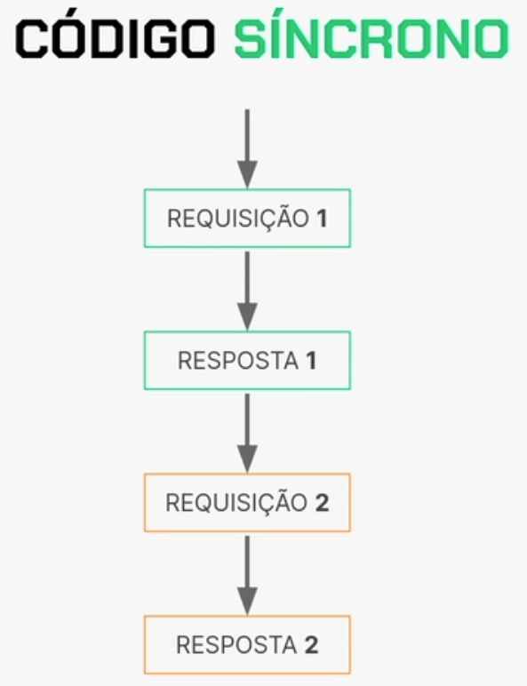

# Curso Alura - JavaScript com Node.js criando sua primeira biblioteca

## Aula 1 - Acessando e Lendo Arquivos

### Aula 1 - Apresentação - Vídeo 1

Transcrição  
Boas-vindas ao curso de Criação de Primeira Biblioteca em Javascript!

Me chamo Juliana Amoasei e serei a sua instrutora neste curso.

> Audiodescrição: Juliana é uma mulher branca. Tem cabelo curto e pintado de azul. Veste uma camiseta preta da Alura e usa óculos de grau de armação vermelha. Está nos estúdios da Alura; ao fundo, há uma iluminação azul e uma estante à direita.

**Para quem é esse curso?**  
Este curso é direcionado a iniciantes em programação que optaram por iniciar com Javascript. Para uma melhor aproveitamento, é altamente recomendado que você já tenha concluído os cursos anteriores desta formação, que incluem Fundamentos de Javascript, Objetos, Arrays, Variáveis, Funções e Tipos de Dados. Este curso não abordará tópicos específicos de front-end.

O que Aprenderemos neste Curso?

- Desenvolver um programa completo
- Lógica de programação, arrays e objetos
- Ferramentas do dia a dia
- Código síncrono e assíncrono
- Importação e exportação de módulos
- Instalação de bibliotecas externas
- Tratamento de erros
- Interação com linha de comando (terminal)

Neste curso, você aprenderá a desenvolver uma programa completo em Javascript, aplicando os conceitos abordados nos cursos anteriores de Fundamentos. O foco será em praticar Lógica de Programação, Manipulação de Arrays e Manipulação de Objetos, além de introduzir conceitos importantes em back-end.

Exploraremos ferramentas essenciais do cotidiano, abordaremos código síncrono e assíncrono, ensinaremos importação e exportação de módulos, demonstraremos como instalar bibliotecas externas para facilitar seu trabalho, discutiremos o tratamento de erros e a interação com a linha de comando através do terminal.

Além disso, aplicaremos todos esses conceitos em um desafio prático em um caso real para que você possa vivenciar na prática o que aprendeu. Não deixe de aproveitar todos os recursos disponíveis na plataforma. Além dos vídeos, oferecemos diversas atividades extras e contamos com o suporte do fórum e do Discord da comunidade para auxiliá-lo durante o curso.

#### Aula 1 - Preparando o ambiente

Se você já fez os cursos que constam como pré-requisito para este, é muito provável que o ambiente já esteja pronto. Ainda assim, organizamos algumas instruções, que estão logo abaixo, para você conferir!

Arquivos iniciais  
Neste curso vamos utilizar alguns arquivos de texto para testes.

Você pode [baixar estes arquivos em zip](https://github.com/alura-cursos/3709-nodejs-lib/archive/refs/heads/arquivos-iniciais.zip) ou manualmente acessando o [repositório do projeto no GitHub](https://github.com/alura-cursos/3709-nodejs-lib/tree/arquivos-iniciais/arquivos). Não esqueça de salvá-los na mesma pasta que vai utilizar para o projeto deste curso.

Para começarmos, são necessárias duas ferramentas: o Node.js, necessário para executar código JavaScript sem precisar do navegador, e o Visual Studio Code ou VSC, editor que usamos para escrever código.

Node.js
Caso já tenha feito algum curso anterior de JavaScript para back-end, o Node.js pode já estar instalado na sua máquina.

> Recomendamos fortemente que tenha feito os cursos anteriores da formação para acompanhar melhor o conteúdo! Se não tiver certeza, é possível conferir com os seguintes passos:

1. - Abra uma janela do terminal em seu computador. Isso pode ser feito da seguinte forma:

Windows: você pode acessar a busca no menu iniciar e procurar por Prompt de Comando, ou acessar via Menu Iniciar > Sistema do Windows > Prompt de Comando.
MacOs: o Terminal está disponível no menu de Aplicações, dentro da pasta de Utilitários.
Linux (Ubuntu): o Terminal está disponível no menu de Programas/Aplicações. Caso não localize, pode estar dentro da pasta Utilitários.
2. - No terminal, digite node --version ou node -v. Se retornar um número de versão, como v20.11.0, o Node.js já está instalado.

Caso precise instalar, siga as instruções para cada sistema operacional que estão na [página inicial do Node.js](https://nodejs.org/). Este curso foi desenvolvido usando a versão 20.11.0.

> Caso você esteja utilizando uma versão anterior do Node.js, como a v18, também pode acompanhar o curso sem precisar de atualização para a v20.

O [site do Node.js](https://nodejs.org/en) (no momento em que produzimos este curso) oferece na página inicial o download da versão LTS (long term support, ou suporte a longo prazo). Clique no botão correspondente para baixar e instalar normalmente como qualquer outro programa.

alt: Site oficial do Node.js. O botão para download da versão LTS se encontra à esquerda, abaixo do texto “Run JavaScript Everywhere. Node.js is a free, open-source, cross-plataform JavaScript runtime environment that lets developers create servers, web apps, command line tools and scripts.”. À direita, há um exemplo de código para criar um servidor HTTP. O site tem tons escuros e a cor de destaque é verde.

Confira abaixo um tutorial em vídeo de instalação do Node.js. O site estará diferente no vídeo porém as instruções e passo a passo da instalação são os mesmos.

**Visual Studio Code**  
O Visual Studio Code é o editor que escolhemos utilizar para escrever nossos códigos durante este curso. Os links para baixar e instalar de acordo com o seu sistema operacional estão na [página inicial do VSC](https://code.visualstudio.com/).

Existem vários outros editores, como o Atom, o Sublime e o Notepad++. Caso já tenha algum destes instalado ou preferência por outro, fique à vontade! Note que alguns recursos e ferramentas variam de editor para editor e podem não estar disponíveis ou funcionar de forma diferente.

Agora podemos começar!

### Aula 1 - Iniciando um projeto Node.js - Vídeo 2

Transcrição  
Vamos analisar o problema que nossa aplicação resolverá, começando agora.

**Entendendo o problema**  
Estou exibindo a página de artigos da Alura na tela. Se pensarmos em artigos, como um artigo de programação ou qualquer outro artigo acadêmico, podemos abrir um sobre "Padrões arquiteturais: arquitetura de software descomplicada" que está aparecendo no site. Durante a escrita, é comum termos certos cacoetes, tanto quanto temos na fala.

Ao escrever um texto sobre front-end (desenvolvimento de interface), por exemplo, é comum começar a repetir a palavra front-end em um parágrafo, o que pode tornar a leitura um tanto estranha ao longo do tempo.

Normalmente, o procedimento é ler o texto manualmente e fazer correções conforme necessário. Recentemente, uma amiga me trouxe uma demanda real relacionada a isso.

Ela perguntou se não seria viável criar um programa para realizar essa tarefa automaticamente. Em outras palavras, o programa analisaria um arquivo de texto, independentemente do seu tamanho, identificaria onde palavras específicas se repetem (por exemplo, a palavra front-end aparecendo cinco vezes em um parágrafo) e me forneceria essas informações.

Isso facilitaria bastante a revisão dos artigos científicos, a tese de mestrado, entre outros textos. Portanto, essa é uma demanda real que pretendemos resolver.

Antes de iniciarmos a solução, vale a pena recapitular um pouco sobre a principal ferramenta que será abordada neste curso durante o desenvolvimento, que é o Node.js.

**O que é Node.js?**  
O que exatamente é o Node e por que ele é tão importante? Para entender isso, é necessário recordar que todo programa precisa de um ambiente de execução para funcionar, independentemente da linguagem utilizada. No caso do JavaScript, existem dois ambientes principais: os navegadores e o runtime, como é conhecido, que inclui o Node, bem como seus concorrentes, como o Dyno e o BAN.

Optamos pelo Node.js entre BAN e Dyno porque é a opção mais antiga, amplamente usada, adotada e testada. Ele se tornou quase sinônimo de JavaScript para o back-end, embora seja apenas uma das opções disponíveis.

Contudo, é a escolha mais significativa e utilizada como ambiente de execução (runtime) do JavaScript fora do navegador. Esse ambiente já inclui diversas funções prontas para uso, como o console.log, que são familiares desde os primeiros passos na programação.

A biblioteca que contém a palavra console e o método log já vem implementada por padrão tanto nos navegadores quanto no Node.js. Essa implementação padrão é tão comum e amplamente utilizada que podemos acessá-la facilmente nos navegadores ou no Node.js através do terminal.

Esse fato nos permite utilizar várias funções sem a necessidade de instalar nada, pois elas estão disponíveis por padrão, tanto nos navegadores quanto no Node.js. Em resumo, um ambiente de execução inclui não apenas o código base, mas também as bibliotecas necessárias para seu funcionamento.

O que são bibliotecas?  
Uma biblioteca consiste em conjuntos de códigos reutilizáveis que solucionam problemas específicos ou atendem necessidades particulares.

Em outras palavras, na programação, existem diversos problemas e demandas comuns, como exibir texto no console, para os quais não precisamos escrever código do zero.

Optamos por utilizar código pronto para evitar o retrabalho. O termo "reinventar a roda" é empregado na programação quando, ao invés de utilizar uma solução já existente, testada e implementada, tentamos criar algo totalmente novo.

- Por que utilizamos a biblioteca?
- Diversos usos e funcionalidades
- Reaproveitamento e eficiência
- Empresas e comunidades
- Qualquer pessoa pode criar uma lib e publicá-la

Existem várias razões pelas quais utilizamos bibliotecas na programação. Primeiramente, elas abrangem uma vasta gama de funcionalidades, o que é importante dado que os problemas enfrentados na programação atualmente tendem a ser complexos.

Em outras palavras, existem bibliotecas prontas para realizar validações, autenticações, testes, conexões com bancos de dados, bem como conexões com uma variedade de outros serviços que uma aplicação pode requerer.

No front-end, enfrentamos desafios comuns como animação e conversão de arquivos. Esses problemas são encontrados em praticamente todas as aplicações e, para evitarmos reinventar a roda, utilizamos bibliotecas pré-desenvolvidas, conhecidas como pacotes de código. Durante o curso, também desenvolveremos isso.

Essas bibliotecas não só nos poupam tempo, mas também nos permitem programar de forma mais eficiente ao reutilizar o código desenvolvido e testado por outras pessoas em diversos cenários.

Quando desenvolvemos algo do zero, é necessário realizar extensos testes para garantir seu funcionamento. No entanto, bibliotecas, especialmente as populares, já passaram por testes abrangentes, identificaram e corrigiram bugs, eliminando a necessidade de reinventar soluções já existentes.

Algumas bibliotecas comuns são nativas nos ambientes de execução, como o console.log. Nos navegadores, há bibliotecas específicas para lidar com elementos de tela, enquanto o Node.js possui suas próprias bibliotecas para diferentes funcionalidades.

Muitas bibliotecas importantes, como as de autenticação, validação e conexão com bancos de dados, são desenvolvidas por empresas ou comunidades externas. Frequentemente, as empresas criam essas bibliotecas e as disponibilizam para uso geral.

Algumas dessas bibliotecas são originalmente desenvolvidas para uso interno, mas, ao perceberem sua utilidade geral, são liberadas para uso externo. Isso ocorre porque resolveram problemas específicos dentro da empresa, mas viram potencial em compartilhar essas soluções com outras pessoas desenvolvedoras.

As comunidades também desenvolvem bastante, inclusive, se você quer contribuir para resolver um bug em determinada biblioteca ou para ajudar em alguma coisa, as comunidades costumam ajudar nos códigos das bibliotecas que são públicas.

Qualquer pessoa tem a capacidade de criar e publicar uma biblioteca em qualquer linguagem de programação, especialmente em JavaScript, desde que atenda a certos requisitos. A disponibilidade da publicação da biblioteca dependerá da plataforma escolhida para isso.

No curso, haverá material adicional sobre como distribuir uma biblioteca, um tópico que não será abordado diretamente aqui.

Conclusão e Próximos Passos  
Agora que entendemos o problema a ser resolvido e o que será desenvolvido, estamos prontos para criar uma biblioteca para solucionar esse problema específico.

### Aula 1 - Usando a linha de comando - Vídeo 3

Transcrição  
Identificamos o problema e agora estamos prontos para iniciar a codificação. Durante a etapa de preparação do ambiente, disponibilizamos um link para o download de três arquivos de texto essenciais para testar nossa aplicação.

Esses arquivos já foram baixados e estão armazenados na pasta de trabalho designada para a codificação. Para garantir que você tenha esses arquivos, criamos uma pasta específica chamada arquivos e os colocamos lá.

Caso ainda não tenha feito isso, é importante fazer uma pausa aqui para baixar os arquivos antes de continuar com o processo.

Criando os arquivos  
Para começar, criaremos o nosso primeiro arquivo. Primeiramente, fora da pasta arquivos, na raiz da pasta do nosso projeto, vamos utilizar o Visual Studio Code para criar uma nova pasta chamada src, que representa o diretório de source (código fonte) onde estarão todos os nossos arquivos.

Para criar, clicamos no segundo ícone de pasta na parte superior esquerda, que representa "New Folder". Dentro dessa pasta src, vamos criar o arquivo index.js, que será o ponto de entrada padrão da nossa aplicação. Para isso, clicamos no primeiro ícone de arquivo na parte superior esquerda ("New File").

src
index.js

Vamos revisar o problema e dividir em três etapas principais. Primeiramente, precisamos implementar a funcionalidade para receber o conteúdo de um arquivo de texto. Em segundo lugar, devemos processar esse conteúdo como uma string, já que se trata de texto.

Por fim, precisamos determinar como disponibilizar as informações resultantes desse processamento. Independentemente do que desejamos realizar - como contar palavras, identificar a quantidade de parágrafos ou encontrar palavras repetidas - o processo geral é o mesmo. O importante é garantir que o resultado do processamento seja disponibilizado de alguma maneira.

Resolveremos o primeiro problema, que é receber o texto do arquivo.

Recebendo o texto  
Criando a variável caminhoArquivo  
Dentro do nosso arquivo index.js, criamos uma variável chamada de caminhoArquivo, pois nosso objetivo inicial é importar esse arquivo para dentro do nosso programa. Em cursos anteriores de fundamentos, aprendemos sobre a função require(), que é nativa do Node.js e nos permite importar módulos externos utilizando uma string como referência para o arquivo desejado.

Foi o que fizemos anteriormente. Vamos testar? Utilizaremos o require() para criar uma string contendo ./arquivos como argumento. Nessa string, inseriremos o nome de um dos arquivos de teste presente na pasta, como por exemplo, texto-web.txt.

Assim, ao passarmos o caminho /texto-web.txt e finalizarmos com ponto e vírgula, poderemos então chamar a função console.log() para verificar o conteúdo da variável caminhoArquivo.

index.js

```JavaScript
const caminhoArquivo = required('./arquivos/texto-web.txt');

console.log(caminhoArquivo);
```

Abrimos o terminal clicando em "Terminal > New terminal" na parte superior esquerda e em seguida executamos o comando que já conhecemos, que é node seguido do caminho para o nosso arquivo index.js que está localizado dentro da pasta src.

> node src/index.js

Contudo, deparamo-nos imediatamente com um erro. Parece que já começamos com uma anomalia desde o início.

O erro abaixo foi parcialmente transcrito.

> Error: Cannot find module './arquivos/texto-web.txt'

O erro diz, em inglês, que o Node não consegue encontrar o módulo que está dentro do caminho que passamos. Isso acontece por quê? Vamos fechar o terminal clicando no ícone de xis no canto superior direito.

Isso ocorre devido ao método require() que tenta obter o conteúdo de um arquivo e executá-lo de alguma maneira. Portanto, ele só pode ser usado com módulos.

Ao executar o comando no terminal, notamos a menção da palavra módulos. Isso significa que o require() só funciona com arquivos JavaScript ou similares, como arquivos JSON. Portanto, para resolver esse problema, precisaremos adotar uma abordagem diferente.

Para resolver essa questão, precisamos instruir o JavaScript a entender que o caminho de arquivo que estamos passando se refere a um texto, e então capturar essa string do texto.

Além disso, há outra questão a considerar. Em segundo, seria conveniente se pudéssemos especificar o caminho do arquivo com o qual desejamos trabalhar, seja "texto-web", "texto-kanban" ou qualquer outro arquivo .txt, sem ter que abrir diretamente o arquivo index.js.

Caso contrário, toda vez que quisermos executar o código, teríamos que acessar manualmente o arquivo index.js e modificar a string do caminho do arquivo. Isso não seria prático.

Vamos começar abordando o segundo problema para tornar nossa vida mais fácil, permitindo que possamos receber qualquer arquivo. Para isso, faremos o seguinte: removeremos o require() do caminhoArquivo, já que não está funcionando como esperado, e substituiremos por outra instrução, que será process.argv.

E deixamos o console.log() para exibir o conteúdo da variável caminhoArquivo.

index.js

```JavaScript
const caminhoArquivo = process.argv;

console.log(caminhoArquivo);
```

Assim, poderemos abrir o terminal e testar o resultado obtido por essa variável. Digitamos o comando node src/index.js no terminal e verificar se ainda há erros.

> node src/index.js

Neste momento, o terminal não está mais apresentando erros; em vez disso, está exibindo um array contendo duas strings.

O retorno abaixo está de acordo com a estrutura de pastas da instrutora:

```JavaScript
[
'/home/juliana/.nvm/versions/node/v20.11.0/bin/node', 

'/home/juliana/Documents/nodejs-lib/src/index.js'
]
```

Ao analisarmos esse array, notamos que a primeira string é um caminho de arquivo localizado no meu computador. Isso é evidente pela presença de /home/juliana, que corresponde ao meu diretório, bin de binário, seguido de outros detalhes como /.nvm/versions/node/v20.11.0/bin/node.

O segundo elemento do array é um caminho, notavelmente mais simples de identificar, pois refere-se diretamente ao arquivo que enviamos para ser lido pelo node, src/index.js. Portanto, o objetivo de process.argv, derivado de argument vector (vetor de argumentos), é simplesmente capturar os valores passados pelo terminal e organizá-los em um array.

Os argumentos são inseridos no array na ordem em que são executados. Assim, o primeiro argumento se refere ao endereço em que estão armazenados os arquivos binários do node, ou seja, os arquivos que o node utiliza para interpretar nosso código. Já o segundo argumento indica o local onde está o código a ser interpretado.

Para ilustrar, podemos fazer um teste prático no terminal. Basta pressionar a seta para cima para recuperar o comando anterior e adicionar alura após node src/index.js.

> node src/index.js alura

Em seguida, pressionamos "Enter" para executar o comando novamente.

O que foi exibido no console desta vez?

```JavaScript
[
'/home/juliana/.nvm/versions/node/v20.11.0/bin/node', 

'/home/juliana/Documents/nodejs-lib/src/index.js', 'alura'
]
```

Mais uma vez, uma string, porém, o último valor agora é uma string contendo a informação "alura". A partir disso, já podemos compreender o que estamos prestes a fazer. O process.argv possibilita que enviemos comandos para o terminal, os quais são inseridos em um array. Dessa forma, ao estarem dentro de um array, podemos utilizá-los em nosso código.

Ou seja, ao executar console.log(caminhoArquivo) e fornecer apenas o índice 2, o comando mostrará apenas alura no terminal.

```JavaScript
const caminhoArquivo = process.argv;

console.log(caminhoArquivo[2]);
```

alura

Isso indica que conseguimos passar o caminho do texto para dentro do programa, seja esse texto proveniente de texto-web, texto-Kanban ou qualquer outro local no computador.

Agora, vamos prosseguir.

Criando a constante link  
No código, criaremos uma nova constante chamada link, que será definida como o resultado de caminhoArquivo no índice 2. Podemos então utilizar console.log() para visualizar o conteúdo de link.

```JavaScript
const caminhoArquivo = process.argv;
const link = caminhoArquivo[2]; 

console.log(link);
```

Em seguida, podemos retornar ao terminal para realizar o último teste. Para limpar o terminal, utilizamos "Ctrl + L" e executamos o comando Node com node src/index.js.

Segundo, src/index.js, que será o arquivo executado. Terceiro, a informação extra, a instrução extra que queremos passar, que é o caminho do nosso arquivo de texto, que está dentro de arquivos/texto-web.txt, por exemplo, .txt.

> node src/index.js arquivos/texto-web.txt

Ao teclarmos "Enter", obtemos:

arquivos/texto-web.txt

E agora ele vai para dentro do nosso programa e pode ser utilizado.

Conclusão e Próximos Passos  
A resolução do segundo problema, que consistia em inserir o caminho dentro do programa, já foi concluída. Agora, enfrentamos o problema principal: transformar esse texto em uma string para que possamos manipulá-lo dentro do código.

### Aula 1 - Lendo arquivos com fs - Vídeo 4

Transcrição  
Já sabemos que o próximo passo é fazer o JavaScript extrair o texto de dentro do arquivo.

**Extraindo texto de um arquivo**  
Como fazer isso? Existe uma biblioteca que faça isso para mim? A resposta é sim, existe. Interagir com arquivos é uma das tarefas mais importantes e básicas que qualquer programa precisa saber fazer.

**Biblioteca File system**  
Essa biblioteca é nativa do Node. Não precisa instalar, ela não é externa. Só precisamos referenciá-la no nosso código. No topo do arquivo, na primeira linha do index.js, criamos uma constante chamada de fs.

Podemos utilizar o require() nesta situação, pois estamos lidando com módulos e arquivos JavaScript. Dentro do require(), passaremos uma string contendo apenas as letras fs. Por fim, finalizamos essa linha de código com um ponto e vírgula.

```JavaScript
const fs = required('fs');

const caminhoArquivo = process.argv;
const link = caminhoArquivo[2]; 

console.log(link);
```

[Documentação da biblioteca File system](https://nodejs.org/api/fs.html#file-system)

O fs (file system, ou sistema de arquivos) é uma biblioteca fundamental que permite interagir com o sistema de arquivos de um computador. Essa funcionalidade é essencial em praticamente todas as linguagens de programação, pois possibilita acessar, criar e modificar arquivos.

A documentação do Node é extensa e complexa, especialmente para uma biblioteca tão essencial quanto o fs. No entanto, vamos incluir o link específico para o método que utilizaremos para ler um arquivo, chamado readFile.

[Método readFile](https://nodejs.org/api/fs.html#fsreadfilepath-options-callback)

Este método é projetado especificamente para essa tarefa. Além disso, a documentação do Node geralmente inclui exemplos de uso para nos auxiliar na implementação inicial.

**Implementando o método readFile**  
Voltamos ao código do arquivo index.js para entender o que a biblioteca faz e o método que vamos usar. Importamos a biblioteca com const fs = require(). Já temos a variável link preparada para receber o caminho do arquivo que desejamos ler.

Agora, podemos implementar o nosso método. Usamos fs.readFile, conforme a documentação sugere. É importante lembrar que ao usar métodos e funções, sejam eles nativos do interpretador ou de terceiros, precisamos saber exatamente quais parâmetros eles requerem para funcionar corretamente.

```JavaScript
const fs = required('fs');

const caminhoArquivo = process.argv;
const link = caminhoArquivo[2]; 

fs.readFile

console.log(link);
```

Ao revisarmos a documentação do readFile, notamos que o exemplo passa dois parâmetros para a função.

Exemplo retirado da documentação:

```JavaScript
import { readFile } from 'node:fs';

readFile('/etc/passwd', (err, data) => {
  if (err) throw err;
  console.log(data);
}); 
```

O primeiro é uma string que contém o caminho do arquivo que desejamos ler. O segundo parâmetro é uma função callback, um conceito que já vimos em cursos anteriores de fundamentos.

Essa função callback deve receber dois parâmetros. O primeiro é denominado err, e o segundo é chamado de data, o qual representa o conteúdo do arquivo em si.

Vamos começar a implementação no VSC. Utilizando fs.readFile, abrimos parênteses. O primeiro parâmetro é uma string contendo o caminho do arquivo, e como já temos isso na variável link, não precisamos envolver isso novamente em aspas, apenas passamos o nome da variável.

No entanto, há um detalhe importante que não está presente na documentação básica.

Como estamos lidando com arquivos de texto, é necessário especificar o encoding, ou seja, o sistema de codificação desse texto.

Para isso, envolvemos o tipo de encoding entre aspas, como por exemplo utf-8.

```JavaScript
const fs = required('fs');

const caminhoArquivo = process.argv;
const link = caminhoArquivo[2]; 

fs.readFile(link, 'utf-8')

console.log(link);
```

O sistema de encoding UTF-8 é utilizado para codificar caracteres no nosso idioma e em muitos outros idiomas que utilizam a escrita latina.

É essencial passar esse sistema para o readFile, para que ele saiba como deve codificar a string em relação a caracteres especiais, símbolos e outros elementos.

Agora, vamos lidar com o terceiro parâmetro, que é o callback com os dois parâmetros mencionados na documentação. Nomeamos o primeiro como erro, mantendo o nome em português conforme a documentação, e o segundo chamamos de texto, representando o conteúdo que esperamos receber. Em seguida, chamamos esses dois parâmetros, abrindo uma arrow function e as chaves para testarmos se está tudo correto.

Sempre inserimos um console.log() para verificar. Nele, retornamos o valor de texto, pois se tudo estiver correto, o fs lerá o arquivo passado por link, converterá tudo em uma string usando o UTF-8 como sistema de codificação de caracteres e passará esse valor para dentro do callback, dentro da função, por meio do parâmetro texto.

Vamos começar removendo o último console.log, que era um link desnecessário.

```JavaScript
const fs = required('fs');

const caminhoArquivo = process.argv;
const link = caminhoArquivo[2]; 

fs.readFile(link, 'utf-8', (erro, texto) => {
  console.log(texto);
})
```

Dessa forma, tudo deve fazer sentido.

Em seguida, salvamos o arquivo e abrimos um novo terminal para testarmos o código. Para isso, basta executar o comando node src/index.js e lembrar de incluir o terceiro parâmetro, já que a variável link espera o caminho do arquivo de texto como entrada.

Então, fornecemos o caminho arquivos/texto-web; o arquivo texto-web.txt, que é um pouco menor.

> node src/index.js arquivos/texto-web.txt

Pressionamos "Enter" para iniciar o teste. O resultado aparece no terminal com o console.log, exibindo o texto do arquivo.

O retorno abaixo foi parcialmente transcrito:

Como a Web funciona

Como a web funciona oferece uma visão simplificada do que acontece quando você vê uma página em seu navegador…

Se abrirmos o arquivo texto-web.txt no editor do lado esquerdo, veremos o conteúdo "como a web funciona, oferece uma visão simplificada, etc.".

Conclusão e Próximos Passos  
Tudo está funcionando conforme o esperado, confirmando que o sistema de arquivos está operando corretamente. Agora podemos prosseguir com o processamento do texto no programa!

### Aula 1 - Para saber mais: Caminho absoluto vs Relativo

Quando começamos a programar é essencial conhecer a estrutura de pastas e arquivos e saber como “navegar” por esta estrutura. Muitas vezes descobrimos que aquele bug estranho aconteceu porque cometemos algum erro no caminho (ou path) de algum arquivo, apesar de editores de texto como o Visual Studio Code ajudarem com o recurso de autocompletar.

Um caminho é onde se localiza um arquivo ou diretório (que também chamamos de pasta) no sistema de arquivos de um sistema operacional. é importante diferenciar caminho relativo de caminho absoluto, além de como acessá-los.

Caminho absoluto
Chamamos de caminho absoluto quando a localização de um arquivo ou pasta é especificado a partir do diretório-raiz do sistema operacional. Por exemplo:

```JavaScript
//caminho para um diretório (a última `/` é opcional)
/home/juliana/Documents/alura/projeto-js

//caminho para um arquivo dentro do diretório
/home/juliana/Documents/alura/projeto-js/index.js
```

Caminho relativo  
Um caminho relativo para um diretório ou arquivo é definido a partir de sua relação com o pwd, ou seja, o present working directory (diretório de trabalho atual). Na linha de comando, pwd também é o comando print working directory (imprimir o diretório de trabalho), que usamos justamente para saber onde na estrutura do sistema operacional se encontra o diretório em que estamos.

Veja no exemplo abaixo uma representação em árvore de um diretório, como o do curso em que estamos trabalhando (o diretório node_modules foi excluído para facilitar a leitura, pois é muito extenso):

```JavaScript
/home/juliana/Documents/nodejs-lib
.
├── arquivos
│   ├── texto-aprendizado.txt
│   ├── texto-kanban.txt
│   └── texto-web.txt
├── lib
│   ├── index.js
```

Na representação acima, consideramos como pwd o diretório nodejs-lib. Então, o caminho relativo do arquivo texto-web.txt, por exemplo, seria ./arquivos/texto-web.txt, e o caminho absoluto seria /home/juliana/Documents/texto-web.txt.

Na estrutura de diretórios, o . representa “aqui”. Quando queremos sair do diretório atual e “voltar” um nível, utilizamos ... Por exemplo:

```JavaScript
/home/juliana/Documents/nodejs-lib
.
├── arquivos
│   ├── texto-aprendizado.txt
│   ├── texto-kanban.txt
│   └── texto-web.txt
├── lib
│   ├── index.js
```

Se quisermos referenciar algum dos arquivos de texto no arquivo ./src/index.js, devemos fazer da seguinte forma:

```JavaScript
// arquivo ./lib/index.js

const stringCaminhoTexto = ‘../arquivos/texto-web.txt’;
```

Usamos o .. para “subir um nível” na hierarquia de diretórios para só então “entrar” no diretório que queremos. Dessa forma, não precisamos referenciar o caminho absoluto de todos os arquivos quando fizermos importações de módulos; o que também funcionaria, mas não é tão prático.

Outra diferença importante entre caminho absoluto e relativo é com relação à execução de programas a partir da linha de comando. Por exemplo, usando a árvore de diretórios acima, o comando node index.js só funcionaria caso o diretório atual (pwd) no terminal já fosse /home/juliana/Documents/nodejs-lib/lib. Por outro lado, o comando node /home/juliana/Documents/nodejs-lib/lib/index.js funcionaria independentemente do diretório atual no terminal, pois o Node.js vai acessar o arquivo index.js a partir de seu caminho absoluto.

O terminal é uma ferramenta poderosa. Além de executar comandos e rodar programas, com ele podemos fazer tudo que fazemos com as janelas e ícones do sistema operacional como navegar entre diretórios (ou pastas), criar arquivos, mudá-los de lugar e renomeá-los, entre outras tarefas.

Pratique os comandos para ir ganhando agilidade e para ficar confortável com o sistema de arquivos e diretórios. Além disso, temos um [curso focado no uso do terminal para Linux](https://cursos.alura.com.br/course/terminal-comandos-executar-tarefas), porém os comandos podem ser utilizados no Windows com a ferramenta GitBash que pode ser instalada automaticamente junto com o [Git](https://git-scm.com/) e também no terminal nativo do MacOs.

### Aula 1 - Lendo arquivos com fs

Conforme praticamos na aula, fs é uma biblioteca importante do Node.js, que permite diversos tipos de interação de uma aplicação com o sistema de arquivos do computador.

Relembrando o que foi construído anteriormente, observe o código abaixo e assinale a alternativa correta sobre os parâmetros utilizados no método fs.readFile:

```JavaScript
const fs = require('fs');
const arquivo = './meuTexto.txt';

fs.readFile(arquivo, 'utf-8', (erro, dados) => {
  console.log(dados);
});
```

Resposta:  
O parâmetro ’utf-8’ define a codificação de caracteres do arquivo a ser lido.

O parâmetro 'utf-8' é usado para informar ao método readFile que o arquivo deve ser lido usando a codificação UTF-8, permitindo a correta interpretação dos caracteres.

### Aula 1 - Faça como eu fiz: utilizando linha de comando e fs

Nesta aula, aprendemos a criar um arquivo JavaScript que recebe um argumento da linha de comando e exibe esse argumento no console. Também vimos como utilizar o módulo fs do Node.js para ler o conteúdo de um arquivo.

Ver opinião do instrutor

Utilizando linha de comando  
Para isso, utilizamos a propriedade process.argv para acessar os argumentos passados na linha de comando. No arquivo "src/index.js", o código foi escrito para armazenar o argumento passado em uma variável e em seguida exibi-lo no console.

Utilizando o módulo fs  
Primeiramente, importamos o módulo fs no nosso arquivo. Em seguida, capturamos o caminho do arquivo a ser lido a partir dos argumentos passados na linha de comando. Por fim, utilizamos o método fs.readFile para ler o conteúdo do arquivo e exibi-lo no console.

### Aula 1 - Para saber mais: links da aula

Confira abaixo a lista de links utilizados durante a aula e/ou links complementares ao conteúdo:

- Artigo: [Começando com o terminal](https://www.alura.com.br/artigos/comecando-com-o-terminal-manipulando-arquivos-e-diretorios) para manipular arquivos e diretórios.
- Artigo: [O que é CLI e como utilizar](https://www.alura.com.br/artigos/cli-interface-linha-comandos) a interface de linha de comando.
- Curso: Terminal: aprenda comandos para executar tarefas.
- Documentação do Node.js: [process.argv](https://nodejs.org/api/process.html#processargv).
- Documentação do Node.js: [fs.readFile](https://nodejs.org/api/fs.html#fsreadfilepath-options-callback).

### Aula 1 - O que aprendemos?

Nessa aula, você aprendeu:

- O que são bibliotecas e seu uso no dia-a-dia de qualquer projeto em programação;
- Como funciona a execução de um programa em JavaScript através da linha de comando e do Node.js;
- A acessar informações enviadas através da linha de comando e utilizar estas informações em seu programa;
- O que é a bilioteca fs nativa do Node.js e como importá-la em seu projeto;
- Como utilizar a fs para acessar um arquivo em seu computador e processar seu conteúdo.

## Aula 2 - Criando a Lógica do Projeto

### Aula 2 - Capturando as palavras - Vídeo 1

Transcrição  
O próximo passo é começar a lógica do contador de palavras.

O que exatamente queremos contar e como faremos isso? A função principal é percorrer o texto e contar as ocorrências de palavras. Portanto, vamos começar criando uma função para isso.

**Verificando palavras duplicadas**  
No index.js, vamos criar uma function chamada verificaPalavrasDuplicadas(). O parâmetro que essa função precisa receber, por enquanto, é apenas o texto que virá do readFile().

Se esse texto virá do readFile, aproveitamos dentro do readFile e substituímos o console.log() pela chamada dessa função verificaPalavrasDuplicadas() recebendo texto.

index.js:

```JavaScript
fs.readFile(link, 'utf-8', (erro, texto) => {
  verificaPalavrasDuplicadas(texto);
})
function verificaPalavrasDuplicadas(texto) {

}
```

Dentro do readFile(), o parâmetro texto se refere ao resultado do callback do readFile(). Assim, processamos o arquivo, armazenamos o resultado desse processamento no parâmetro texto e o enviamos para dentro de verificaPalavrasDuplicadas().

Agora, partimos para a lógica da função contadora de palavras. Mas, antes de começar, vamos listar o que precisa ser feito em forma de comentário.

Primeiro, é preciso pegar todas as palavras da string e iterar essas palavras. Por isso, o primeiro passo é criar um array com as palavras. Depois de criá-lo, podemos iterar esse array.

Dentro desse array, é necessário ter um contador que vai verificar se a palavra existe e adicionar no contador mais um se ela existir ou começa a contagem do zero se ainda não tiver nenhuma ocorrência, até o fim do array.

Então, o segundo passo é contar as ocorrências, que é o ponto central da nossa lógica.

No terceiro passo, precisamos pensar em como disponibilizar esse resultado. Isto é, de que forma vamos exibir essa lista de palavras e a quantidade de vezes que elas ocorrem?

Podemos pensar em montar um objeto com o resultado. Por que um objeto? Para exemplificar, vamos montar um modelo de um objeto com a lista de palavras.

Podemos montar um objeto que tenha diversas propriedades, cada propriedade sendo a palavra e o valor, um número correspondente à quantidade de vezes que ela aparece no texto.

Então, teríamos um objeto com a chave "web" e o valor 5, por exemplo. Outra propriedade poderia ser "computador" com 4 ocorrências e assim por diante.

Vamos deixar esse objeto comentado também para lembrarmos dessa estrutura.

// criar um array com as palavras
// contar as ocorrências
// montar um objeto com o resultado

// {
//   "web": 5,
//   "computador": 4
// }

A partir dessa lista, conseguimos fazer um passo a passo dentro da função verificaPalavrasDuplicadas() para saber o que ela tem que processar.

Criando um array com as palavras
Para fazer o array, vamos criar uma const listaPalavras que recebe texto.split(), que é um método de array que serve para dividir uma string.

O parâmetro do split() será uma string com um espaço dentro. Note que não é uma string vazia, é uma string com um espaço. Porque o parâmetro do split() é o separador.

```JavaScript
function verificaPalavrasDuplicadas(texto) {
  const listaPalavras = texto.split(' ');
}
```

Em outras palavras, o método split() vai pegar toda a string, e a cada ocorrência desse separador (no caso, um espaço), ele vai pegar todo o conteúdo anterior e colocar como um elemento do array.

Em um texto, as palavras normalmente são separadas por espaço. Isso significa que, no final, a variável listaPalavras terá um array composto por todas as palavras do texto - porque o separador é o espaço entre cada uma delas.

Contando as ocorrências e montando o objeto com o resultado
A primeira parte, onde criamos um array com as palavras, está concluída. O segundo passo é contar as ocorrências e depois montar um objeto com resultado.

Podemos já deixar um objeto criado embaixo da listaPalavras. Para isso, criamos um const resultado que recebe um objeto vazio (ou seja, chaves vazias) para guardar as ocorrências de cada palavra.

```JavaScript
function verificaPalavrasDuplicadas(texto) {
  const listaPalavras = texto.split(' ');
  const resultado = {};
}
```

Para entender como montar esse objeto, devemos lembrar como adicionamos propriedades (conjuntos de chave e valor) dentro de um objeto.

Primeiro, devemos passar o nome do objeto e depois passamos a propriedade, com ponto ou com colchetes.

```JavaScript
// objeto[propriedade] = valor;
```

Dessa forma, o JavaScript entende que ele vai criar uma propriedade com esse valor dentro do objeto. Ou, se a propriedade já existir, vai atualizar o valor.

Podemos comentar essa linha para nos lembrar de como vamos montar esse objeto.

Agora, é preciso fazer o loop. Vamos puxar listaPalavras e o método do JavaScript que vamos usar para fazer esse loop, será o forEach().

O forEach é um método do JavaScript que não retorna nada. Ele simplesmente executa o que vai dentro da função callback.

Então, forEach vai receber uma palavra do array de palavras. E, a cada palavra, devemos contá-la e acrescentá-la ao objeto.

Dentro das chaves do callback, vamos acrescentar a propriedade palavra no objeto resultado, ou seja, resultado[palavra].

Assim, para cada palavra do array, será criada uma nova propriedade no objeto cujo nome será essa palavra do texto, por exemplo, "web", "computador" ou "JavaScript".

Isso deve receber um valor, onde podemos implementar o nosso contador. Nesse caso, se a propriedade já existir, atualiza o valor. Se não, a propriedade é criada.

Mas, de que forma podemos passar isso? Após um sinal de igual, vamos abrir parênteses para escrever a expressão resultado[palavra] || 0. Afinal, ou vai existir um valor dentro dessa propriedade ou ela será zero.

Fora dos parênteses, digitamos + 1. Dessa forma, incrementamos 1 se a propriedade já existir ou criando se a propriedade não existir ainda.

No final de tudo isso, após fechar o forEach, vamos passar um console.log() em resultado para verificar se deu tudo certo.

```JavaScript
function verificaPalavrasDuplicadas(texto) {
  const listaPalavras = texto.split(' ');
  const resultado = {};
  // objeto[propriedade] = valor;
  listaPalavras.forEach(palavra => {
    resultado[palavra] = (resultado[palavra] || 0) + 1
  })
  console.log(resultado);
}
```

Testando o código  
Essa é a primeira implementação da lógica. Vamos abrir um novo terminal, chamar node src/index.js, sem esquecer de passar o caminho do arquivo que queremos. Nesse caso, arquivos/texto-web.txt.

> node src/index.js arquivos/texto-web.txt

Retorno parcialmente transcrito:

```JavaScript
{
    'https://developer.mozilla.org/pt-BR/docs/Learn/Getting_started_with_the_web/How_the_Web_works\n\nComo': 1,
    a: 3,
    Web: 3,
    'funciona\n\nComo': 1,
    funciona: 1,
    oferece: 1,
    uma: 4,
    'visão': 1,
    …
}
```

O terminal retorna um objeto com todas as palavras do texto. Por enquanto, ainda não está separado em parágrafo, como nos propusemos.

Além disso, apesar de cada palavra ser uma propriedade e a contagem ser um valor, como queríamos, existem algumas ocorrências estranhas nessa lista.

Primeiro, existem algumas palavras muito curtas, por exemplo, "do", "um", "a", etc. Nesse momento, não queremos contar essas preposições e artigos. Devemos tratar isso para contar apenas palavras um pouco mais longas, como "JavaScript", "computador", etc.

Um segundo caso estranho é que apareceu, no meio de algumas propriedades, um ou dois \n, que aparecem onde tem quebra de linha no texto original.

O \n é um caractere de escape que não é renderizado, ou seja, não o visualizamos no texto, mas ele está lá para indicar que acabou uma linha e deve-se quebrar a linha e começar uma linha nova.

Devemos tratar esse caso, porque o JavaScript considerou como uma palavra só tudo o que estava no fim da primeira linha e o que estava no começo da segunda.

Também existem alguns outros problemas, como, por exemplo, a ocorrência de palavras entre parênteses. Como não há um espaço entre os parênteses e a palavra, o JavaScript também interpretou como uma só palavra. É preciso tratar esse caso para tirar os caracteres especiais da contagem.

E, por último, o JavaScript está fazendo diferenciação entre maiúsculas e minúsculas. Então, "Um" maiúsculo ficou separado de "um" minúsculo - cada um com a sua contagem.

Então, note como existe muito a se refinar nessa primeira implementação.

### Aula 2 - Separando em parágrafos - Vídeo 2

Transcrição  
Agora que já temos a funcionalidade principal, podemos voltar e resolver aqueles casos específicos que tínhamos comentado anteriormente.

Acreditamos que faz mais sentido começar pela quebra de parágrafos, porque queremos manter a contagem das palavras repetidas por parágrafo. Portanto, não faz sentido contar tudo e depois separar.

**Separando em parágrafos**  
Para isso, vamos criar outra função para separar a lógica da quebra de parágrafo da contagem de palavras.

Antes da função verificarPalavrasDuplicadas(), vamos criar uma function chamada quebraEmParagrafos().

Essa função tem que receber o texto como parâmetro, porque a partir dela, fazemos a lógica da contagem de palavras.

Dentro dessa função, vamos criar uma constante chamada paragrafos.

Mas, como fazemos para o JavaScript identificar onde começa um parágrafo e onde termina outro? Devemos chamar texto, que vem como parâmetro, seguido do método de array .split() novamente.

Só que agora, ao invés de um espaço na string, vamos pedir para ele fazer a separação por \n. Lembre-se de usar a barra invertida.

index.js:

```JavaScript
function quebraEmParagrafos(texto) {
  const paragrafos = texto.split('\n');
}
```

O \n é um caractere de escape, que não é renderizado, mas ele assinala numa string onde tem uma quebra de linha.

Então, podemos usar esse \n como um separador de parágrafos. Toda vez que o texto tiver esse caractere de escape, JavaScript com o split() vai pegar toda a string que vinha anteriormente e separá-la como um novo elemento do array.

E a partir daí, esperamos que, dentro da constante paragrafos, exista um array composto por parágrafos separados - ao invés de palavras separadas.

Colocando palavras em minúsculo  
Além disso, podemos aproveitar para resolver outro problema que tínhamos também, que é a separação entre maiúsculas e minúsculas.

Letras maiúsculas e letras minúsculas são caracteres diferentes. Por isso, o JavaScript, obviamente, não acha que é a mesma palavra. Só que, para nós, não faz diferença se a palavra está no começo ou final do parágrafo.

Então, podemos usar um método de string para pegar todo o texto e convertê-lo em letra maiúscula ou minúscula. E, a partir daí, o JavaScript faz a comparação e a contagem.

Tanto faz converter as letras em maiúscula ou minúscula. Mas, como tem muito mais letra minúscula no texto, faz mais sentido transformar as poucas maiúsculas que tem.

Por isso, na constante paragrafos, depois do texto e antes do split(), vamos passar .toLowerCase(), mas sem nenhum parâmetro. Por fim, o juntamos com o split. Ou seja, texto.toLowerCase().split.

Dessa maneira, encadeamos os métodos para transformar todo o texto em letra minúscula e segmentá-lo em parágrafos.

Aproveitamos que o JavaScript já vai ter que percorrer o texto todo para fazer esses dois processos. Assim, o código fica mais performático - em vez de fazer primeiro um e só depois o outro.

Para testar, vamos colocar um console.log() em paragrafos.

```JavaScript
function quebraEmParagrafos(texto) {
  const paragrafos = texto.toLowerCase().split('\n');
  console.log(paragrafos);
}
```

Além disso, precisamos chamar a função quebraEmParagrafos(), porque ela não está sendo chamada em lugar nenhum ainda.

Em readFile(), vamos chamar a função quebraEmParagrafos(), passando texto.

Podemos comentar verificarPalavrasDuplicadas que já estavam sendo chamada, porque agora faremos esse processo por parágrafo. Então, não faz muito sentido essa função ficar dentro do readFile().

```JavaScript
fs.readFile(link, 'utf-8', (erro, texto) => {
  quebraEmParagrafos(texto);
  // verificaPalavrasDuplicadas(texto);
})
```

Testando o código  
No terminal, usamos a seta para cima para repetir o último comando e apertamos "Enter" para executá-lo.

> node src/index.js arquivos/texto-web.txt

Retorno parcialmente transcrito:

```JavaScript
[
    'https://developer.mozilla.org/pt-br/docs/learn/getting_started_with_the_web/how_the_web_works',
    '',
    'como a web funciona',
    '',
    'como a web funciona oferece uma visão simplificada do que acontece quando você vê uma página em um navegador, no seu computador ou telefone.',
    …
]
```

Deu tudo certo. O que o terminal retornou um array, onde cada elemento, em vez de ser uma palavra sozinha, é um dos parágrafos do nosso texto.

Você deve perceber que, junto com os textos, tem algumas strings vazias, que estão separadas do resto. Essas strings são justamente as quebras de linha extra, quando pulamos uma linha antes de começar outro parágrafo.

Podemos tratar esse caso mais para frente. Primeiro, vamos finalizar essa parte.

Mapeando as palavras de cada parágrafo
Qual é o próximo passo? Já temos os parágrafos e um array, portanto, precisamos iterar esse array de parágrafos e chamar a função de verificar palavras dentro dele.

Na função quebraEmParagrafos(), abaixo do split(), vamos criar outra const chamada contagem. Essa constante vai pegar o array de paragrafos e iterar sobre ele.

Só que agora não vamos iterar com o forEach(), vamos iterar com o map(). O map é parecido com o forEach, só que sempre retorna um array com os elementos que foram processados, ou um array vazio.

Por que queremos retornar um array agora? Porque, como estamos separando por parágrafos, podemos ter um array e cada objeto que montamos com a contagem vai separar um parágrafo.

Em suma, teremos um array de objetos, onde cada objeto conta as palavras de um parágrafo.

Em paragrafos.map(), vamos chamar o parâmetro de paragrafo, porque é o padrão que utilizamos.

Em seguida, vamos criar uma arrow function onde necessitamos retornar algo para o map() conseguir jogar para dentro da variável contagem.

Nesse caso, retornaremos verificaPalavrasDuplicadas(), recebendo, ao invés de texto, um paragrafo por vez.

Desse modo, a cada paragrafo do array de paragrafos, vamos executar a função de contagem e retornar um objeto para dentro da variável contagem.

```JavaScript
function quebraEmParagrafos(texto) {
  const paragrafos = texto.toLowerCase().split('\n');
  const contagem = paragrafos.map((paragrafo) => {
    return verificaPalavrasDuplicadas(paragrafo);
  })
  console.log(paragrafos);
}
```

A última modificação que precisamos fazer é na função verificaPalavrasDuplicadas(). Por enquanto, ela não está retornando nada. Apenas visualizávamos o objeto pelo console.log().

Só que agora, ao invés de console.log(resultado), temos que retornar o objeto resultado para fora da função para poder ser utilizado dentro do map().

Agora, em quebraEmParagrafos(), podemos trocar o último console.log() de paragrafos para contagem, que é o nome da variável onde está sendo guardado o array de objetos.

```JavaScript
function quebraEmParagrafos(texto) {
  const paragrafos = texto.toLowerCase().split('\n');
  const contagem = paragrafos.map((paragrafo) => {
    return verificaPalavrasDuplicadas(paragrafo);
  })
  console.log(contagem);
}
function verificaPalavrasDuplicadas(texto) {
  const listaPalavras = texto.split(' ');
  const resultado = {};
  // objeto[propriedade] = valor;
  listaPalavras.forEach(palavra => {
    resultado[palavra] = (resultado[palavra] || 0) + 1
  })
  return resultado;
}
```

Testando o código
Salvamos o arquivo, abrimos o terminal e usamos seta para cima e "Enter" para repetir a execução do comando anterior.

> node src/index.js arquivos/texto-web.txt

Retorno parcialmente transcrito:

```JavaScript
[
    {
        'https://developer.mozilla.org/pt-br/docs/learn/getting_started_with_the_web/how_the_web_works': 1
    },
    { '': 1 },
    { como: 1, a: 1, web: 1, funciona: 1 },
    { '': 1 },
    {
        como: 1,
        a: 1,
        web: 1,
        funciona: 1,
        oferece: 1,
        uma: 2,
        'visão': 1,
        simplificada: 1,
        …
    }
]
```

Foi retornado no terminal um array com diversos objetos. Cada objeto representando a contagem de palavras de um parágrafo.

E o JavaScript também considerou nessa contagem as strings vazias, mas vamos cuidar disso mais adiante.

Próximos passos  
Dois dos problemas que tínhamos, que era a diferenciação entre maiúsculas e minúsculas e a contagem por parágrafo, já foram resolvidos.

Ainda tem mais alguns problemas para atacarmos, por exemplo, a questão dos caracteres especiais, que o JavaScript está considerando como parte das palavras.

E também tirar algumas palavras como "ao", "e", "ou", que no nosso caso achamos que não precisa contar.

### Aula 2 - Para saber mais: caracteres de quebra de linha

Durante esta aula vimos um caractere diferente, o \n. Caracteres precedidos pela barra \ são chamados “caracteres de escape” e deixam de ter significado literal (por exemplo, a letra N) e passam a significar instruções específicas dadas ao interpretador do texto. Por exemplo, inserir uma quebra de linha, inserir caracteres especiais, tabulação e espaços etc.

Alguns exemplos de caracteres de escape:

- \' insere aspas simples
- \" insere aspas duplas
- \\ insere barra invertida
- \n insere nova linha (new line)
- \r insere nova linha (carriage return)
- \t insere tabulação
- \b insere backspace

Para finalizar “fim de linha” ou “quebra de linha”, existem alguns caracteres diferentes e diferentes sistemas operacionais utilizam estes caracteres de formas diferentes ao interpretarem textos.

- Em sistemas Unix e Unix-like (como o Linux) o caractere usado é \n (new line).  
- \n também é caractere de escape padrão para quebra de linha em todas as linguagens baseadas em C (é o caso do JavaScript).
- Em sistemas Windows, a quebra de linha usa o caractere \r, ou carriage return. O nome vem das antigas máquinas de escrever em que o posicionamento da peça responsável por imprimir as letras (carro ou carriage em inglês) era feito manualmente a cada fim de linha.  
  
- Filmagem em preto e branco mostrando duas mãos datilografando em uma máquina de escrever antiga. A mão esquerda empurra a barra de retorno.
- Em antigos sistemas Mac (anteriores ao macOS X) o padrão era \r\n, nessa ordem.  
- A diferença não é apenas no caractere: \n representa o fim de uma linha, o que para Linux e Mac é o equivalente a começar uma nova linha de texto. Já \r move o cursor para o início de uma nova linha (como a máquina de escrever).

É muito importante entender a forma como os sistemas operacionais e as linguagens “encodam” (ou interpretam) os caracteres em uma string para transformá-los em texto, pois as diferenças podem causar bugs de interpretação de caracteres onde menos se espera.

### Aula 2 - Refinando a contagem - Vídeo 3

Transcrição  
Continuando a ajustar nosso código para os casos que discutimos anteriormente, o próximo problema que podemos atacar é a questão dos caracteres especiais. Por exemplo, uma vírgula ou um parênteses que entrou no meio das palavras.

**Suprimindo caracteres especiais**  
Primeiramente, podemos criar uma função para detectar esses caracteres especiais no texto e suprimi-los. Queremos substituir caracteres especiais por nada, por uma string vazia.

Vamos criar outra função, antes de verificarPalavrasDuplicadas(), para fazer isso. Essa funcion que chamaremos de limpaPalavras() deve receber uma palavra por parâmetro para poder fazer essa limpeza.

Queremos substituir caracteres especiais por nada. Existe um método de string que serve justamente para substituir caracteres. Então, essa função vai apenas retornar a palavra.replace, que é o nome desse método de string do JavaScript.

O primeiro parâmetro do replace() é o carácter que queremos substituir. Por exemplo, se quiséssemos substituir todos os abre-parênteses, bastaria passar uma string com abre-parênteses.

O segundo parâmetro do replace, é pelo que queremos substituir. Não queremos substituir por nada, queremos deixar vazio. Então, vamos substituir por uma string vazia.

index.js:

```JavaScript
function limpaPalavras(palavra) {
  return palavra.replace('(', '');
}
```

Contudo, devemos pensar que sempre trabalharemos com essas funções para qualquer texto que recebamos. E, nesses textos, os abre-parênteses não serão os únicos caracteres especiais. Existirão fecha-parênteses, aspas, E comercial, cerquilha e vários outros.

Como podemos passar para essa função um caso mais abrangente? Queremos que seja substituído qualquer um desses caracteres especiais presentes no texto por nada.

Não conseguimos pegar a string, onde está esse abre-parênteses, e começar a colocar também fecha-parênteses, cerquilha, cifrão, vírgula. Não dá para fazer isso, porque o JavaScript vai achar que isso é uma string com exatamente esse conteúdo.

Para esses casos, um recurso muito usado em programação é a expressão regular - também conhecida como RegEx ou RegExp.

> Não vamos entrar em detalhes sobre como RegEx funciona, porque temos um curso dedicado às [Expressões regulares](https://cursos.alura.com.br/course/expressoes-regulares-buscas-validacoes-substituicoes-textos) na Alura.

Deixamos uma expressão regular pronta comentada no código que você pode copiar do repositório do curso. Iremos apenas copiar essa expressão e colá-la como o primeiro parâmetro do replace().

```JavaScript
function limpaPalavras(palavra) {
  return palavra.replace(/[.,\/#!$%\^&\*;:{}=\-_`~()]/g, '');
}
```

É uma expressão bem comprida, com muitos caracteres. Vamos explicar como ela funciona.

Começamos com um barra normal e colchetes. Dentro dos colchetes, listamos todos os casos de caracteres especiais que imaginamos que possa ocorrer no texto. Por exemplo, ponto final, vírgula, barra invertida, barra normal, cerquilha, exclamação, abre e fecha-parênteses fechando, tio, chaves, igual, etc.

No final, colocamos /g para ser global, ou seja, para pesquisar em todas as linhas do texto.

O que fizemos foi usar uma expressão regular que é um tipo de linguagem que utilizamos para identificar padrões em texto.

Ou seja, toda vez que o replace() encontrar uma correspondência de algum dos caracteres listados, ele será suprimido.

Agora podemos passar a função limpaPalavras() para dentro do resto do código.

Em que momento queremos que essas palavras sejam limpas? No momento em que elas estão sendo verificadas. Então, a colaremos em verificaPalavrasDuplicadas(). Afinal, não faz muito sentido fazer isso na parte da separação por parágrafos.

Em verificaPalavrasDuplicadas(), depois de fazer o split(), dentro do forEach(), quando o código estiver verificando palavra por palavra, aí, sim, podemos criar uma const palavraLimpa que não conterá caracteres especiais. Nessa constante, vamos executar a função limpaPalavras() recebendo palavra.

Agora, o objeto resultado não vai ter mais como propriedade palavra, e, sim, palavraLimpa. Então, palavraLimpa.

Isso será igual ao contador, que, ao invés de resultado[palavra], será resultado[palavraLimpa]. E aí, retorna o resultado, como já fazíamos antes.

```JavaScript
function verificaPalavrasDuplicadas(texto) {
  const listaPalavras = texto.split(' ');
  const resultado = {};
  // objeto[propriedade] = valor;
  listaPalavras.forEach(palavra => {
    const palavraLimpa = limpaPalavras(palavra);
    resultado[palavraLimpa] = (resultado[palavraLimpa] || 0) + 1
  })
  return resultado;
}
```

Retirando palavras curtas  
Podemos aproveitar esse momento que estamos dentro do forEach(), verificando palavra por palavra, para resolver aquele outro problema de palavras muito curtas.

Dentro do forEach(), podemos fazer uma condicional, um if. Queremos conferir se o comprimento da palavra, ou seja, se palavra.length é maior ou igual a 3. Assim, cortaremos "ou", "e", "um", etc.

Se for verdadeiro, faremos a limpeza da palavra e jogamos ela dentro do objeto resultado. Por isso, a const palavraLimpa e o objeto resultado vão para dentro desse if.

```JavaScript
function verificaPalavrasDuplicadas(texto) {
  const listaPalavras = texto.split(' ');
  const resultado = {};
  // objeto[propriedade] = valor;
  listaPalavras.forEach(palavra => {
    if (palavra.length >= 3) {
      const palavraLimpa = limpaPalavras(palavra);
      resultado[palavraLimpa] = (resultado[palavraLimpa] || 0) + 1
    }
  })
  return resultado;
}
```

Qualquer palavra que seja menor que isso será simplesmente ignorada.

Testando o código  
Após salvar, podemos abrir o terminal para testar. Executamos o último comando com seta para cima e "Enter".

> node src/index.js arquivos/texto-web.txt

Retorno parcialmente transcrito:

```JavaScript
[
    {
        httpsdevelopermozillaorgptbrdocslearngettingstartedwiththewebhowthewebworks: 1
    },
    {},
    { como: 1, web: 1, funciona: 1 },
    {},
    {
        como: 1,
        web: 1,
        funciona: 1,
        oferece: 1,
        uma: 2,
        'visão': 1,
        simplificada: 1,
        …
    }
]
```

Não encontramos mais nenhum caractere especial nesse array de objetos. Além disso, não temos ocorrências duplicadas, pois as palavras estão todas em letra minúscula.

O único que sobrou foram alguns objetos vazios correspondentes às quebras de linha, mas já sabemos que temos que resolver isso.

Próximos passos  
Note que utilizamos, basicamente, apenas lógica de programação, métodos de array e sintaxe de objetos para construir a lógica de verificação com a ajuda das expressões regulares.

E, por enquanto, essa parte está finalizada. Na sequência, lidaremos com os objetos vazios e aí podemos continuar com os detalhes de implementação da biblioteca.

### Aula 2 - Organizando a saída dos dados - Vídeo 4

Transcrição  
Vamos lidar com o último problema, que é o dos parágrafos vazios.

**Retirando parágrafos vazios**  
Onde podemos implementar essa verificação se um parágrafo é vazio ou não? Acreditamos que seja na função quebraEmParagrafos(), pois é onde fazemos o split() e obtemos um array.

Dentro do map(), onde está sendo feita a contagem e a verificação das palavras, no momento em que o map() percorre o array de parágrafos, podemos verificar antes de executar a função verificaPalavrasDuplicadas(), se o parágrafo tem conteúdo ou não, se é uma string vazia ou não.

Poderíamos fazer essa verificação dentro do map() com if. Por exemplo, se o parágrafo é uma string vazia, não retorna nada. Contudo, o map() sempre retorna algo para cada elemento, ele não pula um elemento. Então, mesmo que ele retorne algo, pode ser undefined.

Uma solução que poderia funcionar é, antes de fazer o map(), ir em const contagem = paragrafos e filtrar os elementos do array procurando strings vazias.

Vamos fazer esse teste. Em const contagem, vamos chamar o método de array filter() para paragrafos, ou seja, paragrafos.filter().map().

O filter() é um método callback, portanto, vamos chamar um parâmetro, que também chamaremos de paragrafo, e abrir uma arrow function.

Lembrando que o filter() trabalha sempre com uma comparação dentro da função. Se a comparação resultar em True, ele retorna o elemento para dentro de um array de resultados. Se retornar False, ele ignora o elemento.

Podemos escrever isso de uma forma bem resumida no filter(). Então, (paragrafo) => paragrafo. Isso porque, como aprendemos quando trabalhamos com tipos de dados e variáveis, valores Truthy e Falsy, uma string vazia é avaliada pelo JavaScript como um valor Falsy.

Ou seja, se o JavaScript tiver que converter o valor de parágrafo para booleano, ele vai retornar Falsy, se o parágrafo for uma string vazia, e Truthy se for uma string que contenha qualquer outro tipo de caractere.

Dessa forma, podemos escrever de forma resumida, porque se paragrafo uma string vazia, vai retornar Falsy e, consequentemente, ele não vai filtrar esse elemento.

index.js:

```JavaScript
function quebraEmParagrafos(texto) {
  const paragrafos = texto.toLowerCase().split('\n');
  const contagem = paragrafos
    .filter((paragrafo) => {paragrafo})
    .map((paragrafo) => {
    return verificaPalavrasDuplicadas(paragrafo);
  })
  console.log(contagem);
}
```

Em resumo, paragrafos.filter() vai ter um retorno de um array de quantidade X de elementos. E também concatenamos o filter() com o map() que já tínhamos feito anteriormente.

Assim, primeiro, fazemos a filtragem e tiramos as strings vazias, e depois fazemos o map verificando as palavras duplicadas no restante.

Testando o código
Abrindo o terminal, chamando o último comando novamente com seta para cima.

> node src/index.js arquivos/texto-web.txt

Retorno parcialmente transcrito:

```JavaScript
[
        {
                httpsdevelopermozillaorgptbrdocslearngettingstartedwiththewebhowthewebworks: 1
        },
        { como: 1, web: 1, funciona: 1 },
        {
                como: 1,
                web: 1,
                funciona: 1,
                oferece: 1,
                uma: 2,
                'visão': 1,
                simplificada: 1,
                …
        }
]
```

Aparentemente deu certo, porque continua retornando um array de objetos, mas todos os objetos vazios sumiram.

No entanto, essa solução tem uma questão que não está aparente. Para conseguir fazer primeiro a filtragem e depois o map() contando as palavras, fizemos dois loops.

Ou seja, primeiro percorremos o array de paragrafos inteiro para fazer o filter, porque filter e map sempre vão até o fim do array. Depois fizemos esse processo de novo para fazer a contagem das palavras.

Quando estamos trabalhando com um texto pequeno, com massas pequenas de dados, isso não tem muita importância, porque normalmente os computadores hoje em dia têm capacidade para processar.

Contudo, quando escrevemos o código, procuramos pensar em todos os casos. E se o seu texto for muito grande, com muitas palavras? Ou se você estiver trabalhando com massa de dados de dois milhões de pessoas usuárias?

Fazer um loop inteiro, depois fazer outro loop inteiro, não é muito performático para o programa. O programa vai ficar com uma performance um pouco mais baixa, porque ele vai consumir bastante recurso para fazer os dois processos.

Conhecendo o flatMap  
Como transformamos esse filter e map em um único loop? Vamos usar outro método de array que ainda não conhecemos, o flatMap(), que também é um método callback.

Assim, const contagem será igual a paragrafos.flatMap(), que vai receber por parâmetro paragrafo seguido de arrow function.

Dentro das chaves, podemos fazer uma verificação if (!paragrafo), ou seja, se paragrafo for avaliado como falso, podemos retornar um array vazio. Isto é, return [].

Se não for um parágrafo vazio, se tiver conteúdo, vamos pegar o return verificaPalavrasDuplicadas(paragrafo) e colocá-lo dentro do flatMap().

Podemos deletar o filter e o map dessa função e deixar no final apenas o console.log(contagem).

```JavaScript
function quebraEmParagrafos(texto) {
  const paragrafos = texto.toLowerCase().split('\n');
  const contagem = paragrafos.flatMap((paragrafo) => {
    if (!paragrafo) return [];
    return verificaPalavrasDuplicadas(paragrafo);
  })
  console.log(contagem);
}
```

Salvamos o arquivo, abrimos o terminal e verificamos que o código está tudo funcionando como esperado. Nossos objetos vazios foram embora.

O que o flatMap() fez? O flat(), sozinho, é um método que pega um array, que tem arrays dentro dele, e o "achata".

Qual seria o processo? Suponha que temos um array que tem os valores 1, 2, e o terceiro valor fosse, por exemplo, outro array com 3 e 4 dentro.

[1, 2, [3, 4]]

O flat() pega o array de dentro e faz uma espécie de concatenação. Aplana com os valores do array externo. Então, o resultado final do flat() seria somente um array com 1, 2, 3 e 4.

[1, 2, 3, 4]

O flatMap() combina as funcionalidades do flat() e do map(). Portanto, ele é um pouco mais performático do que fazer duas funções separadas: primeiro para filtrar e depois para fazer o mapeamento. O flatMap() retorna um array de resultados de forma mais eficiente.

Próximos passos  
A funcionalidade básica já está finalizada. Porém, se observarmos o objeto no terminal, nós estamos exibindo todos os resultados para cada parágrafo.

Será que queremos realmente exibir os casos onde a palavra só é citada uma vez? Acho que não é exatamente a funcionalidade que queríamos. Queremos saber as palavras que estão repetidas. Então, devemos lidar com esse caso.

Mas, antes disso, vamos parar para pensar um pouco no que fazemos quando as coisas não ocorrem como deveriam no nosso programa. Na sequência, discutiremos sobre o tratamento de erros.

### Aula 2 - Mão na massa: usando o reduce

Durante a aula praticamos a manipulação de arrays e objetos usando duas abordagens:

- filter e map
- flatMap

Porém, ainda há uma terceira abordagem para a resolução desse problema muito comum em programação: como suprimir objetos vazios de um array de objetos. Para isso, vamos usar o método de array reduce.

**Opinião do instrutor**  

O funcionamento básico do reduce é percorrer todos os índices de um array e “reduzir” seus valores a um único valor de retorno. Por exemplo:

```JavaScript
const numeros = [1, 2, 3, 4, 5];

const result = numeros.reduce((acum, atual) => acum + atual, 0);

console.log(result); //15
```

No exemplo acima, usamos reduce para reduzir um array de números até a soma de todos eles, começando a contagem em 0 e somando os parâmetros da função callback a cada iteração (valor acumulado + valor atual).

Porém, o reduce também tem muitos usos mais complexos para arrays de objetos e pode nos ajudar a resolver o problema dos objetos vazios.

Observe abaixo uma versão mais curta da solução feita com filter e map:

```JavaScript
const paragrafos = ["código", "js", "", "web", "", "array"];
const result = paragrafos
 .filter((paragrafo) => paragrafo)
 .map((paragrafo) => {
   if (paragrafo) return paragrafo;
 });
console.log(result);
```

Agora, vamos analisar uma abordagem utilizando reduce:

```JavaScript
const paragrafos = ["código", "js", "", "web", "", "array"];
const result = paragrafos.reduce((acum, paragrafo) => {
 if (paragrafo) {
   return [...acum, paragrafo];
 }
 return acum;
}, []);
console.log(result);
```

Acompanhe os passos de desenvolvimento do código acima:

- Queremos “reduzir” o array atual a um outro array, então iniciamos reduce com um valor atual de [] (um array vazio).
- Os parâmetros da função callback são acum (em que são armazenados os valores já processados) e paragrafo, que se refere ao parágrafo sendo processado a cada iteração.
- A condicional if (paragrafo) avalia a string paragrafo em termos booleanos (lembrando de valores truthy e falsy) e apenas entra no if caso paragrafo não seja uma string vazia.
- Caso não seja uma string vazia, o código dentro do bloco if utiliza o spread operator (operador de espalhamento) para retornar um array composto dos valores anteriores (acum) “espalhados” em um novo array com o conteúdo do parágrafo atual.
- Caso seja uma string vazia, o código do bloco if não será executado, e o loop do reduce irá passar direto para o próximo elemento do array, ignorando a string vazia e a deixando de fora do array final.
- Após percorrer todos os elementos, o resultado final de acum será um array composto apenas de strings “não vazias” (avaliadas como truthy na condicional if).
- Qual método utilizar? Apesar de o método reduce construir um novo array a cada iteração, a não ser que se trate de textos e arrays muito grandes, não deve haver muita diferença de performance entre os métodos.

É comum existir mais de uma forma de resolver problemas de lógica de programação! Faça os testes em seu projeto!

### Aula 2 - Relembrando objetos

Objetos são estruturas importantes em praticamente todas as linguagens de programação mais utilizadas. São estruturalmente formados por pares de chave: valor que podem representar alguma abstração do mundo real, como uma conta bancária ou um livro. Os objetos também são parte fundamental do JavaScript e há diversas formas de se criar e trabalhar com eles.

Sabendo disso e relembrando o uso de objetos durante esta aula, marque as opções corretas:

Resposta:  
Para iterar sobre as propriedades de um objeto, podemos utilizar a função for...in .

> Utilizamos for…in para iterar sobre as propriedades enumeráveis de um objeto, como em: for (let info in cliente) { //código }. Você pode conferir mais exemplos no na documentação do MDN sobre for…in.

Alternativa correta:  
A expressão abaixo irá criar uma nova propriedade prop no objeto obj, com o valor de valor. Caso a propriedade prop já exista no objeto, seu valor anterior será substituído por novoValor.

obj.prop = novoValor;

> Em JavaScript, podemos usar a notação de ponto para acessar uma propriedade já existente em um objeto e alterar seu valor, ou para criar uma nova propriedade.

### Aula 2 - Para saber mais: links da aula

Confira abaixo a lista de links utilizados durante a aula e/ou links complementares ao conteúdo:

[Curso: Expressões regulares](https://cursos.alura.com.br/course/expressoes-regulares-buscas-validacoes-substituicoes-textos) para buscas, validação e substituição de textos.
Documentação do MDN: [flatMap](https://developer.mozilla.org/pt-BR/docs/Web/JavaScript/Reference/Global_Objects/Array/flatMap).

### Aula 2 - O que aprendemos?

Nessa aula, você aprendeu:  

- Como utilizar métodos de array e objeto do JavaScript para resolver problemas comuns de lógica de programação, como manipulação de arrays, strings e objetos;
- Como organizar as funcionalidades do projeto em funções separadas, utilizando a importação e exportação de módulos para comunicar as funções entre si e utilizá-las onde necessário.

## Aula 3 - Tratamento de Erros

### Aula 3 - Identificando tipos de erros - Vídeo 1

Transcrição  
Antes de prosseguirmos com as funcionalidades, vamos fazer uma refatoração para organizar melhor o nosso arquivo index.js e também identificar alguns pontos de falha que podem ocorrer no nosso programa.

Por exemplo, um ponto de falha que pode ocorrer, e talvez tenha ocorrido enquanto você estava praticando, é quando nos distraímos e, ao passar o endereço do arquivo que queremos converter ou processar, não passamos um pedaço do endereço e ocorre um erro genérico, um TypeError dizendo que não consegue ler propriedades de undefined. Esse é um exemplo de um erro que pode acontecer.

```JavaScript
TypeError: Cannot read properties of undefined (reading 'toLowerCase')
    at quebraEmParagrafos (/home/juliana/Documents/nodejs-lib/src/index.js:23:28)
    at ReadFileContext.callback (/home/juliana/Documents/nodejs-lib/src/index.js:7:3)
    at FSReqCallback.readFileAfterOpen [as oncomplete] (node:fs:306:13)
```

Normalmente, o que fazemos? Começamos a mapear pontos onde pode ocorrer algum tipo de erro e conseguimos capturar esses erros, — vamos abordar mais adiante o que significa capturar —, e tratá-los para indicar o que queremos fazer. Queremos enviar uma mensagem, queremos fazer outra coisa no lugar etc.

O primeiro ponto onde queremos colocar um aviso de erros para o código, é o próprio readFile. Mas, antes disso, vamos aproveitar para refatorar toda essa parte. Vamos remover alguns comentários que deixamos anteriormente, porque são coisas que já vimos.

Dentro do readFile, vamos criar uma função que vamos chamar de function contaPalavras, recebendo texto, e essa função será o ponto de entrada da aplicação.

Essa será a única função que vamos deixar dentro do readFile. Quebrar parágrafo, contar quantas palavras tem, ver como vamos dar a saída do arquivo, tudo isso virá a partir de contaPalavras, que é o ponto inicial.

```JavaScript
function contaPalavras(texto) {

}
```

Então, quais são as duas coisas que estamos fazendo separadamente? A primeira é fazer o nosso contador de palavras, que já está usando algumas outras funções separadas como o limpaPalavras.A segunda é a de quebrar em parágrafos.

Vamos separar a parte de quebrar em parágrafos em uma outra função. Então, vamos criar uma outra function, que vamos chamar de extraiParagrafos, que também vai receber texto como parâmetro, que é o texto onde vamos gerar o nosso primeiro array.

```JavaScript
function extraiParagrafos(texto) {

}
```

Dentro de extraiParagrafos, vamos colocar o nosso split('\n'). Vamos mover o código que estava anteriormente em quebraEmParagrafos para dentro de extraiParagrafos. E agora, como não precisamos mais salvar isso numa variável para depois utilizar, podemos dar só um return nesse valor.

Agora, todo o restante da nossa função quebraEmParagrafos, vamos passar para dentro de contaPalavras, que é o nosso ponto de entrada. Então, vamos mover todo o código que sobrou dentro de quebraEmParagrafos para dentro de contaPalavras, que, por enquanto, ainda não está sendo executada em nenhum lugar. Podemos excluir a função quebraEmParagrafos

Podemos voltar em readFile, deletar o último comentário, que era uma função que não vai mais ser chamada, e passar a única chamada dentro de readFile para contaPalavras. Agora, contaPalavras recebe texto. Temos que também corrigir dentro da função contaPalavras para agora ela executar primeiro extraiParagrafos.

Então, aqui criamos uma const. Vamos chamar essa const de paragrafos mesmo, que é como estava antes. Igual o resultado da função extraiParagrafos recebendo texto. E, dessa forma, podemos manter o restante do código como estava, porque já estávamos usando esse nome de variável, paragrafos.

Então, agora separamos um pouco mais. E, a partir de agora, podemos fazer algumas marcações de erro para ver o que acontece no console.

Então, como já tínhamos comentado, o primeiro ponto de erro que dá para identificar é justamente dentro do readFile, que, por sinal, o callback do readFile já vem por si com um parâmetro de função do callback erro, só esperando para ser chamado, porque justamente esse é um ponto crítico de falha.

O que conseguimos fazer se passarmos dentro de readFile um console.log apenas para exibir erro? Vamos passar um texto antes, Qual é o erro?, erro. E aí, deixamos o contaPalavras como estava funcionando antes.

```JavaScript
fs.readFile(link, 'utf-8', (erro, texto) => {
    console.log('qual é o erro?', erro);
    contaPalavras(texto);
})
function contaPalavras(texto) {
    const paragrafos = extraiParagrafos(texto)
    const contagem = paragrafos.flatMap((paragrafo) => {
        if (!paragrafo) return [];
        return verificaPalavrasDuplicadas(paragrafo);
    })
    console.log(contagem);
}
function extraiParagrafos(texto) {
    return texto.toLowerCase().split('\n');
}
```

Vamos fazer um teste? Já salvamos o arquivo, vamos abrir o terminal. Vamos carregar novamente o normal, o normal está funcionando, vamos limpar o terminal. E vamos tentar tirar a extensão do nosso arquivo e ver o que acontece.

Além do erro, ele também trouxe a frase que colocamos no console.log, qual é o erro?, que é uma frase em português, então, obviamente, é a nossa.

Então, ao lado do qual é o erro?, vem um objeto, erro, ENOENT. ENOENT é um código de erro que é no entity, ele não conseguiu encontrar a entidade que ele precisava. Não existe esse arquivo ou diretório quando tentou abrir aqui arquivos/texto-web, seguido de um objeto com algumas informações.

Por exemplo, a chamada que foi feita, uma chamada do tipo open para abrir o arquivo, o caminho que foi feito, o código do erro, o número do erro e onde o erro aconteceu. Ele só acusou esse erro lá em index.js:21, na linha 21, quando ele tentou realmente fazer alguma coisa com esse arquivo.

```JavaScript
juliana@juliana:~/Documents/nodejs-lib$ node src/index.js arquivos/texto-web
qual é o erro? [Error: ENOENT: no such file or directory, open 'arquivos/texto-web'] {
    errno: -2,
    code: 'ENOENT',
    syscall: 'open',
    path: 'arquivos/texto-web'
}
/home/juliana/Documents/nodejs-lib/src/index.js:21
    return texto.toLowerCase().split('\n');
           ^
```

O que fazemos com essa informação? Vamos fechar o terminal e fazer mais uma alteração depois do console.log, de qual é o erro?. Então, ao invés de simplesmente jogar o console ali, vamos dizer que if (erro), ou seja, se tiver alguma coisa dentro desse parâmetro erro, ele vai entrar nesse if, e aí sim, damos o console.log em qual é o erro, e vamos dar também um return para ele retornar.

Lembrando que, quando damos um return, retornamos alguma coisa para fora da função, a função deixa de executar ali. Ela encerra a execução dela e vai para outro ponto do código.

```JavaScript
fs.readFile(link, 'utf-8', (erro, texto) => {
   if (erro) {
    console.log('qual é o erro?', erro);
    return
   }
   contaPalavras(texto);
})
```

Vamos tentar ver o que acontece abrindo o terminal e o que mudou. Vamos executar novamente no modo normal para ver se continua funcionando. Continua, então vamos limpar o terminal.

Tentaremos novamente forçar aquele erro tirando o .txt. Agora mudou um pouco o que aparece no console, a mensagem está mais limpa. Ele não está mais exibindo toda aquela mensagem anterior.

```JavaScript
juliana@juliana:~/Documents/nodejs-lib$ node src/index.js arquivos/texto-web
qual é o erro? [Error: ENOENT: no such file or directory, open 'arquivos/texto-web'] {
    errno: -2,
    code: 'ENOENT',
    syscall: 'open',
    path: 'arquivos/texto-web'
}
```

O que ele trouxe para nós foi só o objeto com o erro. E conseguimos fazer o que a partir daí? Conseguimos acessar uma propriedade desse objeto erro.

Vamos tentar novamente. Vamos fechar o terminal. E em vez de console.log apenas em erro, vamos dar em erro.code, por exemplo. Se rodarmos novamente o código sem o .txt, agora ele vai trazer para nós só o código do erro ENOENT, que é o no entity.

A partir daí, conseguimos, já que sabemos que conseguimos acessar uma propriedade desse objeto, e que, na verdade, esse erro que vem para o parâmetro, ele é um objeto JavaScript com algumas informações.

A partir daí, começamos a definir os erros que esperamos receber e o que vamos fazer com eles. Para nos ajudar a gerenciar, a encontrar esses erros e capturá-los de certa forma, vamos ver algumas ferramentas no próximo vídeo.

### Aula 3 - Para saber mais: entendendo a stack trace

Uma das primeiras coisas que percebemos ao começarmos a programar é que praticamente qualquer aviso de erro será acompanhado de uma longa sequência de texto difícil de compreender.

Por exemplo, se tentarmos usar console.log() em alguma variável que não existe em nosso código:

node teste.js

```JavaScript
file:///home/juliana/Documents/nodejs-lib/teste.js:3
console.log(nome);
            ^
ReferenceError: nome is not defined
    at file:///home/juliana/Documents/nodejs-lib/teste.js:3:13
    at ModuleJob.run (node:internal/modules/esm/module_job:218:25)
    at async ModuleLoader.import (node:internal/modules/esm/loader:329:24)
    at async loadESM (node:internal/process/esm_loader:28:7)
    at async handleMainPromise (node:internal/modules/run_main:113:12)

Node.js v20.11.0
```

Boa parte de todo esse texto é representado pela stack trace, ou seja, pelo “rastro” de comandos executados pelo interpretador ao enviarmos o comando node teste.js.

No caso, para que o Node.js execute corretamente o código dentro de um arquivo .js de nosso projeto, ele utiliza por sua vez diversos códigos (funções) que estão dentro de seu próprio código-fonte. Cada parte do código necessário para que o Node.js interprete corretamente o nosso próprio código pode se encontrar em arquivos ou módulos diferentes, e cada comando executado “guarda” este caminho desde o ponto inicial até o último.

Podemos analisar qualquer linha do erro acima e acompanhar este processo:

> at file:///home/juliana/Documents/nodejs-lib/teste.js:3:13

O ponto inicial de chamada do código problemático: arquivo teste.js que está dentro da nossa pasta de projeto, na linha 3 e coluna 13.

> at ModuleJob.run (node:internal/modules/esm/module_job:218:25)

Este erro se “propagou” para o método ModuleJob.run interno do Node.js. Podemos saber que já não estamos mais na pasta do nosso projeto pois a stack trace fornece exatamente o módulo, linha e coluna para onde o erro se propagou.

Assim continua até o último ponto, a função interna do Node.js handleMainPromise.

Quando um erro ocorre, todo esse caminho percorrido pelo comando é passado para dentro de um objeto Error para que possa ser acessado e consultado de alguma forma, por exemplo, exibido no terminal. Dessa forma, podemos usar esse “mapa” para entender o caminho que o processamento percorreu.

Nem todos os avisos de erro são gerados da mesma forma: dependendo da origem, alguns erros são devolvidos pelo sistema operacional, outros pelo Node.js, outros podem ser gerados a partir de alguma biblioteca que estamos usando em nosso projeto. Porém, quase sempre eles seguem o mesmo padrão, apresentando o nome do erro, a descrição do erro e a stack trace.

O Node.js tem uma lista de erros próprios. Confira como Error se comporta no Node.js, uma descrição de cada erro e motivos comuns para acontecerem neste [artigo da Alura sobre erros do Node.js](https://www.alura.com.br/artigos/lidando-com-erros-node-js).

### Aula 3 - Throw, catch e try - Vídeo 2

Transcrição  
Continuando com o nosso tratamento de erros, o que fazemos quando um erro ocorre dentro de uma função? Lembrando que os erros são inevitáveis, eles vão ocorrer de alguma forma dentro de alguma função do seu código. E o que fazemos nesse caso?

Sabemos que existe um tipo de erro que já identificamos, que é o ENOENT. E agora, como fazer com que o programa identifique os tipos de erros e aja de acordo, enviando uma mensagem ou executando alguma outra coisa?

Implementando um bloco try-catch
Existem dois termos importantes que vamos ver agora sobre erros, um deles é o que chamamos de bloco try-catch. Vamos implementar no nosso readFile.

Antes de tudo, vamos escrever try, apenas try(), sem parâmetro, e abrir um bloco com chaves. Dentro do try, vamos colocar somente a linha onde executamos a função contarPalavras. Vamos usar o Alt + seta para cima para movê-la para dentro desse bloco, e apenas isso.

Fora do try, vamos acrescentar outra palavra-chave que é catch. O catch leva parâmetros, e o parâmetro que vamos colocar no catch será erro. Apenas erro, e vamos abrir chaves também porque o catch é outro bloco.

Vamos apagar o if (erro) que tínhamos feito anteriormente, e dentro do catch vamos deixar apenas um comentário. // O que fazer com o erro?. Por enquanto, é só isso.

```JavaScript
fs.readFile(link, 'utf-8', (erro, texto) => {
    try {
        contaPalavras(texto);
    } catch (erro) {
        // o que fazer com o erro?
    }
})
```

Vamos testar no terminal para ver se o nosso código continua funcionando. Vamos chamar o caminho com o .txt no terminal, continua funcionando. Vamos limpar o terminal com Ctrl + L, e tentar o caminho apagando o .txt.

O terminal não acusou o erro, que é diferente de não dar erro, mas em compensação também não trouxe o nosso array de objetos. Então, vamos voltar no nosso código e ver o que aconteceu.

Esse bloco try-catch funciona da seguinte forma: Dentro do try, colocamos todo o código onde é possível que ocorra um erro. Teoricamente, é o código que queremos que dê certo, só que se acontecer alguma coisa que não está certa, se ocorrer qualquer tipo de erro, queremos monitorar o código que está dentro desse bloco, para que, caso algum erro ocorra durante a execução, por exemplo, de contarPalavras, esse erro seja capturado pelo bloco catch. Try significa "tentar" em inglês e Catch, pegar.

Por que não aconteceu nada no terminal? Porque causamos um erro de propósito, esse erro foi capturado, porque ele estava dentro do bloco try, então ele foi interceptado. O try pegou esse erro, que é esse conjunto de dados que, no momento, não sabemos muito bem o que tem dentro, e jogou para ser capturado pelo catch.

Só que o nosso catch não tem nada dentro dele, o nosso catch só tem um comentário. E aí, deu erro, o erro não foi mandado para frente, ninguém fez nada com ele, e ficou por isso mesmo.

Vamos usar o Alt + seta para cima para tirar o contarPalavras de dentro do try, se o deixarmos vazio e tentarmos executar novamente o código, lá no terminal, no caminho triste, voltou a dar erro, mas um erro genérico que não temos muita informação, não foi um erro que tratamos. Então, tirou do bloco try, o erro voltou a ser livre, sem ninguém para tomar conta dele.

Vamos voltar o contarPalavras para dentro do try, onde ele estava antes. E agora, vamos fazer algumas alterações, para irmos refinando essa parte e tentando pegar os erros.

Fora do try, vamos fazer mais um teste, lá dentro de readFile só. Vamos criar um if (erro). Vamos passar só uma instrução dentro desse if, então não precisa das chaves também. Vamos passar somente throw erro. Somente isso. Vamos deixar fora do try mesmo.

```JavaScript
fs.readFile(link, 'utf-8', (erro, texto) => {
    if (erro) throw erro;
    try {
        contaPalavras(texto);
    } catch (erro) {
        // o que fazer com o erro?
    }
})
```

Vamos testar novamente, ver o que acontece. Vamos apagar o .txt do caminho no terminal. Ele voltou a dar o erro ENOENT, só o erro sem nenhuma instrução nossa, também sem nenhum aviso.

O que aconteceu? Criamos uma linha de verificação de erro, fora do try. E o que é esse erro que colocamos no throw? Esse erro se refere a um dos parâmetros do readFile.

Então, o erro que está aparecendo para nós na linha do throw, não é o mesmo erro que será capturado no catch. São dois objetos diferentes.

Isso é muito importante identificar. Porque o readFile, por si só, é uma função que já identifica para nós alguns tipos de erro, já faz um pré-tratamento. Então, conseguimos pegar isso a partir do parâmetro, esse objeto, e lançar esse erro para algum lugar. Só que, de novo, estamos lançando para nenhum lugar ser pego. Ele está só sendo lançado e não está sendo capturado (catch).

O que vamos fazer agora? Vamos passar esse if (erro) para dentro do try, de novo com a seta, Alt + seta para baixo, e aí já podemos ir lá no nosso catch, tirar o comentário e começar a lidar com esse erro de verdade.

Então, dentro do catch, vamos passar duas instruções. A primeira vai ser uma condicional, um if, dizendo if (erro.code) === 'ENOENT', lembrando que tem que ser tudo em letra maiúscula, como está lá no objeto, vamos só passar uma instrução, console.log(), vamos passar aqui no console 'erro que esperava'. É o erro que estamos esperando receber, o ENOENT. Else, só um outro console.log, que vamos passar dentro de uma string, 'outro erro'.

O que estamos fazendo aqui? Perceba que o erro é propagado entre as funções. Então, ele começa num ponto, vai sendo lançado até que algum lugar pega esse erro. É isso que normalmente fazemos quando trabalhamos com bloco try-catch. Então, esse erro está sendo pego dentro do nosso if (erro), que está dentro do try, e essa palavra throw está lançando esse erro para frente.

Uma vez que temos um bloco try-catch, esse catch vai pegar esse erro que foi lançado e, dentro dele, tem ali uma verificação. É o erro que estamos esperando? É um erro que é um objeto que tem a propriedade code e o valor dela é um string ENOENT? Se for, erro que esperávamos. Se não for, aí é outro erro, aí precisamos ver o que aconteceu.

```JavaScript
fs.readFile(link, 'utf-8', (erro, texto) => {
    try {
        if (erro) throw erro;
        contaPalavras(texto);
    } catch (erro) {
        if (erro.code === 'ENOENT') console.log('erro que esperava');
        else console.log('outro erro');
    }
})
```

Vamos voltar no terminal, novamente testar o caminho com .txt no fim, está tudo certo, vamos limpar o terminal, retirar o .txt e obtivemos o erro que esperávamos.

Aparentemente, começamos a cercar esse erro. Poderíamos depois mudar essa mensagem para uma mensagem que faz mais sentido? Sim, mas o que interessa agora para nós é ver como a propagação de erros que aconteceu lá no readFile, ela seguiu um caminho, o erro foi sendo lançado, pegamos onde precisava e vimos o que tem nele.

Só que tem muitos lugares para os erros acontecerem e muitos tipos de erros diferentes. Então, vamos continuar testando um pouco esses casos.

### Aula 3 - Praticando com try/catch - Vídeo 3

Transcrição  
Agora, com tudo que já praticamos sobre throw, try e catch, pode surgir a pergunta: se todo o código que está dentro do bloco try der erro, ele é automaticamente capturado pelo catch? Precisamos mesmo do throw? Precisamos pegar o nosso código, capturar esse erro e lançá-lo para a frente? Vamos fazer um teste.

Vamos comentar a linha onde fizemos aquele if (erro), pegando o erro que vem do parâmetro do readFile. Vamos testar novamente no terminal.

```JavaScript
fs.readFile(link, 'utf-8', (erro, texto) => {
    try {
        // if (erro) throw erro;
        contaPalavras(texto);
    } catch (erro) {
        if (erro.code === 'ENOENT') console.log('erro que esperava');
        else console.log('outro erro');
    }
})
```

Agora ele voltou a dar um erro, mas os erros sempre devem ser lidos com calma. Veja onde o erro está ocorrendo. Ao invés de ocorrer no readFile, porque tem um problema no arquivo, o erro está ocorrendo dentro da função de parágrafo, onde ele faz o toLowerCase().split.

```JavaScript
TypeError: Cannot read properties of undefined (reading 'toLowerCase')
    at extraiParagrafos (/home/juliana/Documents/nodejs-lib/src/index.js:26:16)
    at contaPalavras (/home/juliana/Documents/nodejs-lib/src/index.js:17:22)
    at ReadFileContext.callback (/home/juliana/Documents/nodejs-lib/src/index.js:7:3)
    at FSReqCallback.readFileAfterOpen [as oncomplete] (node:fs:306:13)
```

Ou seja, agora o erro ocorreu mais à frente, não onde queríamos, que é no começo, onde ele já identificou que não tinha o arquivo que ele precisava, o .txt.

O que isso significa? Que o erro não está aparecendo onde esperávamos, ele está ocorrendo em outra parte do código. Isso significa que temos coisas erradas no nosso código que não estão sendo detectadas, e os erros só estão sendo lançados mais à frente, por outras partes do código.

Ou seja, o comportamento do código fica meio errático, porque teoricamente o erro não é um erro de lowercase, não é um erro na string, o erro está acontecendo bem antes, nem tem o arquivo para fazer lowercase. Mas ficamos confusos, porque o erro não está sendo capturado, ele está sendo lançado em partes erráticas, por outras funções que não são as nossas.

Vamos fechar o terminal, voltar o nosso código para o que ele era antes, colocar o contaPalavras dentro do try e o nosso if, pegando o erro que está sendo fornecido do readFile.

Vamos voltar ao terminal só para executar de novo e garantir que está tudo certo. Está tudo certo no erro, é o erro que esperávamos agora, e o código voltou a funcionar.

Você até poderia mudar o texto da mensagem de erro, dizer o erro é que não tem arquivo etc, mas o importante é que esse é o erro que esperado, e ele está sendo capturado da forma que o nosso código espera e tratado da forma que o nosso código espera.

Se quisermos pedir para executar outra coisa, para corrigir o arquivo, aí é com quem está fazendo o desenvolvimento. Mas o importante é manter em mente que temos que capturar os erros. Por exemplo, o readFile, que é um ponto crítico, o meu arquivo tem que ser recebido com sucesso, e se não for, o que eu faço?

Não conseguimos prever todos os erros, sempre tem alguma coisa que não previmos, porque usamos muitas bibliotecas e nos conectamos com muitos serviços, mas começamos implementando esse tipo de estratégia nos mais críticos.

Uma coisa que você pode ter notado é que, dentro do bloco try, se tiver erro, o nosso if dá um throw no erro, e tanto o return quanto o throw fazem com que o código saia da função.

Podemos dizer que o retorno esperado, quando a função executa como ela deve executar e retorna o dado que esperamos que retorne. O throw também interrompe o fluxo, mas, normalmente, ele é usado justamente em caso de coisas não esperadas.

Não precisamos dar throw somente em objetos do tipo erro, mas qualquer tipo de dado pode ser lançado, mas não é muito comum fazermos isso.

O throw, normalmente, é usado para finalizar uma função, jogando para fora dela alguma informação sobre algo que deu errado na execução dessa função, ou que propagou de outras partes do código até ser lançado e capturado nessa parte do código.

E para que um erro lançado não simplesmente interrompa uma função, interrompa o funcionamento do nosso programa, usamos o try-catch, para que o erro possa ser capturado e tratado de forma correta, sem que ele interrompa necessariamente o funcionamento da nossa aplicação.

Isso porque, normalmente, exceções que não são capturadas por nenhum catch, elas vão se propagando pela stack, elas vão indo de função em função, de módulo em módulo, até que acabam interrompendo o funcionamento do programa de uma forma não esperada, com um erro que pode ser que não seja o erro que esperamos receber.

Então, vamos continuar lidando com erros, vendo um pouco mais sobre esse grande universo, finalizando com o objeto erro.

### Aula 3 - O objeto Error - Vídeo 4

Transcrição  
Continuando a nossa incursão pelo mundo do tratamento de erros e exceções, vamos observar dentro do catch, o if que está fazendo a verificação se o erro é do tipo NoEntity.

Se observarmos, a mensagem do console está codificada diretamente no meio do nosso código, ela está fixa, e o tipo de erro também está fixo dentro do catch. Como podemos melhorar esse código, deixando as responsabilidades separadas?

Vamos voltar ao nosso código. Dentro da pasta src, vamos criar outra pasta chamada erros. E dentro da pasta erros, vamos criar um arquivo chamado funcoesErro.js. Dentro dele, podemos começar a escrever algumas funções para separar o tratamento de erros do restante do código.

Separando o tratamento de erros
Vamos escrever uma função chamada trataErros e vai receber por parâmetro apenas erro. Por enquanto, não sabemos muito bem o que vai chegar neste parâmetro erro, mas vamos descobrir.

Podemos passar, nesse primeiro momento, toda a lógica de verificação: se o erro é do tipo NoEntity ou não. Então, vamos passar if (erro.code === 'ENOENT', vamos abrir chaves. Aqui vamos dar um throw.

Em vez de dar um throw no erro, como estávamos fazendo anteriormente, vamos dar um throw em new Error, com E maiúsculo. E vamos passar como parâmetro desse erro uma mensagem.

Agora, podemos melhorar um pouco a mensagem, dizendo, por exemplo, 'arquivo não encontrado'. No nosso else, passamos um return só com uma outra mensagem, por exemplo, 'erro na aplicação'. Porque, nesse momento, não temos muita ideia, não mapeamos ainda quais são os erros que são os mais comuns que podem ocorrer.

Para conseguirmos usar essa função tratarErros no restante da nossa aplicação, precisamos exportá-la, jogá-la para fora desse arquivo funcaoErros. Então, vamos no final do arquivo, na última linha, chamar module.exports = trataErros.

```JavaScript
function trataErros(erro) {
    if (erro.code === 'ENOENT') {
        throw new Error('Arquivo não encontrado');
    } else {
        return 'Erro na aplicação';
    }
}
module.exports = trataErros
```

Voltamos ao index.js. Se exportamos uma função, temos que importá-la no arquivo onde queremos usar. Então, no topo, embaixo de const fs, vamos criar uma nova constante, chamada trataErros, igual require, e dentro do require passamos uma string com o caminho onde está a nossa função trataErros, que é em ./erros/funcoesErro.

```JavaScript
const trataErros = require('./erros/funcoesErro');
```

E onde usamos a função trataErros? No lugar de toda a verificação que estávamos fazendo dentro do catch. Então, no lugar do if else, executamos trataErros, recebendo erro por parâmetro, que é o erro que vai vir ali do catch.

O catch pegou esse erro, mandou para dentro de trataErros, e trataErros vai fazer a lógica da forma como colocamos dentro da função.

```JavaScript
fs.readFile(link, 'utf-8', (erro, texto) => {
    try {
        if (erro) throw erro;
        contaPalavras(texto);
    } catch (erro) {
        trataErros(erro);
    }
})
function contaPalavras(texto) {
    const paragrafos = extraiParagrafos(texto)
}
```

Vamos testar para ver se está tudo certo. Chamamos aqui o caminho sem o .txt no fim. Agora voltou a dar erro, porque não está mais aparecendo aquela mensagem que estava aparecendo no console.

Porém, agora o erro está identificado. Ele dá uma mensagem, ele diz no topo do erro onde esse erro foi identificado. Dentro de funcoesErros foi de onde ele foi lançado. Erro, arquivo não encontrado". E aí ele foi bater lá dentro de trataErro.

Mas, não seria melhor quando estava mostrando só a mensagem, mais nada? Existem casos onde realmente vamos querer só dar uma mensagem. Porém, em alguns casos, quando esperamos erros, queremos receber o objeto de erro mais completo para entender com mais detalhes onde ocorreu esse erro.

Por quê? Porque todo objeto de erro traz junto com ele esse conjunto de informações que chamamos de stack trace (rastreamento de pilha), que é um registro de todas as partes do código que são invocadas, por onde passa o nosso código para ser executado.

Se não temos esse stack trace, sabemos que o erro ocorreu, mas ele não nos diz onde esse erro ocorreu. E com o stack trace, ele vai dizer por ordem, por onde o erro passou.

Então, o primeiro ponto é em tratarErros, porque foi a função que foi chamada quando o erro bateu lá no fs.readFile. Porém, embaixo, ele já mostra para nós o arquivo anterior, por onde esse erro passou antes, e é o index.js na linha 12.

Isso quer dizer que o arquivo index.js na linha 12 tem alguma coisa e foi dali que se originou o erro. Então, a partir do stack trace, ele mostra o caminho completo, inclusive os arquivos lá no Node, nas bibliotecas onde vão ser chamadas, mas ele mostra também o caminho dentro da nossa aplicação por onde o erro passou. Isso pode ser importante.

Digamos que, nesse caso, achamos que não é legal para a pessoa usuária, afinal de contas, a pessoa usuária pode não ter tanta intimidade com as mensagens de erro, e não queremos que ela receba o objeto de erro completo.

Então, voltamos lá em funcoesErro, e em vez de dar um throw em newError no nosso objeto de erro gerado inteiro, só damos um return em 'Arquivo não encontrado'.

Rodamos de novo no terminal sem o .txt no fim, e ele não exibiu nada. Ele não exibiu nada, mas também porque tem uma outra parte do código que temos que mexer lá no index.js, porque se trataErros só retorna, não vai mostrar nada no terminal.

Então, podemos englobar o nosso trataErros por um console.log. Englobamos o retorno da nossa função trataErros nesse console, e tudo agora deve voltar a funcionar, ou não funcionar, digamos que é um erro. Ao abrir o terminal e inserir o caminho sem o .txt, obtemos "Arquivo não encontrado". Quem queria executar já recebeu a mensagem e está tudo certo.

Vamos voltar da forma como estava antes, sem o console.log em trataErros e nossa função erro retornando, dando um throw num objeto de erro, para conversarmos sobre o que é esse new Error.

new Error em JavaScript  
Esse new Error é um tipo de objeto JavaScript de erro, e ele existe justamente para encapsular, digamos assim, para juntar todas as informações que possam ser pertinentes a um erro em um objeto só e lançar esse objeto onde ele tem que ser capturado.

Então, o objeto error traz com ele muitas informações que podemos utilizar para debugar, e por isso que ele é importante. E, muitas vezes, em vez de só retornar uma mensagem, vamos querer lançar um new Error, um novo objeto error, pegando todas as informações de erro que foram capturadas e anexando a elas uma mensagem que achamos pertinente.

O objeto error tem vários outros parâmetros, várias outras formas de utilizar. Dá para tratar erro, dá para ficarmos debugando erro aqui e adicionando pontos de falha à vontade, mas, por enquanto, vamos parar por aqui.

Vamos deixar como desafio algumas coisas que você pode fazer, por exemplo, adicionar mais casos de erro, identificar outros pontos. E, também, temos uma coisa que você pode ter pensado, que é onde temos que capturar erros.

Onde colocamos o try-catch? Porque não colocamos em tudo. Pense que não precisamos capturar todos os erros em todos os lugares. Por exemplo, partes do código que são apenas lógicas de programação com métodos de array são pontos de falha que podem não ser tão críticos.

E você não vai querer colocar try-catch em todo o seu código. Você vai colocar nesses pontos onde mapeamos que podem ocorrer erros. Por exemplo, onde precisamos pegar um arquivo externo. E se é um ponto crítico de falha, vamos colocar um try-catch aqui. Mas isso vai se aprimorando com a prática.

Agora que já vimos uma introdução e fizemos os nossos primeiros testes com tratamento de erro, captura e tratamento, podemos voltar para finalizar as funcionalidades da nossa biblioteca.

### Aula 3 - Tratamento de erros (Exercício)

Durante o funcionamento de um sistema, algumas execuções podem não sair como o esperado. Por exemplo, quando trabalhamos com uma aplicação web, podemos tentar acessar um link que esteja inválido ou tentar salvar um arquivo em um diretório sem ter permissão para isso. Sendo assim, podemos preparar o código para esperar possíveis erros e tratá-los, o que pode ser feito no JavaScript usando a estrutura try/catch.

Sabendo disso, analise as alternativas abaixo e marque as corretas:

Alternativas corretas:

1. No JavaScript o try...catch possibilita lidar com um erro identificando o trecho em que ele pode ocorrer (try) e capturando o erro (catch) para tratá-lo.

> O JavaScript, assim como outras linguagens, utiliza o bloco try para envolver o trecho de código que pode gerar algum tipo de exceção, e o bloco catch é responsável por capturar a exceção (caso ocorra) e permitir que seja “tratada”, retornando alguma mensagem informativa, executando alguma função específica etc.

2. Erros não tratados podem interromper o funcionamento de um programa e “explodir” em pontos não previstos da execução, fazendo com que o programa se comporte de forma errática e dificultando a identificação dos pontos de falha.

> O uso do try/catch auxilia no controle dos pontos de falha, direcionando os erros para onde possam ser devidamente capturados e tratados.

### Aula 3 - Faça como eu fiz: identificando e tratando erros

Nesta aula, foi feita uma alteração no arquivo index.js para adicionar um bloco try/catch que trata erros ao ler um arquivo e exibe mensagens personalizadas dependendo do tipo de erro. Além disso, foi criada uma função trataErros para lidar com erros específicos, como ENOENT (no entity).

Opinião do instrutor

- Adicionando bloco try…catch
- Abra o arquivo index.js.
- Adicione um bloco try...catch logo após a chamada da função fs.readFile.
- Dentro do bloco try, verifique se há erro e lance uma exceção (throw erro) caso exista.
- Chame a função contaPalavras passando o texto lido como parâmetro.
- No bloco catch, verifique se o erro possui o código ENOENT e exiba a mensagem 'erro que esperava' caso positivo.
- Caso contrário, exiba a mensagem 'outro erro'.
- Salve o arquivo.

Criando a função trataErros  
Crie a função trataErros no arquivo funcoesErro.js. No arquivo index.js, importe a função trataErros e utilize para tratar os erros ao ler um arquivo, substituindo a lógica anterior de tratamento de erros.

arquivo: funcoesErro.js

- Crie uma função chamada trataErros.
- Verifique se o erro possui o código ENOENT.
- Se o código for ENOENT, lance um novo erro com a mensagem 'Arquivo não encontrado'.
- Caso contrário, retorne a mensagem 'Erro na aplicação'.
- Exporte a função trataErros.

arquivo: index.js

- Importe a função trataErros do arquivo funcoesErro.js.
- Substitua a lógica de tratamento de erros dentro do bloco try...catch.
- Chame a função trataErros passando o erro como argumento.
- Remova a verificação do código de erro dentro do bloco catch.
- Remova a impressão das mensagens de erro específicas.

### Aula 3 - Para saber mais: links da aula

Confira abaixo a lista de links utilizados durante a aula e/ou links complementares ao conteúdo:

Documentação do MDN: [objeto Error](https://developer.mozilla.org/pt-BR/docs/Web/JavaScript/Reference/Global_Objects/Error)

## Aula 4 - Import/Export e Promessas

### Aula 4 - Importação e exportação em JS - Vídeo 1

Transcrição  
Aproveitando a pausa que fizemos para lidar com tratamento de erros e começar a organizar melhor o nosso projeto, vamos continuar nesse processo de organização.

> Arquivo cli.js

Nosso arquivo index.js está muito poluído e com muitas linhas de código, executando muitas tarefas diferentes sozinho. Ele precisa ser melhor estruturado. E, nesse processo, vamos aprender algo muito importante sobre JavaScript: a importação e exportação de módulos.

Como podemos separar as funcionalidades que estão sendo executadas nesse arquivo?

Parte do código no index.js está realizando a lógica de contagem de palavras, mas outra parte dele, como o readFile, não está fazendo isso. O readile está lidando com a entrada de dados. Então, podemos começar a separação por isso.

Dentro de src, vamos criar outro arquivo chamado cli.js. CLI é a sigla para Command Line Interface (Interface de Linha de Comando, o que vamos entender melhor mais adiante).

Vamos transferir para o cli.js o import do fs, que está na linha 1 do index.js, e o import do trataErros, que está na linha 2. Então, vamos recortar essas linhas e colar no arquivo desejado.

cli.js

```JavaScript
const fs = require('fs');
const trataErros = require('./erros/funcoesErro');
```

Toda a parte que captura o array no process.argv e obtém nosso link no index.js também será transferida para o cli.js.

```JavaScript
const caminhoArquivo = process.argv;
const link = caminhoArquivo[2];
```

Por fim, vamos transferir a função fs.readfile para o cli.js.

```JavaScript
fs.readFile(link, 'utf-8', (erro, texto) => {
    try {
        if (erro) throw erro;
        contaPalavras(texto);
    } catch(erro) {
        trataErros(erro);
    }
});
```

Agora, as funções que realizam a lógica do nosso contador estão separadas e localizadas no index.js. Mais adiante pensaremos no que fazer com elas.

Importação e exportação mais modernas  
O padrão do JavaScript é trabalhar com vários arquivos especializados e com poucas funções dentro deles, exportando e importando esses arquivos entre si. Importamos essas funções da mesma forma que importamos nossa função de erro e a biblioteca fs.

Até agora, temos usado require para importar o que queríamos, como módulos e funções, e module.exports para exportar. Essa é a forma "nativa" do Node.js de lidar com a importação e exportação de módulos, nesse processo de organizar nosso código de forma compartimentada. No entanto, essa forma é aceita apenas no Node.js.

O JavaScript tem outra forma de lidar com a importação e exportação que é aceita tanto no Node.js mais moderno, como na versão 20 que estamos usando, quanto nos navegadores. Essa forma mais moderna e amplamente utilizada é usando import e export.

Configuração no package.json
Para trabalhar com essa versão mais moderna de importação e exportação de módulos, precisamos adotar um certo processo.

No terminal, na pasta raiz do projeto (e não dentro de src), vamos executar o seguinte comando:

> npm init –y

O terminal informará que escreveu um arquivo chamado package.json na pasta do projeto.

O arquivo package.json é um arquivo manifesto. Ele contém tudo que a aplicação precisa para executar, incluindo todas as dependências, bibliotecas usadas, scripts, detalhes de configuração e assim por diante.

Este é o arquivo principal e, normalmente, o primeiro que verificamos quando recebemos um projeto em Node, para entender o que o projeto faz e usa.

Precisamos desse arquivo agora para fazer uma configuração específica necessária para usar a importação e exportação moderna de módulos.

Dentro do package.json, em qualquer ponto do objeto declarado no arquivo, como logo após a propriedade main, vamos adicionar a seguinte informação: "type": "module". Isso informa ao Node que esse projeto utiliza a forma moderna de importação e exportação de arquivos.

> package.json

```JavaScript
{
  "name": "nodejs-lib",
  "version": "1.0.0",
  "description": "",
  "main": "index.js",
  "type": "module",
  "scripts": {
    "test": "echo \"Error: no test specified\" && exit 1"
  },
  "keywords": [],
  "author": "",
  "license": "ISC"
}
```

Esse é o primeiro procedimento necessário para a importação e exportação de arquivos funcionar.

Podemos fechar o arquivo package.json por enquanto. Ainda vamos falar bastante sobre ele nesse e nos próximos cursos.

Importando e exportando trataErros()  
Agora, podemos refatorar nosso código para deixá-lo mais moderno. No arquivo cli.js, onde temos importações, vamos substituir const fs = require('fs') por import fs from 'fs'.

Faremos o mesmo com trataErros, substituindo const trataErros = require('./erros/funcoesErro') por import trataErros from './erros/funcoesErro.js'. Note que, ao usar esse formato, precisamos incluir a extensão do arquivo na importação.

cli.js

```JavaScript
import fs from 'fs';
import trataErros from './erros/funcoesErro.js';
```

Agora, precisamos voltar ao nosso arquivo funcoesErro.js para substituir a exportação antiga com module.exports pela moderna.

Como trataErros() é a única função dentro desse arquivo e, portanto, a única que pode ser exportada, vamos adicionar um export default (que significa "exportação padrão") antes da palavra-chave function que declara a função.

funcoesErro.js

```JavaScript
export default function trataErros(erro) {
    if (erro.code === 'ENOENT') {
        throw new Error('Arquivo não encontrado');
    } else {
        return 'Erro na aplicação';
    }
}
```

Com isso, estamos dizendo que esse arquivo só tem uma função que será exportada. Exportamos funcoesErro e a sua função já está sendo importada em outro lugar!

Importando e exportando contaPalavras()  
Além disso, temos que exportar a função contaPalavras(), que está dentro de readFile, e importá-la também no cli.js.

No index.js, vamos adicionar apenas um export antes de function contaPalavras para exportá-la, já que ela não é a única função no arquivo.

index.js

```JavaScript
export function contaPalavras(texto) {
    const paragrafos = extraiParagrafos(texto)
    const contagem = paragrafos.flatMap(paragrafo => {
        if (!paragrafo) return [];
        return verificaPalavrasDuplicadas(paragrafo);
    })
    console.log(contagem);
}
```

Ou seja, não é uma exportação padrão. Podemos exportar várias funções desse arquivo index.js, como extraiParagrafos(), limpaPalavras(), etc. Para isso, precisaríamos apenas adicionar a palavra-chave export antes de suas declarações.

Então, no cli.js, onde essa função é importada, ela precisa ser especificada dentro de um objeto. Para isso, vamos adicionar o seguinte no topo do arquivo:

cli.js

> import { contaPalavras } from './index.js';

Tudo está importado e exportado corretamente.

Podemos voltar ao terminal e testar novamente. Podemos testar o caminho feliz dessa vez.

Agora, em vez de src/index, usamos src/cli, pois mudamos o nome do arquivo para cli.js, que agora é nosso ponto de entrada.

> node src/cli.js arquivos/texto-web.txt

Tudo continua funcionando! Isso significa que as funções necessárias foram exportadas e importadas com sucesso.

Conclusão  
Abordamos exemplos de duas formas de fazer a exportação, com export default e apenas export, mas existem mais formas de trabalhar com módulos em JavaScript.

Deixaremos um artigo sobre um assunto na seção de links desta aula, bastante completo e extenso, contando inclusive a história dessa mudança, com mais exemplos de como fazer a importação e exportação de módulos. Recomendamos vivamente a leitura!

Isso é algo com que você se deparará muito durante sua vida como pessoa desenvolvedora, pois importamos e exportamos muitos módulos, todos os dias.

Agora que nosso projeto está mais organizado e moderno, podemos continuar adicionando novas funcionalidades!

### Aula 4 - Criando e salvando arquivos - Vídeo 2

Transcrição  
Retornando às implementações e funcionalidades, seria interessante se, ao invés de simplesmente exibir um objeto ou um array de objetos no console, a pessoa usuária da biblioteca pudesse receber esses dados de uma forma mais legível. Talvez passando isso para outro arquivo que pudéssemos enviar por e-mail para ela acessar.

Se pensamos em uma solução que envolve criar um arquivo com os resultados, vamos usar o FS (o File System, ou Sistema de Arquivos), módulo integrado do Node. Além do readFile, o FS possui um método chamado writeFile para fazermos isso!

Nós poderíamos simplesmente passar o readFile, que já está no arquivo cli.js, para writeFile, e fazer as devidas alterações.

No entanto, vamos aproveitar essa nova implementação para abordar um conceito muito importante em JavaScript: o código assíncrono.

Retornando dados e resultados
Antes de começarmos a implementar o nosso writeFile, precisamos fazer uma alteração na função contaPalavras, que é quem pega esse array de objetos e exibe na tela com o console.log.

Para essa função realmente enviar os dados para fora, precisamos fazer com que ela retorne os dados que estão na variável contagem, usando a palavra-chave return. Afinal, o console.log só exibe os dados, mas não os retira da função.

Então, nossa função com essa alteração ficará assim:

index.js

```JavaScript
export function contaPalavras(texto) {
    const paragrafos = extraiParagrafos(texto);
    const contagem = paragrafos.flatMap(paragrafo => {
        if (!paragrafo) return [];
        return verificaPalavrasDuplicadas(paragrafo);
    });
    return contagem;
}
```

Agora podemos voltar para o arquivo cli.js e pensar em como queremos implementar essa funcionalidade de criar um arquivo e salvar dados dentro dele.

Função para criar e salvar o arquivo
Ao invés de passar o fs.ReadFile diretamente no arquivo, vamos criar uma função (usando a palavra-chave function) que chamaremos de criaESalvaArquivo.

O que precisamos passar para essa função para ela criar e salvar um arquivo? Primeiramente, a lista de palavras que ela precisa escrever nesse arquivo novo. Então, vamos passar listaPalavras como parâmetro.

Essa função também precisa saber onde esses arquivos vão ser criados. No Desktop? Na pasta "Meus documentos"? Não sabemos, e a função também não sabe ainda. Então, precisamos passar esse local para a função por meio de um parâmetro, que podemos chamar de endereco.

cli.js

```JavaScript
function criaESalvaArquivo(listaPalavras, endereco) { 

}
```

Agora, vamos implementar o corpo dessa função.

Primeiramente, precisamos pensar em como passar esse endereço para dentro da função.

Vamos criar uma const chamada arquivoNovo. Ela vai receber como valor uma dupla de acentos graves (crases) para concatenar um texto com template strings.

Entre esses acentos, adicionamos um cifrão e chaves, que vão receber o endereco, ou seja, o caminho para o diretório em que o arquivo será criado. Depois das chaves, adicionamos /resultado.txt.

Nesse primeiro momento, estamos deixando fixo o nome desse arquivo que vamos criar. Ou seja, o nome será sempre resultado.txt, apenas por enquanto, para fazermos o primeiro teste. Depois você pode dinamizá-lo também.

Sendo assim, arquivoNovo vai ter seu endereço recebido por parâmetro, concatenado com esse novo arquivo chamado resultado.txt que vamos criar, resultando em:

```JavaScript
function criaESalvaArquivo(listaPalavras, endereco) {
    const arquivoNovo = `${endereco}/resultado.txt`;
}
```

Em seguida, para fazermos o nosso writeFile, vamos já colocá-lo dentro de um bloco try/catch. Então, vamos criar o bloco try com chaves (try {}) e escrever catch depois dele, passando o erro para o catch entre parênteses (catch(erro)). Por enquanto, deixaremos os dois vazios.

Dentro do try, precisamos primeiramente receber a nossa lista de palavras. Então, vamos criar uma const nova aqui dentro, chamada textoPalavras.

Mas, por que criar uma nova variável textoPalavras, se poderíamos só pegar o parâmetro listaPalavras que a função vai receber e capturar o nosso array de objetos?

Porque arrays e objetos são propriedades do JavaScript. O txt não entende esse formato de dado, porque não é uma string. Então, não podemos passá-lo diretamente assim como não conseguimos usar o require para acessar um arquivo .txt.

Sendo assim, antes de passar arrays e objetos para dentro de um arquivo de texto, precisamos converter. Vamos fazer isso com o métofo JSON.stringify(), o mesmo que usamos no curso de objetos. Passamos para ele a nossa listaPalavras, que vai ser recebida por parâmetro.

Essa parte de conversão do texto também pode estar fora do bloco try, porque ela não é um ponto de falha, normalmente. Ela é só uma conversão que acontece internamente na aplicação.

```JavaScript
function criaESalvaArquivo(listaPalavras, endereco) {
    const arquivoNovo = `${endereco}/resultado.txt`;
    const textoPalavras = JSON.stringify(listaPalavras);
    try {
        
    } catch (erro) {

    }
}
```

Agora, vamos para o nosso File System (Sistema de Arquivos). Vamos chamar o método fs.promises para, então, chamar o writeFile, resultando em fs.promises.writeFile(). O fs.writeFile não será chamado diretamente, e entenderemos o motivo daqui a pouco.

O writeFile precisa de dois parâmetros para funcionar. O primeiro parâmetro é o endereço onde ele vai salvar esse arquivo, que já colocamos na variável arquivoNovo - então, ela será nosso primeiro parâmetro.

O segundo parâmetro é o que ele vai colocar dentro desse arquivo. No caso, é o nosso textoPalavras.

WriteFile é um método que não retorna nada, porque ele simplesmente escreve um arquivo, ele não tem dado para retornar. Então, logo depois dele, só para manter a tradição, vamos colocar um console.log e escrever a mensagem "Arquivo criado", só para termos um retorno de que a função foi executada, por enquanto.

Também vamos deixar o nosso catch de erro mais simplificado por enquanto também. Vamos inserir apenas um throw erro para, se acontecer algum erro, ele ser lançado para fora, capturado pelo catch e lançado para o terminal para entendermos.

Então, nossa função está assim:

```JavaScript
function criaESalvaArquivo(listaPalavras, endereco) {
    const arquivoNovo = `${endereco}/resultado.txt`;
    const textoPalavras = JSON.stringify(listaPalavras);
    try {
        fs.promises.writeFile(arquivoNovo, textoPalavras);
        console.log('arquivo criado');
    } catch (erro) {
        throw erro;
    }
}
```

Mas, antes de passarmos para o restante do código e executar para criar o arquivo em algum lugar, precisamos adicionar dois elementos importantes nessa função.

Primeiramente, antes da palavra chave function, vamos acrescentar a palavra-chave async, resultando em async function criaESalvaArquivo.

Em seguida, dentro do bloco try, vamos acrescentar a palavra-chave await antes de fs.promises.writeFile, resultando em await fs.promises.writeFiles.

```JavaScript
async function criaESalvaArquivo(listaPalavras, endereco) {
    const arquivoNovo = `${endereco}/resultado.txt`;
    const textoPalavras = JSON.stringify(listaPalavras);
    try {
        await fs.promises.writeFile(arquivoNovo, textoPalavras);
        console.log('arquivo criado');
    } catch (erro) {
        throw erro;
    }
}
```

Essas duas palavras-chave têm a ver com o código assíncrono que mencionamos anteriormente. Vamos entendê-las melhor daqui a pouco.

Chamando a função para criar e salvar um arquivo  
Tem dois outros pontos que precisamos ajustar no cli. O primeiro é executar a função criaESalvaArquivo em algum lugar, porque ainda não está sendo executada em ponto nenhum.

Podemos fazer isso dentro do readFile, porque essa função pode ler e processar um arquivo, que é o que já está acontecendo em contaPalavras, e depois salvar um arquivo com esse conteúdo.

Então, dentro readFile, na linha de contaPalavras, vamos criar uma const que chamaremos de resultado para guardar, justamente, o resultado do nosso contaPalavras, que é o nosso array de objetos.

Em seguida, vamos chamar a função criaESalvaArquivo, passando como parâmetros a nossa lista de palavras, que está dentro de resultado, e o endereco do arquivo a ser salvo.

```JavaScript
fs.readFile(link, 'utf-8', (erro, texto) => {
    try {
        if (erro) throw erro;
        const resultado = contaPalavras(texto);
        criaESalvaArquivo(resultado, endereco);
    } catch(erro) {
        trataErros(erro);
    }
});
```

Passaremos esse endereço da mesma forma que estamos passando todos os outros dados: por meio da linha de comando.

E se já estamos criando, lá no topo desse arquivo, uma const link para guardar o caminho do arquivo de texto original, o .txt, podemos criar mais uma, logo abaixo.

Ela se chamará const endereco e receberá caminhoDoArquivo no índice 3. Com isso, lá no terminal, adicionaremos o endereço em si, que poderá ser qualquer diretório da máquina onde queremos salvar esse arquivo.

> const endereco = caminhoArquivo[3];

Como a variável endereco está sendo declarada globalmente, podemos passá-la para dentro da chamada de criaEsalvaArquivo no readFile(), como já fizemos.

Teste de criação de arquivo de resultados  
Antes de continuar, vamos fazer um teste, porque escrevemos bastante código sem testar.

No terminal, vamos chamar o seguinte comando: começaremos com node para executar src/cli.js; em terceiro lugar, passamos o endereço do arquivo que queremos processar, que está em arquivos/texto-web.txt; em quarto lugar, passamos o endereço de onde vamos salvar esse arquivo.

Para facilitar o teste, vamos criar um diretório especificamente para isso na raiz do projeto, que chamaremos de resultados.

Então, passamos o endereço dessa pasta como caminho: ./resultados. Nosso comando ficará assim:

> node src/cli.js arquivos/texto-web.txt ./resultados/

Vamos executá-lo.

Recebemos a mensagem "Arquivo criado" no terminal, o que nos indica que deu tudo certo!

Vamos verificar abrindo a pasta resultados. De fato, o arquivo resultado.txt foi criado!

Mas, se abrirmos o arquivo resultado.txt, teremos literalmente o array de objetos transformado em uma string.

resultado.txt

```JavaScript
[{"httpsdeve-lopermozillaorgptbdocslearngettingstartedwiththewebhowthewebworks":1,"como":1,"web":1,"funciona":1},{"como":1,"web":1,"funciona":1,"oferece":1,"uma":2,"visão":1,"simplificada":1,"que":1,"acontece":1,"quando":1... 
//string omitida
```

Isso foi o que pedimos, mas não funciona muito bem para quem vai usar o nosso contador, porque está em um formato muito difícil de ler.

Ou seja, o que pedimos deu certo, pois estamos recebendo um .txt de resultado, mas precisamos formatar melhor essa saída.

Mas antes de arrumar a saída, vamos entender um pouco mais sobre o que são essas tais promessas.

### Aula 4 - Promessas - Vídeo 3

Transcrição  
Para entendermos o que são as promessas, mencionadas anteriormente, precisamos compreender o que é código síncrono e código assíncrono, ou programação síncrona e assíncrona, ou processamento síncrono e assíncrono.

**Código síncrono**  
O código síncrono se configura quando temos operações que precisam ocorrer uma após o outra, em sequência. As operações as instruções que o programa vai seguir, como fazer um cálculo, exibir uma string, processar uma string e assim por diante.

Nesse caso, começamos com uma operação, finalizamos, passamos para a próxima, finalizamos, passamos para a próxima, e assim sucessivamente.

O problema é que a execução de um processo bloqueia a execução do restante do código enquanto ela está ocorrendo.

Por exemplo, se temos que processar uma string de 10 mil linhas, o restante do código da aplicação fica bloqueado enquanto esse processamento não termina.

Podemos pensar no código síncrono como comunicação via rádio: enquanto estamos enviando uma mensagem, falando, a outra pessoa que está na outra ponta não consegue falar. Ou seja, ela não consegue nos interromper para se comunicar.

Ela tem que esperar terminarmos de falar, anunciar que terminamos de falar, para então ela poder nos responder. E enquanto ela está nos respondendo, temos que esperar a resposta dela terminar, porque não conseguimos interromper, para depois responder.

Ou seja: recebemos uma mensagem, mandamos uma resposta; recebemos uma mensagem, mandamos uma resposta. Sempre nessa ordem.

**Código assíncrono**  
Já o código assíncrono, ou as operações assíncronas, ocorrem quando os processos de um programa acontecem cada um no seu próprio tempo, sem bloquear a execução do restante do código.

Então, o programa não fica travado, por exemplo, enquanto a nossa string de 10 mil linhas está sendo processada. O restante do programa continua sendo executado no seu tempo.

Os processos que estão relacionados a essa operação, por exemplo, a conversão dessa string, estão, no seu tempo, esperando terminar. Quando acabar o processamento daquela string, teremos o resultado da operação atrelada a ela. No entnto, o restante do código não está parado ou bloqueado.

Podemos pensar no código assíncrono como comunicação entre mensageiros de celular, como o WhatsApp ou o Telegram. Nesse caso, podemos ir mandando mensagens seguidas sem esperar que a outra pessoa responda. No momento que a outra pessoa puder ou quiser, ela nos responde.

Temos que pensar que nas comunicações assíncronas, por exemplo, uma troca de mensagens de WhatsApp, a resposta pode nem chegar. E o código assíncrono tem que lidar com todos esses casos, tanto quando recebe uma mensagem de volta, quanto quando a mensagem que esperamos receber nunca chega.

**Código síncrono versus Código assíncrono**  
Quando passamos esse conceito para código, conseguimos abstrair o fluxo num esquema.

No código assíncrono, temos a primeira requisição no início da execução. Uma requisição pode ser, por exemplo, um pedido de um dado para o banco de dados. Então, temos que fazer esse pedido para o banco de dados e os esperamos. Não importa o tamanho dos dados que vão chegar, nem o tempo que eles vão demorar para serem processados.

Em seguida, fazemos uma segunda requisição, outro processo no nosso programa, e esperamos isso acontecer. Enquanto isso, fica tudo travado.



Diagrama de fluxo representando o funcionamento de um código síncrono com as palavras 'CÓDIGO SÍNCRONO' em letras maiúsculas e verdes no topo. Há duas setas verticais pretas conectando quatro retângulos. Os retângulos contêm texto, alternando entre 'REQUISIÇÃO 1' em fundo verde claro e 'RESPOSTA 1' em fundo verde mais escuro, seguidos por 'REQUISIÇÃO 2' em fundo laranja claro e 'RESPOSTA 2' em fundo laranja mais escuro. As setas indicam a sequência de processamento de cima para baixo.
No código assíncrono, fazemos uma requisição de uma base de 2 milhões de usuários para um banco de dados, por exemplo. Enquanto isso, o nosso programa está sendo executado. Quando a operação no banco de dados é finalizada e chegam os dados solicitados, temos a resposta aguardada. Então o programa pode fazer o que precisa fazer com a resposta.


Fluxograma simplificado de código assíncrono com setas direcionais mostrando o processo de 'Requisição 1' seguindo para 'Programa' várias vezes até chegar a 'Resposta 1', com o título 'CÓDIGO ASSÍNCRONO' na parte superior.

**Casos de uso do código assíncrono**  
Os casos comuns de uso de código assíncrono, hoje em dia, são principalmente:

- Leitura e manipulação de arquivos em disco (hospedados em memória), que é o que estamos fazendo no nosso programa;
- Comunicação entre cliente e servidor, quando estamos em um computador pedindo dados para outro computador, em outro lugar;
- Operações em bancos de dados.

Por que é importante começarmos a trabalhar com código assíncrono nesse momento?

Porque leitura e manipulação de arquivos, comunicação entre cliente e servidor e operações em bancos de dados são três das principais operações diárias em desenvolvimento web. Tudo que fizermos vai envolver uma ou mais dessas operações.

Promessas e estados de promessa  
Então, chegamos às tais das promessas.

"Promessa" é o termo usado pelo JavaScript para um tipo de objeto dessa linguagem, feito para encapsular e lidar com essas operações assíncronas.

O objeto promise representa os possíveis estados de uma promessa. Mas quais são os estados de uma promessa?

Lembrando do WhatsApp, uma mensagem fica pendente enquanto não obtém um fechamento, um retorno de resposta. Ou seja, enquanto mandamos todas as nossas mensagens no WhatsApp e não temos a resposta da pessoa para quem mandamos, podemos dizer que essa promessa está pendente (pending), pois não sabemos ainda o que vai ser dela. Ela pode se cumprir ou não.

Um dos estados de resolução da promessa, depois que ela deixa de ser pendente, é estar resolvida (fulfilled), concluída com sucesso.

No caso de código, por exemplo: se fizemos uma requisição de determinados dados para um banco de dados, como dados de clientes ou produtos, a promessa resolvida se dá quando esses dados chegam para o nosso computador, cliente, e são resolvidas com sucesso.

O terceiro caso se dá quando essa comunicação falha de alguma forma, afinal, são pontos críticos: temos que conectar com o banco, pedir os dados da forma certa, e precisamos ter acesso a eles. Esse é o estado de promessa rejeitada (rejected). Ou seja, é o caso de erro - como erro na conexão com o banco, na nossa requisição, etc.

Então, uma promessa pode estar:

- Pendente, esperando resolução, esperando o processamento acontecer;
- Resolvida, quando ela se resolve com sucesso e temos os dados;
- Rejeitada, quando não se resolve, resultando no caso de erro.

Agora que entendemos o conceito de promessas, vamos continuar praticando-as no nosso código.

### Aula 4 - Then, async e await - Vídeo 4

Transcrição  
Revisaremos a função que criamos anteriormente para salvar um arquivo com os resultados.

Para que a função criaESalvaArquivo processasse corretamente e retornasse um arquivo txt, utilizamos duas palavras-chave: async e await.

Essa dupla de termos são utilizadas para indicar ao interpretador que existem operações assíncronas nesse trecho de código.

Mas, como utilizamos async e await? O async é sempre adicionado na declaração da função. Então, na função criaESalvaArquivo, adicionamos async antes.

Já o await é adicionado na linha onde executaremos o método assíncrono, que no caso é o fs.promises.readFile(). Adicionamos await antes disso.

Mencionamos anteriormente que writeFile é uma exceção, porque não retorna nenhum dado. Mas, caso estivéssemos retornando algum dado, teríamos que ter uma constante retorno para salvar esses dados.

Nesse exemplo, o await estaria à direita do atribuidor de variável, ou seja, à direita do igual antes da chamada da função. No caso, não precisamos dessa constante retorno, porque writeFile não retorna nada.

Caso você já tenha se deparado com algum tipo de código assíncrono, pode ter encontrado essa resolução feita de outra forma, utilizando outra função que é o then.

**Resolução de promessas usando .then()**  

Vamos entendê-la um pouco melhor. Para isso, copiamos toda a função criaESalvaArquivo, da linha 19 até a 28, e colamos logo abaixo. Feito isso, comentamos a função que criamos anteriormente adicionando // em todas as linhas de código.

Primeiramente, apagamos async e await, pois se trata de outra forma que não utiliza essas duas palavras-chave. Também apagamos o try e catch, pois não vamos utilizá-los e o console.log() Você pode estar se perguntando, mas como trataremos os erro? Descobriremos em breve.

Feito isso, o que sobra são as duas constantes e a chamada assíncrona para fs.promises.writeFile(). Após essa chamada, encadearemos a chamada da outra função o .then(). Como também é uma função callback, nos parênteses, criamos outra função () => {}.

Objeto promise  
Para entendermos p romessas em JavaScript, existe o objeto promise. A documentação do MDN diz que ele representa a eventual conclusão ou falha de uma operação assíncrona em seu valor resultante.

Isso significa que métodos assíncronos, como o writeFile, não retornam dados finais. Sempre nos perguntamos o que a função retorna, podendo ser um array, um objeto, um booleano.

Métodos assíncronos baseados em promessa retornam objetos promise como esse. Não conseguimos abrir esse objeto e tirar os dados de dentro dele, porque é uma representação de uma conclusão que ainda não sabemos se vai acontecer.

Nesse caso, o próprio .then() é a função responsável por fazer a conclusão dessa promessa, como rejeitado ou com sucesso. É dentro dessa função callback do .then() que colocamos o processamento feito com o resultado da promessa.

Então, se sua promessa retorna um JSON com vários dados, é dentro do .then() que dizemos o que faremos com esse JSON. E ele é recebido no parâmetro, então, nos parênteses de .then() passamos json.

No caso do writeFile, ele não retorna nada, então o .then() não precisa processar nada. Podemos colocar apenas o console.log() dizendo arquivo criado.

```JavaScript
//Código omitido
function criaESalvaArquivo(listaPalavras, endereco) {
 const arquivoNovo = `${endereco}/resultado.txt`;
 const textoPalavras = JSON.stringify(listaPalavras);
 fs.promises.writeFile(arquivoNovo, textoPalavras)
     .then(() => {
         console.log('arquivo criado');
     })
```

E o catchque removemos do try catch, como fazemos caso a promessa seja rejeitada? Usaremos outra forma do catch, que é outra função encadeada.

Na linha abaixo, passamos .catch(), que também é uma função callback. Então, passamos outros parênteses e dentro erro seguido da arrow function => {}. Nas chaves, podemos apenas lançar o erro que será recebido por parâmetro throw erro.

Além disso, o .then() também tem outra fase nessa resolução, que é o .finally(). Abaixo, passamos .finally() que é onde colocamos código que queremos que seja executado, independente de dar sucesso ou falha.

Então, independente de conseguir os dados ou de receber uma promessa rejeitada, o .finally() sempre acontece. Ele é muito útil, por exemplo, para fechar conexões com bancos de dados. Como esse não é o nosso caso, nos parênteses chamamos uma função callback () => {}, sem parâmetro nenhum, e passamos console.log('operação finalizada').

```JavaScript
//Código omitido
 function criaESalvaArquivo(listaPalavras, endereco) {
   const arquivoNovo = `${endereco}/resultado.txt`;
   const textoPalavras = JSON.stringify(listaPalavras);
   fs.promises.writeFile(arquivoNovo, textoPalavras)
     .then(() => {
       console.log('arquivo criado');
     })
     .catch((erro) => {
       throw erro
     })
     .finally(() => console.log('operação finalizada'))
 }
```

Vamos testar. Para isso, deletamos o arquivo resultado.txt que salvamos anteriormente para conferir se aparece um novo documento na pasta.

Abrimos um novo terminal e pressionamos a seta para cima para rodarmos o mesmo comando. Pelo console deu certo, aparece a mensagem de "Arquivo criado, operação finalizada".

Deu tudo certo! Conseguimos resolver tanto utilizando o .then() quanto utilizando o async await. Então, qual é a diferença entre essas duas formas?

**Entendendo a diferença entre .then() e assync await**  

A diferença principal é que a sintaxe do async await é mais simplificada, o chamamos inclusive de açúcar sintático. É quando temos uma forma de fazer uma coisa, mas criamos uma camada em cima dela para simplificar a aplicação.

Então é mais fácil de aplicar em códigos para transformar código síncrono em código assíncrono. Se tiramos o async await da função, ela fica uma função JavaScript normal igual várias outras que escrevemos.

Ao contrário do .then(), que tem uma sintaxe própria, esse método de encadeamento de métodos, pode fazer com que o código fique um pouco mais complexo de se escrever e de se entender. Então, ambas as formas funcionam, elas têm outras particularidades. É importante praticar bastante com todos os casos, porém, basicamente, a diferença principal é essa.

Preferimos pessoalmente usar o async await justamente porque ele torna a leitura e a escrita do código mais fluida do que o .then().

O .then() é mais antigo, então é muito mais fácil encontrar exemplos de código com o .then(), mas agora que sabemos em que parte do código está acontecendo o que, conseguimos fazer essa transposição e usar o açúcar sintático do async await em cima do .then().

Disponibilizamos nas atividades um artigo bem completo sobre async await e sobre .then(), além de explicações e vários outros exemplos de uso. Recomendamos fortemente que você leia.

Isso te ajudará a entender melhor os casos de aplicação e como utilizamos o .then() para resolver promessas que, nesse caso específico do writeFile, não tínhamos um retorno para trabalhar.

O próximo passo será finalizar as nossas funcionalidades. Até o vídeo seguinte!

### Aula 4 - Para saber mais: Promise.all e new Promise

Durante esta aula estamos dando nossos primeiros passos na prática de código assíncrono em JavaScript, usando o conceito e a estrutura de promessas.

Uma boa parte do que fazemos em desenvolvimento web, hoje em dia, utiliza código assíncrono, pois várias funcionalidades são ligadas a conexão com bases de dados ou manipulação de arquivos, entre outros casos.

Além do .then() e do async/await, que são necessários quando nosso código executa métodos ou funções definidas como assíncronas (como no caso dos métodos fs.promises.writeFile ou fs.promises.readFile do Node.js), existem outras formas de se trabalhar com promessas.

**Promise.all**  

No nosso projeto recebemos o endereço de um arquivo .txt por vez e processamos apenas este arquivo usando o método fs.readFile().

E o que aconteceria se, ao invés de apenas um arquivo, tivéssemos uma lista de diversos arquivos para serem processados?

Aqui entra um dos métodos de promessas do JavaScript, o Promise.all().

Este método recebe um iterável, como um array, e retorna uma única promessa após todos os itens no array forem percorridos. O conteúdo dessa única promessa, após resolvida, é um array com os valores esperados (em caso de sucesso). O método irá retornar uma promessa rejeitada caso qualquer um dos itens do array não se resolva com sucesso.

Vamos analisar o exemplo:

```JavaScript
async function lerMultiplosArquivos(arrayDeCaminhos) {
 try {
 const arrayDePromessas = arrayDeCaminhos
   .map((caminho) => fs.promises.readFile(caminho, "utf-8")
 );
   const listaDeDados = await Promise.all(arrayDePromessas);
   return listaDeDados;
 } catch (erro) {
   throw erro;
 }
}
```

Confira os passos da função lerMultiplosAquivos:

A função recebe como parâmetro um array de caminhos de arquivo.

O código arrayDeCaminhos.map() vai executar o método fs.promises.readFile() para cada um dos caminhos. Nesse momento, como não usamos then nem async/await, o valor retornado para cada um e guardado na variável arrayDePromessas será literalmente um array contendo objetos Promise ainda não resolvidos.  
A partir deste array de promessas, o método Promise.all se encarrega de resolver cada uma delas e retornar o resultado esperado para dentro da variável listaDeDados.

Executando a função utilizando then:

```JavaScript
const caminhos = [
 "./arquivos/texto-kanban.txt",
 "./arquivos/texto-web.txt",
 "./arquivos/texto-aprendizado.txt",
];

lerMultiplosArquivos(caminhos)
 .then((conteudoDosArquivos) => {
   console.log(conteudoDosArquivos);
   // Aqui podem ser processados os conteúdos de cada arquivo
 })
 .catch((erro) => {
   console.error('Erro ao ler arquivos', erro.message);
 });
```

Ou podemos refatorar a função para usar async/await:

```JavaScript
const caminhos = [
 "./arquivos/texto-kanban.txt",
 "./arquivos/texto-web.txt",
 "./arquivos/texto-aprendizado.txt",
];

async function lerMultiplosArquivos(arrayDeCaminhos) {
 const arrayDePromessas = arrayDeCaminhos.map(
   async (caminho) => await fs.promises.readFile(caminho, "utf-8")
 );
 const conteudosDosArquivos = await Promise.all(arrayDePromessas);
 return conteudosDosArquivos;
}

lerMultiplosArquivos(caminhos);
```

Esse método é bastante útil quando é necessário interagir com mais de um arquivo (por exemplo, todos os arquivos em uma pasta) ou quando devemos acessar diversas URLs.

O construtor Promise()  
Quando há métodos que sabemos que retornam promessas (por exemplo, o fs.promises.writeFile) e precisamos utilizá-los em nosso código, usamos then ou async/await. Isso serve tanto para métodos nativos do Node.js ou de diversas outras bibliotecas e frameworks que vamos usar no dia a dia para buscar dados em bancos de dados, acessar URLs, manipular arquivos, fazer grandes processamentos de muitos dados, operações em nuvem etc.

Além disso, podemos também usar o construtor Promise() para escrever do zero nossas próprias promessas e também indicar como resolvê-las.

O Promise também é usado para resolver casos de encadeamento de promessas mais complexas ou para interagir com bibliotecas e APIs que usam callbacks em seus métodos assíncronos ao invés do objeto Promise.

Vamos ver um exemplo de função que recebe um valor booleano (true ou false) e com base nesse valor retorna uma new Promise() rejeitada ou realizada.

```JavaScript
function promessa(bool) {
 const x = bool;
 return new Promise((resolve, reject) => {
   if (!x) {
     reject(new Error("falha na promessa"));
   }
   resolve("sucesso na promessa");
 });
}

function exibeResposta(textoResult) {
 console.log(textoResult);
}

promessa(true)
 .then((texto) => exibeResposta(texto))
// sucesso na promessa
```

Veja que a função promessa() cria uma nova promessa a partir do construtor new Promise() e com dois parâmetros: resolve e reject. Promise() precisa trabalhar sempre com estes dois parâmetros, que devem ser invocados após a resolução (com ou sem sucesso).

Neste caso, passamos um texto como parâmetro de cada um deles. Quando executamos a função promessa(true) este valor é carregado através das promessas até ser passado para a função exibeResposta(textoResult), que por fim vai exibir a mensagem correta. No caso de promessa(false), além da mensagem “falha na promessa” o Node.js também vai lançar no terminal a stack trace do objeto Error.

Assim, concluímos que sempre temos que ter em mente os estados possíveis de qualquer promessa em JavaScript:

Promessas podem ser concluídas de duas formas: fulfilled (realizada, completa) ou rejected (rejeitada). Isso equivale a duas situações possíveis: a promessa se concretizou (retornou os dados ou executou o código que deveria) ou não.
Promessas que não estão fulfilled nem rejected estão pending (pendentes), ou seja, ainda não é possível saber o resultado final porque o processamento ainda não foi concluído.

Após a finalização do processamento, a promessa passa para o estado de settled (concluída), independente do resultado.
Uma vez que a promessa está settled seu resultado não se altera mais, ou seja, uma promessa que se concluiu como rejected não muda mais para o estado de fulfilled e vice-versa.

Não esqueça de praticar com outros exemplos!

### Aula 4 - Adicionando funcionalidades - Vídeo 5

Transcrição  
É hora de voltarmos ao arquivo resultado.txt e organizarmos a saída de arquivo.

Uma rede de objetos JavaScript, só faz sentido no contexto do código. O que a pessoa desenvolvedora precisa é algo muito mais simples do que isso. Como, por exemplo, que no parágrafo 1, as palavras repetidas são JavaScript e computador. Então, fechamos o resultado.txt.

Como podemos pegar esse array de objetos e transformar em um texto mais simples? Nós já manipulamos bastante objeto e array nesse curso.

**Criando helper functions**  
Na pasta "src", criamos um novo arquivo chamado helpers.js. Nele, criaremos algumas helper functions, funções mais simples que fazem algumas coisas específicas que não estão relacionadas com a funcionalidade principal.

Por exemplo, não vão contar palavras, nem input e output. Então, vamos colocá-las para o código ficar um pouco mais separado.

Precisamos resolver duas coisas, primeiro remover as ocorrências de palavras contadas só uma vez por parágrafo e também fazer a lista simples.

Contagem de palavras  
Começaremos pela contagem de palavras. Para isso, criamos uma function chamada filtraOcorrencias() recebendo um paragrafo. Lembrando que estamos sempre trabalhando com um array de parágrafos. Então, se cada parágrafo é um objeto, usaremos uma função que é o Object.keys(), que aprendemos no curso de objetos.

```JavaScript
function filtraOcorrencias(paragrafo) {
  Object.keys()
}
```

Essa função pega um objeto e retorna um array com todas as chaves desse objeto. Lembrando que a propriedade é chave e valor. As chaves, no nosso caso, são nada mais do que as próprias palavras. Então, teremos um array de palavras. Passamos nos parênteses paragrafo.

Para cada parágrafo, teremos um array de palavras. O que podemos fazer com esse array de palavras? Filtrar essas palavras passando .filter(). Agora temos um array, não é mais um objeto.

Nisso, para cada chave desse array, que é uma palavra, acessaremos o paragrafo novamente, na chave da palavra correspondente. Ficando chave => paragrafo[chave]. Após, verificamos o objeto parágrafo, na propriedade JavaScript, se o valor é maior do que um > 1.

Estamos usando um filtro, então, se o resultado dessa avaliação for true, essa palavra no objeto paragrafo, será filtrada. Já se for 1, o filtro desconsiderará. Não podemos esquecer de retornar, então, no início dessa linha passamos return.

O que teremos no final é um array apenas de palavras, que são as chaves no objeto parágrafo, e apenas filtradas com as propriedades de palavras que tinham um valor maior do que 1.

Filtrando as ocorrências  
Agora filtraremos as ocorrências e montaremos o texto final. Na linha abaixo criamos outra function chamada montaSaidaArquivo() e recebendo listaPalavras. Abrimos chaves, pois depois chamaremos essa nova função na função principal.

Como montamos uma string a partir desse objeto? Na linha abaixo, dentro da função, criamos uma let e a nomeamos de textoFinal. Adicionamos o sinal de igual e aspas simples, uma string vazia. Vamos incrementando a string uma linha por vez.

Se listaPalavras é um array de objetos, então, passamos abaixo listaPalavras.forEach(), pois é iteração de array sem retorno. Ele receberá por parâmetro um objeto paragrafo. Fora dos parênteses, passamos a arrow function => {}.

```JavaScript
//Código omitido
function montaSaidaArquivo(listaPalavras) {
  let textoFinal = '';
  listaPalavras.forEach((paragrafo, indice) => {
    })
}
```

Agora temos um forEach que percorrerá o array de parágrafos, ou seja, cada ocorrência é um parágrafo inteiro. Então, agora criamos uma nova const chamada duplicadas e chamamos a função filtraOcorrencias() recebendo paragrafo.

Lembrando que filtraOcorrencias é uma função que está esperando receber um objeto, cada objeto parágrafo que chegará dentro do forEach.

Após filtrar as ocorrências, esperamos que tenha dentro de duplicadas um array apenas com as palavras, que é o resultado do filtraOcorrencias.

Para transformar esse array em texto, usaremos o método .join() que transformará arrays em strings. Como separador, abrimos uma string, passamos vírgula e um espaço ', '. Assim, o JavaScript pegará cada item desse array, separar em uma string, colocando uma vírgula e um espaço.

Fizemos o .join(), assim, para cada parágrafo já temos uma lista de palavras, como "JavaScript, computador". Agora, montaremos a string que vai dentro da let textoFinal.

Então, no fim do código, passamos textoFinal, incrementamos com +=, e montamos a string final usando o template string, o acento agudo. Entre eles, escrevemos palavras duplicadasno parágrafo.

Como contamos a quantidade de parágrafos? Todos os métodos callback de array do JavaScript, têm o parâmetro principal, que é o elemento da vez, e um segundo parâmetro opcional, que é o índice que está sendo trabalhado naquele momento.

Então, em listaPalavras.forEach(), adicionamos vírgula e passamos indice. Como é um array de parágrafos, cada parágrafo está em ordem, ou seja, o primeiro parágrafo está no índice 0, o segundo está no índice 1, o terceiro está no índice 2 e assim por diante.

Sendo assim, na linha de código de textoFinal, adicionamos após a string ${indice + 1}. Adicionamos o + 1, pois se não o colocar, o primeiro parágrafo será o 0, que é o índice do array e não queremos isso.

Quando estamos usando acento agudo, conseguimos quebrar a linha se quisermos. Nesse caso, pressionamos "Alt + Z" para o JavaScript passar o código para a linha de baixo, quando fica muito comprido.

Na mesma linha de código, adicionamos dois pontos :seguido de ${duplicadas} \n. Com o \n o JavaScript pula uma linha, afinal, estamos fazendo template string e podemos fazer isso. Por fim, passamos return textoFinal.

Nesse caso, estamos usando helpers.js, e queremos chamar a função montaSaidaArquivo() em outro lugar. Então, temos que exportar essa função passando, fora das chaves, export { montaSaidaArquivo }.

Essa é outra forma de fazermos a exportação de arquivos.

O código completo fica da seguinte forma:

helpers.js

```JavaScript
function filtraOcorrencias(paragrafo) {
  return Object.keys(paragrafo).filter(chave => paragrafo[chave] > 1)
}
function montaSaidaArquivo(listaPalavras) {
  let textoFinal = '';
  listaPalavras.forEach((paragrafo, indice) => {
    const duplicadas = filtraOcorrencias(paragrafo).join(', ');
    textoFinal += `palavras duplicadas no parágrafo ${indice + 1}: ${duplicadas} \n`
  })
  return textoFinal;
}
export { montaSaidaArquivo };
```

Após, acessamos o arquivo cli.js. No topo, fazemos o import passando import { montaSaidaArquivo } from './helpers.js'.

cli.js

```JavaScript
import fs from 'fs';
import trataErros from './erros/funcoesErro.js';
import { contaPalavras } from './index.js';
import { montaSaidaArquivo } from './helpers.js';

Código omitido
```

Queremos chamar essa função no criaESalvaArquivo(), que é onde estamos montando o nosso objeto. Então, o JSON.stringify() que usamos próximo à linha 22, não precisamos mais. Então, apagamos e substituímos por montaSaidaArquivo() recebendo listaPalavras, que era o que estava sendo recebido anteriormente para montar o JSON.

Código omitido

```JavaScript
async function criaESalvaArquivo(listaPalavras, endereco) {
  const arquivoNovo = `${endereco}/resultado.txt`;
  const textoPalavras = montaSaidaArquivo(listaPalavras);
  try {
    await fs.promises.writeFile(arquivoNovo, textoPalavras);
    console.log('arquivo criado');
  } catch(erro) {
    throw erro;
  }
}
Código omitido
```

Salvamos o arquivo. Para testar, abrimos o terminal e pressionamos "Seta para cima" para usarmos o comando anterior. Feito isso, o arquivo é criado.

Acessamos o arquivo resultado.txt e notamos que deu certo. Ele substituiu, o arquivo txt que já existia, por uma lista de palavras duplicadas no parágrafo.

palavras duplicadas no parágrafo 1:

palavras duplicadas no parágrafo 2:

palavras duplicadas no parágrafo 3: uma

palavras duplicadas no parágrafo 4:

palavras duplicadas no parágrafo 5:

palavras duplicadas no parágrafo 6:

palavras duplicadas no parágrafo 7: dispositivos, web, seu, conectado

palavras duplicadas no parágrafo 8: cliente, uma, para

Como desafio, você deverá fazer o tratamento para suprimir o resultado quando não há nenhuma palavra duplicada no parágrafo.

Podemos, inclusive, fazer um novo teste com outro arquivo. Para isso, no terminal, passamos o comando node src/cli.js arquivos/texto-kanban.txt ./resultados.

Feito isso, o resultado é maior e podemos ver os outros resultados funcionando.

palavras duplicadas no parágrafo 1:

palavras duplicadas no parágrafo 2:

palavras duplicadas no parágrafo 3: que, você, tenha

palavras duplicadas no parágrafo 4:

palavras duplicadas no parágrafo 5:

palavras duplicadas no parágrafo 6:

palavras duplicadas no parágrafo 7:

palavras duplicadas no parágrafo 8:

palavras duplicadas no parágrafo 9:

palavras duplicadas no parágrafo 10:

palavras duplicadas no parágrafo 11:

palavras duplicadas no parágrafo 12: que, estão

palavras duplicadas no parágrafo 13: que

palavras duplicadas no parágrafo 14: kanban

palavras duplicadas no parágrafo 15:

palavras duplicadas no parágrafo 16:

palavras duplicadas no parágrafo 17: scrum, por, quadro, que, alguns

palavras duplicadas no parágrafo 18:

palavras duplicadas no parágrafo 19: sistema, para

palavras duplicadas no parágrafo 20:

palavras duplicadas no parágrafo 21: modelo, kanban, para, desenvolvimento, software, pensamento, com, método

palavras duplicadas no parágrafo 22:

palavras duplicadas no parágrafo 23: anderson, método, kanban, com, palavra, “k”, dos

palavras duplicadas no parágrafo 24: kanban, como, método, que, forma, framework, implementação

palavras duplicadas no parágrafo 25: uma, metodologia, método, kanban

palavras duplicadas no parágrafo 26:

palavras duplicadas no parágrafo 27: kanban, que, entrega, valor

//Retorno omitido

Repare que a palavra "Kanban" está sendo repetida várias vezes por parágrafo. Sabendo disso, a pessoa que escreveu o texto pode analisá-lo e reescrevê-lo.

A funcionalidade principal já está aplicada, deixaremos alguns desafios para você refazer, além de aplicar algumas melhorias.

A seguir vamos para a parte final do curso. Até lá!

### Aula 4 - Exportando módulos

Quando programamos em Javascript com Node.js, muito provavelmente nosso código ficará espalhado por diversos arquivos que funcionarão separadamente. Um recurso possibilita que arquivos .js sejam "enxergados'' por outros arquivos.

Com base nisso, marque as alternativas corretas:

Resposta: O Node.js também trabalha com outro formato de exportação de módulos, conhecido como CommonJS ou CJS, que utiliza a função require() e o objeto global exports.

> O CJS é conhecido como a “forma do Node.js” fazer exportações e importações de módulos. Porém, a partir do ES6, o JavaScript passou a contar com uma maneira unificada de trabalhar com módulos, o ESM, que utiliza import e export.

### Aula 4 - Faça como eu fiz: criando e salvando arquivo e adicionando funcionalidades

Nesta aula, foi adicionada a funcionalidade de criar e salvar um arquivo com os resultados obtidos da contagem de palavras. Também foi adicionada uma função criaESalvaArquivo que recebe uma lista de palavras e um endereço, converte a lista em formato JSON, e salva em um arquivo de texto no endereço especificado. Além disso, foi desenvolvida uma funcionalidade que identifica palavras duplicadas em cada parágrafo de um texto e gera um arquivo de saída com essas informações.

**Opinião do instrutor**  

Criar e salvar arquivo  
Foi criada uma função assíncrona que recebe a lista de palavras contadas e o endereço do arquivo a ser salvo, transforma a lista em formato JSON, escreve o arquivo no diretório especificado e exibe uma mensagem de confirmação.

arquivo src/cli.js:

- Importe a função criaESalvaArquivo no início do arquivo.
- Atribua o terceiro argumento passado na linha de comando a uma constante chamada endereco.
- Após chamar a função contaPalavras, atribua o resultado a uma constante chamada resultado.
- Chame a função criaESalvaArquivo passando o resultado e o endereço como argumentos.

arquivo src/index.js:

- Modifique a função contaPalavras para retornar a contagem de palavras ao invés de exibi-la no console.

Função criaESalvaArquivo

- Crie uma função criaESalvaArquivo que receba listaPalavras e endereco como parâmetros.
- Dentro da função, defina a variável arquivoNovo com o caminho completo para o novo arquivo a ser criado.
- Converta a listaPalavras em formato JSON e armazene em textoPalavras.
- Utilize fs.promises.writeFile para escrever o conteúdo de textoPalavras no arquivo especificado por arquivoNovo.
- Adicione um bloco .then() para exibir a mensagem 'arquivo criado' quando a operação for bem-sucedida.
- Adicione um bloco .catch() para tratar e lançar qualquer erro que ocorra durante a escrita do arquivo.
- Adicione um bloco .finally() para exibir a mensagem 'operação finalizada' independentemente do resultado da operação.

Identificar palavras duplicadas  
Foi criada uma função montaSaidaArquivo no arquivo helpers.js que filtra as palavras duplicadas em cada parágrafo e formata o texto de saída. Além disso, houve uma modificação no arquivo cli.js para utilizar essa nova função ao salvar o arquivo de resultado.

arquivo helpers.js:

- Crie uma função chamada filtraOcorrencias que recebe um parágrafo e retorna as palavras duplicadas desse parágrafo.
- Implemente a função montaSaidaArquivo que recebe a lista de palavras duplicadas em cada parágrafo e formata o texto de saída com as informações sobre as palavras duplicadas em cada parágrafo.

arquivo cli.js:

- Importe a função montaSaidaArquivo no início do arquivo.
- Modifique a variável textoPalavras para chamar a função montaSaidaArquivo ao invés de usar JSON.stringify.
- Certifique-se de que a função montaSaidaArquivo está sendo utilizada corretamente ao salvar o arquivo de resultado.

### Aula 4 - Para saber mais: links da aula

Confira abaixo a lista de links utilizados durante a aula e/ou links complementares ao conteúdo:

Artigo: [Guia de importaçã e exportação de módulos em JS](https://www.alura.com.br/artigos/guia-importacao-exportacao-modulos-javascript)
Artigo: [async/await: o que é e como usar](https://www.alura.com.br/artigos/async-await-no-javascript-o-que-e-e-quando-usar)
Documentação do MDN: [objeto Promise](https://developer.mozilla.org/pt-BR/docs/Web/JavaScript/Reference/Global_Objects/Promise)

### Aula 4 - O que aprendemos?

Nessa aula, você aprendeu:  

- O que é programação assíncrona e sua importância para viabilizar processos complexos como operações com bancos de dados;
- As formas que o JavaScript utiliza para trabalhar com código assíncrono, como callbacks e promessas;
- O que são promessas, quais são os estados possíveis de uma promessa e o que é o objeto Promise;
- A resolver promessas utilizando then e async/await e as diferenças entre estes métodos.

## Aula 5 - O NPM e sua bibliotecas

### Aula 5 - Instalando libs externas - Vídeo 1

Transcrição  
Nossa biblioteca alcançou a funcionalidade básica e já temos nosso MVP. No entanto, quando nos deparamos com problemas adicionais que não estão relacionados à funcionalidade principal, como procedemos?

Para ilustrar isso, vamos usar o exemplo do terminal.

> node src/cli.js arquivos/texto-kanban.txt ./resultados

Ao abrir o terminal, observamos que o comando node requer quatro argumentos: o próprio node, o arquivo a ser executado por ele, o arquivo de entrada (input) que desejamos processar e o local onde desejamos armazenar o resultado.

Vemos que há muitos passos a serem seguidos em sequência. Mas por que essa sequência é necessária? É importante lembrar que ao utilizar process.argv, ele retorna um array. E um array requer que os elementos estejam na ordem correta, pois é uma lista ordenada.

Imagine o cenário em que distribuímos essa biblioteca, e muitas pessoas começam a utilizá-la, mas algumas dessas pessoas trocam a ordem dos comandos. Isso causaria problemas, já que o texto que deveria ser recebido para processamento seria interpretado como o texto que o node deveria acessar, resultando em erros no programa.

Esse é um problema. Organizar os comandos de uma linha de comando é um problema comum na programação, especialmente para quem trabalha com bibliotecas. Felizmente, existem várias bibliotecas disponíveis para resolver esse tipo de problema.

> Biblioteca commander.js

Para resolver essa questão, vamos utilizar uma biblioteca de terceiros chamada commander.js.

Commander.js

Faremos a instalação dessa biblioteca em nosso projeto e a utilizaremos em nosso código para lidar com os comandos de forma mais organizada.

Instalando a biblioteca  
Vamos entender como fazer isso. Primeiro, vamos ao terminal; pressionamos "Ctrl + C" para limpar a linha de comando e, em seguida, inserimos um comando específico: npm install commander com dois “m”.

> npm install commander

Após pressionar "Enter", o terminal informa que adicionou um package (pacote) ao projeto.

added 1 package, and audited 2 packages in 71ms

found 0 vulnerabilities

Ao examinar a pasta do projeto, notamos o surgimento de uma nova pasta que discutiremos posteriormente, juntamente com uma breve explicação sobre o npm, mais adiante, chamada node_modules. Dentro da pasta node_modules, encontramos a pasta commander, onde estão os arquivos da biblioteca externa que vamos utilizar.

Vamos abordar como usar bibliotecas externas, ou seja, códigos criados por outras pessoas. Nesse caso, é fundamental consultar a documentação para entender como instalar e utilizar a biblioteca, já que cada uma possui métodos e formas de uso específicas.

Na documentação do commander, temos como instalar e utilizar essa biblioteca no projeto. Vamos lá!

Ao utilizar uma biblioteca, o primeiro passo é importá-la. No arquivo cli.js, que geralmente é o ponto de entrada do projeto, faremos a importação da biblioteca Commander, usando a instrução import { Command } from 'commander', similar ao que fizemos com o fs. O autocomplete deve facilitar isso ao reconhecer a biblioteca e sugerir a importação correta.

cli.js

```JavaScript
// código omitido
import { Command } from 'commander';
// código omitido
```

Para utilizar essa biblioteca, após a importação, o primeiro passo é criar uma constante chamada de program e usar a palavra-chave new seguida de Command com "C" maiúsculo, entre parênteses vazios, e finalizar com um ponto e vírgula.

cli.js

```JavaScript
// código omitido
import { Command } from 'commander';

const program = new Command();
// código omitido
```

Dessa forma, criamos uma nova instância da classe Command. Essencialmente, estamos instanciando toda a funcionalidade da biblioteca e armazenando-a na variável program.

Na próxima linha, chamamos os métodos dessa biblioteca que desejamos usar. Então, chamamos program. Pulamos a linha e, então, colocamos qual é a versão da biblioteca que estamos usando no momento, que é 0.0.1. Nossa biblioteca está bem incipiente, então dizemos que ela está na versão 0.0.1, ainda bem no começo, e encadeamos com outro método, program.version('0.0.1').option.

```JavaScript
// código omitido
import { Command } from 'commander';

const program = new Command();

program
    .version('0.0.1')
    .option()
// código omitido
```

Aqui começamos a configurar as opções que desejamos incluir na linha de comando. Precisamos especificar basicamente duas opções. Os dois primeiros comandos são referentes ao node e ao arquivo. Os dois últimos são específicos do que queremos usar, o arquivo que desejamos carregar e o local para onde desejamos direcionar a saída.

Então, mencionamos que a primeira opção é a opção texto. Como podemos inserir isso no código? Começamos abrindo uma string com aspas, -t em minúsculas, que é o identificador que escolhemos para texto. Em seguida, -t, --texto, que é o nome que atribuímos a essa opção.

Entre os sinais de maior que e menor que, incluímos a informação string, indicando que essa opção é do tipo string, embora também pudéssemos passar valores booleanos, numéricos, entre outros.

```JavaScript
// código omitido
import { Command } from 'commander';

const program = new Command();
program
    .version('0.0.1')
    .option('-t, --texto <string>')
// código omitido
```

Fora da string, adicionamos uma vírgula para separar as informações. Assim, temos a primeira string com três informações. O segundo parâmetro de option() é outra string, onde abrimos as aspas. Vamos entender para que isso será utilizado. Mas, afinal, o que é esse comando? Trata-se do caminho do texto a ser processado.

```JavaScript
// código omitido
import { Command } from 'commander';

const program = new Command();
program
  .version('0.0.1')
  .option('-t, --texto <string>', 'caminho do texto a ser processado')

// código omitido
```

Agora, encadeamos esse .option() com outro .option() para passarmos o segundo comando que mencionamos, que é onde desejamos salvar o resultado. Chamamos isso de destino. Então, abrimos outra string e passamos -d para destino, seguido de vírgula e --destino, o nome que atribuímos, também do tipo string.

Agora, saímos dessa string e abrimos uma segunda, o segundo parâmetro, que desta vez é a descrição. Isso representa o caminho da pasta onde o arquivo de resultados será salvo. Portanto, digitamos 'caminho da pasta onde salvar o arquivo de resultados'.

```JavaScript
// código omitido
import { Command } from 'commander';

const program = new Command();
program
  .version('0.0.1')
  .option('-t, --texto <string>', 'caminho do texto a ser processado')
  .option('-d, --destino <string>', 'caminho da pasta onde salvar o arquivo de resultados')
// código omitido
```

Agora que definimos as opções desejadas, o próximo passo é especificar a ação (action) que desejamos que ocorra com base nesses comandos.

Especificando a ação
Isso é feito através de program.version.option.option.action, que também é parte do commander.

```JavaScript
// código omitido
import { Command } from 'commander';

const program = new Command();
program
  .version('0.0.1')
  .option('-t, --texto <string>', 'caminho do texto a ser processado')
  .option('-d, --destino <string>', 'caminho da pasta onde salvar o arquivo de resultados')
    .action()
// código omitido
```

A action é uma função de retorno (callback), o que significa que ela receberá um parâmetro que chamaremos de options. Para cada option que essa função receber, usaremos uma arrow function com chaves para definir o que acontecerá dentro dela.

O que ocorrerá dentro dessa função? Dentro finalizamos as avaliações do que será inserido pela linha de comando. Criaremos uma constante (const) e dentro dela teremos dois objetos: um chamado texto e outro chamado destino, que, coincidentemente, são os nomes dos comandos que definimos anteriormente, e isso será igual à options.

Em seguida, faremos uma verificação usando um if. Se não houver a entrada de texto e destino, ou seja, se !texto || !destino. Isto é, se alguma dessas informações não for recebida pela linha de comando, abriremos um bloco de código dentro do nosso if para exibir uma mensagem de erro usando console.error. A mensagem do console.error será "'Erro: favor inserir caminho de origem e destino'".

```JavaScript
// código omitido
const program = new Command();
program
  .version('0.0.1')
  .option('-t, --texto <string>', 'caminho do texto a ser processado')
  .option('-d, --destino <string>', 'caminho da pasta onde salvar o arquivo de resultados')
  .action((options) => {
    const { texto, destino } = options;
    if (!texto || !destino) {
      console.error('erro: favor inserir caminho de origem e destino')
    }
    })
// código omitido
```

Além disso, há mais duas linhas importantes a serem mencionadas aqui, que são parte da documentação do comando: program.help(). Vamos ver o help em ação. Para isso, basta utilizar parênteses () após help, já que se trata de um método, e depois colocarmos return.

```JavaScript
// código omitido
const program = new Command();
program
  .version('0.0.1')
  .option('-t, --texto <string>', 'caminho do texto a ser processado')
  .option('-d, --destino <string>', 'caminho da pasta onde salvar o arquivo de resultados')
  .action((options) => {
    const { texto, destino } = options;
    if (!texto || !destino) {
      console.error('erro: favor inserir caminho de origem e destino')
        program.help();
        return;
    }
    })
// código omitido
```

Lembram do return que utilizamos anteriormente para evitar a exibição completa do stack trace em caso de erro? Esse é o mesmo return sendo utilizado aqui.

Conclusão e Próximos Passos  
Agora enfrentamos um problema: tudo o que foi discutido até aqui não está sendo utilizado nas funções, pois até o momento elas ainda estão utilizando o process.argv. Vamos agora entender como implementar todas essas configurações dentro das funções que usam esses argumentos da linha de comando.

### Aula 5 - Implementando libs externas - Vídeo 2

Transcrição  
Finalizando a implementação do commander para gerenciar linha de comando, o readFile está solto no código, por enquanto. Vamos fazer com ele agora o mesmo que fizemos com o writeFile e colocá-lo dentro de uma função.

Implementando libs externas
Para começar, vamos criar uma function chamada processaArquivo().

E o que é necessário para funcionar? Dos mesmos parâmetros que o readFile precisava anteriormente. O caminho do texto, que chamaremos de texto, e o caminho onde será salvo, que chamaremos de destino, para ficar igual ao que colocamos no commander.

Dentro dessa função, vamos colocar o fs.readFile(), usando "Alt + Seta para cima". E, agora, corrigiremos os parâmetros. Por enquanto, o readFile() está recebendo o link, que agora será texto. É o link para receber o texto .txt.

E, dentro do readFile(), já estamos chamando contaPalavras(texto) e criaESalvaArquivo(resultado, endereco).

Devemos trocar os parâmetros de criaESalvaArquivos(), pois agora ele não recebe mais endereco, ele tem que receber destino - que era o que vinha da linha de comando, onde queríamos salvar o novo arquivo com os resultados.

cli.js:

```JavaScript
function processaArquivo(texto, destino) {
  fs.readFile(texto, 'utf-8', (erro, texto) => {
    try {
      if (erro) throw erro
      const resultado = contaPalavras(texto);
      criaESalvaArquivo(resultado, destino)
    } catch(erro) {
      trataErros(erro);
    }
  })
}
```

Após essas alterações, precisamos executar processaArquivo() em algum lugar.

Antes de executar processaArquivo(), pode ser que você tenha se perguntado: writeFile é uma função assíncrona e readFile é síncrona, uma vez que usamos .promises no writeFile, mas não no readFile? Não.

O readFile também é uma função assíncrona do Node.

Se você quisesse fazer esses processos de forma síncrona, também poderia colocar um Sync no final do nome do método, mas só utilizamos esse tipo de processamento de forma síncrona em contextos muito específicos. Normalmente queremos que isso seja assíncrono mesmo.

A diferença é que fs.readFile() utiliza outra forma de lidar com o código assíncrono no JavaScript, que é utilizando callbacks.

Então, as funções callbacks não são apenas funções que colocamos dentro de outras. No caso de código assíncrono, ela também é utilizada para resolver internamente esse código.

Confira o material extra para saber mais sobre diferenças entre callbacks e promises.

Não costumamos utilizar callbacks mais. A forma mais moderna é utilizar promises, até porque callbacks podem ficar mais complexos de se ler do que promessas.

Agora, vamos finalizar chamando o processaArquivo(). Onde vamos chamar essa função para executá-la? Dentro de program.action(), onde já tínhamos feito uma verificação de erro com if .

Dentro do action(), vamos adicionar um try-catch para, caso ocorra algum erro no processamento, esse erro seja pego e lançado para fora.

Basta colocar o bloco try-catch, onde o catch começa recebendo o erro e dando apenas um console.log() da string "ocorreu um erro no processamento".

Em seguida, acrescentamos uma vírgula e digitamos erro, caso você queira mandar o objeto inteiro o erro para o console.

E no try, devemos chamar a função processaArquivo(), a qual precisa receber os dois parâmetros que agora estamos gerenciando usando o commander, que é texto e destino.

Mas, antes disso, tem um detalhe que precisamos fazer e não tem relação com o commander, e, sim, com o Node. Vamos precisar instalar uma biblioteca extra do próprio Node.

No topo do arquivo, depois do import fs, vamos importar path from 'path'. Como também é uma biblioteca nativa do Node, não precisamos instalá-la externamente, basta referenciá-la.

import path from 'path';

```JavaScript
program
  .version('0.0.1')
  .option('-t, --texto <string>', 'caminho do texto a ser processado')
  .option('-d, --destino <string>', 'caminho da pasta onde salvar o arquivo de resultados')
  .action((options) => {
    const { texto, destino } = options;

    if (!texto || !destino) {
      console.error('erro: favor inserir caminho de origem e destino')
      program.help();
      return;
    }

    try {
      processaArquivo();
    } catch (erro) {
      console.log('ocorreu um erro no processamento', erro);
    }
  })
```

O path é uma biblioteca também muito importante, porque o Node a usa para fazer gerenciamento de caminhos relativos e absolutos de todos os arquivos que são referenciados dentro do programa.

Então, a biblioteca commander precisa resolver os arquivos que vamos mandar internamente antes de utilizar esses caminhos. Como isso será feito?

Antes do try, vamos criar duas constantes, uma que vamos chamar de caminhoTexto, que será igual a biblioteca path e o método .resolve() para resolver o caminho que vamos passar dentro do terminal. Esse método recebe texto.

E a segunda const será caminhoDestino, que também será igual path.resolve(), recebendo destino. Só que agora com o caminho onde queremos salvar o resultado.

De onde estão vindo texto e destino? Estão vindo da linha 15, onde pegamos options, que é do commander. Ele está sendo recebido por parâmetro em action().

Chamamos a sintaxe de envolver duas variáveis em chaves de desestruturação, é uma ferramenta do JavaScript.

Estamos recebendo de options alguns objetos e pegando duas propriedades, texto e destino, e salvando em duas variáveis separadas. São elas que estamos passando para dentro do path.

Agora, sim, podemos executar a função processaArquivo(), recebendo, caminhoTexto e caminhoDestino. Depois, podemos colocar um console.log(), dizendo "texto processado com sucesso".

E essa última parte é muito importante. Para essa biblioteca commander funcionar, não podemos esquecer de, depois que chamamos todos os métodos dela nesse encadeamento, chamar outro método específico, que é program.parse().

É um método que não recebe nenhum parâmetro, só abre e fecha parênteses. Parse significa converter, pois vai pegar tudo isso e converter para que consigamos utilizar na linha de comando.

```JavaScript
program
  .version('0.0.1')
  .option('-t, --texto <string>', 'caminho do texto a ser processado')
  .option('-d, --destino <string>', 'caminho da pasta onde salvar o arquivo de resultados')
  .action((options) => {
    const { texto, destino } = options;

    if (!texto || !destino) {
      console.error('erro: favor inserir caminho de origem e destino')
      program.help();
      return;
    }

    const caminhoTexto = path.resolve(texto);
    const caminhoDestino = path.resolve(destino);

    try {
      processaArquivo(caminhoTexto, caminhoDestino);
      console.log('texto processado com sucesso');
    } catch (erro) {
      console.log('ocorreu um erro no processamento', erro);
    }
  })
program.parse();
```

Podemos deletar as três constantes (caminhoArquivo, link e endereco) que estavam recebendo via process.argv e criando aquele array. Não precisamos mais delas.

Testando o código  
Para testar, vamos salvar o arquivo e abrir um novo terminal. Qual a diferença para o comando anterior?

No comando anterior, só passávamos as informações uma depois das outras:

node src/cli.js arquivos/texto-kanban.txt ./resultados
Copiar código
O que estamos fazendo com o commander? Estamos assinalando cada um desses comandos com uma flag, chamamos isso de option ou flag.

Tanto faz usar -t e -d ou --texto e --destino, basta colocá-los na frente da informação. Irá funcionar da mesma forma, porque colocamos as duas formas em option().

Agora, nosso comando vai ficar da seguinte forma: node src/cli.js -t, espaço, seguido da informação de onde está vindo o texto. Depois dela, -d de destino, espaço e a informação do destino.

> node src/cli.js -t arquivos/texto-kanban.txt -d ./resultados

Dessa forma, estamos usando flags para identificar o argumento que está chegando. E não faz diferença a ordem deles, porque eles vão estar identificados pela flag.

Ao dar "Enter", recebemos as seguintes mensagens no terminal:

texto processado com sucesso

arquivo criado

Acessando resultado.txt, conferimos que identificou ocorrências das palavras "scrum" e "kanban".

Nosso caso de sucesso está funcionando. Podemos limpar o terminal para testar o caso de erro.

Vamos tirar uma das opções. Nesse caso, apagamos /.resultados.

> node src/cli.js -t arquivos/texto-kanban.txt -d

error: option '-d, --destino <string>' argument missing

Recebemos um erro indicando que está faltando o argumento --destino do tipo string.

Se apagarmos totalmente a flag, inclusive, o -d, ele vai dar outro erro ainda mais completo.

> node src/cli.js -t arquivos/texto-kanban.txt

erro: favor inserir caminho de origem e destino

Usage: cli [options]

Options:

-V, --version output the version number
-t, --texto <string> caminho do texto a ser processado
-d, --destino <string> camiho da pasta onde salvar o arquivo de resultados
-h, --help display help for command
Isso porque colocamos essa condição no commander na linha 17. Se não tem texto ou não tem destino, nós mesmos passamos esse erro.

Quando usamos bibliotecas, queremos que a solução venha mais completa. Inclusive, ela dá até as opções possíveis de comandos, como --texto do tipo string ou comando --destino do tipo string.

Conclusão  
Existem outras bibliotecas de linha de comando, mas a commander é uma das mais usadas. Existem outras mais complexas, outras mais simples.

Basicamente, a biblioteca resolveu dois problemas, tanto sobre a linha de comando quanto sobre avisar de uma forma mais completa se algo deu errado.

Argumento de linha de comando também é uma daquelas funcionalidades que vamos usar para o resto da vida em desenvolvimento. Por isso, é importante já começar a praticar agora, pois trabalharemos com isso todos os dias.

A seguir, finalizaremos com uma última funcionalidade interessante de outra biblioteca de terceiros.

### Aula 5 - Para saber mais: Callbacks vs Promises

Durante o curso praticamos com duas formas de se trabalhar com código assíncrono em JavaScript: callbacks e promises.

**Callbacks**  

Vamos relembrar o primeiro método de file system que utilizamos, o readFile():

```JavaScript
 fs.readFile(texto, 'utf-8', (erro, texto) => {
   try {
     if (erro) throw erro
     const resultado = contaPalavras(texto);
     criaESalvaArquivo(resultado, destino)
   } catch(erro) {
     trataErros(erro);
   }
 })
```

Ao consultarmos a documentação do Node.js sobre o método callback, temos a informação que fs.readFile asynchronously reads the entire contents of a file ou lê assíncronamente todo o conteúdo de um arquivo (em tradução livre).

Mas se já existe esse método, qual o motivo de existir o método adicional fs.promises.readFile() e também o método síncrono fs.readFileSync()?

Funções callback são a forma “pré-ES6” de o JavaScript manejar operações assíncronas. Internamente, o funcionamento de uma função callback envolve a chamada (ou execução) da função interna após a finalização da função mais externa, quando os dados resultantes são passados como parâmetro.

O ES6 (EcmaScript 6 ou, ainda, JavaScript 2015) foi uma das atualizações mais importantes da linguagem e implementou diversas funcionalidades do que chamamos de “JavaScript moderno”.

Por exemplo:

```JavaScript
fs.readFile('/pasta/texto.txt', (erro, texto) => {
  if (erro) throw erro;
  console.log(texto);
});
```

No código acima, o método fs.readFile é executado com o parâmetro '/pasta/texto.txt'. Após o término desse primeiro processamento, os dados retornados pelo método são passados via parâmetro (texto em caso de sucesso ou erro em caso de erro) para dentro da função callback anônima.

Dessa forma, é possível afirmar que a função callback “aguarda” a finalização da função externa para somente então executar com os dados recebidos por parâmetro.

Promises  
O ES6 trouxe a funcionalidade Promise (ou promessa), um objeto que representa a eventual resolução de um processamento assíncrono.

Vamos relembrar o método fs.promises.writeFile() usado no curso:

> await fs.promises.writeFile(arquivoNovo, textoPalavras);

Este método faz o processamento assíncrono baseado em promessas. Ou seja, ao invés de uma função callback, a função pode receber apenas os parâmetros necessários. O uso do async/await (ou then) possibilitará a resolução das promessas e retorno dos dados esperados (ou do erro).

Qual método utilizar?  
As promessas são a forma mais “moderna” de trabalhar com operações assíncronas em JavaScript, possibilitando a escrita de código mais limpo, legível e desacoplado.

Callbacks ainda podem ser (e são) utilizadas, especialmente em contextos nos quais as funções devem executar tarefas mais simples, ou seja, sem tratamento complexo de erro e sem encadeamento de funções. Além disso, há muitas bibliotecas que utilizam “código legado” composto por funções callback, que ainda podem ser utilizadas.

Já Promises, além de serem a opção mais atual e moderna, têm uma forma mais estruturada de fazer o tratamento de erros com try/catch, uma estrutura que facilita o encadeamento de funções quando necessário (com o uso do then) e também permitem código mais limpo e organizado com async/await. Assim, podem ser utilizadas de forma mais produtiva quando é necessário lidar com fluxos assíncronos mais complexos e tratamento de erros mais robusto.

### Aula 5 - Para saber mais: argumentos de linha de comando

O terminal e seus comandos são as nossas ferramentas principais enquanto devs back-end (embora também se utilize bastante no front-end!). É através dele que damos ordens ao sistema sobre o que executar, de que forma e com quais parâmetros, além de muitos outros usos como rodar scripts, testes, configurações etc.

Durante o curso praticamos para entender como um programa JavaScript pode compreender estes comandos e utilizá-los internamente.

Além do [artigo sobre o que é CLI](https://www.alura.com.br/artigos/cli-interface-linha-comandos) que já indicamos anteriormente, é importante saber que os comandos também têm padrões próprios. Conhecendo esses padrões podemos tirar melhor proveito das ferramentas de CLI e compreender melhor seus usos.

Um exemplo é o --help. Grande parte das ferramentas mais estruturadas têm por padrão um comando --help que mostra uma lista de todos os comandos possíveis da ferramenta.

Você pode fazer o teste com o Node.js, executando node --help no terminal. O resultado deverá ser uma lista extensa de comandos do Node.js que podem ser executados, incluindo o -v ou --version que usamos para conferir qual a versão que estamos utilizando.

O Commander, lib que utilizamos para criar nossos próprios comandos, implementa o --help por padrão! Faça o teste.

Para saber mais sobre padrões de CLI, você pode conferir mais no [guia de estilo para CLI da Heroku](https://devcenter.heroku.com/articles/cli-style-guide) e neste artigo da [Atlassian sobre princípios de design para CLIs](https://blog.developer.atlassian.com/10-design-principles-for-delightful-clis/) (ambos em inglês).

Além dos padrões, você também pode se familiarizar mais com termos técnicos utilizados, como flags, options/opções e argumentos.

### Aula 5 - Decorando o terminal - Vídeo 3

Vamos finalizar instalando mais uma biblioteca externa para continuarmos praticando. Existe um problema muito comum que muitas vezes é resolvido no terminal.

Quando o terminal está exibindo muito texto, fica um pouco difícil capturar onde estão as informações mais importantes. Por exemplo, um erro, porque é um bloco denso de texto.

Existe uma biblioteca que nos ajuda a resolver isso de alguma forma? Por exemplo, colocar alguns sinais ou cores no terminal, que é quase sempre preto e branco? Sim, existe.

O nome dessa famosa biblioteca é Chalk. Praticamente todo mundo a utiliza, porque serve como uma forma de assinalar especialmente sucessos e falhas quando trabalhamos com linha de comando. Normalmente, para esses casos, são usadas as cores verde e vermelho.

Vamos fazer uns testes com essa biblioteca para entender como ela funciona.

Decorando o terminal  
No terminal, instalaremos essa biblioteca, já que ela é externa:

> npm install chalk

added 1 package and audited 3 packages in 701ms

É uma biblioteca com pouco código e instalou apenas um pacote de código. Ou seja, ela não tem dependências externas. Ela, por si, não utiliza outras bibliotecas em seu funcionamento.

Sempre que usamos uma biblioteca externa é preciso conferir a documentação. Te convidamos a ler a documentação do Chalk e usar todas as opções que ela te oferece em seu programa. Nesse curso, utilizaremos apenas algumas.

Primeiramente, queremos usar o chalk no CLI, porque vamos colorir os resultados na linha de comando. Em cli.js, vamos importar chalk from 'chalk'.

cli.js:

> import chalk from 'chalk';

O uso dela é bem sucinto. Basta procurar as partes onde temos console.error() ou console.log() e queremos colorir essas mensagens.

Por exemplo, na linha 29, temos um console.log() no try-catch de program.action(). Queremos colorir essa mensagem "texto processado com sucesso" de verde.

Dentro do console.log(), vamos adicionar chalk para chamar a biblioteca. Também chamaremos algum método específico dela.

No caso do Chalk, os métodos são os nomes das cores disponíveis. Como queremos pintar esse texto de verde, chamamos o método chalk.green() e envolvemos o texto entre parênteses.

Podemos fazer isso também com o console.error(), que está na linha 19, dentro do if de program.action(). Basta chamar chalk.red() dentro do console para pintar o texto do terminal de vermelho.

```JavaScript
program
  .version('0.0.1')
  .option('-t, --texto <string>', 'caminho do texto a ser processado')
  .option('-d, --destino <string>', 'caminho da pasta onde salvar o arquivo de resultados')
  .action((options) => {
    const { texto, destino } = options;

    if (!texto || !destino) {
      console.error(chalk.red('erro: favor inserir caminho de origem e destino'))
      program.help();
      return;
    }

    const caminhoTexto = path.resolve(texto);
    const caminhoDestino = path.resolve(destino);

    try {
      processaArquivo(caminhoTexto, caminhoDestino);
      console.log(chalk.green('texto processado com sucesso'));
    } catch (erro) {
      console.log('ocorreu um erro no processamento', erro);
    }
  })
```

Podemos testar para verificar se funcionou.

Testando o código 
Vamos abrir o terminal, chamar novamente os métodos. Vamos repetir o último comando, que era o caso de falha, pois faltava um argumento.

> node src/cli.js -t arquivos/texto-kanban.txt

erro: favor inserir caminho de origem e destino

O texto do erro é tingido de vermelho. Agora, apesar de recebermos um monte de texto, rapidamente identificamos onde está o erro.

Se você quiser dar um aviso, por exemplo, você usa as cores padrão de aviso, como o amarelo.

Também podemos testar o caso de sucesso, acrescentando a flag -d e o ./resultados.

> node src/cli.js -t arquivos/texto-kanban.txt -d ./resultados

texto processado com sucesso

arquivo criado

O texto de sucesso veio tingido de verde.

Essa é a implementação básica do Chalk. É uma biblioteca muito utilizada. Você pode verificar a documentação e testar todos os outros casos de uso para identificar as informações no seu terminal.

O que é npm?
Vamos finalizar discutindo o que é esse tal de npm e também o que é essa pasta "node_modules", que apareceu na raiz do projeto.

Note que a documentação do Chalk está dentro do npm.

O npm é um repositório de código específico, assim como o GitHub é um repositório de código. Porém o npm é um Node Package Manager (Gerenciador de Pacotes do Node).

Ou seja, desde a biblioteca mais específica até o framework mais completo, pode ser hospedado dentro desse repositório de código que é específico do Node.

As linguagens têm os seus gerenciadores (managers) específicos. O Node trabalha basicamente com o npm e com o outro chamado yarn.

Confira as atividades para saber mais informações sobre esses gerenciadores.

Por padrão, o npm é instalado junto com o Node, por isso que o comando npm install funcionou.

Basicamente, usamos o comando npm para o Node acessar esse repositório na internet, remotamente, e puxar o nome da biblioteca que queremos.

Essa biblioteca tem um código executável e esse pacote de código que faz a biblioteca funcionar vem para dentro do seu projeto, na pasta "node_modules".

Se abrirmos essa pasta, vamos encontrar as pastas "chalk" e "commander", que são as duas bibliotecas que instalamos. Como são bibliotecas muito pequenas, elas não precisaram de outras bibliotecas para funcionar.

Mas, é comum que, dependendo da complexidade do seu código e da sua biblioteca, ela precise de várias outras e todo esse grande pacote de código vai parar dentro da pasta "node_modules".

É por isso que conseguimos utilizar no código chalk e os métodos de Chalk, além de fazer um new Command() e usar os métodos de Commander.

Esse código passa a fazer parte do pacote do nosso código através da pasta "node_modules". Ademais, o npm e o Node gerenciam isso tudo de forma transparente internamente.

A pasta "node_modules" só interessa localmente, onde o projeto está instalado e rodando. E, além disso, ela pode ficar muito grande, dependendo da complexidade do código.

Por isso, é importante que você crie um arquivo chamado .gitignore na raiz do seu projeto. Dentro dela, você colocará uma única informação, por enquanto, que é o nome da pasta "node_modules".

.gitignore:

node_modules

Dessa forma, se você quiser salvar o seu projeto no GitHub, a pasta "node_modules" não vai ser incluída. Ela fica localmente, porque só interessa onde o projeto está instalado.

Se você for depois reinstalar esse projeto em outro computador, você vai reinstalar tudo novamente, puxar do repositório e criar uma nova pasta "node_modules".

Conclusão  
Nesse curso, exploramos muitos conteúdos importantes sobre desenvolvimento web back-end, desde trabalhar com a linha de comando até código assíncrono e como interagir com o sistema de arquivos do computador, além de lógica de programação.

### Aula 5 - Para saber mais: NPM, pacotes e dependências

Sempre que vamos trabalhar com um projeto em Node.js do zero, uma das primeiras coisas que fazemos é criar um arquivo package.json utilizando o comando npm init; assim como para todas as instalações de libs externas utilizamos o comando npm install <nome do pacote>.

O NPM é o que chamamos de gerenciador de pacotes, sendo NPM o acrônimo de Node Package Manager ou Gerenciador de Pacotes do Node.

Mas o que são exatamente estes gerenciadores?  
Gerenciadores de pacotes são repositórios de código aberto nos quais devs disponibilizam soluções para o uso da comunidade. Estas soluções são programas que outras pessoas desenvolveram e que utilizamos para ganhar tempo no desenvolvimento de nosso próprio código, e vão desde libs (bibliotecas) pequenas e específicas até frameworks com vários recursos prontos. Pacote é como chamamos o conjunto do código que determinada lib ou framework utiliza para executar.

Algumas dessas bibliotecas são criadas por times de desenvolvimento para resolver algum problema específico que tiveram que enfrentar. Depois elas são disponibilizadas para que outras pessoas com o mesmo contratempo aproveitem e também utilizem. Outras são disponibilizadas por empresas de software que utilizam as plataformas dos gerenciadores (como o NPM) para a distribuição de suas soluções de código. Por serem de código aberto, isso significa que você também pode criar e publicar a sua lib para outras pessoas baixarem e instalarem em seus projetos.

Além do NPM, outro gerenciador muito utilizado em projetos Node.js é o [Yarn](https://yarnpkg.com/), criado em 2016 com a proposta de resolver algumas questões do NPM, especialmente as relacionadas à performance e segurança. Hoje, ambos os gerenciadores são bastante utilizados, porém, o NPM ainda é o gerenciador padrão disponibilizado com a instalação do Node.js.

Instalação local vs global  
Estes pacotes de código podem ser instalados localmente, estando disponíveis somente para o projeto no qual foi instalado através da pasta node_modules, e globalmente, sendo instalados em um diretório geral do NPM e ficando disponíveis para todos os projetos em seu computador, sem a necessidade de instalar separadamente em cada projeto.

Na maior parte das vezes, você vai utilizar a opção local, com os comandos npm install <nome do pacote> ou yarn add <nome do pacote>, pois fica mais fácil gerenciar a versão das libs que utilizamos e é muito comum que um pacote que instalamos “puxe” um ou vários outros pacotes auxiliares que ele precisa para funcionar internamente, o que pode acabar “inflando” a pasta global do node_modules. O ideal é não poluir este diretório global com libs que em alguns casos serão utilizadas em somente um projeto.

Já algumas libs e frameworks mais complexas vão solicitar que a instalação seja feita globalmente para funcionar. Sempre vale a pena consultar a documentação de cada uma. Para fazer uma instalação global de pacotes, utilizamos os comandos npm install -g <nome do pacote> ou yarn add global <nome do pacote>. Novamente, recomendamos que essa opção só seja utilizada quando indicada de forma expressa na documentação do framework ou biblioteca.

> A recomendação é que a instalação de pacotes seja feita sempre localmente (sem o -g) e que a instalação global só seja feita em casos específicos – normalmente a documentação da ferramenta vai informar se isso é necessário.

O NPM e o Yarn têm algumas pequenas diferenças nos comandos e na forma como lidam com os pacotes. Você pode ler a documentação do [NPM](https://docs.npmjs.com/) e do [Yarn](https://yarnpkg.com/) para ter mais informações sobre como os comandos funcionam em cada um.

### Aula 5 - Para saber mais: versões de bibliotecas e softwares

As versões dos softwares que usamos – sejam bibliotecas, frameworks, runtimes como o Node.js e mesmo os navegadores – são importantes. Softwares em uso constante estão em evolução constante, e mesmo quando não há a implementação de novas funcionalidades sempre existem bugs para resolver e coisas a melhorar.

Todos os softwares que trabalhamos em nosso curso, inclusive o próprio Node.js e o NPM, têm algo em comum: trabalham com o conceito de versionamento semântico.

Você já deve ter notado que as sequências numéricas das versões de todos eles seguem o mesmo padrão de três números separados por pontos, por exemplo 1.0.0 (a versão inicial que o package.json cria) ou 20.11.0 (última versão recomendada do Node.js no momento em que este texto foi escrito). O que significa cada número desta sequência?

O versionamento semântico utiliza os seguintes critérios:

1. O primeiro número da sequência (o 20 em 20.11.0) se refere a breaking changes, ou seja, atualizações de versão que têm potencial para “quebrar” códigos que utilizem as versões anteriores. Ou seja, uma aplicação que utiliza códigos (métodos, funções etc.) da versão 18.X.X de determinada lib pode deixar de funcionar com a versão 20.X.X, pois haverá diferenças significativas entre as versões. Estas atualizações são conhecidas como major (ou “maiores”, em tradução livre).
2. O número do meio (o 11 em 20.11.0) se refere a novas funcionalidades adicionadas, mas que não causam “quebra” em relação a códigos das versões anteriores. Este tipo de atualização é conhecida como minor (ou “menores”).
3. O último número (o 0 em 20.11.0) se refere à correção de código: resolução de bugs, melhoramento de performance ou alterações similares que não alteram as funcionalidades atuais (com exceção da correção de bugs) nem introduzem novas. É conhecida como patch (que pode ser traduzido como “remendo”).

À medida que um sistema ou biblioteca cresce, se integra com outras, resolve bugs e adiciona funcionalidades, mais importante se torna a adoção de um padrão que documente essas mudanças, especialmente com relação às breaking changes. Uma atualização não planejada em toda uma funcionalidade baseada nesta biblioteca, em outro sistema, pode quebrar completamente. Por isso a convenção é tão importante e é seguida à risca por todo e qualquer time de desenvolvimento.

Você pode descobrir mais sobre a [convenção Semantic Versioning](https://semver.org/) na página oficial.

### Aula 5 - Linha de comando com Node.js

Durante o curso aprendemos como o Node.js pode capturar comandos inseridos no terminal e utilizá-los internamente em uma aplicação, através da propriedade process.argv.

Também aprendemos que configurar comandos de terminal é uma necessidade comum e que, para isso, existem algumas bibliotecas específicas que podem ser utilizadas, como a Commander.

Relembrando tudo que praticamos com o terminal durante o curso, assinale as alternativas corretas:

Alternativa correta:  
Um programa que utiliza process.argv para receber e processar comandos deve garantir que cada instrução seja recebida sempre na mesma ordem, caso contrário o programa não funcionará como esperado.

> O resultado de process.argv é um array com todos os dados recebidos através da linha de comando, separados por espaço. Por se tratar de uma lista ordenada, comandos recebidos fora da ordem esperada serão passados fora de ordem para dentro do programa.

Alternativa correta:  
O uso de flags antes da informação, por exemplo -d ou --destino, permite que os parâmetros sejam passados ao programa em qualquer ordem.

> O uso de --destino ou --texto em nossa biblioteca garante que tanto a opção --texto ./arquivos/texto.txt --destino ./resultados como --destino ./resultados --texto ./arquivos/texto.txt funcionem da mesma forma, pois a biblioteca Commander identificará cada informação através da flag e não da posição no array, como era o caso com o uso de process.argv.

Alternativa correta:  
Como o resultado da execução do process.argv é um array, podemos utilizar process.argv[2] e process.argv[3], respectivamente, para dar instruções específicas ao programa.

> Por se tratar de um array de strings podemos capturar o retorno das posições 2 e 3 e utilizar os dados de diversas formas.

### Aula 5 - Faça como eu fiz: bibliotecas externas

Nesta aula, utilizamos a [biblioteca Commander](https://www.npmjs.com/package/commander) para organizar os comandos de entrada. Também foi adicionada a funcionalidade de processar o arquivo de texto de forma assíncrona e tratar possíveis erros durante o processo. Por fim, utilizamos cores para melhorar a leitura do terminal com a [biblioteca Chalk](https://www.npmjs.com/package/chalk).

Opinião do instrutor

Instalando a biblioteca Commander  
No arquivo .gitignore, adicionamos a linha node_modules para ignorar essa pasta no controle de versão. Instalamos a biblioteca Commander com npm install commander. Por fim, no arquivo src/cli.js, implementamos um comando para receber opções de texto e destino, exibindo um erro caso não sejam fornecidos.

Processando o texto assincronamente

arquivo src/cli.js:

- Ajuste a lógica para processar o arquivo de texto de forma assíncrona.
- Crie a função processaArquivo que recebe o caminho do arquivo de texto e o caminho de destino.
- Dentro da função processaArquivo, leia o arquivo de texto de forma assíncrona.
- No callback da leitura do arquivo, verifique se houve algum erro.
- Em caso de erro, trate-o utilizando a função trataErros.
- Se a leitura for bem-sucedida, conte as palavras duplicadas e crie e salve o arquivo de resultado.
- Adicione a chamada da função processaArquivo dentro do bloco de código do comando program.
- Atualize as variáveis caminhoTexto e caminhoDestino para utilizar o path.resolve.
- Adicione um bloco try...catch para capturar erros durante o processamento do arquivo.
- Exiba mensagens de sucesso ou erro ao final do processamento do arquivo.

### Aula 5 - Para saber mais: próximos passos: como usar a lib?

Comentamos algumas vezes durante o curso como as bibliotecas são muitas vezes disponibilizadas pela comunidade para resolver problemas comuns. A princípio, qualquer pessoa pode publicar uma biblioteca no NPM caso ela responda a alguns critérios.

Porém, neste curso não iremos abordar a publicação da biblioteca em repositórios (como o NPM). O processo de publicação exige diversos requisitos específicos de configuração, rastreio correto de versionamento, além de [boas práticas como testes](https://cursos.alura.com.br/course/nodejs-testes-unitarios-integracao), que não serão tratadas nesta formação.

Além disso, uma vez publicada, o processo de retirada da biblioteca do NPM não é tão sucinto quanto remover um repositório do nosso perfil do GitHub e deve seguir algumas regras.

Porém, caso você queira disponibilizar a biblioteca como “pública”, ela pode ser clonada a partir do seu repositório no GitHub e executada por qualquer computador que tenha o Node.js instalado. Você pode [escrever um README bacana](https://www.alura.com.br/artigos/escrever-bom-readme) para explicar como a biblioteca funciona e dar exemplos de uso. Ela também pode ser utilizada em conjunto com um front-end para fornecer uma interface de uso no navegador.

Caso tenha interesse em saber mais sobre o processo de publicação de uma biblioteca no NPM, confira os passos do processo na [documentação oficial](https://docs.npmjs.com/creating-and-publishing-scoped-public-packages), assim como as informações sobre as possíveis opções para [retirar uma biblioteca do repositório](https://docs.npmjs.com/unpublishing-packages-from-the-registry).

### Aula 5 - Para saber mais: links da aula

Confira abaixo a lista de links utilizados durante a aula e/ou links complementares ao conteúdo:

NPM: [commander](https://www.npmjs.com/package/commander)
NPM: [chalk](https://www.npmjs.com/package/chalk)
Alura+: [o que é desestruturação em JavaScript, com exemplos](https://cursos.alura.com.br/extra/alura-mais/destructuring-em-js-c308)

### Aula 5 - Projeto final do curso

Você pode [baixar o zip](https://github.com/alura-cursos/3709-nodejs-lib/archive/refs/heads/aula-5.zip) ou acessar o link do [repositório da aula 5 no GitHub!](https://github.com/alura-cursos/3709-nodejs-lib/tree/aula-5)

### Aula 5 - O que aprendemos?

Nessa aula, você aprendeu:

- O que é o NPM e como funciona um gerenciador de pacotes;
- Como utilizar o NPM para criar o esqueleto de um novo projeto Node.js e seu arquivo principal de configuração, o package.json;
- Como instalar bibliotecas externas, importá-las e utilizá-las em seus projetos;
- O que é a pasta node_modules e para que ela serve.

### Aula 5 - Para ir mais fundo

Techguide: [Node.js](https://techguide.sh/pt-BR/path/nodejs/)
> Guia com referência de temas e ferramentas para auxiliar na sua trilha de estudos

Livro: [JavaScript Eloquente 2ª edição(pt)](https://github.com/braziljs/eloquente-javascript) (disponível gratuitamente)
Livro: [Eloquent JavaScript 4ª edição(Eng)](https://eloquentjavascript.net/) (disponível gratuitamente em Inglês)
> Um dos livros mais usados no aprendizado de JavaScript no mundo.

Site: [JavaScript.info](https://javascript.info/)
> Repositório de tutoriais de JavaScript com diversos casos e exemplos. Contém muito conteúdo voltado para front-end, porém, vários exemplos de fundamentos podem ser aproveitados fora do navegador.

Livro: [Primeiros passos com Node.js](https://www.casadocodigo.com.br/products/livro-primeiros-passos-node) (pago)
> Pratique JavaScript com foco em Node.js do básico até as primeiras aplicações.

Livro: [JavaScript, the definitive guide](https://www.oreilly.com/library/view/javascript-the-definitive/9781491952016/) (pago, disponível em português)
> Principal guia de referência técnica em JavaScript, aborda as especificações da linguagem em sua totalidade.

### Aula 5 - Conclusão - Vídeo 4

Transcrição  
Parabéns por ter concluído mais este curso de JavaScript!

O que aprendemos?  
Neste curso, abordamos muitos aspectos importantes sobre desenvolvimento web back-end com JavaScript. Praticamos bastante a lógica de programação, especialmente a manipulação de arrays e de objetos. Compreendemos o que é código assíncrono e por que ele é importante na programação atual, além de como interagir com o código assíncrono em JavaScript.

Praticamos o tratamento de erros, que são ocorrências comuns. Aprendemos a usar bibliotecas externas, como implementá-las, como instalar uma biblioteca em nosso programa e utilizar os códigos dela. Aprendemos a utilizar o file system para interagirmos com o sistema de arquivos do nosso computador. E também como utilizar a linha de comando e o que está por trás dos comandos que inserimos no terminal.

Ao avaliar o curso, deixe seu comentário, compartilhando o que achou positivo ou sugerindo melhorias. Caso não tenha concluído as atividades, recomendo retornar e revisá-las. O curso oferece conteúdo extra cuidadosamente preparado para complementar o material do vídeo.

É fundamental realizar os exercícios propostos, engaje na nossa comunidade no Discord e também aproveitar para esclarecer suas dúvidas no fórum. Estamos ansiosos para receber seu feedback e esperamos vê-lo no próximo curso!
